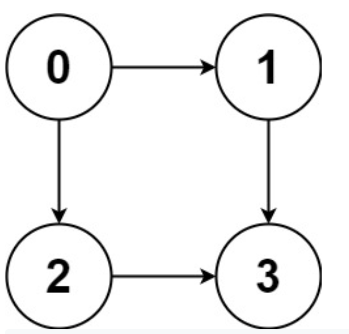
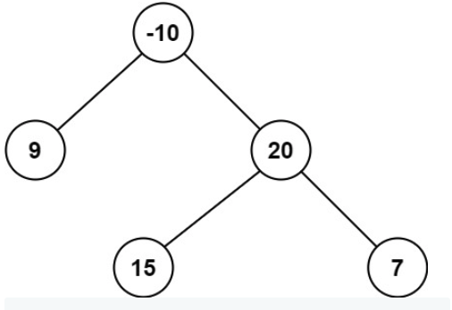

- [array](#array)
  - [1.Two Sum](#1two-sum)
  - [4.Median of Two Sorted Array](#4median-of-two-sorted-array)
  - [11.Container With Most Water](#11container-with-most-water)
  - [27.Remove Element](#27remove-element)
  - [31.Next Permutation](#31next-permutation)
  - [41. First Missing Positive](#41-first-missing-positive)
  - [48. Rotate Image](#48-rotate-image)
  - [54. Spiral Matrix](#54-spiral-matrix)
  - [59.Spiral Matrix II](#59spiral-matrix-ii)
  - [283.Move Zeroes](#283move-zeroes)
  - [410.Split Array Largest Sum](#410split-array-largest-sum)
- [Hash Table](#hash-table)
  - [3. Longest Substring Without Repeating Characters](#3-longest-substring-without-repeating-characters)
  - [18.4SUM](#184sum)
  - [36.Valid Sudoku](#36valid-sudoku)
  - [37.SudoKu Sovler](#37sudoku-sovler)
  - [49. Group Anagrams](#49-group-anagrams)
  - [138.  Copy List with Random Pointer](#138--copy-list-with-random-pointer)
- [Linked List](#linked-list)
  - [2.Add Two Numbers](#2add-two-numbers)
  - [19.Remove Nth Node From End of List](#19remove-nth-node-from-end-of-list)
  - [21.Merge Two Sorted Lists](#21merge-two-sorted-lists)
  - [24. Swap Nodes in Pairs](#24-swap-nodes-in-pairs)
  - [25. Reverse Nodes in k-Group](#25-reverse-nodes-in-k-group)
  - [83. Remove Duplicates from Sorted List](#83-remove-duplicates-from-sorted-list)
  - [341.Flatten Nested List Iterator](#341flatten-nested-list-iterator)
- [Math](#math)
  - [7.Reverse Integer](#7reverse-integer)
  - [9.Palindrome Number](#9palindrome-number)
  - [12.Integer to Roman](#12integer-to-roman)
  - [43. Multiply Strings](#43-multiply-strings)
  - [60. Permutation Sequence](#60-permutation-sequence)
- [Two pointers](#two-pointers)
  - [15.3Sum](#153sum)
  - [16.3Sum Closest](#163sum-closest)
  - [26.Remove Duplicates from Sorted Array](#26remove-duplicates-from-sorted-array)
  - [28 Implement strStr()](#28-implement-strstr)
  - [61.Rotate List](#61rotate-list)
  - [80. Remove Duplicates from Sorted Array II](#80-remove-duplicates-from-sorted-array-ii)
- [String](#string)
  - [10.Regular Expression Matching](#10regular-expression-matching)
  - [13.Roman to Integer](#13roman-to-integer)
  - [14.Longest Comman Prefix](#14longest-comman-prefix)
  - [67. Add Binary](#67-add-binary)
  - [72.Edit Distance](#72edit-distance)
- [Binary Search](#binary-search)
  - [33.Search in Rotated Sorted Array](#33search-in-rotated-sorted-array)
  - [34. Find First and Last Position of Element in Sorted Array](#34-find-first-and-last-position-of-element-in-sorted-array)
  - [35.Search Insert Position](#35search-insert-position)
  - [69.Sqrt((x))](#69sqrtx)
  - [74.Search a 2D Matrix](#74search-a-2d-matrix)
  - [81. Search in Rotated Sorted Array II](#81-search-in-rotated-sorted-array-ii)
  - [153.Find Minimum in Rotated Sorted Array](#153find-minimum-in-rotated-sorted-array)
  - [154.Find Minimum in Rotated Sorted Array II](#154find-minimum-in-rotated-sorted-array-ii)
- [Divide and Conquer](#divide-and-conquer)
  - [23.Merge k Sorted Lists](#23merge-k-sorted-lists)
  - [53.Maximum Subarray](#53maximum-subarray)
  - [169. Majority Element](#169-majority-element)
  - [215. Kth Largest Element in an Array](#215-kth-largest-element-in-an-array)
  - [240、Search a 2D Matrix II](#240search-a-2d-matrix-ii)
  - [241、Different Ways to Add Parentheses](#241different-ways-to-add-parentheses)
- [Dynamic Programming](#dynamic-programming)
  - [32. Longest Valid Parentheses](#32-longest-valid-parentheses)
  - [53. Maximum Subarray](#53-maximum-subarray)
  - [62.Unique Paths](#62unique-paths)
  - [63.Unique Paths II](#63unique-paths-ii)
  - [64.Minimum Path Sum](#64minimum-path-sum)
  - [70.Climbing Stairs](#70climbing-stairs)
  - [91.Decode Ways](#91decode-ways)
  - [97.Interleaving String](#97interleaving-string)
  - [115、Distinct Subsequences](#115distinct-subsequences)
  - [120、Triangle](#120triangle)
  - [121、Best Time to Buy and Sell Stock](#121best-time-to-buy-and-sell-stock)
  - [123、Best Time to Buy and Sell Stock III](#123best-time-to-buy-and-sell-stock-iii)
  - [174.Dungeon Game](#174dungeon-game)
  - [300.Longest Increasing Subsequence](#300longest-increasing-subsequence)
  - [312.Burst  Ballons](#312burst--ballons)
  - [322.Coin Change](#322coin-change)
  - [354. Russian Doll Envelopes](#354-russian-doll-envelopes)
  - [494.Target Sum](#494target-sum)
  - [514.Freedom Trail(自由之路)](#514freedom-trail自由之路)
  - [516.Longest Palindromic Subsequence](#516longest-palindromic-subsequence)
  - [583. Delete Operation for Two Strings](#583-delete-operation-for-two-strings)
  - [712.Minimum ASCII Delete Sum for Two Strings](#712minimum-ascii-delete-sum-for-two-strings)
  - [877.Stone Game](#877stone-game)
  - [887.Super Egg Drop](#887super-egg-drop)
  - [931.Minimum Falling Path Sum](#931minimum-falling-path-sum)
  - [1143. Longest Common Subsequence（LCS）](#1143-longest-common-subsequencelcs)
  - [Package Problem](#package-problem)
    - [416.Partition Equal Subset Sum](#416partition-equal-subset-sum)
    - [518.Coin Change 2](#518coin-change-2)
  - [Stock Problem](#stock-problem)
    - [121.Best Time to Buy and Sell Stock](#121best-time-to-buy-and-sell-stock-1)
    - [122. Best Time to Buy and Sell Stock II（无限次）](#122-best-time-to-buy-and-sell-stock-ii无限次)
    - [123. Best Time to Buy and Sell Stock III(最多两次)](#123-best-time-to-buy-and-sell-stock-iii最多两次)
    - [188. Best Time to Buy and Sell Stock IV (指定最多k次)](#188-best-time-to-buy-and-sell-stock-iv-指定最多k次)
    - [309. Best Time to Buy and Sell Stock with Cooldown(无限次，但又冷冻期限制)](#309-best-time-to-buy-and-sell-stock-with-cooldown无限次但又冷冻期限制)
    - [714. Best Time to Buy and Sell Stock with Transaction Fee(无限次，但每次买卖要手续费)](#714-best-time-to-buy-and-sell-stock-with-transaction-fee无限次但每次买卖要手续费)
- [Backtracking](#backtracking)
  - [17.Letter Combinations of a Phone Number](#17letter-combinations-of-a-phone-number)
  - [22.Generate Parentheses](#22generate-parentheses)
  - [39.Combination Sum](#39combination-sum)
  - [40.Combination Sum II](#40combination-sum-ii)
  - [46、Permutations](#46permutations)
  - [47、Permutations II](#47permutations-ii)
  - [51.N-Queens](#51n-queens)
  - [52.N-Queens II](#52n-queens-ii)
- [Stack](#stack)
  - [20.Valid Parentheses](#20valid-parentheses)
  - [42.Trapping Rain Water](#42trapping-rain-water)
  - [84.Largest Rectangle in Histogram](#84largest-rectangle-in-histogram)
  - [85.Maximal Rectangle](#85maximal-rectangle)
  - [94、Binary Tree Inorder Traversal](#94binary-tree-inorder-traversal)
  - [144、Binary Tree Preorder Traversal](#144binary-tree-preorder-traversal)
  - [496.Next Greater Element I](#496next-greater-element-i)
  - [739.Daily Temperatures](#739daily-temperatures)
  - [](#)
  - [895.Maximum Frequency Stack](#895maximum-frequency-stack)
  - [264.Ugly Number II](#264ugly-number-ii)
  - [295.Find Median from Data Stream](#295find-median-from-data-stream)
  - [316.Remove Duplicate Letters](#316remove-duplicate-letters)
  - [347. Top K Frequent Elements](#347-top-k-frequent-elements)
  - [703.Kth Largest Element in a Stream](#703kth-largest-element-in-a-stream)
  - [767.Reorganize String](#767reorganize-string)
- [Greedy](#greedy)
  - [55.Jump Game](#55jump-game)
  - [45. Jump Game II](#45-jump-game-ii)
  - [122.  Best Time to Buy and Sell Stock II](#122--best-time-to-buy-and-sell-stock-ii)
  - [134. Gas Station](#134-gas-station)
  - [135. Candy](#135-candy)
  - [392.Is Subsequence](#392is-subsequence)
  - [435.Non-overlapping Intervals](#435non-overlapping-intervals)
  - [452.Minimum Number of Arrows to Burst Balloons](#452minimum-number-of-arrows-to-burst-balloons)
- [Sort](#sort)
  - [56.Merge Intervals](#56merge-intervals)
  - [57.Insert Interval](#57insert-interval)
  - [75.Sort Colors](#75sort-colors)
  - [147.Insertion Sort List](#147insertion-sort-list)
  - [148.Sort List](#148sort-list)
  - [164.Maximum Gap](#164maximum-gap)
  - [179.Largest Number](#179largest-number)
  - [242. Valid Anagram](#242-valid-anagram)
  - [349. Intersection of Two Arrays](#349-intersection-of-two-arrays)
  - [350. Intersection of Two Arrays II](#350-intersection-of-two-arrays-ii)
  - [524.Longest Word in Dictionary through Deleting](#524longest-word-in-dictionary-through-deleting)
- [Bit Manipulation](#bit-manipulation)
  - [78.Subsets](#78subsets)
  - [136.Single Number](#136single-number)
  - [137.Single Number II](#137single-number-ii)
  - [169.Majority Element](#169majority-element)
  - [187.Repeated DNA Sequences](#187repeated-dna-sequences)
  - [190.Reverse Bits](#190reverse-bits)
  - [191.Number of 1 Bits](#191number-of-1-bits)
  - [201. Bitwsie AND of Numbers Range](#201-bitwsie-and-of-numbers-range)
  - [231.Power of Two](#231power-of-two)
- [Tree](#tree)
  - [94.Binary Tree Inorder Traversal](#94binary-tree-inorder-traversal-1)
  - [95.Unique Binary Search Trees II](#95unique-binary-search-trees-ii)
  - [96.Unique Binary Search Trees](#96unique-binary-search-trees)
  - [98.Validate Binary Search Tree](#98validate-binary-search-tree)
  - [99.Recover Binary Search Tree](#99recover-binary-search-tree)
  - [100.Same Tree](#100same-tree)
  - [101.Symmetric Tree](#101symmetric-tree)
  - [104.Maximum Depth of Binary Tree](#104maximum-depth-of-binary-tree)
  - [105.Construct Binary Tree from Preorder and Inorder Traversal](#105construct-binary-tree-from-preorder-and-inorder-traversal)
  - [106.Construct Binary Tree from Inorder and Postorder Traversal](#106construct-binary-tree-from-inorder-and-postorder-traversal)
  - [113.Path Sum II](#113path-sum-ii)
  - [114. Flatten Binary Tree to Linked List](#114-flatten-binary-tree-to-linked-list)
  - [117.Populating Next Right Pointers in Each Node II](#117populating-next-right-pointers-in-each-node-ii)
  - [222.Count Complete Tree Nodes](#222count-complete-tree-nodes)
  - [236.Lowest Common Ancestor of a Binary Tree](#236lowest-common-ancestor-of-a-binary-tree)
  - [652. Find Duplicate Subtrees](#652-find-duplicate-subtrees)
- [DFS](#dfs)
  - [108.Convert Sorted Array to Binary Search Tree](#108convert-sorted-array-to-binary-search-tree)
  - [109. Convert Sorted List to Binary Search Tree](#109-convert-sorted-list-to-binary-search-tree)
  - [110.Balanced Binary Tree](#110balanced-binary-tree)
  - [111.Minimum Depth of Binary Tree](#111minimum-depth-of-binary-tree)
  - [112.Path Sum](#112path-sum)
  - [129.Sum Root to Leaf Numbers](#129sum-root-to-leaf-numbers)
  - [131.Palindrome Partitioning](#131palindrome-partitioning)
  - [109Binary Tree Right Side View](#109binary-tree-right-side-view)
  - [257.Binary Tree Paths](#257binary-tree-paths)
- [BFS](#bfs)
  - [102.Binary Tree Level Order Traversal](#102binary-tree-level-order-traversal)
  - [103. Binary Tree Zigzag Level Order Traversal](#103-binary-tree-zigzag-level-order-traversal)
  - [107.Binary Tree Level Order Traversal II](#107binary-tree-level-order-traversal-ii)
  - [116. Populating Next Right Pointers in Each Node](#116-populating-next-right-pointers-in-each-node)
  - [127.Word Ladder](#127word-ladder)
  - [<font color=red>279.Perfect Squares</font>](#font-colorred279perfect-squaresfont)
  - [542. 01 matrix](#542-01-matrix)
- [Union Find(并查集)](#union-find并查集)
  - [128.Longest consecutive Sequence](#128longest-consecutive-sequence)
  - [130.Surrounded Regions](#130surrounded-regions)
  - [200.Number of Islands](#200number-of-islands)
  - [399.Evaluate Division](#399evaluate-division)
  - [547. Number of Provinces](#547-number-of-provinces)
  - [684. Redundant Connection](#684-redundant-connection)
  - [685.Redundant Connection 2](#685redundant-connection-2)
- [Graph](#graph)
  - [133.Clone Graph](#133clone-graph)
  - [207.Course Schedule](#207course-schedule)
  - [210.Course Schedule II](#210course-schedule-ii)
  - [310.Minimum Height Trees](#310minimum-height-trees)
  - [797.All Paths From Source To Target](#797all-paths-from-source-to-target)
  - [841.Keys and Rooms](#841keys-and-rooms)
  - [997. Find the Town Judge](#997-find-the-town-judge)
- [Design](#design)
  - [146.LRU Cache](#146lru-cache)
  - [155.Min Stack](#155min-stack)
  - [173.Binary Search Tree Iterator](#173binary-search-tree-iterator)
  - [208.Implement Trie(Prefix Tree)](#208implement-trieprefix-tree)
  - [211. Design Add and Search Words Data Structure](#211-design-add-and-search-words-data-structure)
  - [225. Implement Stack using Queues](#225-implement-stack-using-queues)
  - [232.Implement Queue using Stacks](#232implement-queue-using-stacks)
  - [294.Find Median from Data Stream](#294find-median-from-data-stream)
  - [284.Peeking Iterator](#284peeking-iterator)
  - [<font color=red>297.Serialize and Deserialize Binary Tree</font>](#font-colorred297serialize-and-deserialize-binary-treefont)
  - [380. Insert Delete GetRandom O(1)](#380-insert-delete-getrandom-o1)
  - [460.LFU cache](#460lfu-cache)
  - [705. Design HashSet](#705-design-hashset)
  - [706.Design HashMap](#706design-hashmap)
  - [710.Random Pick with Blacklist](#710random-pick-with-blacklist)
- [Topological Sort(拓扑排序)](#topological-sort拓扑排序)
  - [1203. Sort Items by Groups Respecting Dependencies](#1203-sort-items-by-groups-respecting-dependencies)
- [Trie](#trie)
  - [421.Maximum XOR of Two Numbers in an Array](#421maximum-xor-of-two-numbers-in-an-array)
- [Binary Indexed Tree](#binary-indexed-tree)
  - [307. Range Sum Query - Mutable](#307-range-sum-query---mutable)
- [Binary Search Tree](#binary-search-tree)
  - [538. Convert BST to Greater Tree](#538-convert-bst-to-greater-tree)
  - [1382.Balance a Binary Search Tree](#1382balance-a-binary-search-tree)
  - [1038.  Binary Search Tree to Greater Sum Tree](#1038--binary-search-tree-to-greater-sum-tree)
  - [1373. Maximum Sum BST in Binary Tree](#1373-maximum-sum-bst-in-binary-tree)
- [Recursion](#recursion)
  - [124.Binary Tree Maximum Path Sum](#124binary-tree-maximum-path-sum)
  - [395. Longest Substring with At Least K Repeating Characters](#395-longest-substring-with-at-least-k-repeating-characters)
  - [669.Trim a Binary Search Tree](#669trim-a-binary-search-tree)
  - [687. Longest Univalue Path](#687-longest-univalue-path)
  - [783. Minimum Distance Between BST nodes](#783-minimum-distance-between-bst-nodes)
  - [894.All Possible Full Binary Trees](#894all-possible-full-binary-trees)
  - [897.Increasing Order Search Tree](#897increasing-order-search-tree)
- [Brainteaser（脑筋急转弯）](#brainteaser脑筋急转弯)
  - [777. Swap Adjacent in LR String](#777-swap-adjacent-in-lr-string)
  - [1227. Airplane Seat Assignment Probability](#1227-airplane-seat-assignment-probability)
  - [1503. Last Moment Before All Ants Fall Out of a Plank](#1503-last-moment-before-all-ants-fall-out-of-a-plank)
- [Queue](#queue)
  - [239.Sliding Window Maximum](#239sliding-window-maximum)
  - [621. Task Scheduler](#621-task-scheduler)
  - [622. Design Circular Queue](#622-design-circular-queue)
  - [641.Design Circular Deque](#641design-circular-deque)
  - [862. Shortest Subarray with Sum at Least K](#862-shortest-subarray-with-sum-at-least-k)
- [Minimax](#minimax)
  - [375.Guess Number Higher or Lower II](#375guess-number-higher-or-lower-ii)
- [Reservoir Sampling](#reservoir-sampling)
  - [382.Linked List Random Node](#382linked-list-random-node)
- [Ordered map](#ordered-map)
  - [352.Data Stream as Disjoint Intervals](#352data-stream-as-disjoint-intervals)
  - [715. Range Module](#715-range-module)
  - [846. Hand of Straights](#846-hand-of-straights)
- [Random](#random)
  - [470.Implement Rand10() Using Rand7()](#470implement-rand10-using-rand7)
  - [519. Random Flip Matrix](#519-random-flip-matrix)
- [Sliding Window](#sliding-window)
  - [3. Longest Substring Without Repeating Characters](#3-longest-substring-without-repeating-characters-1)
  - [76. Minimum Window Substring](#76-minimum-window-substring)
  - [239.Sliding Window Maximum](#239sliding-window-maximum-1)
  - [438.Find All Anagrams in a String](#438find-all-anagrams-in-a-string)
  - [567.Permutation in String](#567permutation-in-string)
  - [978.Longest Turbulent Subarray](#978longest-turbulent-subarray)
  - [1004. Max Consecutive Ones III](#1004-max-consecutive-ones-iii)
- [Line Sweep](#line-sweep)
  - [850. Rectangle Area II](#850-rectangle-area-ii)
  - [1288. Remove Covered Intervals](#1288-remove-covered-intervals)
- [Deque](#deque)
  - [1696. Jump Game VI](#1696-jump-game-vi)
- [。。。](#-1)
  - [44.Wildcard Matching](#44wildcard-matching)
  - [50. Pow(x,n)](#50-powxn)
# array

## 1.Two Sum

给定一个 没有排序的 数组中，找出其中两个数和等于目标数的索引值(有且仅有一个)。

**example**

```
Input: nums = [2,7,11,15], target = 9
Output: [0,1]
Output: Because nums[0] + nums[1] == 9, we return [0, 1].
```

解法:

要在O(n)时间解决，考虑使用map 来进行，因为map的查找是O(1)的。

```c++
class Solution {
public:
    vector<int> twoSum(vector<int>& nums, int target) {
        unordered_map<int,int> m;//value to index
        vector<int> result(2,0);
        for(int i=0;i<nums.size();i++)
        {
            int x=target-nums[i];
            if(m.find(x)!=m.end())  //find if any number before this can get the target sum
            {
                result[0]=i;
                result[1]=m[x];               
                return result;
            }
            
            m[nums[i]]=i; //save
        }
         return result;
    }
};
```

```java
class Solution {
    public int[] twoSum(int[] nums, int target) {
        Map<Integer,Integer> m=new HashMap<>();
        for(int i:nums)
            m.put(i,target-i);
        int[] r=new int[2];
        for(int i=0;i<nums.length;i++){
            if(m.containsKey(m.get(nums[i]))){
                int v=m.get(nums[i]);
                r[0]=i;
                for(int j=0;j<nums.length;j++)
                    if(nums[j]==v)
                    {
                        r[1]=j;
                        break;
                    }
                if(r[0]==r[1])
                    continue;
                break;
            }
        }
        return r;
        
    }
}
```


## 4.Median of Two Sorted Array

找出两个已排序数组 合并后的中位数

**Example：**

```
Input: nums1 = [1,3], nums2 = [2]
Output: 2.00000
Explanation: merged array = [1,2,3] and median is 2.

Input: nums1 = [1,2], nums2 = [3,4]
Output: 2.50000
Explanation: merged array = [1,2,3,4] and median is (2 + 3) / 2 = 2.5.
```

解法：因为两个数组已排序，可以简单在O(n)时间复杂度来让两个数组进行合并，然后中位数就容易找到。

```java
class Solution {
    public double findMedianSortedArrays(int[] nums1, int[] nums2) {
        int index1 = 0;
        int index2 = 0;
        int med1 = 0;
        int med2 = 0;
        for (int i=0; i<=(nums1.length+nums2.length)/2; i++) {
            med1 = med2;
            if (index1 == nums1.length) {
                med2 = nums2[index2];
                index2++;
                continue;
            }
            if (index2 == nums2.length) {
                med2 = nums1[index1];
                index1++;
                continue;
            }
            if (nums1[index1] < nums2[index2] ) {
                med2 = nums1[index1];
                index1++;
            }  else {
                med2 = nums2[index2];
                index2++;
            }
        }

        // the median is the average of two numbers
        if ((nums1.length+nums2.length)%2 == 0) {
            return (float)(med1+med2)/2;
        }

        return med2;
    }
}
```

O(log(min(m,n)))

```java
class Solution {
    public double findMedianSortedArrays(int[] nums1, int[] nums2) {
        if(nums1.length>nums2.length){
            return findMedianSortedArrays(nums2,nums1);
        }
        int x=nums1.length;
        int y=nums2.length;
        
        int low=0;
        int high=x;
        while(low<=high){
            int partionX=(low+high)/2;
            int partionY=(x+y+1)/2-partionX;
            
            int maxLeftX=(partionX==0)?Integer.MIN_VALUE:nums1[partionX-1];
            int minRightX=(partionX==x)?Integer.MAX_VALUE:nums1[partionX];
            
            int maxLeftY=(partionY==0)?Integer.MIN_VALUE:nums2[partionY-1];
            int minRightY=(partionY==y)?Integer.MAX_VALUE:nums2[partionY];
            
            if(maxLeftX<=minRightY && maxLeftY<=minRightX){
                if((x+y)%2==0){
                    return ((double)Math.max(maxLeftX,maxLeftY)+Math.min(minRightX,minRightY))/2;
                }else{
                    return (double)Math.max(maxLeftX,maxLeftY);
                }
            }else if(maxLeftX>minRightY){
                high=partionX-1;
            }else{
                low=partionX+1;
            }
        }
        return -1;   
    }
}
```


## 11.Container With Most Water

 

给出很多条高度>=0的栅栏，需要找到两条栅栏，使得两者之间围城的面积最大(长为距离之差，宽为矮栅栏的高度)

考虑：从宽度->高度来考虑面积

首先考虑宽度，因为距离越远宽度越宽，所以初始宽度设为最大宽度，

因为面积要增大，所以宽度逐渐减小时，面积需要增大则必须高度增加，因此宽度减小后，选取的两栅栏的高度都必须大于当时最小的那个栅栏的高度才行，这样的思路，就能够在O(n)的时间复杂度解决该问题。

```java
class Solution {
    public int maxArea(int[] height) {
        int l=0,r=height.length-1;
        int Max=(r-l)*Math.min(height[l],height[r]);
        while(l<r){
            int h=Math.min(height[l],height[r]);
            while(l<height.length && height[l]<=h) l++;
            while(r>=0 && height[r]<=h) r--;
            if(l<r){
                Max=Math.max(Max,(r-l)*Math.min(height[l],height[r]));
            }
        }
        return Max;
    }
}
```

## 27.Remove Element


给你一个数组nums和一个值val，你需要原地移除所有数值等于val的元素，并返回移除后数组的新长度。

不要使用额外的数组空间，你必须使用O(1)额外空间并原地修改输入数组。

元素的顺序可以改变，你不要考虑数组中超出新长度后面的元素。

**Example 2:**

```
Input: nums = [0,1,2,2,3,0,4,2], val = 2
Output: 5, nums = [0,1,4,0,3]
Explanation: Your function should return length = 5, with the first five elements of nums containing 0, 1, 3, 0, and 4. Note that the order of those five elements can be arbitrary. It doesn't matter what values are set beyond the returned length.
```

双指针：

```java
class Solution {
    public int removeElement(int[] nums, int val) {
        int fast,slow;
        fast=slow=0;
        while(fast<nums.length && nums[fast]==val) fast+=1;
        while(fast<nums.length){
            nums[slow]=nums[fast];
            slow+=1;
            fast+=1;
            while(fast<nums.length && nums[fast]==val) fast+=1;
        }
        
        return slow;
    }
}
```

## 31.Next Permutation

给定一个数组nums，实现方法nextPermutation将其转变为按其字典顺序的下一个更大的情况，如果是最大，则转变为最小

**Example 1:**

```
Input: nums = [1,2,3]
Output: [1,3,2]
```

**Example 2:**

```
Input: nums = [3,2,1]
Output: [1,2,3]
```

**Example 3:**

```
Input: nums = [1,1,5]
Output: [1,5,1]
```

思路：关键找到下一个序列和前一个序列的关系：

```java
class Solution {
    public void nextPermutation(int[] nums) {////2, 5 4 3 2 1
        if(nums.length<=1){
            return;
        }
        int i=nums.length-2;
        while(i>=0 && nums[i]>=nums[i+1]) i--;
        if(i>=0){
            int j=nums.length-1;
            while(nums[j]<=nums[i]) j--; 
            swap(nums,i,j);   //2, 5 4 3 2 1 -> 3, 5 4 2 2 1
        }
        reverse(nums,i+1,nums.length-1); //3, 5 4 2 2 1 -> 3, 1 2 2 4 5
    }
    
    private void swap(int[] nums,int i,int j){
        nums[i]=nums[i]^nums[j];
        nums[j]=nums[i]^nums[j];
        nums[i]=nums[i]^nums[j];
    }
    private void reverse(int[] nums,int i,int j){
        while(i<j) swap(nums,i++,j--);
    }
}
```

## 41. First Missing Positive

给定一个未经过排序的整数数组nums, 找出其中最小的缺失的正整数。附加：如果在O(n)时间内找到并且用常数个连续空间。

**Example 1:**

```
Input: nums = [1,2,0]
Output: 3
```

**Example 2:**

```
Input: nums = [3,4,-1,1]
Output: 2
```

**Example 3:**

```
Input: nums = [7,8,9,11,12]
Output: 1
```

思路：用hash结构,能做到O(n)时间复杂度，

```c++
 int firstMissingPositive(vector<int>& nums) {
        unordered_map<int,bool> m;
        for(auto item:nums)
            if(item>0)
                m[item]=true;
        for(int i=1;i<static_cast<int>(pow(2,31)-1);i++)
            if(m.find(i)==m.end())
                return i;
        return static_cast<int>(pow(2,31)-1);
    }
```

如何做到O(1)额外空间？

```java
class Solution {
    private void swap(int[] A,int a,int b){
        A[a]=A[a]^A[b];
        A[b]=A[a]^A[b];
        A[a]=A[a]^A[b];
    }
    public int firstMissingPositive(int[] A) {
        int n=A.length;
        int i=0;
        while (i < n){
            if (A[i] > 0 && A[i] <= n && A[A[i] - 1] != A[i])
                swap(A,i,A[i]-1);
            else
                i++;
        }
        for(i = 0; i < n; ++ i){
            if(A[i] != i + 1)
                return i + 1;
        }
        
        return n + 1;
    }
}
```

## 48. Rotate Image

给定一个n*n的矩阵代表一张图片，将这个图片顺时针旋转90°。

**Example**

 

```
Input: matrix = [[1,2,3],[4,5,6],[7,8,9]]
Output: [[7,4,1],[8,5,2],[9,6,3]]
```

思路：从外到内依次旋转：先考虑四个边缘点。

```c++
class Solution {
    private void rotate(int[][] matrix,int start,int len){
        if(len==1)
            return;
        // 4 point
        int temp=matrix[start][start];
        matrix[start][start]=matrix[start+len-1][start];
        matrix[start+len-1][start]= matrix[start+len-1][start+len-1];
        matrix[start+len-1][start+len-1]=matrix[start][start+len-1];
        matrix[start][start+len-1]=temp;
        
        //4 edge
        if(len>=3){
            int[] old=new int[len-2];
            int i=0;
            for(int j=1;j<=len-2;j++){
                old[i++]=matrix[start][start+j];
                matrix[start][start+j]= matrix[start+len-1-j][start];
            }

            for(int j=1;j<=len-2;j++){
                matrix[start+len-1-j][start]=matrix[start+len-1][start+len-1-j];
            }

            for(int j=1;j<=len-2;j++){
                matrix[start+len-1][start+len-1-j]=matrix[start+j][start+len-1];
            }

            i=0;
            for(int j=1;j<=len-2;j++){
                matrix[start+j][start+len-1]=old[i++];
            }
        }
    }
    public void rotate(int[][] matrix) {
        int n=matrix.length;
        int i,len;
        for( i=0,len=n;i<n/2 && len>=1;i++,len-=2){
            rotate(matrix,i,len);
        }
    }
}
```


## 54. Spiral Matrix

给定一个m*n的二维矩阵，返回螺旋式排列的数据序列。

**Example 1:**


```
Input: matrix = [[1,2,3],[4,5,6],[7,8,9]]
Output: [1,2,3,6,9,8,7,4,5]
```

思路：记住转向顺序即可 向右->向下  ，向下->向左  ，向左->向上， 向上->向右

```java
class Solution {
    private enum direction{left,right,up,down};
    public List<Integer> spiralOrder(int[][] matrix) {
        int rows=matrix.length;
        int cols=matrix[0].length;
        int colStart=0;
        int rowStart=0;
        int curRow=0,curCol = 0;
        curRow=0;
        colStart=0;
        int colLength=cols;
        int rowLength=rows;
        int num=0;
        direction d=direction.right;
        LinkedList<Integer> result = new LinkedList<>();
        while(num<rows*cols){
            if(d==direction.right){
                for(int i=colStart;i<=colStart+colLength-1;i++){
                    num+=1;
                    result.add(matrix[curRow][i]);
                }
                curCol=colStart+colLength-1;
                rowStart=curRow+1;
                rowLength-=1;
                d=direction.down;
            }else if(d==direction.down){
                for(int i=rowStart;i<=rowStart+rowLength-1;i++){
                    num+=1;
                    result.add(matrix[i][curCol]);
                }
                curRow=rowStart+rowLength-1;
                colStart=curCol-1;
                colLength-=1;
                d=direction.left;
            }else if(d==direction.left){
                for(int i=colStart;i>=colStart-colLength+1;i--){
                    num+=1;
                    result.add(matrix[curRow][i]);
                }
                curCol=colStart-colLength+1;
                rowStart=curRow-1;
                rowLength-=1;
                d=direction.up;
            }else if(d==direction.up){
                for(int i=rowStart;i>=rowStart-rowLength+1;i--){
                    num+=1;
                    result.add(matrix[i][curCol]);
                }
                curRow=rowStart-rowLength+1;
                colStart=curCol+1;
                colLength-=1;
                d=direction.right;
            }
        }


        return result;
    }
}
```

## 59.Spiral Matrix II

给定一个数字n，  由此产生一个螺旋状的矩阵：：1，2，3，...,n^2

 **Example 1:**

 

```
Input: n = 3
Output: [[1,2,3],[8,9,4],[7,6,5]]
```

**Example 2:**

```
Input: n = 1
Output: [[1]]
```

思路，类似54

```java
 class Solution {
    private enum direction{left,right,up,down};
    public int[][] generateMatrix(int n) {
        int[][] matrix=new int[n][n];
        int rows=n;
        int cols=n;
        int colStart=0;
        int rowStart=0;
        int curRow=0,curCol = 0;
        curRow=0;
        colStart=0;
        int colLength=cols;
        int rowLength=rows;
        int num=0;
        direction d=direction.right;
        while(num<n*n){
            if(d==direction.right){
                for(int i=colStart;i<=colStart+colLength-1;i++){
                    num+=1;
                    matrix[curRow][i]=num;
                }
                curCol=colStart+colLength-1;
                rowStart=curRow+1;
                rowLength-=1;
                d=direction.down;
            }else if(d==direction.down){
                for(int i=rowStart;i<=rowStart+rowLength-1;i++){
                    num+=1;
                    matrix[i][curCol]=num;
                }
                curRow=rowStart+rowLength-1;
                colStart=curCol-1;
                colLength-=1;
                d=direction.left;
            }else if(d==direction.left){
                for(int i=colStart;i>=colStart-colLength+1;i--){
                    num+=1;
                    matrix[curRow][i]=num;
                }
                curCol=colStart-colLength+1;
                rowStart=curRow-1;
                rowLength-=1;
                d=direction.up;
            }else if(d==direction.up){
                for(int i=rowStart;i>=rowStart-rowLength+1;i--){
                    num+=1;
                    matrix[i][curCol]=num;
                }
                curRow=rowStart-rowLength+1;
                colStart=curCol+1;
                colLength-=1;
                d=direction.right;
            }
        }


        return matrix;
    }
}
```


## 283.Move Zeroes

把数组中所有0移到末尾并不改变其它元素的相对位置。

**Example 1:**

```
Input: nums = [0,1,0,3,12]
Output: [1,3,12,0,0]
```

**Example 2:**

```
Input: nums = [0]
Output: [0]
```

思路：快慢指针

```java
class Solution {
    public void moveZeroes(int[] nums) {
        int slow=0;
        int fast=0;
        while(fast<nums.length){
            if(nums[fast]!=0){
                nums[slow++]=nums[fast++];
            }else{
                fast++;
            }
        }
        for(int i=slow;i<nums.length;i++)
            nums[i]=0;
    }
}
```


## 410.Split Array Largest Sum

给定一个非负整数数组合一个整数m，你需要将这个数组分为m个非空的连续子数组。设定一个算法使得这m个子数组各自和的最大值最小。


**Example 1:**

```
Input: nums = [7,2,5,10,8], m = 2
Output: 18
Explanation:
There are four ways to split nums into two subarrays.
The best way is to split it into [7,2,5] and [10,8],
where the largest sum among the two subarrays is only 18.
```

**Example 2:**

```
Input: nums = [1,2,3,4,5], m = 2
Output: 9
```

思路:问题转化，考虑反推：限定最大子数组和为max时，所能组成的子数组个数为多少，是否大于m还是等于m，还是小于m。即至少要有多少个子数组。

```java
class Solution {
    public int splitArray(int[] nums, int m) {
        int lo=getMax(nums),hi=getSum(nums);
      //二分法
        while(lo<hi){
            
            int mid=lo+(hi-lo)/2;
            
            int n=split(nums,mid);
            if(n==m){
                hi=mid;
            }else if(n<m){
                hi=mid;
            }else if(n>m){
                lo=mid+1;
            }
            
        }
        return lo;
    }
    
    /*
    辅助函数，若限制最大子数组和为 max，
    计算 nums 至少可以被分割成几个子数组
    */
    private int split(int[] nums,int max){
        int count=1;
        int sum=0;
        for(int i=0;i<nums.length;i++){
            if(sum+nums[i]>max){
                count++;
                sum=nums[i];
            }else{
                sum+=nums[i];
            }
        }
        return count;
    }
    
    private int getMax(int[] nums){
        int res=0;
        for(int n:nums)
            res=Math.max(res,n);
        return res;
    }
    private int getSum(int[] nums){
        int res=0;
        for(int n: nums)
            res+=n;
        return res;
    }
}
```


# Hash Table

## 3. Longest Substring Without Repeating Characters

找到一个字符串中最长并且不存在重复字符的子串的长度

**Example**

```
Input: s = "pwwkew"
Output: 3
Explanation: The answer is "wke", with the length of 3.
Notice that the answer must be a substring, "pwke" is a subsequence and not a substring.
```

法1：dp思想

顺序 找到每个字符能往前数的最大长度，由于当前字符的长度最长是前一个字符能够达到的长度+1，因此能分解为子问题，dp方法能解决。

```c++
    int lengthOfLongestSubstring(string s) { 
        int n=s.size();
        if(n==0)
            return 0;
        vector<int> dp(n,1); //dp[i] represent s[i-dp[i]+1],...s[i] is a set
        for(int i=1;i<n;i++)
        {
            for(int j=i-1;j>=0&&j>=i-dp[i-1];j--)
            {
                if(s[i]==s[j])  //find repeat number
                {
                    dp[i]=i-j;
                    break;
                }          // not repeat number
                dp[i]+=1;
            }
        }
        return *max_element(dp.begin(),dp.end());
    }
```

更快捷的思路：滑动窗口

```c++
class Solution {
    public int lengthOfLongestSubstring(String s) {
        if(s.length()==0)
            return 0;
        int left=0;
        int right=1;
        int curMaxLength=1;
        HashMap<Character,Integer> m=new HashMap<>();
        m.put(s.charAt(0),0);
        for(int i=1;i<s.length();i++){
            char c=s.charAt(i);
            right=i;
            if(!m.containsKey(c)){
                m.put(c,i);
            }else{
                left=Math.max(m.get(c)+1,left);
                m.remove(c);
                m.put(c,i);
            }
            curMaxLength=Math.max(curMaxLength,right-left+1);
        }
        return curMaxLength;
    }
}
```

## 18.4SUM

**找出一个数组中所有长度为4的和为目标数的 子数组集合**。

example：

```
Input: nums = [1,0,-1,0,-2,2], target = 0
Output: [[-2,-1,1,2],[-2,0,0,2],[-1,0,0,1]]
```

首先想法：数组需要排序，方便进行遍历。

然后该问题时间复杂度最高为$O(n^4)$，但这样会超时，因此考虑降低为$O(n^3)$

其实就华为2SUM问题，如何降为$O(n)$时间复杂度，另外因为是集合所以要考虑重复的剔除。

对于已排序数组 2SUM问题只需前后两个位置索引即可，因此该题可如下解决

```c++
class Solution {
    public List<List<Integer>> fourSum(int[] nums, int target) {
        Arrays.sort(nums);
        int n=nums.length;
       // Set<String> check=new HashSet<>();

        Set<List<Integer>> result=new HashSet<>();
        for(int i=0;i<n-3;i++){
            for(int j=i+1;j<n-2;j++){
                int low=j+1;
                int high=n-1;
                while(high>low){
                    int current=nums[i]+nums[j]+nums[low]+nums[high];
                    if(current==target){
                        ArrayList<Integer> list= new ArrayList<>();
                        list.add(nums[i]);
                        list.add(nums[j]);
                        list.add(nums[low]);
                        list.add(nums[high]);
                        result.add(list);
                        low+=1;
                        high-=1;
                    }else if(current>target){
                        high-=1;
                    }else{
                        low+=1;
                    }
                }
            }
        }
        List<List<Integer>> l= new ArrayList<>(result);
        return l;
    }
}
```

另一种利用hash 的方法，思想类似。

## 36.Valid Sudoku

检查给出的数独题目是否有效。

数独题目的条件：每行数不重复，每列数不重复，每个小正方形不重复（1~9）。

方法：按条件依次遍历。

**不得有两个数重复在上面每个子问题出现。**

->利用set。

```c++
 class Solution {
public:
    bool isValidSudoku(vector<vector<char>>& board) {
        
        //row
        for(int i=0;i<board.size();i++)
        {
            set<char> s;
            int numsdot=0;
            for(int j=0;j<board[i].size();j++)
            {
                if(board[i][j]=='.')
                    numsdot+=1;
                else
                    s.insert(board[i][j]);
                
            }
            if(s.size()+numsdot!=9)
                return false;
        }
        
        //colomn
        for(int j=0;j<board[0].size();j++)
        {
            set<char> s;
            int numsdot=0;
            for(int i=0;i<board.size();i++)
            {
                if(board[i][j]=='.')
                    numsdot+=1;
                else
                    s.insert(board[i][j]);
                
            }
            if(s.size()+numsdot!=9)
                return false;
        }
        
        //grid
        
        for(int si=0;si<=6;si+=3)
            for(int sj=0;sj<=6;sj+=3)
            {
                
                set<char> s;
                int numsdot=0;
                for(int i=si;i<si+3;i++)
                {
                    for(int j=sj;j<sj+3;j++)
                    {
                        if(board[i][j]=='.')
                            numsdot+=1;
                        else
                            s.insert(board[i][j]);
                    }
                }    
                 if(s.size()+numsdot!=9)
                     return false;   
                
            }
        return true;
            
    }
};
```

代码优点冗长，考虑一种简洁的代码方式：

$O(n^2)$时间遍历，如果当前位置数不为空，为i，则标记当前行出现过i，当前列出现过i，当前网格出现过i，则以后的对应行不能出现i，以后的对应行不能出现i，以后的对应网格也不能出现i。

```java
class Solution {
    private int[][] rows = new int[9][9];
    private int[][] cols = new int[9][9];
    private int[][][] blocks =new int[3][3][9];
    public boolean isValidSudoku(char[][] board) {
        for(int r=0;r<9;r++){
            for(int c=0;c<9;c++){
                if(board[r][c]!='.'){
                    int num=board[r][c]-'1';
                    if(rows[r][num]++ >0){
                        return false;
                    }
                    if(cols[num][c]++>0){
                        return false;
                    }
                    if(blocks[r/3][c/3][num]++>0){
                        return false;
                    }
                }
            }
        }
        return true;
    }
}
```

## 37.SudoKu Sovler

解数独。

example：

```
Input: board = [["5","3",".",".","7",".",".",".","."],["6",".",".","1","9","5",".",".","."],[".","9","8",".",".",".",".","6","."],["8",".",".",".","6",".",".",".","3"],["4",".",".","8",".","3",".",".","1"],["7",".",".",".","2",".",".",".","6"],[".","6",".",".",".",".","2","8","."],[".",".",".","4","1","9",".",".","5"],[".",".",".",".","8",".",".","7","9"]]
Output: [["5","3","4","6","7","8","9","1","2"],["6","7","2","1","9","5","3","4","8"],["1","9","8","3","4","2","5","6","7"],["8","5","9","7","6","1","4","2","3"],["4","2","6","8","5","3","7","9","1"],["7","1","3","9","2","4","8","5","6"],["9","6","1","5","3","7","2","8","4"],["2","8","7","4","1","9","6","3","5"],["3","4","5","2","8","6","1","7","9"]]
Explanation: The input board is shown above and the only valid solution is shown below:
```

逻辑清晰明了，就是贪婪法，但需要回溯，因此运用好DFS即可。

```c++
class Solution {
public:
    
    bool sign;
    bool check(int n,int key,vector<vector<char>>& board)
    {
        
        //row check
        for(int i=0;i<9;i++)
        {
            int j=n/9;
            if(board[j][i]==key+'0') 
                return false;
        }
        
        //col check
        for(int i=0;i<9;i++)
        {
            int j=n%9;
            if(board[i][j]==key+'0') return false;
        }
        int x=n/9/3*3;
        int y=n%9/3*3;
        
        //grid check
        for(int i=x;i<x+3;i++)
            for(int j=y;j<y+3;j++)
            {
                if(board[i][j]==key+'0') return false;
            }
        
        return true;
    }
    void DFS(int n,vector<vector<char>>& board)
    {
        if(n>80)//has finished
        {
            sign=true;
            return ;
        }
        if(board[n/9][n%9]!='.')//this location has filled
        {
            DFS(n+1,board);
        }
        else{
            
            //number to select
            for(int i=1;i<=9;i++)
            {
                if(check(n,i,board)==true)//check ok
                {   
                    char temp='0'+i;
                    board[n/9][n%9]=temp;
                    DFS(n+1,board);
                    
                    //check if succeed
                    if (sign==true) return;
                    //this i failed ，then recall 
                    board[n/9][n%9]='.';

                }
            }
        }
    }
    void solveSudoku(vector<vector<char>>& board) {
        sign=false;
        DFS(0,board);
        
    }
};
```

更简洁的解法

```java
class Solution {
    
    private boolean check(char[][] board, int i, int j, char val)
    {
        int row = i - i%3, column = j - j%3;
        for(int x=0; x<9; x++) if(board[x][j] == val) return false;
        for(int y=0; y<9; y++) if(board[i][y] == val) return false;
        for(int x=0; x<3; x++)
        for(int y=0; y<3; y++)
            if(board[row+x][column+y] == val) return false;
        return true;
    }
    private boolean solveSudoku(char[][] board,int i,int j){
        if(i==9){
            return true;
        }
        if(j==9){
            return solveSudoku(board,i+1,0);
        }
        if(board[i][j]!='.'){
            return solveSudoku(board,i,j+1);
        }
        for(char c='1';c<='9';c++){
            if(check(board, i, j, c)){
                board[i][j] = c;
                if(solveSudoku(board, i, j+1)) return true;
                board[i][j] = '.'; //recall
            }
        }
        return false;
    }
    public void solveSudoku(char[][] board) {
        solveSudoku(board,0,0);
    }
}

```

## 49. Group Anagrams

给定一个string 数组，将其中 字符相同(仅顺序不同)的string放在一块，返回。

**Example 1:**

```
Input: strs = ["eat","tea","tan","ate","nat","bat"]
Output: [["bat"],["nat","tan"],["ate","eat","tea"]]
```

**Example 2:**

```
Input: strs = [""]
Output: [[""]]
```

**Example 3:**

```
Input: strs = ["a"]
Output: [["a"]]
```

思路：HashMap 建立ArrayList到List的映射

```java
class Solution {
    public List<List<String>> groupAnagrams(String[] strs) {
        Map<ArrayList<Integer>,List<String>> m=new HashMap<>();
        for(int i=0;i<strs.length;i++){
            String s=strs[i];
            ArrayList<Integer> list=new ArrayList<>();
            for(int j=0;j<26;j++){
                list.add(0);
            }
            for(int j=0;j<s.length();j++){
                int index=s.charAt(j)-'a';
                int temp=list.get(index);
                list.set(index,temp+1);
            }
            
            if(!m.containsKey(list)){
                m.put(list,new ArrayList<String>());
            }
            m.get(list).add(strs[i]);
        }
        
        List<List<String>> results=new ArrayList<>();
        for(ArrayList<Integer> k:m.keySet()){
            results.add(m.get(k));
        }
        return results;
    }
}
```

## 138.  Copy List with Random Pointer

一个链表中含有的节点node除了next指针外还有一个random指针可能指向链表中的任何节点或者null。

利用**深复制**来返回一个新的链表。

**Example1**

 

```
Input: head = [[7,null],[13,0],[11,4],[10,2],[1,0]]
Output: [[7,null],[13,0],[11,4],[10,2],[1,0]]
```

思路：要存random的位置，需要遍历两次。

```c++

class Solution {
    public Node copyRandomList(Node head) {
        if(head==null)
            return head;
        List<Node> list=new ArrayList<>();
        Node cur=head;
        Map<Node,Integer> nodeIndex=new HashMap<>();
        int index=0;
        while(cur!=null){
            Node newNode=new Node(cur.val);
            list.add(newNode);
            nodeIndex.put(cur,index++);
            cur=cur.next;
        }
        
        
        List<Integer> randomIndex=new ArrayList<>();
        cur=head;
        while(cur!=null){
            Node random=cur.random;
            if(random!=null){
                randomIndex.add(nodeIndex.get(random));
            }else{
                 randomIndex.add(-1);
            }
            cur=cur.next;
        }
        
        for(int i=0;i<list.size();i++){
            if(i!=list.size()-1){
                list.get(i).next=list.get(i+1);
            }
            if(randomIndex.get(i)!=-1){
                list.get(i).random=list.get(randomIndex.get(i));
            }else{
                list.get(i).random=null;
            }
        }
        
        return list.get(0);
        
    }
}
```

# Linked List

## 2.Add Two Numbers

给出两个链表，把其从尾部到头部倒序值连在一起看作十进制数，返回一个链表，其倒序十进制数值连在一块是前两个“十进制数”之和。

example：


```java
class Solution {
    public ListNode addTwoNumbers(ListNode l1, ListNode l2) {
        ListNode node=new ListNode(-1);
        ListNode cur=node;
        int C=0;
        while(l1!=null && l2!=null){
            int value=l1.val+l2.val+C;
            ListNode newNode=new ListNode(value%10);
            C=value/10;
            cur.next=newNode;
            cur=cur.next;
            l1=l1.next;
            l2=l2.next;
        }
        while(l1!=null){
            int value=l1.val+C;
            ListNode newNode=new ListNode(value%10);
            C=value/10;
            cur.next=newNode;
            cur=cur.next;
            l1=l1.next;
        }
        while(l2!=null){
            int value=l2.val+C;
            ListNode newNode=new ListNode(value%10);
            C=value/10;
            cur.next=newNode;
            cur=cur.next;
            l2=l2.next;
        }
        if(C!=0)
            cur.next=new ListNode(C);
        return node.next;
    }
}
```


## 19.Remove Nth Node From End of List

给定一个链表和一个数n，移走链表中 倒数第n个数。

<font color=red>思考:如何只需要一次遍历？</font>

Example:


一次遍历，且O(1)时间复杂度。

```java
class Solution {
    public ListNode removeNthFromEnd(ListNode head, int n) {
        ListNode fast=head;
        ListNode slow=head;
        int count=0;
        while(count<n){
            fast=fast.next;
            count+=1;
        }
        if(fast==null){
            return head.next;
        }
        fast=fast.next;
        while(fast!=null){
            slow=slow.next;
            fast=fast.next;
        }
        if(slow.next.next==null){
            slow.next=null;
        }else{
            slow.next=slow.next.next;
        }
        return head;
    }
}
```

## 21.Merge Two Sorted Lists

将两个已排序的链表合并为一个排好序的链表：

Example

```
Input: l1 = [1,2,4], l2 = [1,3,4]
Output: [1,1,2,3,4,4]
```

最简单的方法，递归。

```java
class Solution {
    public ListNode mergeTwoLists(ListNode l1, ListNode l2) {
        if(l1==null){
            return l2;
        }
        if(l2==null){
            return l1;
        }
        if(l1.val<l2.val){
            ListNode newl1=l1.next;
            l1.next=mergeTwoLists(newl1,l2);
            return l1;
        }else{
            ListNode newl2=l2.next;
            l2.next=mergeTwoLists(l1,newl2);
            return l2;
        }
    }
}
```

循环解决：

```java
class Solution {
    public ListNode mergeTwoLists(ListNode l1, ListNode l2) {
        ListNode head=new ListNode(-1);
        ListNode cur=head;
        while(l1!=null && l2!=null){
            if(l1.val<l2.val){
                cur.next=l1;
                l1=l1.next;
            }else{
                cur.next=l2;
                l2=l2.next;
            }
            cur=cur.next;
        }
        if(l1!=null){
            cur.next=l1;
        }else{
            cur.next=l2;
        }
        return head.next;
    }
}
```

## 23.Merge k Sorted Lists

合并K个有序链表，利用优先队列来减轻当前最小元素时间复杂度为O(logK)。

整体为O(nLogk)

```java
class Solution {
    private PriorityQueue<Pair<ListNode,Integer>> q=new PriorityQueue<>((pair1,pair2)->{
        return pair1.getKey().val>pair2.getKey().val?1:-1;
    });
    private ListNode mergeKLists(ArrayList<ListNode> lists,boolean flag,int preIndex) {
        if(lists.size()==0)
            return null;
        if(!flag){
            for(int i=0;i<lists.size();i++){
                if(lists.get(i)!=null)
                    q.add(new Pair<>(lists.get(i),i));
            }
        }else{
            if(preIndex!=-1)
                q.add(new Pair<>(lists.get(preIndex),preIndex));
        }
        if(q.size()==0){
            return null;
        }
        Pair<ListNode, Integer> pair = q.poll();
        ListNode curNode = pair.getKey();
        Integer index = pair.getValue();
        if(curNode.next!=null){
            lists.set(index,curNode.next);
            curNode.next=mergeKLists(lists,true,index);
        }else{
            if(lists.size()>0){
                lists.set(index,null);
                curNode.next=mergeKLists(lists,true,-1);
            }else{
                curNode.next=null;
            }
        }
        return curNode;
    }
    public ListNode mergeKLists(ListNode[] lists) {
        ArrayList<ListNode> arrayList=new ArrayList<ListNode>();
        for(int i=0;i<lists.length;i++){
            arrayList.add(lists[i]);
        }
        if(arrayList.size()>0)
            return mergeKLists(arrayList,false,-1);
        else
            return null;
    }
}
```

## 24. Swap Nodes in Pairs

给定一个链表，从第一个节点开始交换任意两个相邻的节点，返回这个链表。

注意：不能只是改变它们的值，必须以节点本身为单位。

**Example 1:**

 

```
Input: head = [1,2,3,4]
Output: [2,1,4,3]
```

思路1：用vector存起来然后改指针next，但是要额外空间。

思路2：直接改指针, 递归。

```java
class Solution {
    public ListNode swapPairs(ListNode head) {
        if(head==null ||head.next==null){
            return head;
        }else{
            ListNode temp=head.next;
            ListNode remainNodes=swapPairs(temp.next);
            head.next=remainNodes;
            temp.next=head;
            return temp;
        }
    }
}
```

## 25. Reverse Nodes in k-Group

给定一个链表，每次翻转k个节点，返回这个链表

另外考虑：如何利用o(1)的额外空间并且只改变节点本身(不是改变节点的值)

**Example 1:**

 

```
Input: head = [1,2,3,4,5], k = 2
Output: [2,1,4,3,5]
```

思路：递归

```java
 class Solution {
    
    public ListNode reverseKGroup(ListNode head, int k) {
        ListNode start=head;
        ListNode cur=start;
        boolean flag=true;
        for(int i=0;i<k;i++){
            if(cur!=null){
                cur=cur.next;
            }else{
                flag=false;
                break;
            }
        }
        
        if(!flag){
            return head;
        }else{
            ListNode nextNode=cur;
            ListNode reaminsNode=reverseKGroup(nextNode,k);
            
            ListNode pre=start;
            cur=start.next;
            for(int i=1;i<k;i++){
                ListNode next=cur.next;
                cur.next=pre;
                pre=cur;
                cur=next;
            }
            head.next=reaminsNode;
            return pre;
            
        }
        
    }
}
```

## 83. Remove Duplicates from Sorted List

去除有序链表中重复的数

**Example：**

```
Input: head = [1,1,2]
Output: [1,2]
```

快慢指针：

```java
class Solution {
    public ListNode deleteDuplicates(ListNode head) {
        if(head==null)
            return null;
        ListNode slow,fast;
        slow=fast=head;
        while(fast!=null){
            if(slow.val!=fast.val){
                slow.next=fast;
                slow=fast;
            }
            fast=fast.next;
        }
        slow.next=null;
        return head;
    }
}
```


## 341.Flatten Nested List Iterator

扁平化嵌套列表迭代器

```java
public class NestedInteger {
    // 如果其中存的是一个整数，则返回 true，否则返回 false
    public boolean isInteger();

    // 如果其中存的是一个整数，则返回这个整数，否则返回 null
    public Integer getInteger();

    // 如果其中存的是一个列表，则返回这个列表，否则返回 null
    public List<NestedInteger> getList();
}
```

**Example 1:**

```
Input: nestedList = [[1,1],2,[1,1]]
Output: [1,1,2,1,1]
Explanation: By calling next repeatedly until hasNext returns false, the order of elements returned by next should be: [1,1,2,1,1].
```

解法：低估

```java
public class NestedIterator implements Iterator<Integer> {

    private List<Integer> resultList;
    
    private int index;
    
    private void dfs(List<NestedInteger> nestedList){
        for(NestedInteger nestedInteger:nestedList){
            if(nestedInteger.isInteger()){
                resultList.add(nestedInteger.getInteger());
            }else{
                List<NestedInteger> list=nestedInteger.getList();
                dfs(list);
            }
        }
    }
    public NestedIterator(List<NestedInteger> nestedList) {
        resultList=new ArrayList<>();
        dfs(nestedList);
        index=0;
    }

    @Override
    public Integer next() {
        return resultList.get(index++);
    }

    @Override
    public boolean hasNext() {
        return index<resultList.size();
    }
}
```


# Math

## 7.Reverse Integer

整数翻转，所有反转的结果只能在$[-2^{31},2^{31}-1]$范围内，超出范围则返回0；

**Example 1:**

```
Input: x = 123
Output: 321
```

**Example 2:**

```
Input: x = -123
Output: -321
```

**Example 3:**

```
Input: x = 120
Output: 21
```

**Example 4:**

```
Input: x = 0
Output: 0
```

思考：

取模

```java
class Solution {
    public int reverse(int x) {
        boolean flag=true;
        if(x<0){
            flag=false;
            x=Math.abs(x);
        }
        long result=0;
        while(x>0){
            result=result*10+x%10;
            x=x/10;
        }
        if(result>Integer.MAX_VALUE || result<Integer.MIN_VALUE){
            return 0;
        }
        return flag==true?(int)result:-(int)result;
    }
}
```

## 9.Palindrome Number

判断一个整数是否为回文数

**Example 1:**

```
Input: x = 121
Output: true
```

**Example 2:**

```
Input: x = -121
Output: false
Explanation: From left to right, it reads -121. From right to left, it becomes 121-. Therefore it is not a palindrome
```

延伸：取模反转后判断是否相等。

```java
 class Solution {
    public boolean isPalindrome(int x) {
        if(x<0 || (x!=0 && x%10==0)){
            return false;
        }else{
            int oldX=x;
            int sum=0;
            while(x>0){
                sum=sum*10+x%10;
                x=x/10;
            }
            return sum==oldX;
        }
    }
}
```

## 12.Integer to Roman

将一个整数转换为罗马数

先考虑规则

```
Symbol       Value
I             1
V             5
X             10
L             50
C             100
D             500
M             1000
```

思路：从大到小考虑。

```c++
class Solution {
    public String intToRoman(int num) {
        String result="";
        if(num/1000!=0){
            int index=num/1000;
            for(int i=0;i<index;i++){
                result+="M";
            }
            num=num%1000;
        }
        if(num/100!=0){
            int index=num/100;
            if(index==5){
                result+="D";
            }else if(index<=3){
                for(int i=0;i<index;i++){
                    result+="C";
                }
            }else if(index==4){
                 result+="CD";
            }
            else if(index==9){
                 result+="CM";
            }else if(index<=8){
                result+="D";
                for(int i=5;i<index;i++){
                     result+="C";
                }
            }
            num=num%100;
        }
        if(num/10!=0){
            int index=num/10;
            if(index==5){
                result+="L";
            }else if(index<=3){
                for(int i=0;i<index;i++){
                    result+="X";
                }
            }else if(index==4){
                 result+="XL";
            }
            else if(index==9){
                 result+="XC";
            }else if(index<=8){
                result+="L";
                for(int i=5;i<index;i++){
                     result+="X";
                }
            }
            num=num%10;
        }
        if(num!=0){
            int index=num;
            if(index==5){
                result+="V";
            }else if(index<=3){
                for(int i=0;i<index;i++){
                    result+="I";
                }
            }else if(index==4){
                 result+="IV";
            }
            else if(index==9){
                 result+="IX";
            }else if(index<=8){
                result+="V";
                for(int i=5;i<index;i++){
                     result+="I";
                }
            }
            num=num%10;
        }
        return result;
    }
}
```

## 43. Multiply Strings

给定两个string 类型的非负整数 num1 num2，返回两个数的乘积，用string 返回。

**Example 1:**

```
Input: num1 = "2", num2 = "3"
Output: "6"
```

**Example 2:**

```
Input: num1 = "123", num2 = "456"
Output: "56088"
```

思路：由于是string 则num1和num2可能很大，因此不应该直接转换为int类型计算应该逐位乘，根据前一个进位记录真实值。

```java
class Solution {
    public String multiply(String num1, String num2) {
        int[] res=new int[num1.length()+num2.length()];
        for(int i=num1.length()-1;i>=0;i--){
            for(int j=num2.length()-1;j>=0;j--){
                res[i+j+1]+=(num1.charAt(i)-'0')*(num2.charAt(j)-'0');
                res[i+j]+=res[i+j+1]/10;
                res[i+j+1]%=10;
            }
        }
        
        int start=0;
        while(start<res.length && res[start]==0){
            start+=1;
        }
        if(start==res.length){
            return "0";
        }
        
        String result="";
        for(int i=start;i<res.length;i++){
            result+=String.valueOf(res[i]);
        }
        return result;
    }
}
```

## 60. Permutation Sequence

给定一个n 能够找到它的初始序列[1,2,3,...,n]。

这个序列按顺序能增大到最后一个[n,n-1,n-2,...,2,1]，总共n!个序列。

给定k，返回第k大的序列(用string表示)。

**Example 1:**

```
Input: n = 3, k = 3
Output: "213"
```

**Example 2:**

```
Input: n = 4, k = 9
Output: "2314"
```

**Example 3:**

```
Input: n = 3, k = 1
Output: "123"
```

思路：依次找数，如n=4，k=9。

对于第一位是1，2，3，4。因为后三位3!=6，9/6=1,9%6=3<6。因此第一位是2

然后对于1，3，4。因为2！=2，3/2=1,3%2=1。因此第二位是3，

1，4 因为1！=1，1/1=1,1%1=1,因此即为这个排为14

最终2314。

```c++
class Solution {
public:
    int factorial(int x)
    {
        if(x==0)
            return 1;
        else 
            return x*factorial(x-1);
    }
    
    string getstring(int k,int fac,vector<int>& vec)
    {
        if(vec.empty())
            return "";
        int n=vec.size();
        if(k<=fac)           //just first element insert
        {
            string temp=to_string(vec[0]);
            vec.erase(vec.begin());
            if(!vec.empty())
                fac/=vec.size();
            return temp+getstring(k,fac,vec);
        }
        else{   //select first element
            int index;
            if(k%fac==0)       // beacuse start from 0  so this situation shold minus 1
            {
                index=k/fac-1;
                k=fac;     
            }
            else 
            {
                index=k/fac;
                k=k%fac;
            }
            string temp=to_string(vec[index]);
            vec.erase(vec.begin()+index);
            if(!vec.empty())
                fac/=vec.size();
            return temp+getstring(k,fac,vec);
        }
        return "";
            
    }
    
    string getPermutation(int n, int k) {
        
        vector<int> vec;//substring vec and is sorted, first is [1,2,3,4,5,...,n] ,
        for(int i=1;i<=n;i++)
            vec.push_back(i);
        
        int fac=factorial(n-1);
        return getstring(k,fac,vec);    
    }
};
```

java解法

```java
class Solution {
    public String getPermutation(int n, int k) {
        int pos = 0;
        List<Integer> numbers = new ArrayList<>();
        int[] factorial = new int[n+1];
        StringBuilder sb = new StringBuilder();

        // create an array of factorial lookup
        int sum = 1;
        factorial[0] = 1;
        for(int i=1; i<=n; i++){
            sum *= i;
            factorial[i] = sum;
        }
        // factorial[] = {1, 1, 2, 6, 24, ... n!}

        // create a list of numbers to get indices
        for(int i=1; i<=n; i++){
            numbers.add(i);
        }
        // numbers = {1, 2, 3, 4}

        k--;

        for(int i = 1; i <= n; i++){
            int index = k/factorial[n-i];
            sb.append(String.valueOf(numbers.get(index)));
            numbers.remove(index);
            k-=index*factorial[n-i];
        }

        return String.valueOf(sb);
    }
}
```

# Two pointers

## 15.3Sum

类似 18.4Sum。

目的是找出所有和为0的长度为3的集合。(不重复)

排序后可以将第2层循环用2pointer来改为O（1）

**Example 1:**

```
Input: nums = [-1,0,1,2,-1,-4]
Output: [[-1,-1,2],[-1,0,1]]
```

```java
class Solution {
    public List<List<Integer>> threeSum(int[] nums) {
        
        int n=nums.length;
        List<List<Integer>> result=new ArrayList<>();
        if(n==0)
            return result;
        
        Arrays.sort(nums);
        for(int i=0;i<n-2;i++){
            if(i>0 && nums[i]==nums[i-1])
                continue;
            int target=-nums[i];
            int j=i+1;
            int k=n-1;
            while(j<k){
                if(nums[j]+nums[k]==target){
                    List<Integer> l=Arrays.asList(nums[i],nums[j],nums[k]);
                    result.add(l);
                    while(j<n-1 &&nums[j]==nums[j+1]) j+=1;
                    while(k>0 && nums[k]==nums[k-1]) k-=1;
                    j+=1;
                    k-=1;
                }else if(nums[j]+nums[k]<target){
                    j++;
                }else{
                    k--;
                }
            }
        }
        return result;
    }
}
```

## 16.3Sum Closest

找出数组中3个数的和与目标target数最接近的值。

**Example 1:**

```
Input: nums = [-1,2,1,-4], target = 1
Output: 2
Explanation: The sum that is closest to the target is 2. (-1 + 2 + 1 = 2).
```

解法：与15.3Sum 类似，两个pointer减低时间复杂度

```java
class Solution {
    public int threeSumClosest(int[] nums, int target) {
        Arrays.sort(nums);
        int n=nums.length;
        
        int closedDistance=10000;
        int result=-1;
        for(int i=0;i<n;i++){
            int sumTarget=target-nums[i];
            int j=i+1;
            int k=n-1;
            while(k>j){
                int total=nums[j]+nums[k];
                if(Math.abs(total-sumTarget)<closedDistance){
                    closedDistance=Math.abs(total-sumTarget);
                    result=total+nums[i];
                }
                if(total==sumTarget){
                    return target;
                }else if(nums[j]+nums[k]>=sumTarget){
                    k-=1;
                }else{
                    j+=1;
                }
            }
        }
        return result;
    }
}
```

## 26.Remove Duplicates from Sorted Array

去除给定已排序数组中重复的数(重复则去除到只剩1个)。

返回去除后长度。

空间复杂度：O(1)

思路：快慢指针

```java
public int removeDuplicates(int[] nums) {
        if(nums.length==0)
            return 0;
        int slow,fast;
        slow=fast=0;
        while(fast<nums.length){
            if(nums[fast]!=nums[slow]){
                slow++;
                nums[slow]=nums[fast];
            }
            fast++;
        }
        
        return slow+1;
    }
```

## 28 Implement strStr()

给定一个源字符串和一个目标字符串，返回目标字符串第一次在源字符串出现的位置，”“则返回0，没有则返回-1。

直接思路：遍历并利用substr进行比较：

```c++
class Solution {
public:
    int strStr(string haystack, string needle) {
    
        int m=haystack.size();
        int n=needle.size();
        //"" return 0
        if(n==0)
            return 0;
        //n>m return -1
        else if(n>m)
            return -1;
        for(int i=0;i<=m-n;i++)
        {
            if(haystack.substr(i,n)==needle)
                return i;
        }
        return -1;
    }
};
```

## 61.Rotate List

给定一个链表和整数k，

将此链表旋转k次(一次旋转代表将最后一个元素移动到第一个元素前面变为新链表的头结点)

**Example1**

 

```
Input: head = [1,2,3,4,5], k = 2
Output: [4,5,1,2,3]
```

思路：k首先应该对链表长度l取模 k=k%l，得到实际移动位置。

因为方向是最后一个数目，因此实际旋转后的终点节点是第l-k 个节点，开始节点是l-k+1节点。

```c++
ListNode* rotateRight(ListNode* head, int k) {
        
        if(head==nullptr)
            return nullptr;
        
        int l=0;     //node total number
        ListNode* temp=head;
        ListNode* last;
        
        while(temp!=nullptr)
        {
            if(temp->next==nullptr)  //find old last node
                last=temp;
            temp=temp->next;
            l++;
        }
        k=k%l;
        int index=1;
        temp=head;

        //circle
        last->next=head;
        
        while(index<l-k)  //l-k:find newlast  l-l+1:find newfirst
        {
            index++;
            temp=temp->next;
        }
        
        ListNode* newfirst=temp->next;
        ListNode* newlast=temp;
        newlast->next=nullptr;
        return newfirst;
    }
```

## 80. Remove Duplicates from Sorted Array II

给定一个已排好序(升序)数组，在合适位置移除重复项，这样数组中相同的数最多出现两次。

只能在原有数组上进行操作，即空间复杂度是O(1)的。

**Example 1:**

```
Input: nums = [1,1,1,2,2,3]
Output: 5, nums = [1,1,2,2,3]
Explanation: Your function should return length = 5, with the first five elements of nums being 1, 1, 2, 2 and 3 respectively. It doesn't matter what you leave beyond the returned length.
```

```c++
int removeDuplicates(vector<int>& nums) {
        
        int newi=0;
        while(newi<static_cast<int>(nums.size())-2)
        {  
            //cout<<"newi:"<<newi<<endl;
            for(int i=newi;i<static_cast<int>(nums.size())-2;)
            {
                if(nums[i]==nums[i+1]&&nums[i+1]==nums[i+2])
                {
                    int duplicate=nums[i];
                    int start=i+2;
                    int end=start;
                    while(end<nums.size()&& nums[end]==duplicate)
                        end++;
                    nums.erase(nums.begin()+start,nums.begin()+end);  //delete
                    newi=start;       //newi :next consider value
                    break;
                }
                else
                {
                    newi=i+1;
                    break;
                }
            }
        }
        return nums.size();
    }
```


# String

## 10.Regular Expression Matching

给定一个源字符串s和一个模式串p，判断p是否为s的正则表达式，

其中:

'.'代表任何单一字符，’*‘表示前一个字符的0个或n个。

**Example 1:**

```
Input: s = "aa", p = "a"
Output: false
Explanation: "a" does not match the entire string "aa".
```

**Example 2:**

```
Input: s = "aa", p = "a*"
Output: true
Explanation: '*' means zero or more of the preceding element, 'a'. Therefore, by repeating 'a' once, it becomes "aa".
```

**Example 3:**

```
Input: s = "ab", p = ".*"
Output: true
Explanation: ".*" means "zero or more (*) of any character (.)".
```

**Example 4:**

```
Input: s = "aab", p = "c*a*b"
Output: true
Explanation: c can be repeated 0 times, a can be repeated 1 time. Therefore, it matches "aab".
```

**Example 5:**

```
Input: s = "mississippi", p = "mis*is*p*."
Output: false
```

思路：以s每个字符为遍历，查看是否p能匹配，但是这里要注意$*$的情况，需要看$*$后一个字符才能判断此时p的位置该前进或不动。

具体怎么做：

假设s的长度为n，p的长度为m。利用动态规划思想，即判断$dp[n][m]$最终是否为true(能否好用m长度的p来描述出n长度的s)。

$dp[i][j]=true$即$s[0...i-1]$可用$p[0...j-1]$描述出来。

考虑子问题情况：

1、如果$p[j-1]!=*$，那么$dp[i][j]=dp[i-1][j-1] 并且 s[i-1]==p[j-1]||'.'==p[j-1]$

2、如果$p[j-1]==*$，也就是说$p[j-2]$为真正需要考虑的字符。这时候又有两种子情况：

​	a、$x*$ 重复了0次，表示为空，这时候$dp[i][j]=dp[i][j-2]$

​	b、$x*$重复了$n(n\ge 1)$次, 这时候$dp[i][j]=(s[i-1]==p[j-2] || '.'==p[j-2])$&&$dp[i-1][j]$


难度：较大，需要利用动态规划

<font color=red>思考：理解状态之间的变化</font>

```c++
class Solution {
public:
 bool isMatch(string s, string p) {
     
     int m=s.size();
     int n=p.size();
     
     //dp[i][j] ==true means  s[0:i] can be described by p[0:j]
     vector<vector<bool> > dp(m+1,vector<bool>(n+1,false));
     
     dp[0][0]=true;
     
     //special situation s="" 
     for(int j=1;j<=n;j++)
         dp[0][j]=p[j-1]=='*'&&dp[0][j-2];
     
     for(int i=1;i<=m;i++)
     {
         for(int j=1;j<=n;j++)
         {
             if(p[j-1]!='*')         
                 //
                 dp[i][j]=(dp[i-1][j-1] &&(s[i-1]==p[j-1]||'.'==p[j-1]));
             else
                 dp[i][j]=dp[i][j-2] ||(s[i-1]==p[j-2]||'.'==p[j-2])&&dp[i-1][j];
         }
     }
    return dp[m][n];
    
    }
};
```

## 13.Roman to Integer

利用罗马数字转换为int值。

题12的逆向变换。

**Example 4:**

```
Input: s = "LVIII"
Output: 58
Explanation: L = 50, V= 5, III = 3.
```

**Example 5:**

```
Input: s = "MCMXCIV"
Output: 1994
Explanation: M = 1000, CM = 900, XC = 90 and IV = 4.
```

遍历给定字符串，注意1，5及1，10的对应转换关系即可——主要考虑 以4 和以9出现时的转换。

```c++
class Solution {
public:
    int romanToInt(string s) {
        unordered_map<char,int> m;
        m['I']=1;
        m['V']=5;
        m['X']=10;
        m['L']=50;
        m['C']=100;
        m['D']=500;
        m['M']=1000;
        
        int result=0;
        int i;
        //0* present 0 show (0 or more than 0 times)
        for(i=0;i<s.size()-1;)
        {
            //not 40* or 90*
            if(m[s[i]]>=m[s[i+1]])
            {
                result+=m[s[i]];
                i+=1;
            }
            //40* or 90* shows
            else{
                result=result+m[s[i+1]]-m[s[i]];
                i+=2;
            }
        }
        if(i<s.size())
            result+=m[s[i]];
        return result;
    }
};
```

## 14.Longest Comman Prefix

找出给定字符串集合的最长公共**前缀字符串**。

**Example 1:**

```
Input: strs = ["flower","flow","flight"]
Output: "fl"
```

**Example 2:**

```
Input: strs = ["dog","racecar","car"]
Output: ""
Explanation: There is no common prefix among the input strings.
```

思路：遍历时，第一个字符串建立一个基准，后续字符串依次比较这个基准即可。

```c++
class Solution {
public:
    string longestCommonPrefix(vector<string>& strs) {
        if(strs.empty())
            return "";
        //get min length
        int n=strs[0].size();
        for(int i=0;i<strs.size();i++)
            if(strs[i].size()<n)
                n=strs[i].size();
        
        int i;
        bool flag=false;//  difference emerge
        for(i=0;i<n;i++)
        {
            char target=strs[0][i];
            for(int j=1;j<strs.size();j++)
            {
                if(strs[j][i]!=target)
                  { 
                    flag=true;
                    break;
                  }
            }
            if(flag)
                return strs[0].substr(0,i);
        }
        return strs[0].substr(0,i);
        
        
    }
};
```

## 67. Add Binary

给定两个二进制string出现的数值，以string类型返回它们的sum。

**Example 1:**

```
Input: a = "11", b = "1"
Output: "100"
```

**Example 2:**

```
Input: a = "1010", b = "1011"
Output: "10101"
```

思路：考虑进位C即可。

```c++
string addBinary(string a, string b) {
        int l1=a.size();
        int l2=b.size();
        string result="";
        int i,j;
        int C=0;
        for(i=l1-1,j=l2-1;i>=0&&j>=0;i--,j--)
        {
            int x=a[i]-'0';
            int y=b[j]-'0';
            int temp=x+y+C;
            C=0;
            if(temp>1)
            {
                C=1;
                temp=temp%2;
            }
            result+=(temp+'0');
        }
        //a longer
        while(i>=0)
        {
            int x=a[i]-'0';
            int temp=x+C;
            C=0;
            if(temp>1)
            {
                C=1;
                temp=temp%2;
            }
            result+=(temp+'0');
            i--;
        }
        //or b longer
        while(j>=0)
        {
            int y=b[j]-'0';
            int temp=y+C;
            C=0;
            if(temp>1)
            {
                C=1;
                temp=temp%2;
            }
            result+=(temp+'0');
            j--;
        }
        
        if(C==1)
            result+='1';
        reverse(result.begin(),result.end());
        return result;
        
    }
```

## 72.Edit Distance

给定两个字符串word1和word2，返回从word1到word2转变的最少次数。

转变包括：插入一个字符，删除一个字符，替换一个字符。

**Example 1:**

```
Input: word1 = "horse", word2 = "ros"
Output: 3
Explanation: 
horse -> rorse (replace 'h' with 'r')
rorse -> rose (remove 'r')
rose -> ros (remove 'e')
```

**Example 2:**

```
Input: word1 = "intention", word2 = "execution"
Output: 5
Explanation: 
intention -> inention (remove 't')
inention -> enention (replace 'i' with 'e')
enention -> exention (replace 'n' with 'x')
exention -> exection (replace 'n' with 'c')
exection -> execution (insert 'u')
```

思路：考虑动态规划

 

```c++
      int minDistance(string word1, string word2) {
        int m=word1.size();
        int n=word2.size();
        vector<vector<int> > dp(m+1,vector<int>(n+1,0));
        
        for(int i=1;i<=m;i++) dp[i][0]=i;
        for(int j=1;j<=n;j++) dp[0][j]=j;
        
        for(int i=1;i<=m;i++)
        {
            for(int j=1;j<=n;j++)
            {
                if(word1[i-1]==word2[j-1]) dp[i][j]=dp[i-1][j-1];
                else{
                    dp[i][j]=min(dp[i-1][j-1],min(dp[i][j-1],dp[i-1][j]))+1;
                }
            }
        }
        return dp[m][n];
    }
```

```java
class Solution {
    
    int min(int a,int b,int c){
        return Math.min(Math.min(b,c),a);
    }
    public int minDistance(String s1, String s2) {
        int m=s1.length(),n=s2.length();
        int[][] dp=new int[m+1][n+1];
        for(int i=1;i<=m;i++)
            dp[i][0]=i;
        for(int j=1;j<=n;j++)
            dp[0][j]=j;
        //自底向上求解
        for(int i=1;i<=m;i++)
            for(int j=1;j<=n;j++){
                if(s1.charAt(i-1)==s2.charAt(j-1)){
                    dp[i][j]=dp[i-1][j-1];
                }else{
                    dp[i][j]=min(dp[i-1][j]+1, //删除
                                 dp[i][j-1]+1, //添加
                                 dp[i-1][j-1]+1);//替换
                }
            }
        return dp[m][n];
                
    }
}
```


# Binary Search

## 33.Search in Rotated Sorted Array

一个升序序列由于经过某种旋转顺序发生了变化，给定目标数，找到该目标数的位置。若不存在则返回-1。

**Example 1:**

```
Input: nums = [4,5,6,7,0,1,2], target = 0
Output: 4
```

**Example 2:**

```
Input: nums = [4,5,6,7,0,1,2], target = 3
Output: -1
```

**Example 3:**

```
Input: nums = [1], target = 0
Output: -1
```

思路：

考虑到最好在log时间内求解，因此思考二分法：

1、首先利用二分法找出逆序位置。

2、然后在逆序位置两边分别用简单二分法查找。

```c++
class Solution {
public:
    int binarysearch(vector<int>& nums,int l,int r,int target)
    {
        int mid;
        while(l<=r)
        {
            mid=(l+r)/2;
            if(nums[mid]==target)
                return mid;
            else if(nums[mid]<target)
                l=mid+1;
            else 
                r=mid-1;
        }
        return -1;
    }
    
     int search(vector<int>& nums, int target) {
         
         //if nums[last]>=nums[0] ,jast one part
         if(nums[nums.size()-1]>=nums[0])
         return binarysearch(nums,0,nums.size()-1,target);
         
         //2 part
         
         //find m: Dividing point
         int l=0;
         int r=nums.size()-1;
         int m;
         bool flag1,flag2;
         
         while(l<=r)
         {
             m=(l+r)/2;
             if(m-1>=0)
             {
                 if(nums[m]<nums[m-1])
                     break;
             }
             if(m+1<=nums.size()-1)
             {
                  if(nums[m]>nums[m+1])
                     break;
             }
             if(nums[m]>nums[l])
                l=m+1;
             else r=m-1;     
         }
         
         // find m
         
         int l1,r1,l2,r2;
         if(nums[m]>=nums[0])
         {
             l1=0;
             r1=m;
             l2=m+1;
             r2=nums.size()-1;
         }
         else{
             l1=0;
             r1=m-1;
             l2=m;
             r2=nums.size()-1;
         }
         
         //cout<<l1<<","<<r1<<" "<<l2<<","<<r2<<endl;
         if(target>=nums[l1])
         {
             //search in first part
            return binarysearch(nums,l1,r1,target);
             
         }
         else{
             //search in second part
             return binarysearch(nums,l2,r2,target);
         }      
         
         return -1;
         
    }
   
};
```

## 34. Find First and Last Position of Element in Sorted Array

给出一个可能有重复数的升序序列和一个目标数，

找出该目标数的起始位置和结束位置，若不存在该目标数，返回[-1,-1]。

简单思路：利用二分法找到一个该数然后再遍历找到起始位置和终止位置。

```c++
class Solution {
public:
    vector<int> searchRange(vector<int>& nums, int target) {  
        
        vector<int> revec={-1,-1};
        int l=0;
        int r=nums.size()-1;
        bool findflag=false;
        int mid;
        //binary search one position
        while(l<=r)
        {
            mid=(l+r)/2;
            if(nums[mid]==target)
            {
                findflag=true;
                break;
            }
            else if(nums[mid]>target)
                r=mid-1;
            else 
                l=mid+1;
        }
        //traversal the start and end position
        if(!findflag)
            return revec;
        else{
            int left=mid;
            int right=mid;

            while(left>=0 &&nums[left]==target) left--;
            if(left<=0||nums[left]!=target) left+=1;
            
            while(right<=nums.size()-1 &&nums[right]==target) right+=1;
            if(right>=nums.size()||nums[right]!=target) right-=1;

        
            revec[0]=left;
            revec[1]=right;
            return revec;
        }
        
    }
};
```

另一种思路：

找两个数，一个是目标数的最左的位置，一个是比目标数大1 的最左位置。

```c++
vector<int> searchRange(vector<int>& nums, int target) {
    int idx1 = lower_bound(nums, target);
    int idx2 = lower_bound(nums, target+1)-1;
    if (idx1 < nums.size() && nums[idx1] == target)
        return {idx1, idx2};
    else
        return {-1, -1};
}

int lower_bound(vector<int>& nums, int target) {
    int l = 0, r = nums.size()-1;
    while (l <= r) {
        int mid = (r-l)/2+l;
      
      //这个逻辑决定了 找到的是最左的位置，如果不存在该数，则是紧挨该数最右的位置。
        if (nums[mid] < target)
            l = mid+1;
        else
            r = mid-1;
    }
    return l;
}
```

## 35.Search Insert Position

给出一个已排为升序且无重合值的序列和一个目标值，如果存在目标值，则返回该数位置，如果不存在，则返回应该插入的位置。

**Example 1:**

```
Input: nums = [1,3,5,6], target = 5
Output: 2
```

**Example 2:**

```
Input: nums = [1,3,5,6], target = 2
Output: 1
```

思路，直接二分法

```c++
class Solution {
public:
    int searchInsert(vector<int>& nums, int target) {
        int l,r,m;
        l=0;
        r=nums.size()-1;
        while(l<=r)
        {
            m=(l+r)/2;
            if(target==nums[m])
                return m;
            else if(target>nums[m])
                l=m+1;
            else 
                r=m-1;
        }

        //because now l>r
        return l;
    }
};
```

## 69.Sqrt((x))

给定一个非负整数x，计算并且返回其开方值(向下截断为整数）。

不能用库函数sqrt，因此采用二分法。

```c++
class Solution {
public:
    int mySqrt(int x) {
        long l,r,m;
        l=0;
        r=x;
        long temp;
        while(l<=r)
        {
            m=(l+r)/2;
            temp=m*m;
            if(temp>pow(2,31)-1)
                r=m-1;
            else if(temp==x)
                return m;
            else if(temp<x)
                l=m+1;
            else 
                r=m-1;
        }
        return r;
    }
};
```

## 74.Search a 2D Matrix

在一个mxn的整数矩阵中找出目标值。

其中这个矩阵的每一行从左到右递增，并且下一行的第一个数比上一行的最后一个数要大。

**Example 1:**

 

```
Input: matrix = [[1,3,5,7],[10,11,16,20],[23,30,34,60]], target = 3
Output: true
```

思路：二分查找

```c++
 bool searchMatrix(vector<vector<int>>& matrix, int target) {
        int l=0;
        int r=matrix.size()-1;
        int mid;
        while(l<=r)
        {
            mid=(l+r)/2;
            if(matrix[mid][0]==target)
                return true;
            else if(matrix[mid][0]>target)
                r=mid-1;
            else 
                l=mid+1;
        }
        
        mid=(l+r)/2;
        
        int l1=0;
        int r1=matrix[mid].size()-1;
        int mid1;
        
        while(l1<=r1)
        {
            mid1=(l1+r1)/2;
            if(matrix[mid][mid1]==target)
                return true;
            else if(matrix[mid][mid1]>target)
                r1=mid1-1;
            else 
                l1=mid1+1;
        }
        return false;   
    }
```

## 81. Search in Rotated Sorted Array II

给定一个升序序列（可能有重复值)和一个目标值，然后对这个序列进行了某种旋转

判断序列中是否有该值。

**Example 1:**

```
Input: nums = [2,5,6,0,0,1,2], target = 0
Output: true
```

**Example 2:**

```
Input: nums = [2,5,6,0,0,1,2], target = 3
Output: false
```

```c++
bool search(vector<int>& nums, int target) {
        int left = 0, right =  nums.size()-1, mid;
        
        while(left<=right)
        {
            mid = (left + right)/2;
            if(nums[mid] == target) return true;

            // the only difference from the first one, trickly case, just updat left and right
            if( (nums[left] == nums[mid]) && (nums[right] == nums[mid]) ) {++left; --right;}

            else if(nums[left] <= nums[mid])
            {
                if( (nums[left]<=target) && (nums[mid] > target) ) right = mid-1;
                else left = mid + 1; 
            }
            else
            {
                if((nums[mid] < target) &&  (nums[right] >= target) ) left = mid+1;
                else right = mid-1;
            }
        }
        return false;
    }
```

## 153.Find Minimum in Rotated Sorted Array

一个递增序列(没有重复数)已经被旋转过，找出其中最小的数。

**Example 1:**

```
Input: nums = [3,4,5,1,2]
Output: 1
Explanation: The original array was [1,2,3,4,5] rotated 3 times.
```

**Example 2:**

```
Input: nums = [4,5,6,7,0,1,2]
Output: 0
Explanation: The original array was [0,1,2,4,5,6,7] and it was rotated 4 times.
```

思路:二分查找法

```c++
 int findMin(vector<int>& nums) {
        int l=0;
        int r=nums.size()-1;
        int mid;
        while(l<r and nums[l]>nums[r])
        {
            mid=(l+r)/2;
           if(nums[mid]>=nums[l])
                l=mid+1;
            else if(nums[mid]<nums[r])
                r=mid;
        }
        return nums[l];
        
    }
```

## 154.Find Minimum in Rotated Sorted Array II

一个递增序列(可能存在重复数)已经被旋转过，找出其中最小的数。**Example 1:**

```
Input: [1,3,5]
Output: 1
```

**Example 2:**

```
Input: [2,2,2,0,1]
Output: 0
```

思路：和153类似，将其转换为set后再转换为vector即可

```c++
int findMin(vector<int>& nums) {
            int l=0;
            int r=nums.size()-1;
            int mid;
            while(l<r)
            {
                mid=(l+r)/2;
               if(nums[mid]>nums[r])
                    l=mid+1;
                else if(nums[mid]<nums[l])
                {
                  r=mid;
                  l+=1;
                }
              	else
                  r-=1;
            }
            return nums[l];
        
    }
```


# Divide and Conquer

## 23.Merge k Sorted Lists

给定k个已排序好的链表，将它们归并成一个已排好序的链表。

**Example 1:**

```
Input: lists = [[1,4,5],[1,3,4],[2,6]]
Output: [1,1,2,3,4,4,5,6]
Explanation: The linked-lists are:
[
  1->4->5,
  1->3->4,
  2->6
]
merging them into one sorted list:
1->1->2->3->4->4->5->6
```

思路1：联想到stl的 merge函数 merge(first1,last1,first2,last2,result,compare);

```c++
 ListNode* mergeKLists(vector<ListNode*>& lists) {
         if(lists.size()==0)
             return nullptr;
         
         vector<vector<int>> vecs;
         for(int i=0;i<lists.size();i++)
         {
             vector<int> vec;
             ListNode* temp=lists[i];
             while(temp!=nullptr)
             {
                 vec.push_back(temp->val);
                 temp=temp->next;
             }
             if(vec.size()>0)
                vecs.push_back(vec);
         }
         if(vecs.size()==0)
             return nullptr;
         vector<int> rvec=vecs[0];
         
         vector<int> tempvec;
         
         for(int i=1;i<vecs.size();i++)
         {
             tempvec.clear();
             //依次归并
             merge(rvec.begin(),rvec.end(),vecs[i].begin(),vecs[i].end(),back_inserter(tempvec));
             rvec=tempvec;
         }
        
        ListNode* root=new ListNode(-1);
        ListNode* head=new ListNode(0);
        root->next=head;
        for(int i=0;i<rvec.size();i++)
        {
            ListNode* temp=new ListNode(rvec[i]);
            head->next=temp;
            head= head->next;
        }
         
         return root->next->next;
                
     }
```

但是这样时间复杂度和空间复杂度均太大，不如直接合并为一个序列后用快速排序

```c++
 ListNode* mergeKLists(vector<ListNode*>& lists) {
        
        vector<int> vec;
        for(int i=0;i<lists.size();i++)
        {
            ListNode* temp=lists[i];
            while(temp!=nullptr)
            {   
                vec.push_back(temp->val);
                temp=temp->next;
            }
            
        }
        
        sort(vec.begin(),vec.end());
        ListNode* root=new ListNode(-1);
        ListNode* head=new ListNode(0);
        root->next=head;
        
        for(int i=0;i<vec.size();i++)
        {
            ListNode* temp=new ListNode(vec[i]);
            head->next=temp;
            head= head->next;
        }
        
        return root->next->next;
                
    }
```

不用merge 有更好的merge方法：

```c++
class Solution {
public:
    ListNode *mergeTwoLists(ListNode* l1, ListNode* l2) {
        if (NULL == l1) return l2;
        else if (NULL == l2) return l1;
        if (l1->val <= l2->val) {
            l1->next = mergeTwoLists(l1->next, l2);
            return l1;
        }
        else {
            l2->next = mergeTwoLists(l1, l2->next);
            return l2;
        }
    }
    ListNode *mergeKLists(vector<ListNode *> &lists) {
        if (lists.empty()) return NULL;
        int len = lists.size();
        while (len > 1) {
            for (int i = 0; i < len / 2; ++i) {
                lists[i] = mergeTwoLists(lists[i], lists[len - 1 - i]);
            }
            len = (len + 1) / 2;
        }
        
        return lists.front();
    }
};
```

## 53.Maximum Subarray

给定一个序列，返回其所有连续子序列中的 最大和。

**Example 1:**

```
Input: nums = [-2,1,-3,4,-1,2,1,-5,4]
Output: 6
Explanation: [4,-1,2,1] has the largest sum = 6.
```

**Example 2:**

```
Input: nums = [1]
Output: 1
```

**Example 3:**

```
Input: nums = [0]
Output: 0
```

考虑：动态规划，记录前一个序列当前最大和后，

对于下一个位置i:

1、若前一个位置i-1的最大子序列和dp[i-1]大于0，则为dp[i]=dp[i-1]+nums[i]

2、若前一个位置i-1的最大子序列和dp[i-1]小于等于0，则dp[i]=nums[i]。

```c++
class Solution {
public:
    int maxSubArray(vector<int>& nums) {
        //dp method
        vector<int> dp(nums.size(),0);
        dp[0]=nums[0];
        for(int i=1;i<nums.size();i++)
        {
            if(dp[i-1]>0)
                dp[i]=dp[i-1]+nums[i];
            else
                dp[i]=nums[i];
        }
        
        return *max_element(dp.begin(),dp.end());
        
    }
};
```

## 169. Majority Element

找出一个给定长度为n的序列中出现次数超过⌊ n/2 ⌋的数（前提：这样的数一定存在）。

**Example 1:**

```
Input: [3,2,3]
Output: 3
```

**Example 2:**

```
Input: [2,2,1,1,1,2,2]
Output: 2
```

思路：用map映射即可

```c++
class Solution {
public:
    int majorityElement(vector<int>& nums) {
        unordered_map<int,int> mshowtimes;
        int limit=nums.size()/2;
        for(auto item:nums)
        {
            if(mshowtimes.find(item)==mshowtimes.end())
                mshowtimes[item]=1;
            else
                mshowtimes[item]+=1;
            if(mshowtimes[item]>limit)
                return item;
        }
        //impossible situation
        return -1;
    }
};
```

更好的办法：空间复杂度O(1)：

因为考虑其余数加起来数目不会多于大数，因此可以如下：

```c++
  int majorityElement(vector<int>& num) {

        int major=num[0], count = 1;
        for(int i=1; i<num.size();i++){
            if(count==0){
                count++;
                major=num[i];
            }else if(major==num[i]){
                count++;
            }else count--;
            
        }
        return major;
    }
```

## 215. Kth Largest Element in an Array

找出一个未排序序列，第k大的数值。

**Example 1:**

```
Input: [3,2,1,5,6,4] and k = 2
Output: 5
```

**Example 2:**

```
Input: [3,2,3,1,2,4,5,5,6] and k = 4
Output: 4
```

最直观解法：快速排序后，取倒数第k个。

```c++
class Solution {
public:
    int findKthLargest(vector<int>& nums, int k) {
        sort(nums.begin(),nums.end());
        return nums[nums.size()-k];
    }
};
```

更实用的解法，不用对所有排序：

```c++
 int findKthLargest(vector<int>& nums, int k) {
        priority_queue<int,vector<int>,greater<int>> q;
        for(int i=0;i<nums.size();i++)
        {
            q.push(nums[i]);
            if(q.size()>k)
                q.pop();
        }
        
        while(q.size()!=k)
            q.pop();
        return q.top();
    }
```


## 240、Search a 2D Matrix II

写出一个算法能够在一个二维数组中判断是否存在目标值

其中二维数组的特点是：

$matrix[i+1][j]>matrix[i][j]$且$matrix[i][j+1]>matrix[i][j]$

即每列从上往下是递增的，没行从左到右也是递增的。

**Example 1:**

 

```
Input: matrix = [[1,4,7,11,15],[2,5,8,12,19],[3,6,9,16,22],[10,13,14,17,24],[18,21,23,26,30]], target = 5
Output: true
```


思路1：用二分法：

```c++
 bool binarysearch(vector<vector<int>>& matrix,int x,int& target)
    {
        int l=0;
        int r=matrix[x].size()-1;
        int mid;
        while(l<=r)
        {
            //cout<<l<<","<<r<<endl;
            mid=(l+r)/2;
            if(matrix[x][mid]==target) return true;
            else if(matrix[x][mid]>target) r=mid-1;
            else l=mid+1;
        }
        return false;
    }
    bool searchMatrix(vector<vector<int>>& matrix, int target) {
        int m=matrix.size();
        int n=matrix[0].size();
        
        int minx;
        for(minx=m-1;minx>=0;)
        {
            if(matrix[minx][n-1]>=target)
                minx--;
            else 
                break;
        }
        minx+=1;
        int maxx=minx;
        for(maxx=minx;maxx<=m-1;)
        {
            if(matrix[maxx][0]<=target)
                maxx++;
            else break;
        }
        maxx--;
        
        cout<<minx<<","<<maxx<<endl;
        
        for(int i=minx;i<=maxx;i++)
        {
            if(binarysearch(matrix,i,target))
                return true;
        }
        
        return false;
        }
```


**思路2：从左下角开始，如果比target数大，就查找它的上面，如果比target小就查找它的右边。**

```c++
bool searchMatrix(vector<vector<int>>& matrix, int target) {
				int m = matrix.size();
        if (m == 0) return false;
        int n = matrix[0].size();

        int i = 0, j = n - 1;
        while (i < m && j >= 0) {
            if (matrix[i][j] == target)
                return true;
            else if (matrix[i][j] > target) {
                j--;
            } else 
                i++;
        }
        return false;
}
```

## 241、Different Ways to Add Parentheses

给定一个字符串表示的计算表达式，返回所有可能的加括号后的计算结果。

**Example 1:**

```
Input: "2-1-1"
Output: [0, 2]
Explanation: 
((2-1)-1) = 0 
(2-(1-1)) = 2
```

**Example 2:**

```
Input: "2*3-4*5"
Output: [-34, -14, -10, -10, 10]
Explanation: 
(2*(3-(4*5))) = -34 
((2*3)-(4*5)) = -14 
((2*(3-4))*5) = -10 
(2*((3-4)*5)) = -10 
(((2*3)-4)*5) = 10
```

思路：按每个符号的左右两半分别作为子问题进行计算。

```c++
vector<int> diffWaysToCompute(string input) {
        vector<int> result;
        int size = input.size();
        for (int i = 0; i < size; i++) {
            char cur = input[i];
            if (cur == '+' || cur == '-' || cur == '*') {
                // Split input string into two parts and solve them recursively
                vector<int> result1 = diffWaysToCompute(input.substr(0, i));
                vector<int> result2 = diffWaysToCompute(input.substr(i+1));
                for (auto n1 : result1) {
                    for (auto n2 : result2) {
                        if (cur == '+')
                            result.push_back(n1 + n2);
                        else if (cur == '-')
                            result.push_back(n1 - n2);
                        else
                            result.push_back(n1 * n2);    
                    }
                }
            }
        }
        // if the input string contains only number
        if (result.empty())
            result.push_back(atoi(input.c_str()));
        return result;
    }
```


# Dynamic Programming

## 32. Longest Valid Parentheses

给出一个只含"("")"的字符串，找出其中拥有合法且最长的子串的长度。

**Example 1:**

```
Input: s = "(()"
Output: 2
Explanation: The longest valid parentheses substring is "()".
```

**Example 2:**

```
Input: s = ")()())"
Output: 4
Explanation: The longest valid parentheses substring is "()()".
```

**Example 3:**

```
Input: s = ""
Output: 0
```

<font color=red>思考：如何使用dp</font>

1、如果s[i]='(',那么dp[i]==0,因为任何有效子字符串不能以’（‘结尾

2、如果s[i]=')':

​	a、如果s[i-1]='(' 那么dp[i]=i>=2?dp[i-2]+2:2

​	b、如果s[i-1]=')' 并且<font color=red>s[i-dp[i-1]-1]=='('</font>,dp[i]=dp[i-1]+2+(i-dp[i-1]-2>=0?dp[i-dp[i-1]-2]:0)


```c++
class Solution {
public:
    int longestValidParentheses(string s) {
        if(s.empty())
            return 0;
        
        vector<int> dp(s.size(),0);
        for(int i=0;i<s.size();i++)
        {
            if(s[i]=='(')
                continue;
            else{//')'
                if(i-1>=0)
                {
                    if(s[i-1]=='(')
                        dp[i]=i>=2?dp[i-2]+2:2;
                    else if(s[i-1]==')' && i-dp[i-1]-1>=0 &&s[i-dp[i-1]-1]=='(')
                    {
                        int pre=i-dp[i-1]-2>=0?dp[i-dp[i-1]-2]:0;
                        dp[i]=dp[i-1]+2+pre;
                    }
                    
                }
            }
        }
        
        
        return *max_element(dp.begin(),dp.end());
       
    }
};
```

## 53. Maximum Subarray

**Example 1:**

```
Input: nums = [-2,1,-3,4,-1,2,1,-5,4]
Output: 6
Explanation: [4,-1,2,1] has the largest sum = 6.
```

**Example 2:**

```
Input: nums = [1]
Output: 1
```

思路：简单动态规划，每个值只需考虑上一个即可。

```java
class Solution {
    public int maxSubArray(int[] nums) {
        int[] dp=new int[nums.length];
        dp[0]=nums[0];
        for(int i=1;i<dp.length;i++){
            if(dp[i-1]>0)
                dp[i]=dp[i-1]+nums[i];
            else
                dp[i]=nums[i];
        }
        int Max=dp[0];
        for(int item:dp){
            Max=Math.max(Max,item);
        }
        return Max;
    }
}
```

## 62.Unique Paths

在一个m行n列的地图中，给定起始位置（0，0），目标位置（m-1,n-1）

只能向右或者向下走，有多少种不同的路径？

**Example 1:**


```
Input: m = 3, n = 7
Output: 28
```

思路：动态规划，即遍历时当前位置的路径数

$dp[i][j]=j-1>=0?dp[i][j-1]:0+i-1>=0?dp[i-1][j]:0$

```c++
class Solution {
public:
    int uniquePaths(int m, int n) {
        
        vector<vector<int>> dp(m,vector<int>(n,0));
        dp[0][0]=1;
        
        //first column
        for(int i=0;i<m;i++)
            dp[i][0]=1;
        //first row
        for(int j=0;j<n;j++)
            dp[0][j]=1;
        for(int i=1;i<m;i++)
        {
            for(int j=1;j<n;j++)
            {
                dp[i][j]=dp[i-1][j]+dp[i][j-1];
            }
        }
        return dp[m-1][n-1];
    }
};
```

## 63.Unique Paths II

在一个m行n列的地图中，给定起始位置（0，0），目标位置（m-1,n-1），

只能向右或者向下走，但是地图中存在障碍，障碍点不能到达，有多少种不同的路径？

类似62题障碍点(i,j),$dp[i][j]=0$

```c++
class Solution {
public:
    int uniquePathsWithObstacles(vector<vector<int>>& obstacleGrid) {
        int m=obstacleGrid.size();
        int n=obstacleGrid[0].size();
        vector<vector<int>> dp(m,vector<int>(n,0));
        dp[0][0]=0;
        
        //first column
        for(int i=0;i<m;i++)
        {
            if(obstacleGrid[i][0]!=1)
                dp[i][0]=1;
            else 
                break;
        }
        
        //first row
        for(int j=0;j<n;j++)
        {
             if(obstacleGrid[0][j]!=1)
                dp[0][j]=1;
            else 
                break;
        }
        
        for(int i=1;i<m;i++)
        {
            for(int j=1;j<n;j++)
            {
                if(obstacleGrid[i][j]==1)
                    dp[i][j]=0;
                else
                    dp[i][j]=dp[i-1][j]+dp[i][j-1];
            }
        }
        return dp[m-1][n-1];
    }
};
```

## 64.Minimum Path Sum

在一个m行n列的带权地图中，给定起始位置（0，0），目标位置（m-1,n-1），

只能向右或者向下走，最小权重是多少？

类似 62，63

```c++
class Solution {
public:
    int minPathSum(vector<vector<int>>& grid) {
        const int m=grid.size();
        const int n=grid[0].size();
        vector<vector<int> > dp(m,vector<int>(n,0));
        dp[0][0]=grid[0][0];
        //first column
        for(int i=1;i<m;i++)
            dp[i][0]=dp[i-1][0]+grid[i][0];
        
        //first row
        for(int j=1;j<n;j++)
            dp[0][j]=dp[0][j-1]+grid[0][j];
        
        for(int i=1;i<m;i++)
            for(int j=1;j<n;j++)
            {
                dp[i][j]=min(dp[i-1][j],dp[i][j-1])+grid[i][j];
            }
        
        return dp[m-1][n-1];
    }
};
```

## 70.Climbing Stairs

给定一个数字n代表阶梯的长度，你从0步开始爬，每次只可以爬1步或两步，问：到达n步有多少种爬法：

**Example 1:**

```
Input: n = 2
Output: 2
Explanation: There are two ways to climb to the top.
1. 1 step + 1 step
2. 2 steps
```

**Example 2:**

```
Input: n = 3
Output: 3
Explanation: There are three ways to climb to the top.
1. 1 step + 1 step + 1 step
2. 1 step + 2 steps
3. 2 steps + 1 step
```

思路：最简单的动态规划题

```c++
int climbStairs(int n) {
        if(n==1)
            return 1;
        else if(n==2)
            return 2;
        vector<int> dp(n+1,0);
        dp[1]=1;
        dp[2]=2;
        for(int i=3;i<=n;i++)
            dp[i]=dp[i-1]+dp[i-2];
        return dp[n];
    }
```

## 91.Decode Ways

一个包含A-Z的字符串，可以被编码成只包含0-9的字符串，先给定一个已被编码的结果字符串，计算出其能被解码的方式数目

其中编码方式为：

```
'A' -> "1"
'B' -> "2"
...
'Z' -> "26"
```

**Example 1:**

```
Input: s = "12"
Output: 2
Explanation: "12" could be decoded as "AB" (1 2) or "L" (12).
```

**Example 2:**

```
Input: s = "226"
Output: 3
Explanation: "226" could be decoded as "BZ" (2 26), "VF" (22 6), or "BBF" (2 2 6).
```

思路：主要考虑两个数连起来时如何解码。

```c++
int numDecodings(string  s){
        vector<int> dp(s.size(),0);
        if(s[0]=='0') //0 first can't decode
            return 0;
        else{
            dp[0]=1;
            for(int i=1;i<s.size();i++)
            {
                if(s[i]!='0')
                    dp[i]+=dp[i-1];   //first method
                if(s[i-1]=='1'||(s[i-1]=='2'&&s[i]<='6'))  //second method
                {
                    if(i-2>=0)
                        dp[i]+=dp[i-2];
                    else
                        dp[i]+=1;
                }

            }
            return dp[s.size()-1];
        }
    }
```

## 97.Interleaving String

给定3个字符串s1,s2和s3。判断s3是否能由s1和s2构成。

其中它们有构成的s3对应的s1和s2的相对次序不能变：

**Example 1:**

**Example 1:**

 

```
Input: s1 = "aabcc", s2 = "dbbca", s3 = "aadbbcbcac"
Output: true
```

```
Input: s1 = "aabcc", s2 = "dbbca", s3 = "aadbbcbcac"
Output: true
```

思路：动态规划，把其拆为子问题，最终问题时长度为n1的字符串s1和长度为n2的字符串s2如何组合的问题

```c++
 bool isInterleave(string s1, string s2, string s3) {
        
        int n1=s1.size();
        int n2=s2.size();
        int n3=s3.size();
        if(n1+n2!=n3)
            return false;

        vector<vector<bool>> dp(n1 + 1, vector<bool>(n2 + 1, false));

        // initialize starting point
        dp[0][0] = true;

        // initialize first column
        for (int i = 1; i <= n1; ++i)  dp[i][0]=dp[i-1][0] and (s1[i-1]==s3[i-1]);
        
        // initialize first row
        for (int j = 1; j <= n2; ++j) dp[0][j] = dp[0][j - 1] and (s2[j - 1] == s3[j - 1]);
        
        // initialize rest of the table
        for (int i = 1; i <= n1; ++i)
        {
            for (int j = 1; j <= n2; ++j)
            {
                dp[i][j] = (dp[i - 1][j] and s1[i - 1] == s3[i + j - 1]) or (dp[i][j - 1] and s2[j - 1] == s3[i + j - 1]);
            }
        }
        return dp[n1][n2];
    }
```

## 115、Distinct Subsequences

给定两个字符串 s和t，返回其中s的子串和t一样的数目。

**Example 1:**

```
Input: s = "rabbbit", t = "rabbit"
Output: 3
Explanation:
As shown below, there are 3 ways you can generate "rabbit" from S.
rabbbit
rabbbit
rabbbit
```

**Example 2:**

```
Input: s = "babgbag", t = "bag"
Output: 5
Explanation:
As shown below, there are 5 ways you can generate "bag" from S.
babgbag
babgbag
babgbag
babgbag
babgbag
```

思路：动态规划问题，最终问题是长为n1的s中有多少个长为n2的t(长为n2的t能由长为n1的s如何选取子串表示)。

```c++
int numDistinct(string s, string t) {
        int m=t.size();
        int n=s.size();
        vector<vector<long> > dp(m+1,vector<long>(n+1,false));
        for(int j=0;j<=n;j++) 
            dp[0][j]=1;
        for(int i=1;i<=m;i++)
            for(int j=1;j<=n;j++)
            {
                if(t[i-1]==s[j-1])
                    dp[i][j]=dp[i][j-1]+dp[i-1][j-1];
                else
                    dp[i][j]=dp[i][j-1];
            }
        return dp[m][n];
    }
```

## 120、Triangle

给定一个三角形数组，返回其从顶到下最小的路径

**Example 1:**

```
Input: triangle = [[2],[3,4],[6,5,7],[4,1,8,3]]
Output: 11
Explanation: The triangle looks like:
   2
  3 4
 6 5 7
4 1 8 3
The minimum path sum from top to bottom is 2 + 3 + 5 + 1 = 11 (underlined above).
```

**Example 2:**

```
Input: triangle = [[-10]]
Output: -10
```

思路：注意到邻居的索引关系有

triangle\[i\][j\].next=triangle\[i+1\]\[j\]\&&triangle\[i+1\]\[j+1\]​

由此可以写出动态规划算法。

```c++
int minimumTotal(vector<vector<int>>& triangle) {
        vector<vector<int>> dp=triangle;
        dp[0][0]=triangle[0][0];
        for(int i=1;i<triangle.size();i++)
        {
            for(int j=0;j<triangle[i].size();j++)
            {
                int temp1=(j==0?INT_MAX:dp[i-1][j-1]);
                int temp2=j==triangle[i].size()-1?INT_MAX:dp[i-1][j];
                dp[i][j]=min(temp1,temp2)+triangle[i][j];
            }
        }
        
        int lastindex=triangle.size()-1;
        return *min_element(dp[lastindex].begin(),dp[lastindex].end());
    }
```

## 121、Best Time to Buy and Sell Stock

给出一个数组代表第i个元素代表第i天的股票价格。

你可以选两天进行一次买卖，返回能获得的最大的利润。

**Example 1:**

```
Input: prices = [7,1,5,3,6,4]
Output: 5
Explanation: Buy on day 2 (price = 1) and sell on day 5 (price = 6), profit = 6-1 = 5.
The answer is not 7-1 = 6, as selling price needs to be larger than buying price.
```

**Example 2:**

```
Input: prices = [7,6,4,3,1]
Output: 0
Explanation: In this case, no transactions are done and the max profit = 0.
```

思路：动态规划，dp[i]为若i天卖，则应在dp[i]天买。

```c++
 int maxProfit(vector<int>& prices) {
        
         int n=prices.size();
        // vector<int > dp(n,0);
        const int maxn=100001;  
        int dp[maxn];  //int array faster than vector  //dp[i]:present buy in dp[i]-th day, sell in i-th day
        dp[0]=0;
        int i=1;
        while(i<n)
        {
            if(prices[i]>prices[dp[i-1]])
                dp[i]=dp[i-1];
            else dp[i]=i;
            i++;
        }
        //vector<int> profits;
        int maxprofit=0;
        for(int i=0;i<n;i++)
            if(dp[i]<i)
            maxprofit=max(maxprofit,prices[i]-prices[dp[i]]);
        return maxprofit;
        
    }
```

另一种思路，状态空间，代码更简洁

```c++
int maxProfit(vector<int>& prices) {
        
        int s1=-prices[0];
        int s2=INT_MIN;
        for(int i=1;i<prices.size();i++)
        {
            s1=max(s1,-prices[i]);
            s2=max(s2,s1+prices[i]);
        }
        return max(0,s2);
        
    }
```


## 123、Best Time to Buy and Sell Stock III

题设前面条件同122，但是最多可以买卖两次，求可能的最大利润。

**Example 1:**

```
Input: prices = [3,3,5,0,0,3,1,4]
Output: 6
Explanation: Buy on day 4 (price = 0) and sell on day 6 (price = 3), profit = 3-0 = 3.
Then buy on day 7 (price = 1) and sell on day 8 (price = 4), profit = 4-1 = 3.
```

**Example 2:**

```
Input: prices = [1,2,3,4,5]
Output: 4
Explanation: Buy on day 1 (price = 1) and sell on day 5 (price = 5), profit = 5-1 = 4.
Note that you cannot buy on day 1, buy on day 2 and sell them later, as you are engaging multiple transactions at the same time. You must sell before buying again.
```

利用状态空间来做：

```c++
int maxProfit(vector<int>& prices) {
	if(prices.empty()) return 0;
	int s1=-prices[0],s2=INT_MIN,s3=INT_MIN,s4=INT_MIN;
        
	for(int i=1;i<prices.size();++i) {            
		s1 = max(s1, -prices[i]);
		s2 = max(s2, s1+prices[i]);
		s3 = max(s3, s2-prices[i]);
		s4 = max(s4, s3+prices[i]);
	}
	return max(0,s4);
}
```


## 174.Dungeon Game

输入一个存储着整数的二维数组 `grid`，如果 `grid[i][j] > 0`，说明这个格子装着血瓶，经过它可以增加对应的生命值；如果 `grid[i][j] == 0`，则这是一个空格子，经过它不会发生任何事情；如果 `grid[i][j] < 0`，说明这个格子有怪物，经过它会损失对应的生命值。

现在你是一名骑士，将会出现在最上角，公主被困在最右下角，你只能向右和向下移动，请问你初始至少需要多少生命值才能成功救出公主？

**Example 1:**

 

```
Input: dungeon = [[-2,-3,3],[-5,-10,1],[10,30,-5]]
Output: 7
Explanation: The initial health of the knight must be at least 7 if he follows the optimal path: RIGHT-> RIGHT -> DOWN -> DOWN.
```

**Example 2:**

```
Input: dungeon = [[0]]
Output: 1
```

思路：因为要考虑到每一个位置骑士的声明值至少为1。所以适合逆向考虑问题。

```java
class Solution {
    public int calculateMinimumHP(int[][] dungeon) {
        int m=dungeon.length;
        int n=dungeon[0].length;
        int[][] dp=new int[m][n];
        dp[m-1][n-1]=Math.max(1,-dungeon[m-1][n-1]+1);
        for(int i=m-2;i>=0;i--)
            dp[i][n-1]=Math.max(1,dp[i+1][n-1]-dungeon[i][n-1]);
        for(int j=n-2;j>=0;j--)
            dp[m-1][j]=Math.max(1,dp[m-1][j+1]-dungeon[m-1][j]);
        
        for(int i=m-2;i>=0;i--){
            for(int j=n-2;j>=0;j--){
                dp[i][j]=Math.max(1,Math.min(dp[i+1][j],dp[i][j+1])-dungeon[i][j]);
            }
        }
        return dp[0][0];
    }
}
```

 

## 300.Longest Increasing Subsequence

给定一个无序的整数数组，找到其中最长上升子序列的长度。

**Example 1:**

```
Input: nums = [10,9,2,5,3,7,101,18]
Output: 4
Explanation: The longest increasing subsequence is [2,3,7,101], therefore the length is 4.
```

**Example 2:**

```
Input: nums = [0,1,0,3,2,3]
Output: 4
```

思路：考虑子问题， 用dp。

```java
public int lengthOfLIS(int[] nums) {
        int[] dp=new int[nums.length];
        Arrays.fill(dp,1);
        for(int i=1;i<dp.length;i++){
            for(int j=i-1;j>=0;j--){
                if(nums[j]<nums[i]){
                    dp[i]=Math.max(dp[i],dp[j]+1);
                }
            }
        }
        
        int r=0;
        for(int item:dp){
            r=Math.max(item,r);
        }
        return r;
    }
```

思路2：二分查找解法

```java
public int lengthOfLIS(int[] nums) {
        int[] top=new int[nums.length];
        
        //牌堆初始化为0
        int piles=0;
        for(int i=0;i<nums.length;i++){
            
            //要处理的扑克牌
            int poker=nums[i];
            
            int left=0,right=piles;
            while(left<right){
                int mid=(left+right)/2;
                if(top[mid]>poker){
                    right=mid;
                }else if(top[mid]<poker){
                    left=mid+1;
                }else{
                    right=mid;
                }
            }
            
            //没找到合适的牌堆，新建一堆
            if(left==piles) piles++;
            //把这张牌放到牌堆顶
            top[left]=poker;
        }
        //牌堆数就是LIS长度
        return piles;
    }
```


## 312.Burst  Ballons

戳气球问题。

有 n 个气球，编号为0 到 n - 1，每个气球上都标有一个数字，这些数字存在数组 nums 中。

现在要求你戳破所有的气球。戳破第 i 个气球，你可以获得 nums[i - 1] * nums[i] * nums[i + 1] 枚硬币。 这里的 i - 1 和 i + 1 代表和 i 相邻的两个气球的序号。如果 i - 1或 i + 1 超出了数组的边界，那么就当它是一个数字为 1 的气球。

求所能获得硬币的最大数量。


示例 1：
输入：nums = [3,1,5,8]
输出：167
解释：
nums = [3,1,5,8] --> [3,5,8] --> [3,8] --> [8] --> []
coins =  3*1*5    +   3*5*8   +  1*3*8  + 1*8*1 = 167

思路：动态规划：考虑最后戳破的气球是哪个。

```java
class Solution {
    public int maxCoins(int[] nums) {
        int n=nums.length;
        //添加两侧的虚拟气球
        int[] points=new int[n+2];
        points[0]=points[n+1]=1;
        for(int i=1;i<=n;i++){
            points[i]=nums[i-1];
        }
        //base case 已经被初始化为 0
        int[][] dp=new int[n+2][n+2];
        //开始状态转移
        // i 应该从上往下
        
        for(int i=n;i>=0;i--){  
              // j 应该从左往右
            for(int j=i+1;j<n+2;j++){
                for(int k=i+1;k<j;k++){ //最后戳破的气球
                    dp[i][j]=Math.max(dp[i][j],dp[i][k]+dp[k][j]+points[i]*points[k]*points[j]);
                }
            }
        }
        
        return dp[0][n+1];
           
    }
}
```


## 322.Coin Change

换零钱问题：给定一个零钱面值数组，给定一个数值amount。求组成数值amount需要最少多少张零钱，如果不行，则返回-1。

**Example 1:**

```
Input: coins = [1,2,5], amount = 11
Output: 3
Explanation: 11 = 5 + 5 + 1
```

**Example 2:**

```
Input: coins = [2], amount = 3
Output: -1
```

思路：动态规划

```java
class Solution {
    public int coinChange(int[] coins, int amount) {
        
        if(amount==0)
            return 0;
         
        int[] dp=new int[amount+1];
        dp[0]=0;
        for(int i=1;i<=amount;i++) dp[i]=amount+1;
        
        
        for(int i=1;i<=amount;i++){
            for(int j=0;j<coins.length;j++){
                if(i-coins[j]>=0){
                            dp[i]=Math.min(dp[i],dp[i-coins[j]]+1);
                    }
                        
            }
        }
        
        return (dp[amount]==amount+1)?-1:dp[amount];
    }
        
}
```

## 354. Russian Doll Envelopes

给定许多信封，具有宽和长两个属性吗，信封嵌套问题，找出其中能被嵌套在一起的最多信封数目(信封A能够嵌套于信封B即 A.w>B.w 并且 A.l>B.l)

**Example 1:**

```
Input: envelopes = [[5,4],[6,4],[6,7],[2,3]]
Output: 3
Explanation: The maximum number of envelopes you can Russian doll is 3 ([2,3] => [5,4] => [6,7]).
```

**Example 2:**

```
Input: envelopes = [[1,1],[1,1],[1,1]]
Output: 1
```

```java
class Solution {
    
    private int lengthOfLIS(int[] nums) {
        int[] dp=new int[nums.length];
        Arrays.fill(dp,1);
        for(int i=1;i<dp.length;i++){
            for(int j=i-1;j>=0;j--){
                if(nums[j]<nums[i]){
                    dp[i]=Math.max(dp[i],dp[j]+1);
                }
            }
        }
        
        int r=0;
        for(int item:dp){
            r=Math.max(item,r);
        }
        return r;
    }
    public int maxEnvelopes(int[][] envelopes) {
        int n=envelopes.length;
        Arrays.sort(envelopes,new Comparator<int[]>(){
            /*
            这个解法的关键在于，对于宽度 w 相同的数对，要对其高度 h 进行降序排序。因为两个宽度相同的信封不能相互包含的，
            */
            @Override
            public int compare(int[] a, int[] b) {
                return a[0]==b[0]?b[1]-a[1]:a[0]-b[0];
            }
        });
        
        int[] height=new int[n];
        for(int i=0;i<n;i++){
            height[i]=envelopes[i][1];
        }
        
        return lengthOfLIS(height);
    }
}
```


## 494.Target Sum

给定一个非负整数数组，a1,a2,...,an和一个目标数，S。现在你有两个符号+和-，对于数组中的任意一个数，你都可以从+或-中选择一个符号添加在前面。

**Example 1:**

```
Input: nums = [1,1,1,1,1], target = 3
Output: 5
Explanation: There are 5 ways to assign symbols to make the sum of nums be target 3.
-1 + 1 + 1 + 1 + 1 = 3
+1 - 1 + 1 + 1 + 1 = 3
+1 + 1 - 1 + 1 + 1 = 3
+1 + 1 + 1 - 1 + 1 = 3
+1 + 1 + 1 + 1 - 1 = 3
```

比较好的思路：dp

```java
class Solution {
    
    private int subsets(int[] nums,int sum){
        int n=nums.length;
        int[][] dp=new int[n+1][sum+1];
        for(int i=0;i<=n;i++){
            dp[i][0]=1;
        }
        
        for(int i=1;i<=n;i++){
            for(int j=0;j<=sum;j++){
                if(j>=nums[i-1]){
                    dp[i][j]=dp[i-1][j]+dp[i-1][j-nums[i-1]];
                }else{
                    dp[i][j]=dp[i-1][j];
                }
            }
        }
        return dp[n][sum];
    }
    public int findTargetSumWays(int[] nums, int target) {
        int sum=0;
        for(int n:nums) sum+=n;
        if(sum<target || (sum+target)%2==1){
            return 0;
        }
        return subsets(nums,(sum+target)/2);
    }
}
```

## 514.Freedom Trail(自由之路)

给定一个字符串 ring，表示刻在外环上的编码；给定另一个字符串 key，表示需要拼写的关键词。您需要算出能够拼写关键词中所有字符的最少步数。

最初，ring 的第一个字符与12:00方向对齐。您需要顺时针或逆时针旋转 ring 以使 key 的一个字符在 12:00 方向对齐，然后按下中心按钮，以此逐个拼写完 key 中的所有字符。

旋转 ring 拼出 key 字符 key[i] 的阶段中：

您可以将 ring 顺时针或逆时针旋转一个位置，计为1步。旋转的最终目的是将字符串 ring 的一个字符与 12:00 方向对齐，并且这个字符必须等于字符 key[i] 。
如果字符 key[i] 已经对齐到12:00方向，您需要按下中心按钮进行拼写，这也将算作 1 步。按完之后，您可以开始拼写 key 的下一个字符（下一阶段）, 直至完成所有拼写。

**Example 1:**

```
Input: ring = "godding", key = "gd"
Output: 4
Explanation:
For the first key character 'g', since it is already in place, we just need 1 step to spell this character. 
For the second key character 'd', we need to rotate the ring "godding" anticlockwise by two steps to make it become "ddinggo".
Also, we need 1 more step for spelling.
So the final output is 4.
```

**Example 2:**

```
Input: ring = "godding", key = "godding"
Output: 13
```

思路：动态规划，定义dp[i] [j]表示表示当前中心位置在ring[i]、完成剩余的key[j....]需要多少次数。

```java
class Solution {
    Map<Character,ArrayList<Integer>> charToIndex=new HashMap<>();
    ArrayList<ArrayList<Integer>> memo=new ArrayList<>();
    public int findRotateSteps(String ring, String key) {
        int m=ring.length();
        int n=key.length();
        for(int i=0;i<m;i++){
            ArrayList<Integer> temp=new ArrayList<>();
            for(int j=0;j<n;j++){
                temp.add(0);
            }
            memo.add(temp);
        }
        for(int i=0;i<ring.length();i++){
            ArrayList<Integer> tempList=new ArrayList<>();
            if(charToIndex.containsKey(ring.charAt(i))){
               tempList=charToIndex.get(ring.charAt(i));
            }
                tempList.add(i);
                charToIndex.put(ring.charAt(i),tempList);
        }
        return dp(ring,0,key,0);
    }
    
    private int dp(String ring,int i,String key,int j){
        if(j==key.length()){
            return 0;
        }
        if(memo.get(i).get(j)!=0) return memo.get(i).get(j);
        int n=ring.length();
        int res=Integer.MAX_VALUE;
        ArrayList<Integer> indexs= charToIndex.get(key.charAt(j));
        
        for(Integer k:indexs){
            int delta=Math.abs(k-i);
            delta=Math.min(delta,n-delta);
            int subProblem=dp(ring,k,key,j+1);
            res=Math.min(res,1+delta+subProblem);
        }
    
        
        memo.get(i).set(j,res);
        return res;
    }
}
```

## 516.Longest Palindromic Subsequence

给定一个字符串s，找到其中最长的回文子序列。可以假设s的最大长度为1000。

**Example 1:**

```
Input: s = "bbbab"
Output: 4
Explanation: One possible longest palindromic subsequence is "bbbb".
```

**Example 2:**

```
Input: s = "cbbd"
Output: 2
Explanation: One possible longest palindromic subsequence is "bb".
```

思路：动态规划dp[i] [j]表明substr(i,j)所能组成的最大回文子序列。

```java
class Solution {
    public int longestPalindromeSubseq(String s) {
        int n=s.length();
        int[][] dp=new int[n][n];
        for(int i=0;i<n;i++)
            dp[i][i]=1;
        //反着遍历保证正确的状态转移
        for(int i=n-1;i>=0;i--){
            for(int j=i+1;j<n;j++){
                if(s.charAt(i)==s.charAt(j))
                    dp[i][j]=dp[i+1][j-1]+2;
                else
                    dp[i][j]=Math.max(dp[i+1][j],dp[i][j-1]);
            }
        }
        return dp[0][n-1];
    }
}
```


## 583. Delete Operation for Two Strings

给定两个字符串s1和s2，找到使得s1和s2相同所需的最小步数，每步可以删除任意一个字符串中的一个字符。

**Example 1:**

```
Input: word1 = "sea", word2 = "eat"
Output: 2
Explanation: You need one step to make "sea" to "ea" and another step to make "eat" to "ea".
```

**Example 2:**

```
Input: word1 = "leetcode", word2 = "etco"
Output: 4
```

题目核心仍是LCS，求出LCS长度，用s1.length+s2.length-2*LCS.length即可

```java
private int longestCommonSubstring(String s1,String s2){
        int m=s1.length();
        int n=s2.length();
        int[][] dp=new int[m+1][n+1];
        for(int i=1;i<=m;i++){
            for(int j=1;j<=n;j++){
                if(s1.charAt(i-1)==s2.charAt(j-1)){
                    dp[i][j]=1+dp[i-1][j-1];
                }else{
                    dp[i][j]=Math.max(dp[i-1][j],dp[i][j-1]);
                }
            }
        }
        return dp[m][n];
    }
    public int minDistance(String word1, String word2) {
        int lcsLength=longestCommonSubstring(word1,word2);
        return -2*lcsLength+word1.length()+word2.length();
    }
```

## 712.Minimum ASCII Delete Sum for Two Strings

给定两个字符串s1，s2，找到使两个字符串相等所需删除的ASCII值的最小和。

**Example 1:**

```
Input: s1 = "sea", s2 = "eat"
Output: 231
Explanation: Deleting "s" from "sea" adds the ASCII value of "s" (115) to the sum.
Deleting "t" from "eat" adds 116 to the sum.
At the end, both strings are equal, and 115 + 116 = 231 is the minimum sum possible to achieve this.
```

思路：定义逆向来看，dp[m] [n]，dp[i] [j]为将s1[0...i-1] 和 s2[0....j-1]删除为字符串相等所需要的ASCII值的最小和。

```java
public int minimumDeleteSum(String s1, String s2) {
        int m=s1.length();
        int n=s2.length();
        int[][] dp=new int[m+1][n+1];
        for(int i=1;i<=m;i++)
            dp[i][0]=dp[i-1][0]+s1.charAt(i-1);
        for(int j=1;j<=n;j++)
            dp[0][j]=dp[0][j-1]+s2.charAt(j-1);
        for(int i=1;i<=m;i++){
            for(int j=1;j<=n;j++){
                if(s1.charAt(i-1)==s2.charAt(j-1)){
                    dp[i][j]=dp[i-1][j-1];
                }else{
                    dp[i][j]=Math.min(dp[i][j-1]+s2.charAt(j-1),dp[i-1][j]+s1.charAt(i-1));
                }
            }
        }
        return dp[m][n];
    }
```

## 877.Stone Game

亚历克斯和李用几堆石子在做游戏。偶数堆石子排成一行，每堆都有正整数颗石子 piles[i] 。

游戏以谁手中的石子最多来决出胜负。石子的总数是奇数，所以没有平局。

亚历克斯和李轮流进行，亚历克斯先开始。 每回合，玩家从行的开始或结束处取走整堆石头。 这种情况一直持续到没有更多的石子堆为止，此时手中石子最多的玩家获胜。


**偶数堆石子，先手必胜(因为石子的总数是奇数这样，先手方可以通过计算偶数位置和和奇数位置和来选择)**

这里考虑奇数个石子的情况：使用动态规划。

dp[i] [j].fir表示从第i个石头到第j个石头来选开始或者结束，先手方最大能获得石子数。

dp[i] [j].sec 表示从第i个石头到第j个石头来选开始或结束，后手方最大能获得石子数。

```java
class Solution {
    
    class Pair{
        public int fir;//先手方
        public int sec;//后手方
        Pair(int fir,int sec){
            this.fir=fir;
            this.sec=sec;
        }
    }
    public boolean stoneGame(int[] piles) {
        int n=piles.length;
        Pair[][] dp=new Pair[n][n];
        for(int i=0;i<n;i++){
            for(int j=i;j<n;j++){
                dp[i][j]=new Pair(0,0);
            }
        }
        
        for(int i=0;i<n;i++){
            dp[i][i].fir=piles[i];
            dp[i][i].sec=0;
        }
        
        //斜着遍历数组
        for(int l=2;l<=n;l++){
            for(int i=0;i<=n-l;i++){
                int j=l+i-1;
                
                int left=piles[i]+dp[i+1][j].sec;//选左边能获得的最大石子数
                int right=piles[j]+dp[i][j-1].sec;//选右边能获得的最大石子数
                
                if(left>right){ //左边大
                    dp[i][j].fir=left;//先手方会选左边
                    dp[i][j].sec=dp[i+1][j].fir;//后手方变为dp[i+1][j]的先手方
                }else{
                    dp[i][j].fir=right;//先手方会选右边
                    dp[i][j].sec=dp[i][j-1].fir;//后手方变为dp[i][j-1]的先手方
                }
            }
        }
        
        Pair res=dp[0][n-1];
        return res.fir-res.sec>0;
    }
}
```


## 887.Super Egg Drop

扔鸡蛋问题：给定你鸡蛋个数K和楼层数N，鸡蛋到达一定楼层高度阈值后扔鸡蛋就会破裂，鸡蛋没破可以重复扔，鸡蛋破了就不能扔了，你最多需要扔多少次，这样不管实际阈值在哪，你都能测出阈值？

**Example 1:**

```
Input: k = 1, n = 2
Output: 2
//你有1个鸡蛋，楼层高度为2；
你需要从1楼开始扔，1楼没破的话你还要在2楼扔，所以你最多需要扔两次。(不能一开始在2层扔，这样如果破了你就不知道阈值为1还是2)
```

**Example 2:**

```
Input: k = 2, n = 6
Output: 3
```

思路:动态规划：设拥有k个鸡蛋，拥有测试次数m，然后在最倒霉情况下能测试出的楼层为dp[ k ] [m ]。

==$dp[k][m]=dp[k][m-1]+dp[k-1][m-1]+1$​​==

 

- $dp[k][m]$​ :当前能达到的楼层
- $dp[k][m-1]$​​：在某个楼层鸡蛋扔了，但没摔碎，次数减一，鸡蛋个数不变，去此楼层楼上去测，即为楼上的所有楼层。
- $dp[k-1][m-1]$：在某个楼层鸡蛋扔了，摔碎，次数减一，鸡蛋个数也减一，去此楼层楼下去测，即为楼下的所有楼层。
- 1：代表此楼层。

```java
class Solution {
    public int superEggDrop(int K, int N) {
        int[][] dp = new int[K + 1][N + 1];
        //dp[i][j] ：最多能测试楼层数
        //i:当前鸡蛋个数；
        //j：利用i个鸡蛋能扔的次数
        int m = 0;
        for(;dp[K][m]<N;){
            m+=1;
             for (int k = 1; k <= K; k++)
                dp[k][m] = dp[k][m - 1] + dp[k - 1][m - 1] + 1;
        }
        return m;
    }
}
```


## 931.Minimum Falling Path Sum

给定一个二维数组，求最小下降路径和：

**Example 1:**

```
Input: matrix = [[2,1,3],[6,5,4],[7,8,9]]
Output: 13
Explanation: There are two falling paths with a minimum sum underlined below:
[[2,1,3],      [[2,1,3],
 [6,5,4],       [6,5,4],
 [7,8,9]]       [7,8,9]]
```

思路：动态规划

```java
public int minFallingPathSum(int[][] matrix) {
        int m=matrix.length;
        int n=matrix[0].length;
        int[][] dp=new int[m][n];
        for(int j=0;j<n;j++)
            dp[0][j]=matrix[0][j];
        for(int i=1;i<m;i++){
            for(int j=0;j<n;j++){
                dp[i][j]=dp[i-1][j];
                if(j-1>=0)
                    dp[i][j]=Math.min(dp[i-1][j-1],dp[i][j]);
                if(j+1<=n-1)
                    dp[i][j]=Math.min(dp[i-1][j+1],dp[i][j]);
                dp[i][j]+=matrix[i][j];
            }
        }
        
        int maxNumber=dp[m-1][0];
        for(int item:dp[m-1]){
            maxNumber=Math.min(maxNumber,item);
        }
        return maxNumber;
    
    }
```


## 1143. Longest Common Subsequence（LCS）

对于输入的两个字符串s1和s2，找出他们两的最长公共子序列的长度。

**Example 1:**

```
Input: text1 = "abcde", text2 = "ace" 
Output: 3  
Explanation: The longest common subsequence is "ace" and its length is 3.
```

**Example 2:**

```
Input: text1 = "abc", text2 = "abc"
Output: 3
Explanation: The longest common subsequence is "abc" and its length is 3.
```

思想：dp，构造二维数组dp[m] [n] 代表s1[0..m-1]与s2[0..n-1]的最大公共子序列长度。

```java
public int longestCommonSubsequence(String text1, String text2) {
        int m=text1.length();
        int n=text2.length();
        int[][] dp=new int [m+1][n+1];
        // 定义：text1[0..i-1] 和 text2[0..j-1] 的 lcs 长度为 dp[i][j]
        // 目标：text1[0..m-1] 和 text2[0..n-1] 的 lcs 长度，即 dp[m][n]
        // base case: dp[0][..] = dp[..][0] = 0
        
        for(int i=1;i<=m;i++){
            for(int j=1;j<=n;j++){
                if(text1.charAt(i-1)==text2.charAt(j-1)){ //相同字符
                    dp[i][j]=1+dp[i-1][j-1];
                }else{
                    dp[i][j]=Math.max(dp[i][j-1],dp[i-1][j]);
                }
            }
        }
        return dp[m][n];
    }
```


## Package Problem

0-1背包问题

```java
int knapsack(int W, int N, vector<int>& wt, vector<int>& val) {
    // vector 全填入 0，base case 已初始化
    vector<vector<int>> dp(N + 1, vector<int>(W + 1, 0));
    for (int i = 1; i <= N; i++) {
        for (int w = 1; w <= W; w++) {
            if (w - wt[i-1] < 0) {
                // 当前背包容量装不下，只能选择不装入背包
                dp[i][w] = dp[i - 1][w];
            } else {
                // 装入或者不装入背包，择优
                dp[i][w] = max(dp[i - 1][w - wt[i-1]] + val[i-1], 
                               dp[i - 1][w]);
            }
        }
    }

    return dp[N][W];
}
```

### 416.Partition Equal Subset Sum

给定一个数组，判断是否能够将其分为两个子数组，它们的和相等。

**Example 1:**

```
Input: nums = [1,5,11,5]
Output: true
Explanation: The array can be partitioned as [1, 5, 5] and [11].
```

**Example 2:**

```
Input: nums = [1,2,3,5]
Output: false
Explanation: The array cannot be partitioned into equal sum subsets.
```

分析：题意就是能否在其找出子数组的和为1/2 *  全数组的和，即背包问题。

```java
public boolean canPartition(int[] nums) {
        int sum=0;
        for(int i=0;i<nums.length;i++)
            sum+=nums[i];
        int target=sum/2; //package problem
        if(target*2!=sum)
            return false;
        else{
            boolean[][] dp=new boolean[nums.length+1][target+1];
            for(int i=0;i<=nums.length;i++)
                dp[i][0]=true;
            for(int i=1;i<=nums.length;i++){
                for(int w=1;w<=target;w++){
                    if(w-nums[i-1]<0){
                        dp[i][w]=dp[i-1][w];
                    }else{
                        dp[i][w]=dp[i-1][w]||dp[i-1][w-nums[i-1]];
                    }
                }
            }
            return dp[nums.length][target];
        }
    }
```

### 518.Coin Change 2

给定不同面额的硬币和一个总金额。写出函数来计算可以凑成总金额的硬币组合数。假设每一种面额的硬币有无限个。

**Example 1:**

```
Input: amount = 5, coins = [1,2,5]
Output: 4
Explanation: there are four ways to make up the amount:
5=5
5=2+2+1
5=2+1+1+1
5=1+1+1+1+1
```

思路：无限个，即完全背包问题

```java
class Solution {
    public int change(int amount, int[] coins) {
        int N=coins.length;
        int[][] dp=new int[N+1][amount+1]; //dp[i][j]由前n个硬币能凑成金额j的组合数。
        for(int j=0;j<=amount;j++)  dp[0][j]=0;
        for(int i=0;i<=N;i++) dp[i][0]=1;
        
        for(int i=1;i<=N;i++){
            for(int j =1;j<=amount;j++){
                if(j-coins[i-1]<0)
                    dp[i][j]=dp[i-1][j];
                else
                    dp[i][j]=dp[i-1][j]+dp[i][j-coins[i-1]];
            }
        }
        
        return dp[N][amount];
    }
}
```

## Stock Problem

### 121.Best Time to Buy and Sell Stock

即只能买卖一次

```java
class Solution {
    public int maxProfit(int[] prices) {
        int n=prices.length;
        int dpSell=0;
        int dpBuy=Integer.MIN_VALUE;
        for(int i=0;i<n;i++){
            dpSell=Math.max(dpSell,dpBuy+prices[i]);
            dpBuy=Math.max(dpBuy,-prices[i]);
        }
        return dpSell;
    }
}
```

### 122. Best Time to Buy and Sell Stock II（无限次）

```java
class Solution {
    public int maxProfit(int[] prices) {
        int n=prices.length;
        int dpSell=0;
        int dpBuy=Integer.MIN_VALUE;
        for(int i=0;i<n;i++){
            int temp=dpSell;
            dpSell=Math.max(dpSell,dpBuy+prices[i]);
            dpBuy=Math.max(temp-prices[i],dpBuy);
        }
        
        return dpSell;
    }
}
```

### 123. Best Time to Buy and Sell Stock III(最多两次)

```java
class Solution {
    public int maxProfit(int[] prices) {
        int maxK=2;
        int n=prices.length;
        int[][][] dp=new int[n][maxK+1][2];
        
        for(int i=0;i<n;i++){
            for(int k=maxK;k>=1;k--){
                if(i-1==-1){
                    dp[i][k][0]=0;
                    dp[i][k][1]=-prices[i];
                    continue;
                }
                dp[i][k][0]=Math.max(dp[i-1][k][0],dp[i-1][k][1]+prices[i]);
                dp[i][k][1]=Math.max(dp[i-1][k][1],dp[i-1][k-1][0]-prices[i]);
            }
        }
        
        return dp[n-1][maxK][0];
    }
}
```

### 188. Best Time to Buy and Sell Stock IV (指定最多k次)

一般形式

```java
class Solution {  
    public int maxProfitKInf(int[] prices) { //无限次
        int n=prices.length;
        int dpSell=0;
        int dpBuy=Integer.MIN_VALUE;
        for(int i=0;i<n;i++){
            int temp=dpSell;
            dpSell=Math.max(dpSell,dpBuy+prices[i]);
            dpBuy=Math.max(temp-prices[i],dpBuy);
        }
        
        return dpSell;
    }
    public int maxProfit(int maxK, int[] prices) {
        int n=prices.length;
        if(maxK>n/2) //即无限次
            return maxProfitKInf(prices);
        
        int[][][] dp=new int[n][maxK+1][2];
        for(int i=0;i<n;i++){
            for(int k=maxK;k>=1;k--){
                if(i-1==-1){
                    dp[i][k][0]=0;
                    dp[i][k][1]=-prices[i];
                    continue;
                }
                dp[i][k][0]=Math.max(dp[i-1][k][0],dp[i-1][k][1]+prices[i]);
                dp[i][k][1]=Math.max(dp[i-1][k][1],dp[i-1][k-1][0]-prices[i]);
            }
        }
        return dp[n-1][maxK][0];
    }
}
```

### 309. Best Time to Buy and Sell Stock with Cooldown(无限次，但又冷冻期限制)

```java
class Solution {
    public int maxProfit(int[] prices) {
        int n=prices.length;
        int dpSell=0;
        int dpBuy=Integer.MIN_VALUE;
        int dpPre=0;
        for(int i=0;i<n;i++){
            int temp=dpSell;
            dpSell=Math.max(dpSell,dpBuy+prices[i]);
            dpBuy=Math.max(dpBuy,dpPre-prices[i]);
            dpPre=temp;
        }
        
        return dpSell;
    }
}
```

### 714. Best Time to Buy and Sell Stock with Transaction Fee(无限次，但每次买卖要手续费)

```java
class Solution {
    public int maxProfit(int[] prices, int fee) {
        int n=prices.length;
        int dpSell=0;
        int dpBuy=Integer.MIN_VALUE;
        for(int i=0;i<n;i++){
            dpSell=Math.max(dpSell,dpBuy+prices[i]);
            dpBuy=Math.max(dpBuy,dpSell-prices[i]-fee);
        }
        
        return dpSell;
    }
}
```

## House Robber问题

### 198.House Robber问题1

打家劫舍问题：对排成一队的房子进行打劫，每个房子有不同数目的金币，前提是不能打劫相邻位置的房子，你最多能打劫到多少金币？

```java
class Solution {
    public int rob(int[] nums) {
        int n=nums.length;
        int[] dp=new int[n+2];
        // 从第 i 间房子开始抢劫，最多能抢到的钱为 x
        for(int i=n-1;i>=0;i--){
            dp[i]=Math.max(dp[i+1],nums[i]+dp[i+2]);
        }
        return dp[0];
    }
}
```


### 213.House Robber问题2

打家劫舍问题：对排成一个环的房子进行打劫，每个房子有不同数目的金币，前提是不能打劫相邻位置的房子，你最多能打劫到多少金币？

```java
class Solution {
    
    private int robRange(int[] nums,int start,int end){
         int n = nums.length;
        // dp[i] = x 表示：
        // 从第 i 间房子开始抢劫，最多能抢到的钱为 x
        // base case: dp[n] = 0
        int[] dp = new int[nums.length + 2];
        for (int i = end; i >= start; i--) {
            dp[i] = Math.max(dp[i + 1], nums[i] + dp[i + 2]);
        }
        return dp[start];
    }
    public int rob(int[] nums) {
        int n=nums.length;
        if(n==1) return nums[0];
        return Math.max(robRange(nums,0,n-2),robRange(nums,1,n-1));
    }
}
```

### 337. House Robber III

打家劫舍问题，地图变成了二叉树。

```java
class Solution {
    private Map<TreeNode,Integer> memo=new HashMap<>(); //记忆字典
    public int rob(TreeNode root) {
        if(root==null) return 0;
        if(memo.containsKey(root))
            return memo.get(root);
        
        // 抢，然后去下下家
        int do_it = root.val
            + (root.left == null ? 
                0 : rob(root.left.left) + rob(root.left.right))
            + (root.right == null ? 
                0 : rob(root.right.left) + rob(root.right.right));
            // 不抢，然后去下家
        int not_do = rob(root.left) + rob(root.right);

        int res = Math.max(do_it, not_do);
        memo.put(root, res);
        return res;
    }
}
```

# Backtracking

## 17.Letter Combinations of a Phone Number

考虑手机的九键输入，

给定从2到9的数字序列，返回所有可能的字符串集合。

 

**Example 1:**

```
Input: digits = "23"
Output: ["ad","ae","af","bd","be","bf","cd","ce","cf"]
```

**Example 2:**

```
Input: digits = ""
Output: []
```

**Example 3:**

```
Input: digits = "2"
Output: ["a","b","c"]
```


思路：递归，然后回溯

第一步：建立映射

```c++
class Solution {
public:
    vector<string>  r;
    unordered_map<char,vector<string> > m;

    
    void dfs(string now,string remainder)
    {
        if(remainder.size()==0)//finish
            r.push_back(now);
        else{
            char temp=remainder[0];
            for(int j=0;j<m[temp].size();j++)
            {
                //in
                dfs(now+m[temp][j],remainder.substr(1));
                
                //back
            }
        }
    }
    vector<string> letterCombinations(string digits) {
        if(digits.empty())
            return r;

        //construct map relationship
        m['2']={"a","b","c"};
        m['3']={"d","e","f"};
        m['4']={"g","h","i"};
        m['5']={"j","k","l"};
        m['6']={"m","n","o"};
        m['7']={"p","q","r","s"};
        m['8']={"t","u","v"};
        m['9']={"w","x","y","z"};
        dfs("",digits);
        
        return r;
        
    }
};
```

## 22.Generate Parentheses

给出n，返回所有正确的n对圆括号的集合。

**Example 1:**

```
Input: n = 3
Output: ["((()))","(()())","(())()","()(())","()()()"]
```

**Example 2:**

```
Input: n = 1
Output: ["()"]
```

考虑：一个左括号一定对应一个右号，因此对于加左括号和加右括号两个操作一定要同时出现。

```C++
class Solution {
public:
    vector<string> rvec;
    int Slength;
    
    bool judge(string s)
    {
        
        return s.size()==Slength;
    }
    
    void addleft(string now,int remainder)
    {
        if(now.size()>Slength)
            return;
        if(remainder==0 && judge(now))
        {
            rvec.push_back(now);
        }
        else if(remainder<0)
            return;
        else{
            
            addleft(now+"(",remainder+1);
            addright(now+"(",remainder+1);

        }
    }
    
    void addright(string now,int remainder)
    {
        if(now.size()>Slength)
            return;
        if(remainder==0 && judge(now))
        {
            rvec.push_back(now);
        }
        else if(remainder<0)
            return;
        else{
            addleft(now+")",remainder-1);
            addright(now+")",remainder-1);
        }
    }
    vector<string> generateParenthesis(int n) {
        Slength=2*n;
        addleft("",0);
        addright("",0);
        
        set<string> mys(rvec.begin(),rvec.end());
        rvec.assign(mys.begin(),mys.end());
        
        return rvec;
        
    }
    
   
};
```

时间复杂度和空间复杂度较高：

考虑优化方案

```c++
vector<string> result;
vector<string> generateParenthesis(int n) {
    helper("", n, 0);
    return result;
}

/*  this hepler function insert result strings to "vector<string> result"
	When number of '(' less than "n", can append '(';
	When number of '(' is more than number of ')', can append ')';

	string s : current string;
	int leftpare_need : number of '(' that have not put into "string s";
	int moreleft : number of '(' minus number of ')' in the "string s";
*/

void helper(string s, int leftpare_need, int moreleft)
{
	if(leftpare_need == 0 && moreleft == 0)
	{
	    result.push_back(s);
	    return;
	}
	if(leftpare_need > 0)
		helper(s + "(", leftpare_need - 1, moreleft+1);
	if(moreleft > 0)
		helper(s + ")", leftpare_need, moreleft - 1);
}
```

## 39.Combination Sum

给定一个整数序列 和一个目标整数值，

返回由其中数组合之后为目标整数值的集合(每个数可以重复)。

**Example 1:**

```
Input: candidates = [2,3,6,7], target = 7
Output: [[2,2,3],[7]]
Explanation:
2 and 3 are candidates, and 2 + 2 + 3 = 7. Note that 2 can be used multiple times.
7 is a candidate, and 7 = 7.
These are the only two combinations.
```

**Example 2:**

```
Input: candidates = [2,3,5], target = 8
Output: [[2,2,2,2],[2,3,3],[3,5]]
```

**Example 3:**

```
Input: candidates = [2], target = 1
Output: []
```

思路，首先排序后找到小于等于target的子序列。

在这子序列进行查找。

运用递归回溯的思想

```c++

    vector<vector<int>> rvec;
    vector<int> subcandidates;
    
    bool dfs(int i,vector<int> temp, int& target)
    {
        //return false: no need to continue recursion
        //return true: need to continue recursion
        temp.push_back(subcandidates[i]);
        int sum=accumulate(temp.begin(),temp.end(),0);
        if(sum==target)
        {
            rvec.push_back(temp);//find
            return false;
        }
        else if(sum>target) //can't find by this way
            return false;
        else{
            for(int j=i;j<subcandidates.size();j++)
            {
                if(dfs(j,temp,target)==false)
                    return true;
            }
        }
        return true;
    }
    
    vector<vector<int>> combinationSum(vector<int>& candidates, int target) {
        
        sort(candidates.begin(),candidates.end());
        int i=0;
        while(i<candidates.size()&&candidates[i]<=target)
            i+=1;
        
        //get Get the effective subcandidates
        subcandidates.assign(candidates.begin(),candidates.begin()+i);
        
        for(int i=0;i<subcandidates.size();i++)
        {
            vector<int> temp;
            dfs(i,temp,target);
            
        }
        
        return rvec;
    }
```

## 40.Combination Sum II

给定一个整数序列 和一个目标整数值，

返回其中子序列之后为目标整数值的集合(不能重复)。

可以用39的思想，但是会超时

这里用另一种方法：

```c++
     vector<vector<int>> combinationSum2(vector<int>& candidates, int target) {
        vector<vector<int>> subset;
        vector<int> current;
        sort(candidates.begin(), candidates.end());
        dfs(target, candidates, 0, subset, current);
        return subset;
    }
    
    void dfs(int target, vector<int>& candidates, int index, vector<vector<int>>& subset,vector<int>& current){
        if(target < 0) return;                  //makes sure you exit before getting a negative sum
        if(target == 0){                        //when this is finally 0 you have got a valid combination
            subset.push_back(current);
            return;
        }
        for(int i = index; i<candidates.size(); i++){ //// remember to put 'index' here as it carries the correct value from the recursive function
            if(i>index && candidates[i]==candidates[i-1])continue;    //removes duplicate numbers in the candidates list so as to remove duplicate combinations
            current.push_back(candidates[i]);
            dfs(target-candidates[i], candidates, i+1,subset, current);
            current.pop_back();
        }
    }
```

## 46、Permutations

给定长度为n的互不相同的数组，返回其所有排列。

思路是递归，并回溯。

**Example 1:**

```
Input: nums = [1,2,3]
Output: [[1,2,3],[1,3,2],[2,1,3],[2,3,1],[3,1,2],[3,2,1]]
```

**Example 2:**

```
Input: nums = [0,1]
Output: [[0,1],[1,0]]
```

**Example 3:**

```
Input: nums = [1]
Output: [[1]]
```

```c++
vector<vector<int>> rvec;
    void  permutetest(vector<int> subnums,int s,int e)
    {
        if(s==e)
        {
            rvec.push_back(subnums);
        }
        else{
            for(int i=s;i<e;i++)
            {
                swap(subnums[s],subnums[i]);//start
                permutetest(subnums,s+1,e);
                swap(subnums[s],subnums[i]);//back
            }
        }
    }
    vector<vector<int>> permute(vector<int>& nums) {
        
        int n=nums.size();
        permutetest(nums,0,n);
        return rvec;
    }
```

## 47、Permutations II

给定一个数组，其中可能有重复值，返回其中所有的不带重复的排列。

**Example 1:**

```
Input: nums = [1,1,2]
Output:
[[1,1,2],
 [1,2,1],
 [2,1,1]]
```

**Example 2:**

```
Input: nums = [1,2,3]
Output: [[1,2,3],[1,3,2],[2,1,3],[2,3,1],[3,1,2],[3,2,1]]
```

思路1：类似46，去重且在循环体优化，避免不必要的递归。

```c++
    vector<vector<int>> rvec;
        void  permutetest(vector<int> subnums,int s,int e)
        {
            if(s==e and find(rvec.begin(),rvec.end(),subnums)==rvec.end())
            {
                rvec.push_back(subnums);
            }
            else{
                for(int i=s;i<e;i++)
                {
                    if(i!=s&&subnums[s]==subnums[i])
                          continue;
                    swap(subnums[s],subnums[i]);//start
                    permutetest(subnums,s+1,e);
                    swap(subnums[s],subnums[i]);//back
                }
            }
        }
    vector<vector<int>> permuteUnique(vector<int>& nums) {
        int n=nums.size();
        permutetest(nums,0,n);
        return rvec;
    }
```

## 51.N-Queens

n-皇后问题

给定整数n，返回所有可能的n皇后结果矩阵。

皇后问题即对于每一行每一列每一斜行，都只能有一个皇后。

**Example 1:**


```
Input: n = 4
Output: [[".Q..","...Q","Q...","..Q."],["..Q.","Q...","...Q",".Q.."]]
Explanation: There exist two distinct solutions to the 4-queens puzzle as shown above
```

**Example 2:**

```
Input: n = 1
Output: [["Q"]]
```

回溯

```c++
bool isSafe(int row,int col,int& n,vector<string>& nQueens)
    {
        //for col
        for(int i=0;i<row;i++)
        {
            if(nQueens[i][col]=='Q')
                return false;
        }
        //for row
        for(int i=0;i<col;i++)
        {
            if(nQueens[row][i]=='Q')
                return false;
        }
        //for 2 xiehang
        int i=row-1,j=col-1;
        while(i>=0 and j>=0)
        {
            if(nQueens[i][j]=='.') i--,j--;
            else return false;
        }
        
        i=row-1,j=col+1;
        while(i>=0 and j<n)
        {
            if(nQueens[i][j]=='.') i--,j++;
            else return false;
        }
        return true;
    }
    void dfs(vector<string> nQueens,int row,int& n,vector<vector<string> >& rvec)
    {
        if(row==n)
            rvec.push_back(nQueens);
        else{
            for(int col=0;col<n;col++)
            {
                if(isSafe(row,col,n,nQueens))
                {
                    nQueens[row][col]='Q';
                    dfs(nQueens,row+1,n,rvec);
                    nQueens[row][col]='.';
                }
            }
        }
    }
    vector<vector<string>> solveNQueens(int n) {
        vector<vector<string> > rvec;
        vector<string> nQueens(n,string(n,'.'));
        dfs(nQueens,0,n,rvec);
        return rvec;
    }
```

## 52.N-Queens II

给定数字n，判断n皇后的解法个数。

解法同51

```c++
bool isSafe(int row,int col,int& n,vector<string>& nQueens)
    {
        //for col
        for(int i=0;i<row;i++)
            if(nQueens[i][col]=='Q')
                return false;
        //for row
        for(int i=0;i<col;i++)
            if(nQueens[row][i]=='Q')
                return false;
        //for 2 xiehang
        int i=row-1,j=col-1;
        while(i>=0 and j>=0)
        {
            if(nQueens[i][j]=='.') i--,j--;
            else return false;
        }
        i=row-1,j=col+1;
        while(i>=0 and j<n)
        {
            if(nQueens[i][j]=='.') i--,j++;
            else return false;
        }
        return true;
    }
    void dfs(vector<string> nQueens,int row,int& n,int& result)
    {
        if(row==n)
            result+=1;
        else{
            for(int col=0;col<n;col++)
            {
                if(isSafe(row,col,n,nQueens))
                {
                    nQueens[row][col]='Q';
                    dfs(nQueens,row+1,n,result);
                     nQueens[row][col]='.';
                }
            }
        }
    }
    int totalNQueens(int n) {
        //vector<vector<string> > rvec;
        int result=0;
        vector<string> nQueens(n,string(n,'.'));
        dfs(nQueens,0,n,result);
        return result;
    }
```


# Stack

## 20.Valid Parentheses

给定一个只包含字符“（”、“）”、“{”、“}”、“[”和“]”的字符串，确定输入字符串是否有效。

**Example 1:**

```
Input: s = "()"
Output: true
```

**Example 2:**

```
Input: s = "()[]{}"
Output: true
```

**Example 3:**

```
Input: s = "(]"
Output: false
```

**Example 4:**

```
Input: s = "([)]"
Output: false
```

**Example 5:**

```
Input: s = "{[]}"
Output: true
```

第一思路，用栈，主要考虑进栈、出栈条件：

```c++
class Solution {
public:
    bool isValid(string s) {
        
        stack<char> mstack;
        for(int i=0;i<s.size();i++)
        {
            if(s[i]==')')
            {
                if(mstack.empty()==false && mstack.top()=='(')
                    mstack.pop();
                else return false;
            }
            else if(s[i]=='}')
            {
                 if(mstack.empty()==false && mstack.top()=='{')
                    mstack.pop();
                else return false;
            }
            else if(s[i]==']')
            {
                 if(mstack.empty()==false && mstack.top()=='[')
                    mstack.pop();
                else return false;
            }
            else{
                mstack.push(s[i]);
            }
        }
        if(mstack.empty())
            return true;
        return false;
    }
};
```

## 42.Trapping Rain Water

给出一个序列代表地形的高度，计算当下雨后能存储多少单位的水。

**Example 1:**


```
Input: height = [0,1,0,2,1,0,1,3,2,1,2,1]
Output: 6
Explanation: The above elevation map (black section) is represented by array [0,1,0,2,1,0,1,3,2,1,2,1]. In this case, 6 units of rain water (blue section) are being trapped.
```

**Example 2:**

```
Input: height = [4,2,0,3,2,5]
Output: 9
```

逐层求解时间复杂度为$O(n^2)$，会出现超时。

首先考虑计算左右边界的方法算出每个位置水的高度，用这个高度减去壁垒height即为这个位置实际装水量

```c++
int trap(vector<int>& height) {
        
        int n=height.size();
        if(n<=2)
            return 0;
        vector<int> left(n,0);
        vector<int> right(n,0);
        left[0]=height[0];
        for(int i=1;i<n;i++)
            left[i]=max(left[i-1],height[i]);
        
        right[n-1]=height[n-1];
        for(int i=n-2;i>=0;i--)
            right[i]=max(right[i+1],height[i]);
        
        
        int area=0;
        for(int i=1;i<n-1;i++)
        {
            if(left[i]!=height[i]&&right[i]!=height[i])
                area+=min(left[i],right[i])-height[i];
        }
        
        return area;
        
    }
```

利用stack

解释

> When is water trapped?
> Water is trapped when an increasing height appears.

```
        __     __rightUpper2
leftUpper |  _|
          |_| rightUpper1
           ^
      lowerHeight
rightUpper1 traps 1 x 1(width x height) units of water.
rightUpper2 traps 2 x 1(width x height) units of water.
```

> Stack store decreasing heights that can be possible `leftUpper` .
> Whenever we meet a `rightUpper`, we should accumulate water trapped.

> How much water is trapped because of the `rightUpper`?
> water trapped = width * height
> The width of water trapped depends on distance from `leftUpper` to `rightUpper`, so we save index rather than height
> The height of water trapped depends on `min(leftUpper, rightUpper) - lowerHeight`.
>
> 见https://leetcode.com/problems/trapping-rain-water/discuss/178028/Stack-with-Explanation-(Java-Python-Scala)

```c++
int trap(vector<int>& height) {
        int totalwater=0;
        stack<int> mystack;
        for(int r=0;r<height.size();r++)
        {
            while(!mystack.empty() && height[mystack.top()]<height[r])
            {
                int bottom=mystack.top();
                mystack.pop();
                if(mystack.empty())
                    break;
                int l=mystack.top();
                int water=(r-l-1)*(min(height[r],height[l])-height[bottom]);
                totalwater+=water;
            }
            mystack.push(r);
        }
        
        return totalwater;
        
    }
```

## 84.Largest Rectangle in Histogram

给出n个非负整数代表连续宽为1的矩形的高度，找出其中面积最大的 矩形的面积。


**Example:**

```
Input: [2,1,5,6,2,3]
Output: 10
```

直观思路：

计算每个高度能拥有的最大矩形

```c++
int largestRectangleArea(vector<int>& heights) {
      
        int maxarea=0;
        int n=heights.size();
        for(int i=0;i<n;i++)
        {
            int r=i;
            int l=i;
            while(r<n&&heights[r]>=heights[i])
                r++;
            r--;
            while(l>=0&&heights[l]>=heights[i])
                l--;
            l++;
                        
            maxarea=max((r-l+1)*heights[i],maxarea);
        }
        return maxarea;
        
    }
```

但是这样会超时。

```C++
int largestRectangleArea(vector<int>& heights) {
        stack<int> indexes;
        int maxArea = 0;
        heights.push_back(0);
        indexes.push(0);
        for (int i = 1; i < heights.size(); i++){
            while(!indexes.empty() && heights[i] < heights[indexes.top()]){
                int h = heights[indexes.top()];
                indexes.pop();
                int prev = indexes.empty() ? -1 : indexes.top();
                maxArea = max(maxArea, (i - prev -1) * h);
            }
            indexes.push(i);
        }
        return maxArea;
    }
```

## 85.Maximal Rectangle

给出一个含0，1的二维矩阵，找出其中面积最大只含1的子矩阵的面积。

**Example**


```
Input: matrix = [["1","0","1","0","0"],["1","0","1","1","1"],["1","1","1","1","1"],["1","0","0","1","0"]]
Output: 6
Explanation: The maximal rectangle is shown in the above picture.
```

思路：对于每一个1，计算出其能构成最大矩阵的长和宽。

<font color=red>思考：用dp如何思考出状态变化，逐行</font>

```c++
int maximalRectangle(vector<vector<char> > &matrix) {
        
        int m=matrix.size();
        if(m==0)
            return 0;
        int n=matrix[0].size();
        vector<int> left(n,0);
        vector<int> right(n,n);
        vector<int> height(n,0);
        
        int maxArea=0;
        for(int i=0;i<m;i++)
        {//逐行
            int cur_left=0;
            int cur_right=n;
          
            for(int j=0;j<n;j++)
            {
                if(matrix[i][j]=='1')
                    height[j]+=1;//考虑到了前一行的值
                else 
                    height[j]=0;
            }
            
            for(int j=0;j<n;j++)
            {
                if(matrix[i][j]=='1')
                    left[j]=max(left[j],cur_left);//考虑到了前一行的值
                else   //无法在此构成矩形,更新状态
                {
                    left[j]=0;
                    cur_left=j+1;
                }
            }
            
            for(int j=n-1;j>=0;j--)
            {
                if(matrix[i][j]=='1')
                    right[j]=min(right[j],cur_right);//考虑到了前一行的值
                else{//无法在此构成矩形,更新状态
                    right[j]=n;
                    cur_right=j;
                }
            }
            
            for(int j=0;j<n;j++)
            {
                maxArea=max(maxArea,(right[j]-left[j])*height[j]);
            }
        }
        return maxArea;
        
    }
```

## 94、Binary Tree Inorder Traversal

给定一个二叉树，返回其中序遍历序列

思路：递归方法易得，这里使用利用栈的方法

```c++
 vector<int> inorderTraversal(TreeNode* root) {
        stack<TreeNode*> mys;
        TreeNode* temp=root;
        
        vector<int> result;
        while(temp!=nullptr||mys.size()>0)
        {
            if(temp!=nullptr)
            {
                mys.push(temp);
                temp=temp->left;
            }
            else{
                TreeNode* node=mys.top();
                mys.pop();
                result.push_back(node->val);
                temp=node->right;
            }
        }
        return result;
    }
```

## 144、Binary Tree Preorder Traversal

给定一个二叉树，返回其前序遍历序列：

思路：递归容易实现，在这里考虑利用栈不递归的方法。

```c++
vector<int> preorderTraversal(TreeNode* root) {
        stack<TreeNode* > mys;
        vector<int> result;
        TreeNode* temp=root;
        while(temp!=nullptr or mys.size()>0)
        {
            if(temp!=nullptr)
            {
                result.push_back(temp->val);
                mys.push(temp);
                temp=temp->left;
            }
            else{
                TreeNode* t=mys.top();
                mys.pop();
                temp=t->right;
            }
        }
        return result;
    }
```


## 496.Next Greater Element I

给你 两个数组nums1 nums2，找出nums2中 从左到右找每个比当前数大的第一个数。只要返回nums1所需要的数。

**Example 1:**

```
Input: nums1 = [4,1,2], nums2 = [1,3,4,2]
Output: [-1,3,-1]
Explanation:
For number 4 in the first array, you cannot find the next greater number for it in the second array, so output -1.
For number 1 in the first array, the next greater number for it in the second array is 3.
For number 2 in the first array, there is no next greater number for it in the second array, so output -1.
```


单调栈

```java
public int[] nextGreaterElement(int[] nums1, int[] nums2) {
        int[] r=new int[nums2.length];
        Stack<Integer> s=new Stack<>();
        //倒着往里面放
        for(int i=nums2.length-1;i>=0;i--){
            while(!s.isEmpty() && s.peek()<=nums2[i]){
                s.pop();
            }
            
            r[i]=s.isEmpty()?-1:s.peek();
            s.push(nums2[i]);
        }
        Map<Integer,Integer> m=new HashMap<>();
        for(int i=0;i<r.length;i++)
            m.put(nums2[i],r[i]);
        
        int[] re=new int[nums1.length];
        for(int i=0;i<re.length;i++)
            re[i]=m.get(nums1[i]);
        
        return re;
        
    }
```

使用hashtmap

```java
public int[] nextGreaterElement(int[] nums1, int[] nums2) {
        Map<Integer,Integer> m=new HashMap<Integer,Integer>();
        for(int i=0;i<nums2.length;i++)
        {
            m.put(nums2[i],i);
        }
        
        int[] r=new int[nums1.length];
        for(int i=0;i<nums1.length;i++)
        {
            boolean find=false;
            for(int j=m.get(nums1[i]);j<nums2.length;j++){
                if(nums2[j]>nums1[i])
                {
                    r[i]=nums2[j];
                    find=true;
                    break;
                }
            }
            if(!find)
                r[i]=-1;
        }
        
        return r;
    }
```

## 739.Daily Temperatures

温度问题：一个数组代表每日气温，找出往后距离当前天最近的温度值比当前天温度温暖的天数距离。如果没有则返回0。

For example, given the list of temperatures `temperatures = [73, 74, 75, 71, 69, 72, 76, 73]`, your output should be `[1, 1, 4, 2, 1, 1, 0, 0]`.

思路：类似496.利用单调栈。

```java
class Solution {
    public int[] dailyTemperatures(int[] temperatures) {
        Stack<Integer> s=new Stack<>();
        int n=temperatures.length;
        int[] r=new int[n];
        for(int i=n-1;i>=0;i--){
            while(s.isEmpty()==false && temperatures[s.peek()]<=temperatures[i])
                s.pop();
            r[i]=s.isEmpty()?0:s.peek()-i;
            s.push(i);
        }
        return r;
    }
}
```

## 

## 895.Maximum Frequency Stack

void push（int val）将整数val推送到堆栈顶部。

int pop（）删除并返回堆栈中最频繁的元素。

如果最频繁的元素有一个tie，那么最靠近堆栈顶部的元素将被移除并返回。

```java
 int maxFreq=0;
    HashMap<Integer,Integer> valToFreq=new HashMap<>();
    HashMap<Integer,Stack<Integer>> freqToVals=new HashMap<>();
    public FreqStack() {
        
    }
    
    public void push(int val) {
        // 修改 VF 表：val 对应的 freq 加一
        int freq = valToFreq.getOrDefault(val, 0) + 1;
        valToFreq.put(val, freq);
        // 修改 FV 表：在 freq 对应的列表加上 val
        freqToVals.putIfAbsent(freq, new Stack<>());
        freqToVals.get(freq).push(val);
        // 更新 maxFreq
        maxFreq = Math.max(maxFreq, freq);
    }
    
    public int pop() {
         // 修改 FV 表：pop 出一个 maxFreq 对应的元素 v
        Stack<Integer> vals = freqToVals.get(maxFreq);
        int v = vals.pop();
        // 修改 VF 表：v 对应的 freq 减一
        int freq = valToFreq.get(v) - 1;
        valToFreq.put(v, freq);
        // 更新 maxFreq
        if (vals.isEmpty()) {
            // 如果 maxFreq 对应的元素空了
            maxFreq--;
        }
        return v;
    }
```


## 264.Ugly Number II

给定n，找出第n个丑数

**丑数**：那些质因数只有2，3，5的数。

**Example:**

```
Input: n = 10
Output: 12
Explanation: 1, 2, 3, 4, 5, 6, 8, 9, 10, 12 is the sequence of the first 10 ugly numbers.
```

思路动态规划，第 i-th数是被i-th前面的数通过*2 还是*3 还是*5得到

```C++
int nthUglyNumber(int n) 
    {
        int t2,t3,t5;
        t2=t3=t5=0;
        vector<int> uglyvec(n);
        uglyvec[0]=1;
        for(int i=1;i<n;i++)
        {
            uglyvec[i]=min(uglyvec[t2]*2,min(uglyvec[t3]*3,uglyvec[t5]*5));
            if(uglyvec[i]==uglyvec[t2]*2)
                t2++;
            if(uglyvec[i]==uglyvec[t3]*3)
                t3++;
            if(uglyvec[i]==uglyvec[t5]*5)
                t5++;
            
        }
        return uglyvec[n-1];
    }
```

## 295.Find Median from Data Stream

设计数据结构，能够即时添加新数并且计算中位数。

**Example:**

```
addNum(1)
addNum(2)
findMedian() -> 1.5
addNum(3) 
findMedian() -> 2
```

若为偶数个数，则返回中间两个数的平均值。

第一思路：数组的即时插入

```c++
vector<double> rvec;
    MedianFinder() {
        
    }
    void addNum(int num) {
        if(rvec.size()==0)
            rvec.push_back(num);
        else if(rvec[0]>=num)
            rvec.insert(rvec.begin(),1,num);
        else if(rvec[rvec.size()-1]<=num)
            rvec.push_back(num);
        else{
            for(int i=0;i<rvec.size()-1;i++)
            {
                if(rvec[i]<=num && num<rvec[i+1])
                {
                    rvec.insert(rvec.begin()+i+1,1,num);
                    break;
                }
            }
        }
            
    }
    double findMedian() {
        
        
        double r;
        if(rvec.size()%2==0)
        {
            r=(rvec[rvec.size()/2]+rvec[rvec.size()/2-1])/2;
        }
        else{
            r=rvec[rvec.size()/2];
        }
        return r;
    }
```

因为用了vector 里面的insert 插入操作是O(n)的。


可以考虑用两个优先队列，这样直接能够找到中间的一个数或两个数。

```c++
priority_queue<int> smallnums_q; // front 4,3,2,1
    priority_queue<int,vector<int>,greater<int> > largenums_q; //front 5,6,7,8
    
    MedianFinder() {
        
    }
    void addNum(int num) {
        
        if(smallnums_q.empty()||(smallnums_q.top()>num))//empty or small than the max number in smallnums_q
            smallnums_q.push(num);
        else
            largenums_q.push(num);
        
        //insure that length1+1>=length2 >= lengh1
        if(smallnums_q.size()>largenums_q.size()+1)
        {
            
            largenums_q.push(smallnums_q.top()); //insure that length2 >= lengh1
            smallnums_q.pop();
        }
        else if(smallnums_q.size()+1<largenums_q.size())//insure that length1+1 >= lengh2
        {
            smallnums_q.push(largenums_q.top());
            largenums_q.pop();
        }
           
            
    }
    double findMedian() {
        if(smallnums_q.size()==largenums_q.size())
            return smallnums_q.empty()?0:(smallnums_q.top()+largenums_q.top())/2.0;
        else
            return smallnums_q.size()>largenums_q.size()?smallnums_q.top():largenums_q.top();
        
    }
```

## 316.Remove Duplicate Letters

给你一个仅包含小写字母的字符串，请你去除字符串中重复的字母，使得每个字母只出现一次。需保证返回结果的字典序最小(要求不能打乱其它字符的相对位置)

**Example 1:**

```
Input: s = "bcabc"
Output: "abc"
```

**Example 2:**

```
Input: s = "cbacdcbc"
Output: "acdb"
```

思路：单调栈加数组统计以后位置是否还有该字母(确保字典序最小)

```java
public String removeDuplicateLetters(String s) {
        Stack<Character> myStack=new Stack<>();   
        
        boolean[] inStack=new boolean[256];  //统计是否出现
        int[] count=new int[256]; //统计当前以及该字符的情况 256：因为为字符 ASCILL码256够用了。
        
        for(int i=0;i<s.length();i++){
            count[s.charAt(i)]++;
        }
        
        for(char c:s.toCharArray()){
            
            count[c]--;
            if(inStack[c]) continue;
            
            while(!myStack.isEmpty() && myStack.peek()>c){
                if(count[myStack.peek()]==0)
                    break;
                
                inStack[myStack.pop()]=false;
            }
            myStack.push(c);
            inStack[c]=true;
        }
        
        StringBuilder sb=new StringBuilder();
        while(!myStack.isEmpty()){
            sb.append(myStack.pop());
        }
        return sb.reverse().toString();
    }
```


## 347. Top K Frequent Elements

给定一个非空整数数组，返回其中k个出现最频繁的数组成的序列。

**Example 1:**

```
Input: nums = [1,1,1,2,2,3], k = 2
Output: [1,2]
```

**Example 2:**

```
Input: nums = [1], k = 1
Output: [1]
```

思考，用unordered_map存储后在再排序

```c++
  static bool cmp(pair<int,int> a,pair<int,int> b)
    {
        return a.second>b.second;
    }
    vector<int> topKFrequent(vector<int>& nums, int k) {
        
        unordered_map<int,int> m;
        for(auto item:nums)
        {
            if(m.find(item)==m.end())
                m[item]=1;
            else
                m[item]+=1;
        }
        vector<pair<int,int> > ntpairvec(m.begin(),m.end());
        sort(ntpairvec.begin(),ntpairvec.end(),cmp);
        
        vector<int> rvec;
        int i=0;
        while(i<k)
        {
            rvec.push_back(ntpairvec[i].first);
            i+=1;
        }
        return rvec;
    }
```

## 703.Kth Largest Element in a Stream

设计方法有add和KthLargeest，KthLargeest初始化，add方法返回此时流中第k大个元素。

**Example 1:**

```
Input
["KthLargest", "add", "add", "add", "add", "add"]
[[3, [4, 5, 8, 2]], [3], [5], [10], [9], [4]]
Output
[null, 4, 5, 5, 8, 8]

Explanation
KthLargest kthLargest = new KthLargest(3, [4, 5, 8, 2]);
kthLargest.add(3);   // return 4
kthLargest.add(5);   // return 5
kthLargest.add(10);  // return 5
kthLargest.add(9);   // return 8
kthLargest.add(4);   // return 8
```

思路：流的话，用插入排序。

```c++
vector<int> nums;
    int k;
    KthLargest(int k, vector<int>& nums) {
        this->nums=nums;
        this->k=k;
        sort(this->nums.begin(),this->nums.end());
    }
    
    int add(int val) {
       // cout<<val<<endl;
        if( nums.empty() or val<=nums[0])
            nums.insert(nums.begin(),val);
        else
        {
            int i;
            for(i=0;i<nums.size()-1;i++)
            {
                if(val>nums[i] and val<=nums[i+1])
                {
                    nums.insert(nums.begin()+i+1,val);
                    break;
                }
            }

            if(i==nums.size()-1)
                nums.push_back(val);
        }
        
        // for(auto i:nums)
        //     cout<<i<<"\t";
        // cout<<endl;
        return nums[nums.size()-k];
              
    }
```

思路2：优先队列

```c++
	int k;
	priority_queue<int,vector<int>,greater<int>> pq;
    
    KthLargest(int k, vector<int> nums) {       
        this->k=k;
        for(int i=0;i<nums.size();i++)
        {
            pq.push(nums[i]);
            if(pq.size()>k)
                pq.pop();
        }
    }
    int add(int val) {
        pq.push(val);
        if(pq.size()>k)
            pq.pop();
        return pq.top();
    }
```

## 767.Reorganize String

给定一个字符串S，判断是否其中的字符能够重新排列能让所有的重复字符都不相邻。

**Example 1:**

```
Input: S = "aab"
Output: "aba"
```

**Example 2:**

```
Input: S = "aaab"
Output: ""
```

如果可以，返回任意一种字符串，如果不行，返回”“;

思路：首先对于每一个出现次数不为0的字符，统计其出现的次数，按出现频率由高到低排序。

判断：当出现频率最多的那个字符的数目n1<=n/2的上界。

```c++
string reorganizeString(string S) {
        vector<int> showtimes(26,0);
        
        for(auto c:S)
           showtimes[c-'a']+=1;
        
        int maxn=0;
        char mostchar='a';
        for(int i=0;i<26;i++)
        {
            if(showtimes[i]>maxn)
            {
                maxn=showtimes[i];
                mostchar='a'+i;
            }
        }
        if(S.size()%2==0 and maxn>S.size()/2)
            return "";
        if(S.size()%2==1 and maxn>S.size()/2+1)
            return  "";
        
        vector<string> svec(maxn,string(1,mostchar));
        cout<<mostchar<<endl;
        
        int ssindex=0;
        S="";
        for(int i=0;i<26;i++)
        {
            if(i!=mostchar-'a')
                S+=string(showtimes[i],i+'a');
        }
        
        
        for(int i=0;i<S.size();i++)
        {
            if(S[i]!=mostchar)
            {
                svec[ssindex]+=S[i];
                ssindex+=1;
                if(ssindex==maxn)
                    ssindex=0;
            }
        }
        
        string r="";
        for(auto item:svec)
            r+=item;
        return r;
        
    }
```


# Greedy

## 55.Jump Game

给定序列，每个值代表你所处位置能一次性向前跳过的最大长度(可跳跃小于该长度)，

从起始位置开始，判断能否达到最后一个位置。

**Example 1:**

```
Input: nums = [2,3,1,1,4]
Output: true
Explanation: Jump 1 step from index 0 to 1, then 3 steps to the last index.
```

**Example 2:**

```
Input: nums = [3,2,1,0,4]
Output: false
Explanation: You will always arrive at index 3 no matter what. Its maximum jump length is 0, which makes it impossible to reach the last index.
```

考虑1：贪心法

```java
   class Solution {
    public boolean canJump(int[] nums) {
        int farthest=0; //最远的距离
        for(int i=0;i<nums.length-1;i++){
            farthest=Math.max(farthest,nums[i]+i);
            if(farthest<=i) //这里没有跳成功，证明前面也不能跳到i之后的位置，则永远也达不到之后的位置
              return false; 
        }
        return farthest>=nums.length-1;
    }
}
```

因此考虑用dp方法

```c++
class Solution {
    public boolean canJump(int[] nums) {
        boolean[] dp=new boolean[nums.length];
        dp[0]=true;
        for(int i=0;i<dp.length;i++){
            if(dp[i]==true){
                int j=Math.min(i+nums[i],dp.length-1);
                while(dp[j]==false){
                    dp[j]=true;
                    j--;
                }
            }
        }
        return dp[nums.length-1];
    }
}
```

## 45. Jump Game II

给定序列，每个值代表你所处位置能一次性向前跳过的最大长度(可跳跃小于该长度)，

从起始位置开始，判断能到达终点的最小跳跃次数(条件中暗示总能到达终点)

**Example 1:**

```
Input: nums = [2,3,1,1,4]
Output: 2
Explanation: The minimum number of jumps to reach the last index is 2. Jump 1 step from index 0 to 1, then 3 steps to the last index.
```

**Example 2:**

```
Input: nums = [2,3,0,1,4]
Output: 2
```

动态规划思路：

```c++
class Solution {
    public int jump(int[] nums) {
        int[] dp=new int[nums.length];
        for(int i=1;i<dp.length;i++){
            dp[i]=(Integer.MAX_VALUE)/2;
        }
        dp[0]=0;
        for(int i=0;i<dp.length;i++){
            for(int j=i+1;j<dp.length&&j<=nums[i]+i;j++){
                dp[j]=Math.min(dp[j],dp[i]+1);
            }
        }
        return dp[dp.length-1];
    }
}
```

贪心思路：

```java
class Solution {
    public int jump(int[] nums) {
        int n=nums.length;
        int end=0,farthest=0;
        int jumps=0;
        for(int i=0;i<n-1;i++){
            /**
            *选择选择范围更大的哪一个,比如3 1 4 2，从第0个位置应该跳在第2个位置应为跳到第2个位置后能选择3~6进行跳跃，而选择第3个位置下一步最多跳到5的位置。因此等于说位置2比位置3选择更多。
            */
            farthest=Math.max(nums[i]+i,farthest); 
            if(end==i){
                jumps++;
                end=farthest;
            }
        }
        return jumps;
    }
}
```


## 122.  Best Time to Buy and Sell Stock II

给定一个整数序列，代表每天一个stock的价格，每天可以买或卖出这个石头，但是最多可以手持一个，且卖必须发生在买之后，返回最大的获利值。

**Example 1:**

```
Input: [7,1,5,3,6,4]
Output: 7
Explanation: Buy on day 2 (price = 1) and sell on day 3 (price = 5), profit = 5-1 = 4.
             Then buy on day 4 (price = 3) and sell on day 5 (price = 6), profit = 6-3 = 3.
```

**Example 2:**

```
Input: [1,2,3,4,5]
Output: 4
Explanation: Buy on day 1 (price = 1) and sell on day 5 (price = 5), profit = 5-1 = 4.
             Note that you cannot buy on day 1, buy on day 2 and sell them later, as you are
             engaging multiple transactions at the same time. You must sell before buying again.
```

**Example 3:**

```
Input: [7,6,4,3,1]
Output: 0
Explanation: In this case, no transaction is done, i.e. max profit = 0.
```

考虑升序序列和降序序列的特点

```c++
 int maxProfit(vector<int>& prices) {
        int n=prices.size();
        int i=0;
        
        int profit=0;
        while(i<=n-1)
        {
            //descending order
            while(i<n-1&&prices[i]>=prices[i+1])
                i++;
            if(i==n-1)//if buy can't sell so don't buy
                break;
            int buyprice=prices[i];//the valley number: buy
            //increasing order
            while(i<n-1&&prices[i]<=prices[i+1])
                i++;
            int saleprice=prices[i]; //the top number :sell
            profit+=(saleprice-buyprice);
        }
        return profit;
        
    }
```

## 134. Gas Station

一个圆形路径上有N个加油站，每个加油站i能加油gas[i].

假设你的车的油箱很大，并且从加油站i到加油站i+1的路上会消耗掉cost[i]的油量。

初始油箱容量为空，返回选择的起始加油站位置，使能够绕路径一圈，如果没有返回-1.

**Example 1:**

```
Input: 
gas  = [1,2,3,4,5]
cost = [3,4,5,1,2]

Output: 3

Explanation:
Start at station 3 (index 3) and fill up with 4 unit of gas. Your tank = 0 + 4 = 4
Travel to station 4. Your tank = 4 - 1 + 5 = 8
Travel to station 0. Your tank = 8 - 2 + 1 = 7
Travel to station 1. Your tank = 7 - 3 + 2 = 6
Travel to station 2. Your tank = 6 - 4 + 3 = 5
Travel to station 3. The cost is 5. Your gas is just enough to travel back to station 3.
Therefore, return 3 as the starting index.
```

思路：贪婪法：从每个加油站试试走着看

```c++
  bool test(int start,vector<int>& gas, vector<int>& cost)
    {
        int currentgas=gas[start];
        int j=start;
        while(currentgas>=cost[j])
        {
            currentgas-=cost[j];// cost
            j=(j+1)%gas.size();
            currentgas+=gas[j];//add
            if(j==start)
                return true;
        }
        return false;
    }
    
    int canCompleteCircuit(vector<int>& gas, vector<int>& cost) {
        
        int n=gas.size();
        for(int i=0;i<n;i++)
        {
            if(test(i,gas,cost))
                return i;
        }
        return -1;
        
    }
```

时间复杂度较高，多了一个$O(n)$

```C++
 int canCompleteCircuit(vector<int>& gas, vector<int>& cost) {
         int gas_sum=0;
         int cost_sum=0;
         int start=0;
         int currentgas=0;
         for(int i=0;i<gas.size();i++)
         {
             gas_sum+=gas[i];
             cost_sum+=cost[i];
             currentgas+=(gas[i]-cost[i]);
             if(currentgas<0)//fail 
             {
                 // position at or before this all can't succeed
                 /*proof by contradiction：
                 
                 if i currentgas<0 but i-1 currentgas>=0.
                 then gas[i]<cost[i],so can't start at i.
                 
                 and if start at i-1,  then it must exists: the currentgas <= (currentgas 'in' 'old start position')
                 
                 and so on， position at or before this all can't succeed
                 */
                 //so
                 start=i+1;//
                 currentgas=0;
             }
           
         }
           if(gas_sum<cost_sum)
                 return -1;
             return start;
         
     }
```

## 135. Candy

给定数字N代表有N个孩子，每个孩子有一个优先级值，这些孩子站成一排，现在给每个孩子分糖果，

其中：每个孩子至少能拿到一个糖果；如果对于一个孩子，它的左边或右边孩子的优先级比他低，则他的糖果数需要比他对应的邻居糖果数高。

**Example 1:**

```
Input: [1,0,2]
Output: 5
Explanation: You can allocate to the first, second and third child with 2, 1, 2 candies respectively.
```

**Example 2:**

```
Input: [1,2,2]
Output: 4
Explanation: You can allocate to the first, second and third child with 1, 2, 1 candies respectively.
             The third child gets 1 candy because it satisfies the above two conditions.
```

求出需要的最小糖果数目。

思路：

贪心法，从左看一遍，再从右看一遍。

```c++
 int candy(vector<int>& ratings) {
        
        vector<int> candynums(ratings.size(),1);
        
        //from left to right
        for(int i=1;i<ratings.size();i++)
        {
            if(ratings[i]>ratings[i-1])
                candynums[i]=max(candynums[i-1]+1,candynums[i]);
        }
        
        //from right to left
        for(int i=ratings.size()-2;i>=0;i--)
        {
             if(ratings[i]>ratings[i+1])
                candynums[i]=max(candynums[i+1]+1,candynums[i]);
        }
        
        return accumulate(candynums.begin(),candynums.end(),0);
    }
```

## 392.Is Subsequence

给定一个字符串s和一个字符串t，判断s是否是t的子串。

**Example 1:**

```
Input: s = "abc", t = "ahbgdc"
Output: true
```

**Example 2:**

```
Input: s = "axc", t = "ahbgdc"
Output: false
```

思路：递归

```c++
bool isSubsequence(string s, string t) {
        if(s.empty())  //s ""  t "xxx"
            return true;
        else{
            int i=0;
            while(i<t.size() and t[i]!=s[0])
                i++;
            if(i==t.size())  //s "xxx"  t""
                return false;
            return isSubsequence(s.substr(1),t.substr(i+1)); //next
        }
    }
```

## 435.Non-overlapping Intervals

给你很多形如 `[start, end]` 的闭区间，请你设计一个算法，**算出这些区间中需要至少移除的区间数量能使互不相交的区间最少**。

**Example 1:**

```
Input: intervals = [[1,2],[2,3],[3,4],[1,3]]
Output: 1
Explanation: [1,3] can be removed and the rest of the intervals are non-overlapping.
```

**Example 2:**

```
Input: intervals = [[1,2],[1,2],[1,2]]
Output: 2
Explanation: You need to remove two [1,2] to make the rest of the intervals non-overlapping.
```

思路：贪心法：先按区间结束点从小到大排序，贪心算出最多能有多少个区间互不相交，然后总数减去即可。

```java
class Solution {
    public int eraseOverlapIntervals(int[][] intervals) {
        int n=intervals.length;
        
        Arrays.sort(intervals,(l1,l2)->{
           return l1[1]-l2[1];
        });
        
        int end=intervals[0][1];
        int sum=1;
        for(int i=1;i<n;i++){
            if(intervals[i][0]>=end){
                sum+=1;
                end=intervals[i][1];
            }
        }
        return n-sum;
        
    }
}
```

## 452.Minimum Number of Arrows to Burst Balloons

打气球游戏，和上题类似。

**Example 1:**

```
Input: points = [[10,16],[2,8],[1,6],[7,12]]
Output: 2
Explanation: One way is to shoot one arrow for example at x = 6 (bursting the balloons [2,8] and [1,6]) and another arrow at x = 11 (bursting the other two balloons).
```

```java
public int findMinArrowShots(int[][] points) {
        Arrays.sort(points,(point1,point2)->{
           if(point1[1]>point2[1]) //the last case
               return 1;
           return point1[1]-point2[1];
        });
        int sum=1;
        int end=points[0][1];
        for(int i=1;i<points.length;i++){
            if(points[i][0]>end){
                sum+=1;
                end=points[i][1];
            }
        }
        return sum;
    }
```

# Sort

## 56.Merge Intervals

给定一个整数区间集合，这些区间可能存在重合区域，将有重合区域的区间合并，返回最后没有重合的区间集合。

**Example 1:**

```
Input: intervals = [[1,3],[2,6],[8,10],[15,18]]
Output: [[1,6],[8,10],[15,18]]
Explanation: Since intervals [1,3] and [2,6] overlaps, merge them into [1,6].
```

**Example 2:**

```
Input: intervals = [[1,4],[4,5]]
Output: [[1,5]]
Explanation: Intervals [1,4] and [4,5] are considered overlapping.
```


首先肯定是排序，根据区间起点进行排序：

然后合并时考虑两个区间的相交情况：

```c++
vector<vector<int>> merge(vector<vector<int>>& intervals) {
        sort(intervals.begin(),intervals.end());
        
        vector<vector<int>> revec;
        
        vector<int> start=intervals[0];
        
        for(int i=1;i<intervals.size();i++)
        {
            
            //intersect
            if(intervals[i][0]<=start[1])
            {
                start[1]=max(start[1],intervals[i][1]);
            }
            //not intersect
            else{
                revec.push_back(start);// add 
                start=intervals[i];
            }
        }
        revec.push_back(start);//last ,add
        return revec;
        
    }
```

```c++
vector<Interval> merge(vector<Interval> &intervals) {
        vector<Interval> rvec;
        if(intervals.size()==0)
            return rvec;
        sort(intervals.begin(),intervals.end(),compare);
        //vector<Interval> rvec;
        rvec.push_back(intervals[0]);
        int i=1;
        while(i<intervals.size())
        {
            if(rvec.back().end>=intervals[i].start)
                rvec.back().end=max(rvec.back().end,intervals[i].end);
            else
                rvec.push_back(intervals[i]);
            i+=1;
        }
        return rvec;
    }
```


## 57.Insert Interval

给定一个已排序的不相交的整数区间集合以及一个新的插入区间，插入之后这些区间可能存在重合区域，将有重合区域的区间合并，返回最后没有重合的区间集合。

**Example 1:**

```
Input: intervals = [[1,3],[6,9]], newInterval = [2,5]
Output: [[1,5],[6,9]]
```

**Example 2:**

```
Input: intervals = [[1,2],[3,5],[6,7],[8,10],[12,16]], newInterval = [4,8]
Output: [[1,2],[3,10],[12,16]]
Explanation: Because the new interval [4,8] overlaps with [3,5],[6,7],[8,10].
```

思路：因为已经排好序，插入后用题56方法即可

```c++
 static bool cmp(vector<int>& a,vector<int>& b)
    {
        if(a[0]!=b[0])
            return a[0]<b[0];
        else return a[1]<b[1];
    }
    
    vector<vector<int>> insert(vector<vector<int>>& intervals, vector<int>& newInterval) {
    
        
        //because intervals is sorted ,insert newInterval get new intervals
        vector<vector<int>> revec;
        int n=intervals.size();
        if(n==0)
            intervals.push_back(newInterval);
        else{
            if(cmp(newInterval,intervals[0]))
                intervals.insert(intervals.begin(),1,newInterval);
            else if(cmp(intervals[n-1],newInterval))
                 intervals.insert(intervals.end(),1,newInterval);
            else{
                for(int i=1;i<n;i++)
                {
                    if(cmp(intervals[i-1],newInterval) && cmp(newInterval,intervals[i]))
                    {
                        intervals.insert(intervals.begin()+i,1,newInterval);
                        break;
                    }
                }
            }       
        }
        
        //simple solution
        vector<int> start=intervals[0];
        
        for(int i=1;i<intervals.size();i++)
        {
            
            //intersect
            if(intervals[i][0]<=start[1])
            {
                start[1]=max(start[1],intervals[i][1]);
            }
            //not intersect
            else{
                revec.push_back(start);// add 
                start=intervals[i];
            }
        }
        revec.push_back(start);//last ,add
        return revec;
        
        
    }
```

## 75.Sort Colors

给定一个长度为n的整数序列，每个值只能是0，1或者2.

给出排序算法让相同值的数邻接，并且顺序是0,1,2;

**Example 1:**

```
Input: nums = [2,0,2,1,1,0]
Output: [0,0,1,1,2,2]
```

**Example 2:**

```
Input: nums = [2,0,1]
Output: [0,1,2]
```

如果用库函数，直接sort完事

不用库函数的话就手写 快速排序——实现sort细节。

```c++
int partition(vector<int>& nums,int lo,int hi)
    {
        int v=nums[lo]; // partition number
        int i=lo;
        int j=hi+1;
        int temp;
        while(true)
        {
            while(nums[--j]>v)
                if(j==lo)
                    break;
            while(nums[++i]<v)
                if(i==hi)
                    break;
            if(i>=j) break;
            swap(nums[i],nums[j]);
        }
        
        swap(nums[j],nums[lo]);
        return j;
    }
    void QuickSort(vector<int>& nums,int lo,int hi)
    {
        if(lo>=hi)
            return;
        int mid=partition(nums,lo,hi);
        QuickSort(nums,lo,mid-1);
        QuickSort(nums,mid+1,hi);
        
    }
    void sortColors(vector<int>& nums) {
     
        //sort(nums.begin(),nums.end());
        //quick sort
        QuickSort(nums,0,nums.size()-1);
         
     }
```

## 147.Insertion Sort List

利用插入排序算法来对链表排序

**Example 1:**

```
Input: 4->2->1->3
Output: 1->2->3->4
```

**Example 2:**

```
Input: -1->5->3->4->0
Output: -1->0->3->4->5
```

考虑链表的对于每一个新到来节点的插入。


```c++
  ListNode* insertionSortList(ListNode* head) {
        if(head==nullptr)
            return head;
        ListNode* waitNode=head->next; //consider node
        ListNode* insertedstart=head; //sorted start
        ListNode* insertedend=head; //sorted end
        insertedstart->next=nullptr;
        
        while(waitNode!=nullptr)
        {
            ListNode* tempNode=waitNode;
            waitNode=waitNode->next;
            tempNode->next=nullptr;
            
            if(insertedstart->val>=tempNode->val) //less or equal than sorted array first
            {
                tempNode->next=insertedstart;
                insertedstart=tempNode;
            }
            else if(insertedend->val<=tempNode->val)//large or equal than orted array last
            {
                insertedend->next=tempNode;
                insertedend=tempNode;
            }
            //in the middles
            else{
                ListNode* current=insertedstart;
                while(current!=nullptr)
                {
                    if(tempNode->val>=current->val&& tempNode->val<current->next->val)
                    {
                        //insert
                        ListNode* t=current->next;
                        current->next=tempNode;
                        tempNode->next=t;
                        break;
                    }
                    //else
                    current=current->next;
                }
                
            }
                
        }
        return insertedstart;
    }
```

## 148.Sort List

给定一个链表，返回其排序后升序的链表

另外考虑：如何在O(nlogn)时间且只用O(1)空间复杂度

**Example**

```
Input: head = [4,2,1,3]
Output: [1,2,3,4]
```

思路：使用快慢指针，归并排序的思想

```c++
ListNode* sortList(ListNode* head) {
        if(head==nullptr or head->next==nullptr)
            return head;
        ListNode* slow=head;
        ListNode* fast=head->next;
        
        while(fast!=nullptr and fast->next!=nullptr)
        {
            slow=slow->next;
            fast=fast->next->next;
        }
        
        fast=slow->next;
        slow->next=nullptr;
        
        return merge(sortList(head),sortList(fast));
        
        
    }
    
    ListNode* merge(ListNode* l1,ListNode* l2)
    {
        ListNode dump(0);
        ListNode* cur=&dump;
        while(l1!=nullptr && l2!=nullptr)
        {
            if(l1->val<l2->val)
            {
                cur->next=l1;
                l1=l1->next;
            }
            else{
                cur->next=l2;
                l2=l2->next;
            }
            cur=cur->next;
        }
        if(l1!=nullptr)
            cur->next=l1;
        else 
            cur->next=l2;
        return dump.next;
        
    }
```

## 164.Maximum Gap

给定一个未经排序的数组，找出其排序后连续数的最大差异。

**Example 1:**

```
Input: [3,6,9,1]
Output: 3
Explanation: The sorted form of the array is [1,3,6,9], either
             (3,6) or (6,9) has the maximum difference 3.
```

**Example 2:**

```
Input: [10]
Output: 0
Explanation: The array contains less than 2 elements, therefore return 0.
```

思路：先排序即可

```c++
 int maximumGap(vector<int>& nums) {
        if(nums.size()<=1)
            return 0;
        sort(nums.begin(),nums.end());
        int maxgap=nums[1]-nums[0];
        for(int i=1;i<nums.size()-1;i++)
            maxgap=max(maxgap,nums[i+1]-nums[i]);
        return maxgap;
    }
```

## 179.Largest Number

给定一个包含非负整数的数组，重新排序它们，让数组全部数连起来后能形成最大的数

**Example 1:**

```
Input: nums = [10,2]
Output: "210"
```

**Example 2:**

```
Input: nums = [3,30,34,5,9]
Output: "9534330"
```

**Example 3:**

```
Input: nums = [1]
Output: "1"
```

**Example 4:**

```
Input: nums = [10]
Output: "10"
```

思路：转换为string 后用cmp比

```c++
static bool cmp(string a,string b)
    {
        return a+b>b+a;
    }
    string largestNumber(vector<int>& nums) {
        
        vector<string> numstr;
        for(auto item:nums)
            numstr.push_back(to_string(item));
        sort(numstr.begin(),numstr.end(),cmp);
        string result="";
        for(auto item:numstr)
            result+=item;
        int i=0;
        while(result[i]=='0' and i<result.size()-1) i++; //delete extra 0
        return result.substr(i);
        
    }
```

## 242. Valid Anagram

**Example 1:**

```
Input: s = "anagram", t = "nagaram"
Output: true
```

**Example 2:**

```
Input: s = "rat", t = "car"
Output: false
```

判断两个字符串所含的字符是否一样。

思路：用2个hashmap记录，再比较

```c++
class Solution {
public:
    bool isAnagram(string s, string t) {
        unordered_map<char,int> m1;
        unordered_map<char,int> m2;
        for(auto item:s)
        {
            if(m1.find(item)==m1.end())
                m1[item]=1;
            else m1[item]+=1;
        }
        for(auto item:t)
        {
            if(m2.find(item)==m2.end())
                m2[item]=1;
            else m2[item]+=1;
        }
        
        for(auto item:s)
            if(m1[item]!=m2[item])
                return false;
        for(auto item:t)
            if(m2[item]!=m1[item])
                return false;
        return true;
        
    }
};
```

## 349. Intersection of Two Arrays

给定两个数组，计算它们之间的“交叉”

即返回的交叉数组中的元素在原始两个数组中都存在，且这个交叉数组是个集合

**Example 1:**

```
Input: nums1 = [1,2,2,1], nums2 = [2,2]
Output: [2]
```

**Example 2:**

```
Input: nums1 = [4,9,5], nums2 = [9,4,9,8,4]
Output: [9,4]
```

思路：两个数组先排序可以降低时间复杂度

```c++
vector<int> intersection(vector<int>& nums1, vector<int>& nums2) {
        sort(nums1.begin(),nums1.end());
        sort(nums2.begin(),nums2.end());
        
        //change to set
        set<int> snums1(nums1.begin(),nums1.end());
        set<int> snums2(nums2.begin(),nums2.end());
        
        nums1.assign(snums1.begin(),snums1.end());
        nums2.assign(snums2.begin(),snums2.end());
        int i,j,n1,n2;
        i=j=0;
        n1=nums1.size();
        n2=nums2.size();
        vector<int> rvec;
        while(i<n1 and j<n2)
        {
            if(nums1[i]==nums2[j])
            {
                rvec.push_back(nums1[i]);
                i++;
                j++;
            }
            else if(nums1[i]<nums2[j])
                i++;
            else 
                j++;
        }        
        return rvec;
    }
```

## 350. Intersection of Two Arrays II

给定两个数组，计算出它们的交叉数组，可以有重复

**Example 1:**

```
Input: nums1 = [1,2,2,1], nums2 = [2,2]
Output: [2,2]
```

**Example 2:**

```
Input: nums1 = [4,9,5], nums2 = [9,4,9,8,4]
Output: [4,9]
```

思路：类似349，只是不需要取集合即可

```c++
vector<int> intersect(vector<int>& nums1, vector<int>& nums2) {
        sort(nums1.begin(),nums1.end());
        sort(nums2.begin(),nums2.end());
    
        int i,j,n1,n2;
        i=j=0;
        n1=nums1.size();
        n2=nums2.size();
        vector<int> rvec;
        while(i<n1 and j<n2)
        {
            if(nums1[i]==nums2[j])
            {
                rvec.push_back(nums1[i]);
                i++;
                j++;
            }
            else if(nums1[i]<nums2[j])
                i++;
            else 
                j++;
        }        
        return rvec;
    }
```

## 524.Longest Word in Dictionary through Deleting

给定一个字符串s和一个字符串字典d，找出字典中最长的能被s通过删除某些字符形成的最长的字符串。

如果有多个，则返回字典排序最小的那个。

**Example 1:**

```
Input:
s = "abpcplea", d = ["ale","apple","monkey","plea"]
Output: 
"apple"
```

**Example 2:**

```
Input:
s = "abpcplea", d = ["a","b","c"]
Output: 
"a"
```

思路：把d按字符串长度进行排序后，用贪婪法

```c++
 static bool cmp(string a,string b)
    {
        if(a.size()!=b.size())
            return a.size()>b.size();
        else{
            int i=0,j=0;
            while(i<a.size() and a[i]==b[j])
            {
                i++;
                j++;
            }
            return a[i]<b[i];
        }
    }
    bool search(string s,string t)
    {
        if(t=="")
            return true;
        if(s.size()<t.size())
            return false;
        int i=0,j=0;
        while(i<s.size() and j<t.size())
        {
           if(s[i]==t[j])
               return search(s.substr(i+1),t.substr(j+1));
            i++;
        }
        return false;
    }
    string findLongestWord(string s, vector<string>& d) {
        sort(d.begin(),d.end(),cmp);
        for(auto item:d)
        {
            if(search(s,item))
                return item;
        }
        return "";
    }
```

可以通过，但时间复杂度和空间复杂度较高

优化后：

```c++
string findLongestWord(string s, vector<string>& d) {
        string ans;
        for(string word: d){ //for each word in d 
            int j=0,k=0;
            while(j<s.size() && k<word.size()){ 
                if(s[j]==word[k]) //for each letter in s and word, compare
                    k++;         // & increment only if they equal
                j++;   
            }
            int n=word.size();
            if(k==n && ((ans.size()==n && ans>word) || ans.size()<n))
                ans=word;
            //save word as ans if the three conditions are met: 
                //1. k==n: if every letter of word exists in string s (and in order of the word)
                //2. ans.size()<n: word is a longer word than ans 
                //3. (ans.size()==n && ans>word): word is same size as ans but is lexicographically smaller
            //REMEMBER: "return the longest word with the smallest lexicographical order."
        }
        return ans;
    }
```


# Bit Manipulation

## 78.Subsets

给定一个整数序列，返回其所有的可能的子集

**Example 1:**

```
Input: nums = [1,2,3]
Output: [[],[1],[2],[1,2],[3],[1,3],[2,3],[1,2,3]]
```

**Example 2:**

```
Input: nums = [0]
Output: [[],[0]]
```

第一思路：全部子集只需要考虑每一个数是否在集合中就行，即$2^n$个子集

递归，求出组合方法再对应即可。

```c++
vector<string> strs;//combination ways
    void search(string curs,int index,int& maxn)
    {
        if(index==maxn)
            strs.push_back(curs);
        else{
            search(curs+"0",index+1,maxn); //0: don't add this number
            search(curs+"1",index+1,maxn); //1: add this number
        }
    }
    
    vector<vector<int>> subsets(vector<int>& nums) {
        
        int n=nums.size();
        search("",0,n);
        
        vector<vector<int>> rvec;
        
        for(int i=0;i<strs.size();i++)
        {
            vector<int> tempvec;
            for(int j=0;j<strs[i].size();j++)
            {
                if(strs[i][j]=='1')
                    tempvec.push_back(nums[j]);
            }
            rvec.push_back(tempvec);
        }
        return rvec;
    }
```

## 136.Single Number

给出一个非空整数组nums，除了一个元素其余元素都出现两次，找出这个出现1次的数

**Example 1:**

```
Input: nums = [2,2,1]
Output: 1
```

**Example 2:**

```
Input: nums = [4,1,2,1,2]
Output: 4
```

思考：直接解决好办，但如何时间复杂度O(n)空间复杂度O(1)？

异或：因为一对的元素都会异或为0，最后只剩0和单独的数异或得到该值

```c++
 int singleNumber(vector<int>& nums) {
        //XOR
        int result=nums[0];
        for(int i=1;i<nums.size();i++)
            result^=nums[i];
        return result;
    }
```

## 137.Single Number II

给出一个非空整数组nums，除了一个元素其余元素都出现三次，找出这个出现1次的数

**Example 1:**

```
Input: nums = [2,2,3,2]
Output: 3
```

**Example 2:**

```
Input: nums = [0,1,0,1,0,1,99]
Output: 99
```

思路：常规操作，用hash table结构存储出现次数：

```c++
int singleNumber(vector<int>& nums) {
        unordered_map<int,int> showtimes;
        for(auto item:nums)
        {
            if(showtimes.find(item)==showtimes.end())
                showtimes[item]=1;
            else showtimes[item]+=1;
        }
        
        for(auto iter=showtimes.begin();iter!=showtimes.end();iter++)
        {
            if(iter->second==1)
                return iter->first;
        }
        return -1;
    }
```

考虑延伸到位运算，这里参考 [一般解法](https://leetcode.com/problems/single-number-ii/discuss/43295/Detailed-explanation-and-generalization-of-the-bitwise-operation-method-for-single-numbers)

```
for (int i : nums) {
    xm ^= (xm-1 & ... & x1 & i);
    xm-1 ^= (xm-2 & ... & x1 & i);
    .....
    x1 ^= i;
    
    mask = ~(y1 & y2 & ... & ym) where yj = xj if kj = 1, and yj = ~xj if kj = 0 (j = 1 to m).

    xm &= mask;
    ......
    x1 &= mask;
}
```

因此

```c++
 int singleNumber(vector<int>& nums) {
        int x1,x2,mask;
        x1=x2=mask=0;
        for(auto item:nums)
        {
            x2^=x1&item;
            x1^=item;
            mask=~(x1&x2);
            x2&=mask;
            x1&=mask;
        }
        return x1;
        
    }
```

## 169.Majority Element

给定一个长度为n的数组，找出其中出现次数超过$⌊ n/2 ⌋$的数(题设：该数一定存在)

**Example 1:**

```
Input: [3,2,3]
Output: 3
```

**Example 2:**

```
Input: [2,2,1,1,1,2,2]
Output: 2
```

常规方法有很多，这里比较好的是利用目标数会出现超过总数一半的条件，进行一次遍历

```c++
 int majorityElement(vector<int>& nums)
    {
        int count=1;
        int major=nums[0];
        for(int i=1;i<nums.size();i++)
        {
            if(count==0)
            {
                major=nums[i];
                count+=1;
            }
            else
            {
                if(nums[i]==major)
                    count+=1;
                else 
                    count-=1;
            }
                
        }
        return major;
        
    }
```

## 187.Repeated DNA Sequences

给定一个只含有“A”,"C","G","T"的字符串，找出其中所有长度为10 的重复出现过的子序列。

**Example 1:**

```
Input: s = "AAAAACCCCCAAAAACCCCCCAAAAAGGGTTT"
Output: ["AAAAACCCCC","CCCCCAAAAA"]
```

**Example 2:**

```
Input: s = "AAAAAAAAAAAAA"
Output: ["AAAAAAAAAA"]
```

思路：因为长度为固定长度，因此用hashtable 结构存储 ，并遍历

```c++
vector<string> findRepeatedDnaSequences(string s) {
        unordered_map<string,bool> showedm;
        set<string> rset;
        
        string stemp;    
        for(int i=0;i<=int(s.size())-10;i++)
        {
            stemp=s.substr(i,10);
            if(showedm.find(stemp)==showedm.end())
                showedm[stemp]=true;
            else
                rset.insert(stemp);
        }
        
        
     
        vector<string> rvec(rset.begin(),rset.end());
        return rvec;
    }
```

## 190.Reverse Bits

翻转给定的32位unsigned int 类型数

**Example 1:**

```
Input: n = 00000010100101000001111010011100
Output:    964176192 (00111001011110000010100101000000)
Explanation: The input binary string 00000010100101000001111010011100 represents the unsigned integer 43261596, so return 964176192 which its binary representation is 00111001011110000010100101000000.
```

**Example 2:**

```
Input: n = 11111111111111111111111111111101
Output:   3221225471 (10111111111111111111111111111111)
Explanation: The input binary string 11111111111111111111111111111101 represents the unsigned integer 4294967293, so return 3221225471 which its binary representation is 10111111111111111111111111111111.
```

思路：先获得每位数

```c++
uint32_t reverseBits(uint32_t n) {
        
        vector<int> ns;
        while(n>0)
        {
            int temp=n>>1;
            temp=temp<<1;
            ns.push_back(n-temp);
            n=n>>1;
        }
        
        
        while(ns.size()<32)
            ns.push_back(0);  //add extra zero
        
        uint32_t result=0;
        for(int i=31;i>=0;i--)
        {
            if(ns[i]==1)
                result+=pow(2,31-i);
        }
        return result;
    }
```

## 191.Number of 1 Bits

写一个函数以unsigned integer为输入 并且返回其中二进制表示中1的数目。

思路：类似190，用移位的思想

```c++
class Solution {
public:
    int hammingWeight(uint32_t n) {
        
        int ones=0;
        while(n>0)
        {
            int temp=n>>1;
            if(n!=(temp<<1))
                ones++;
            n=temp;
        }
        return ones;
        
    }
};
```

## 201. Bitwsie AND of Numbers Range

给定两个数[m,n] , 0 <= m <= n <= 2147483647, 返回对m,n之间所有数字的与操作的结果

**Example 1:**

```
Input: [5,7]
Output: 4
```

**Example 2:**

```
Input: [0,1]
Output: 0
```

思路：将m和n转换为二进制数后，从低位到高位判断，判断从哪位起后面不再变化

(因为之间的与操作都将得0)；

```c++
 int rangeBitwiseAnd(int m, int n) {     
        int count=0;
        while(m!=n)
        {
            m=m>>1;
            n=n>>1;
            count+=1;
        }
        return m<<count;
    }
```

## 231.Power of Two

给定一个整数n，判断其是不是2的次方数。

存在x有$n=2^x$.

思路：因为给定的数在$-2^{31}<=n<=2^{31}-1$上，因此遍历即可。

```c++
bool isPowerOfTwo(int n) {       
        if(n<0)
            return false;
        for(int i=0;i<=31;i++)
            if(n==pow(2,i))
                return true;
        return false;
    }
```


# Tree

## 94.Binary Tree Inorder Traversal

给出二叉树的root节点，返回这颗二叉树的中序遍历时的节点值序列


```
Input: root = [1,null,2,3]
Output: [1,3,2]
```

思路：直接递归终须遍历，延伸思考：**不递归的中序遍历**

```c++
 void InorderTraversal(vector<int>& resultvec,TreeNode* node)
    {
        if(node!=nullptr)
        {
            InorderTraversal(resultvec,node->left);
            resultvec.push_back(node->val);
             InorderTraversal(resultvec,node->right);
        }
    }
    vector<int> inorderTraversal(TreeNode* root) {
        
        
        vector<int> resultvec;
        InorderTraversal(resultvec,root);
        return resultvec;
    }
```

**不递归的中序遍历**

利用stack

```c++
 vector<int> inorderTraversal(TreeNode* root) {
        vector<int> resultvec;
        stack<TreeNode*> s;
        
        TreeNode* node=root;
        while(node!=nullptr || s.size()>0)
        {
            while(node!=nullptr)
            {
                s.push(node);
                s=s->left;
            }
            //get most left
            node=s.top();
            s.pop();
            resultvec.push_back(node->val);
            //consider most left nodes's right child
            node=node->right;
        }
    }
```

## 95.Unique Binary Search Trees II

给定整数n，构造所有值范围在1，2,..,n的 二叉搜索树。

**Example:**

```
Input: 3
Output:
[
  [1,null,3,2],
  [3,2,null,1],
  [3,1,null,null,2],
  [2,1,3],
  [1,null,2,null,3]
]
Explanation:
The above output corresponds to the 5 unique BST's shown below:

   1         3     3      2      1
    \       /     /      / \      \
     3     2     1      1   3      2
    /     /       \                 \
   2     1         2                 3
```

思路：递归构造

```c++
vector<TreeNode*> construct_BST(int l,int h)//l:min value in the left, h:max value in the right
    {
        vector<TreeNode*> res;
     
        if(l>h)
        {
            res.push_back(nullptr);
            return res;
        }
        
    
        for(int i=l;i<=h;i++)// select the root
        {
            //when l==h
            //lefts={nullptr} rights={nullptr} 
            vector<TreeNode*> lefts=construct_BST(l,i-1);  //get all possible left node
            vector<TreeNode*> rights=construct_BST(i+1,h);//get all possible right node
            
            //combine: O(n^2)
            for(int j=0;j<lefts.size();j++)
            {
                for(int k=0;k<rights.size();k++)
                {
                    TreeNode* root=new TreeNode(i);
                    root->left=lefts[j];
                    root->right=rights[k];
                    res.push_back(root);
                }
            }
            
        }
        return res;//return all possible node from l to h
    }
    
    vector<TreeNode*> generateTrees(int n) {
        
        if(n==0)
            return vector<TreeNode*>(0);
        return construct_BST(1,n);
             
    }
```

```java
List<TreeNode> build(int lo,int hi)
    {
        List<TreeNode> res=new LinkedList<>();
        if(lo>hi)
        {
            res.add(null);
            return res;
        }
        for(int i=lo;i<=hi;i++)
        {
            List<TreeNode> leftTree=build(lo,i-1);
            List<TreeNode> rightTree=build(i+1,hi);
            
            for(TreeNode left:leftTree)
            {
                for(TreeNode right:rightTree)
                {
                    TreeNode root=new TreeNode(i);
                    root.left=left;
                    root.right=right;
                    res.add(root);
                }
            }
        }
        
        return res;
    }
    public List<TreeNode> generateTrees(int n) {
        if(n==0) 
            return new LinkedList<>();
        return build(1,n);
    }
```


## 96.Unique Binary Search Trees

给定整数n，返回能构造所有值范围在1，2,..,n的 二叉搜索树的数目。

**Example:**

```
Input: 3
Output: 5
Explanation:
Given n = 3, there are a total of 5 unique BST's:

   1         3     3      2      1
    \       /     /      / \      \
     3     2     1      1   3      2
    /     /       \                 \
   2     1         2                 3
```

思路：只需要求数目，明显左子树加右子树的数目之积和该二叉树有关。

因此可以利用动态规划

```c++
    int numTrees(int n) {
        vector<int> dp(1+n,0);
        dp[0]=1;//null node 1combination
        dp[1]=1;//one node 1 combination
        for(int i=2;i<=n;i++) //dp for every length('i')
        {
            for(int k=0;k<i;k++)  //every root situation root can select from 1 to i
            {
                dp[i]+=dp[k]*dp[i-k-1];   //left times* right times
            }
        }
        return dp[n];
    
    }
```

## 98.Validate Binary Search Tree

给出一个二叉树的root节点，判断它是否是一颗BST


根据BST的条件，中序遍历该二叉树，有序即为BST。


```
Input: root = [2,1,3]
Output: true
```


解法：

```c
 void Inorder_traversal(TreeNode* node,vector<int>& values)
    {
        if(node!=nullptr)
        {
            Inorder_traversal(node->left,values);
            values.push_back(node->val);
            Inorder_traversal(node->right,values);
        }
    }
    bool isValidBST(TreeNode* root) {
        vector<int> values;
        Inorder_traversal(root,values);
        
        //judge if is sorted
        for(int i=1;i<values.size();i++)
            if(values[i]<=values[i-1])
                return false;
        return true;
    }
```

## 99.Recover Binary Search Tree

给定一个BST的root节点，正好这个BST中有两个节点位置发生了交换因此，现在不满足BST条件，找到这两个节点，恢复这个BST。


```
Input: root = [1,3,null,null,2]
Output: [3,1,null,null,2]
Explanation: 3 cannot be a left child of 1 because 3 > 1. Swapping 1 and 3 makes the BST valid.
```

利用中序遍历，因为中序遍历下为均有序的则未打乱，若两个顺序交换， 则大的数跑到前面来了，小的数去后面了


```c++
class Solution {
public:
    
    TreeNode* prenode;
    TreeNode* preprenode;
    TreeNode* node1;
    TreeNode* node2;
    
    
    //example1 :1,2,3,4,5,6 ->1,2,4,3,5,6
    //example2 :1,2,3,4,5,6 ->1,4,3,2,5,6
    
    void InorderTraversal(TreeNode* node)
    {
        if(node!=nullptr)
        {
            InorderTraversal(node->left);
            if(prenode==nullptr)
                prenode=node;
            else{
                                                    // example1:4>3  //example2: 4>3
                if(node1==nullptr && prenode->val>node->val)// find first node：big value
                {
                    node1=prenode;
                }                                   //example1:   4>3  && 3<5 //example2:3>2 && 2<5
                else if(node1!=nullptr && preprenode->val>prenode->val &&prenode->val<node->val)
                {//node1 has been found , node2 small value
                    node2=prenode;
                }
                preprenode=prenode;
                prenode=node;
            }
            
            InorderTraversal(node->right);
            
        }
    }
    
    void recoverTree(TreeNode* root)
    {
        preprenode=prenode=node1=node2=nullptr;
        InorderTraversal(root);
        
        //node2 in the last
        if(node2==nullptr||(prenode->val<preprenode->val))
            node2=prenode;
        
        //exchange
        int temp=node1->val;
        node1->val=node2->val;
        node2->val=temp;
        
    }

};
```

更精简的解法：

```java
TreeNode firstElement = null;
    TreeNode secondElement = null;
    TreeNode prevElement = null;

    public void recoverTree(TreeNode root) {
        traverse(root);

        int temp = firstElement.val;
        firstElement.val = secondElement.val;
        secondElement.val = temp;
    }

    private void traverse(TreeNode root) {
        if (root == null) return;

        traverse(root.left);

        if (prevElement != null) {
            if (firstElement == null && prevElement.val >= root.val) {
                firstElement = prevElement;
            }
        }
        if (firstElement != null && prevElement.val >= root.val) {
            secondElement = root;
        }
        prevElement = root;

        traverse(root.right);
    }
```

## 100.Same Tree

给两个二叉树，判断两颗二叉树是不是一样的。

递归判断每个节点

**Example 1:**

```
Input:     1         1
          / \       / \
         2   3     2   3

        [1,2,3],   [1,2,3]

Output: true
```

**Example 2:**

```
Input:     1         1
          /           \
         2             2

        [1,2],     [1,null,2]

Output: false
```

```c++
bool isSameTree(TreeNode* p, TreeNode* q) {
        
        if(p==nullptr && q==nullptr)
            return true;
        else if(p==nullptr ||q==nullptr)
            return false;
        else{
            if(p->val==q->val)
            {
                return isSameTree(p->left,q->left) &&isSameTree(p->right,q->right);
            }
            else return false;
        }
    }
```

## 101.Symmetric Tree

给出一个二叉树，判断其是不是镜像的。

For example, this binary tree `[1,2,2,3,4,4,3]` is symmetric:

```
    1
   / \
  2   2
 / \ / \
3  4 4  3
```

 

But the following `[1,2,2,null,3,null,3]` is not:

```
    1
   / \
  2   2
   \   \
   3    3
```

思路： 判断 中序遍历 和 逆-中序遍历  结果是否一样 ，但需要用到额外每个节点的高度信息。

```c++
class Solution {
public:
    unordered_map<TreeNode*,int> nodeheight; //height infor
    
    void PreTraversal(TreeNode* node,int h) //Traversal to get height
    {
        if(node!=nullptr)
        {
            nodeheight[node]=h;
            PreTraversal(node->left,h+1);
            PreTraversal(node->right,h+1);
            
        }
    }
    
    void Inorder1(TreeNode* node,vector<pair<int,int>> & vec1) //left mid right
    {
        if(node!=nullptr)
        {
            Inorder1(node->left,vec1);
            vec1.push_back(make_pair(node->val,nodeheight[node]));
            Inorder1(node->right,vec1);
        }
    }
    
    void Inorder2(TreeNode* node,vector<pair<int,int>> & vec2) //right mid left
    {
        if(node!=nullptr)
        {
            Inorder2(node->right,vec2);
            vec2.push_back(make_pair(node->val,nodeheight[node]));
            Inorder2(node->left,vec2);
        }
    }
    
    bool isSymmetric(TreeNode* root) {
        
        PreTraversal(root,1);  //get height infor
        
        vector<pair<int,int>> vec1; //pair  node_value node_height
        vector<pair<int,int>> vec2;
        Inorder1(root,vec1);
        Inorder2(root,vec2);
        
        assert(vec1.size()==vec2.size());
        for(int i=0;i<vec1.size();i++)
        {
            if(vec1[i]!=vec2[i]) //node_value node_height compare
                return false;
        }
        return true;
    }
};
```

## 104.Maximum Depth of Binary Tree

给出一个二叉树的根节点root，返回这棵树的深度。

**Example 1:**


```
Input: root = [3,9,20,null,null,15,7]
Output: 3
```

思路1：递归（DFS思想）

```c++
int maxDepth(TreeNode* root) {
        if(root==nullptr)
            return 0;
        return 1+max(maxDepth(root->left),maxDepth(root->right));      
    }
```


## 105.Construct Binary Tree from Preorder and Inorder Traversal

利用前序遍历和中序遍历来重构二叉树

For example, given

```
preorder = [3,9,20,15,7]
inorder = [9,3,15,20,7]
```

Return the following binary tree:

```
    3
   / \
  9  20
    /  \
   15   7
```

每次重构都要找到那个当前根节点。用一个map存。

```c++
/* from Preorder and Inorder Traversal */
    TreeNode* buildTree(vector<int>& preorder, vector<int>& inorder) {
        int n=preorder.size();
        unordered_map<int,int> m;
        for(int i=0;i<inorder.size();i++)
            m[inorder[i]]=i;
        return helper(preorder,0,n-1,inorder,0,n-1,m);
    }
    
    TreeNode* helper(vector<int>& preorder,int prestart,int preend,vector<int>& inorder,int instart,int inend, unordered_map<int,int>& m)
    {
        // tree        8 4 5 3 7 3
        // preorder    8 [4 3 3 7] [5]
        // inorder     [3 3 4 7] 8 [5]

        // 每次从 preorder 头部取一个值 mid，作为树的根节点
        // 检查 mid 在 inorder 中 的位置，则 mid 前面部分将作为 树的左子树，右部分作为树的右子树
        
        if(prestart>preend ||instart>inend)
            return nullptr;
        
        //int mid=preorder[prestart];
        TreeNode* root=new TreeNode(preorder[prestart]);
        int inroot=m[root->val];
        int dis=inroot-instart;
        
        //TreeNode* root=new TreeNode(mid);
        root->left=helper(preorder,prestart+1,prestart+dis,inorder,instart,inroot-1,m);
        root->right=helper(preorder,prestart+1+dis,preend,inorder,inroot+1,inend,m);
        
        return root;
        
    }
```

```java
 TreeNode buildTreeHelper(int[] preorder,int preStart,int preEnd,int[] inorder,int inStart,int inEnd,Map<Integer,Integer> inMap)
    {
        if(preStart>preEnd || inStart>inEnd) return null;
        TreeNode root=new TreeNode(preorder[preStart]);
        int inRoot=inMap.get(root.val);
        int numsLeft=inRoot-inStart;
        
        root.left=buildTreeHelper(preorder,preStart+1,preStart+numsLeft,inorder,inStart,inRoot-1,inMap);
        root.right=buildTreeHelper(preorder,preStart+numsLeft+1,preEnd,inorder,inRoot+1,inEnd,inMap);
        return root;
    }
    public TreeNode buildTree(int[] preorder, int[] inorder) {
        Map<Integer,Integer> inMap=new HashMap<Integer,Integer>();
        for(int i=0;i<inorder.length;i++)
            inMap.put(inorder[i],i);
        return buildTreeHelper(preorder,0,preorder.length-1,inorder,0,inorder.length-1,inMap);
    }
```


## 106.Construct Binary Tree from Inorder and Postorder Traversal

根据中序遍历和后序遍历构造二叉树

**Note:**
You may assume that duplicates do not exist in the tree.

For example, given

```
inorder = [9,3,15,20,7]
postorder = [9,15,7,20,3]
```

Return the following binary tree:

```
    3
   / \
  9  20
    /  \
   15   7
```

思路：仿105

```c++
class Solution {
public:
    TreeNode* buildTree(vector<int>& inorder, vector<int>& postorder) {
        int n=inorder.size();
        return helper(inorder,0,n,postorder,0,n);
    }
    
    TreeNode* helper(vector<int>& inorder,int instart,int inend,vector<int>& postorder,int poststart,int postend)
    {
        // tree        8 4 5 3 7 3
        // inorder     [9] 3 [15 20 7]
        // postorder    [9] [15 7 20] 3
        if(instart>=inend ||poststart>=postend)
            return nullptr;
        int mid=postorder[postend-1];
        int dis=find(inorder.begin()+instart,inorder.begin()+inend,mid)-(inorder.begin()+instart);
        
        TreeNode* root=new TreeNode(mid);
        root->left=helper(inorder,instart,instart+dis,postorder,poststart,poststart+dis);
        root->right=helper(inorder,instart+dis+1,inend,postorder,poststart+dis,postend-1);
        return root;
    }
   
};

```

```java
class Solution {
    
    public TreeNode helper(int[] inorder,int instart,int inend,
                           int[] postorder,int poststart,int                                                        postend,Map<Integer,Integer> imap)
    {
        if(instart>inend || poststart>postend)
            return null;
        else{
            TreeNode root=new TreeNode(postorder[postend]);
            int inRoot=imap.get(root.val);
            int numsleft=inRoot-instart;
            root.left=helper(inorder,instart,inRoot-1,postorder,poststart,poststart+numsleft-1,imap);
            root.right=helper(inorder,inRoot+1,inend,postorder,poststart+numsleft,postend-1,imap);
            return root;
            
        }
    }
    
    public TreeNode buildTree(int[] inorder, int[] postorder) {
        
        int n=inorder.length;
        Map<Integer,Integer> imap=new HashMap<>();
        for(int i=0;i<inorder.length;i++)
        {
            imap.put(inorder[i],i);
        }
        
        return helper(inorder,0,n-1,postorder,0,n-1,imap);
    }
}
```


## 113.Path Sum II

给定二叉树的根节点，和目标整数targetSum，返回所有的根节点到叶子节点的路径，并且这些路径需要满足路径带权长度为targetSum。

**Example1：**

 

```
Input: root = [5,4,8,11,null,13,4,7,2,null,null,5,1], targetSum = 22
Output: [[5,4,11,2],[5,8,4,5]]
```

思路：利用hash结构记录每个节点的父节点以及当前位置的长度

```c++
unordered_map<TreeNode*,TreeNode*> parentn;//parent node
    unordered_map<TreeNode*,int> nodedis; //current distance from root
    
    void PreOrderTraversal(TreeNode* node)
    {
        if(node!=nullptr)
        {
            if(node->left!=nullptr)
            {
                parentn[node->left]=node;
                nodedis[node->left]=nodedis[node]+node->left->val;
                PreOrderTraversal(node->left);
            }
            if(node->right!=nullptr)
            {
                parentn[node->right]=node;
                nodedis[node->right]=nodedis[node]+node->right->val;
                PreOrderTraversal(node->right);
            }
                
        }
    }
    vector<vector<int>> pathSum(TreeNode* root, int targetSum) {
        
        vector<vector<int>> rvecs;
        if(root==nullptr)
            return rvecs;
        nodedis[root]=root->val;
        PreOrderTraversal(root);
        for(auto iter=nodedis.begin();iter!=nodedis.end();iter++)
        {
            TreeNode* tempnode=iter->first;
            if(tempnode->left==nullptr and tempnode->right==nullptr and iter->second==targetSum)
            {
                vector<int> tempvec;
                TreeNode* node=tempnode;
                while(parentn.find(node)!=parentn.end())
                {
                    tempvec.push_back(node->val);
                    node=parentn[node];
                }
                tempvec.push_back(root->val);
                reverse(tempvec.begin(),tempvec.end());
                rvecs.push_back(tempvec);
                    
            }
        }
        return rvecs;
    }
```

## 114. Flatten Binary Tree to Linked List

给定一个二叉树的根节点，将这个树展平称为一个链表的形式。每个节点若有孩子节点，只能是右孩子节点，顺序为原二叉树的前序遍历。

**Example 1:**

 

```
Input: root = [1,2,5,3,4,null,6]
Output: [1,null,2,null,3,null,4,null,5,null,6]
```

**Example 2:**

```
Input: root = []
Output: []
```

**Example 3:**

```
Input: root = [0]
Output: [0]
```

```c++
vector<TreeNode*> temps;
    void preorder(TreeNode* node)
    {
        if(node!=nullptr)
        {
            temps.push_back(node);
            preorder(node->left);
            preorder(node->right);
        }
    }
    void flatten(TreeNode* root) {
        preorder(root);
        for(int i=0;i<int(temps.size())-1;i++)
        {
            temps[i]->left=nullptr;
            temps[i]->right=temps[i+1];
        }
    
    }
```

## 117.Populating Next Right Pointers in Each Node II

将二叉树的每一个next节点指向它同层次右边的节点。

**Example 1:**


 

```
Input: root = [1,2,3,4,5,null,7]
Output: [1,#,2,3,#,4,5,7,#]
Explanation: Given the above binary tree (Figure A), your function should populate each next pointer to point to its next right node, just like in Figure B. The serialized output is in level order as connected by the next pointers, with '#' signifying the end of each level.
```

思考：1.使用常数额外空间 2.递归方法很好，您可以假设隐式堆栈空间不算作此问题的额外空间。

思路：按层来遍历：

```c++
Node* connect(Node* root) {
        Node* cur=new Node(0);
        Node* dummy=new Node(0);
        Node* node=root;
        while(node!=nullptr)
        {
            cur=dummy;
            dummy->next=nullptr;
            cout<<"a:"<<node->val<<endl;
            while(node!=nullptr) //for every layer
            {
                cout<<"b:"<<node->val<<endl;
                if(node->left!=nullptr)
                {
                    cur->next=node->left;
                    cur=cur->next;
                }
                if(node->right!=nullptr)
                {
                    cur->next=node->right;
                    cur=cur->next; 
                }
                node=node->next;
            }
            node=dummy->next;//next layer fisrt node
        }
        //delete cur;
        delete dummy;
        return root;
    }
```


## 222.Count Complete Tree Nodes

求完全二叉树的节点数。

**Example 1:**

 

```
Input: root = [1,2,3,4,5,6]
Output: 6
```

思路：如何做到小于O(n)的时间复杂度。

```java
public int countNodes(TreeNode root) {
        TreeNode l=root,r=root;
        int hl=0,hr=0;
        while(l!=null){
            l=l.left;
            hl++;
        }
        while(r!=null){
            r=r.right;
            hr++;
        }
        if(hl==hr)
            return (int)Math.pow(2,hl)-1;
        
        return 1+countNodes(root.left)+countNodes(root.right);
        
    }
```

时间复杂度：$O(log_2N)\cdot O(log_2N)$

## 236.Lowest Common Ancestor of a Binary Tree

找两个节点的最近公共祖先

**Example 1:**

 

```
Input: root = [3,5,1,6,2,0,8,null,null,7,4], p = 5, q = 1
Output: 3
Explanation: The LCA of nodes 5 and 1 is 3.
```

递归的思想

```java
public TreeNode lowestCommonAncestor(TreeNode root, TreeNode p, TreeNode q) {
        if(root==null)
            return null;
        if(root==p || root==q)
            return root;
        
        TreeNode left=lowestCommonAncestor(root.left,p,q);
        TreeNode right=lowestCommonAncestor(root.right,p,q);
        
        if(left!=null && right!=null) //左边能找到一个数，右边也能找到一个数，那肯定就是最近的祖宗了
            return root;
        if(left==null && right==null)//左右都一个找不到，没有祖宗
            return null;
        return left==null?right:left;//哪边找到则哪边是祖宗
    }
```


## 652. Find Duplicate Subtrees

给定一棵二叉树，返回所有重复的子树

 

```
Input: root = [1,2,3,4,null,2,4,null,null,4]
Output: [[2,4],[4]]
```

思路序列化后装入hashmap

```java
private HashMap<String,Integer> memo=new HashMap<>();
    
    private LinkedList<TreeNode> res=new LinkedList<>();
    
    private String traverse(TreeNode node)
    {
        if(node==null)
            return "#";
        
        String left=traverse(node.left);
        String right=traverse(node.right);
        
        String subTree=left+","+right+","+node.val;
        
        int freq=memo.getOrDefault(subTree,0);
        if(freq==1)
            res.add(node);
        memo.put(subTree,freq+1);
        return subTree;
    }
    public List<TreeNode> findDuplicateSubtrees(TreeNode root) {
        
        traverse(root);
        return res;
        
    }
```


# DFS

## 108.Convert Sorted Array to Binary Search Tree

给定一个排好序的序列，将它转换为**平衡二叉搜索树。**

**Example:**

```
Given the sorted array: [-10,-3,0,5,9],

One possible answer is: [0,-3,9,-10,null,5], which represents the following height balanced BST:

      0
     / \
   -3   9
   /   /
 -10  5
```

思路：递归

```c++

class Solution {
public:
    
    TreeNode* helper(vector<int>& nums,int start,int end)
    {
        if(start>end) //nullptr
            return nullptr;
        else if(start==end)
            return new TreeNode(nums[start]); //just one node,just the node
        else{
            int mid=(start+end)/2;
            TreeNode* root=new TreeNode(nums[mid]);
            
            root->left=helper(nums,start,mid-1); //left
            root->right=helper(nums,mid+1,end); //right
            return root;
        }
    }
    TreeNode* sortedArrayToBST(vector<int>& nums) {
        
        return helper(nums,0,nums.size()-1);
    }
};
```

## 109. Convert Sorted List to Binary Search Tree

给定一个升序的链表，利用它生**平衡二叉搜索树。**

**Example**


```
Input: head = [-10,-3,0,5,9]
Output: [0,-3,9,-10,null,5]
Explanation: One possible answer is [0,-3,9,-10,null,5], which represents the shown height balanced BST.
```

思路：和108类似，先利用链表获得vector即可？

```c++
    TreeNode* sortedListToBST(ListNode* head) {
        
        vector<int> nums;
        while(head!=nullptr)
        {
            nums.push_back(head->val);
            head=head->next;
        }
        
        return helper(nums,0,nums.size()-1);
        
    }
```

## 110.Balanced Binary Tree 

给定一个二叉树，判断其是否平衡二叉树

**Example1：**

```
Input: root = [3,9,20,null,null,15,7]
Output: true
```

思路：划分为子问题，递归

```c++
 int getdegree(TreeNode* node)
    {
        if(node==nullptr)
            return 0;
        else{
            return 1+max(getdegree(node->left),getdegree(node->right));
        }
    }
    
    bool isBalanced(TreeNode* root) {
        TreeNode* temp=root;
        if(temp==nullptr)
            return true;
        
        int ldegree=getdegree(temp->left);
        int rdegree=getdegree(temp->right);
        
        if(abs(ldegree-rdegree)>1)
            return false;
        return isBalanced(temp->left) && isBalanced(temp->right);
       
    }
```

## 111.Minimum Depth of Binary Tree

给出一个二叉树，找到其中的最浅深度。

**Example 1:**


```
Input: root = [3,9,20,null,null,15,7]
Output: 2
```

思路1：递归

```c++
 int minDepth(TreeNode* root) {
        
        if(root==nullptr)
            return 0;
        
        else if(root->left==nullptr)
            return 1+minDepth(root->right);
        else if(root->right==nullptr)
            return 1+minDepth(root->left);
        else if(root->left!=nullptr && root->right!=nullptr)
            return 1+min(minDepth(root->left),minDepth(root->right));
        else 
            return 1;
        
    }
```

## 112.Path Sum

给定一个树和一个sum值，判断是否有一个从root到leaf node的路径路径上的所有值和为sum。

**Example:**

Given the below binary tree and `sum = 22`,

```
      5
     / \
    4   8
   /   / \
  11  13  4
 /  \      \
7    2      1
```

return true, as there exist a root-to-leaf path `5->4->11->2` which sum is 22.

思路：dfs

```c++
bool dfs(TreeNode* node, int tempsum)
    {   
        if(node==nullptr)
            return false;
        else{
            if(node->val==tempsum&&node->left==nullptr && node->right==nullptr)
                return true;
            else   
                return dfs(node->left,tempsum-node->val) || dfs(node->right,tempsum-node->val);
        }
    }
    bool hasPathSum(TreeNode* root, int sum) {
        return dfs(root,sum);  
    
    }
```

## 129.Sum Root to Leaf Numbers

给定一个二叉树只包含0-9的数字，每个从根节点到叶节点的路径可以代表一个数值，计算所有路径的总和值。

**Example:**

```
Input: [1,2,3]
    1
   / \
  2   3
Output: 25
Explanation:
The root-to-leaf path 1->2 represents the number 12.
The root-to-leaf path 1->3 represents the number 13.
Therefore, sum = 12 + 13 = 25.
```

利用string存当前值，前序遍历，走到根节点时，比较当前值。

```c++
long totalvalue;
    long getvalue(string s)
    {
        long r=0;
        for(int i=s.size()-1;i>=0;i--)
            r+=(s[i]-'0')*pow(10,s.size()-i-1);
        return r;
    }
    void PreoderTraversal(TreeNode* node,string curval)
    {
        if(node!=nullptr)
        {
            if(node->left!=nullptr)
                PreoderTraversal(node->left,curval+to_string(node->val));
            if(node->right!=nullptr)
                PreoderTraversal(node->right,curval+to_string(node->val));
            if(node->left==nullptr and node->right==nullptr) //leaf node
               totalvalue+=getvalue(curval+to_string(node->val));
            
        }
    }
    int sumNumbers(TreeNode* root) {
        totalvalue=0;
        PreoderTraversal(root,"");
        return totalvalue;
    }
```

## 131.Palindrome Partitioning

给定一个字符串，将字符串进行切分，这样每个子字符串都是回文的。返回所有的切割结果总和。

**Example 1:**

```
Input: s = "aab"
Output: [["a","a","b"],["aa","b"]]
```

**Example 2:**

```
Input: s = "a"
Output: [["a"]]
```

思路：dfs+回溯

```c++
vector<vector<string>> rvec;
    bool ispalindrome(string temp)
    {
        for(int x=0;x<temp.size()/2;x++)
            if(temp[x]!=temp[temp.size()-1-x])
                return false;
        return true;
    }
    void dfs_partition(vector<string>& vec,string& s,int index)
    {
        if(index==s.size())
        {
            rvec.push_back(vec);
            return;
        }
        for(int i=index;i<s.size();i++)
        {   
            if(ispalindrome(s.substr(index,i-index+1)))
            {
                vec.push_back(s.substr(index,i-index+1));
                dfs_partition(vec,s,i+1);
                vec.pop_back();// back tracking
            }
        }
    }
    
    vector<vector<string>> partition(string s) {
        vector<string> vec;
        dfs_partition(vec,s,0);
        return rvec;
    }
```

## 109Binary Tree Right Side View

给定一个二叉树，返回从右边往左看的所有层第一个数的数组。

**Example:**

```
Input: [1,2,3,null,5,null,4]
Output: [1, 3, 4]
Explanation:

   1            <---
 /   \
2     3         <---
 \     \
  5     4       <---
```

思路：dfs遍历：对于每下一层，先往右，若没有右孩子再往左。需要记录层次信息。

```c++
void dfs(TreeNode* node,vector<int>& rvec,int h)
    {
        if(node!=nullptr)
        {
            if(h+1>rvec.size())
                rvec.push_back(node->val); //right side number 
            dfs(node->right,rvec,h+1);
            dfs(node->left,rvec,h+1);
        }
    }
    vector<int> rightSideView(TreeNode* root) {
        vector<int> rvec;
        dfs(root,rvec,0);
        return rvec;
    }
```

## 257.Binary Tree Paths

给定一个二叉树，返回所有根节点到叶节点的路径

**Example:**

```
Input:

   1
 /   \
2     3
 \
  5

Output: ["1->2->5", "1->3"]

Explanation: All root-to-leaf paths are: 1->2->5, 1->3
```

思路：遍历时记录每个节点的父节点即可。

```c++
vector<TreeNode*> leafnodes;
    unordered_map<TreeNode*,TreeNode*> parentnode;
    void preorder(TreeNode* node)
    {
        if(node!=nullptr)
        {
            if(node->left==nullptr and node->right==nullptr)
            {
                leafnodes.push_back(node);
            }
            else{
                if(node->left!=nullptr)
                {
                    parentnode[node->left]=node;
                    preorder(node->left);
                }
                if(node->right!=nullptr)
                {
                    parentnode[node->right]=node;
                    preorder(node->right);
                }
            }
        }
    }
    vector<string> binaryTreePaths(TreeNode* root) {
        preorder(root);
        vector<string> paths;
        for(auto leaf:leafnodes)
        {
            vector<string> curpath;
            TreeNode* node=leaf;
            while(parentnode.find(node)!=parentnode.end())
            {
                curpath.push_back(to_string(node->val));
                node=parentnode[node];
            }
            curpath.push_back(to_string(root->val));
            reverse(curpath.begin(),curpath.end());
            string a="";
            for(int i=0;i<curpath.size()-1;i++)
                a+=(curpath[i]+"->");
            a+=curpath[curpath.size()-1];
            paths.push_back(a);
        }
        return paths;
    }
```


# BFS

## 102.Binary Tree Level Order Traversal

给定一个二叉树，返回 每层的节点值 形成的序列。

For example:
Given binary tree `[3,9,20,null,null,15,7]`,

```
    3
   / \
  9  20
    /  \
   15   7
```


return its level order traversal as:

```
[
  [3],
  [9,20],
  [15,7]
]
```

思路：这里BFS即为前序遍历。

```c++
 void Pretraversal(vector<vector<int>>& rvec,TreeNode* node,int height)//Preorder traversal
    {
        if(node!=nullptr)
        {
            if(height+1>rvec.size())
            {
                vector<int> temp;
                rvec.push_back(temp);
            }
            rvec[height].push_back(node->val);
            Pretraversal(rvec,node->left,height+1);
            Pretraversal(rvec,node->right,height+1);
        }
    }
    
    vector<vector<int>> levelOrder(TreeNode* root) {
       // unordered_map<TreeNode*,int> nodelevel;
        vector<vector<int> > rvec;
        Pretraversal(rvec,root,0);
        
        return rvec;
    }
```

## 103. Binary Tree Zigzag Level Order Traversal

给定一个二叉树，输出每一层的节点值，每一层的顺序为上一层顺序的相反，

第一层为从左到右。

For example:
Given binary tree `[3,9,20,null,null,15,7]`,

```
    3
   / \
  9  20
    /  \
   15   7
```


return its zigzag level order traversal as:

```
[
  [3],
  [20,9],
  [15,7]
]
```

思路：首先先序遍历即可，然后根据层数是否为2的倍数来判断是否进行reverse

```c++
void PreOrder(TreeNode* node,int h,vector<vector<int>>& rvec)
    {
        if(node!=nullptr)
        {
            if(rvec.size()>=h+1)
            {
                rvec[h].push_back(node->val);
            }
            else
            {
                vector<int> newtemp{node->val};
                rvec.push_back(newtemp);
            }
            PreOrder(node->left,h+1,rvec);
            PreOrder(node->right,h+1,rvec);
        }
    }
    vector<vector<int>> zigzagLevelOrder(TreeNode* root) {
        vector<vector<int>> rvec;
        PreOrder(root,0,rvec); //preorder traversal
        
        for(int i=0;i<rvec.size();i++)
        {
            if(i%2==1) //reverse when deepth%2==1
                reverse(rvec[i].begin(),rvec[i].end());
        }
        return rvec;
    }
```

## 107.Binary Tree Level Order Traversal II

给定一个二叉树，将每一层的节点的值组合成序列后将序列组合后返回。

(自底向下，从左到右)

For example:
Given binary tree `[3,9,20,null,null,15,7]`,

```
    3
   / \
  9  20
    /  \
   15   7
```

return its bottom-up level order traversal as:

```
[
  [15,7],
  [9,20],
  [3]
]
```

和103很类似，思路：先序遍历再reverse 

```C++
void PreorderTraversal(TreeNode* node,int h,vector<vector<int>>& result)
    {
        if(node!=nullptr)
        {
            if(result.size()>=h+1)
            {
                result[h].push_back(node->val);   
            }
            else{
                vector<int> temp(1,node->val);
                result.push_back(temp);   
            }
            PreorderTraversal(node->left,h+1,result);
            PreorderTraversal(node->right,h+1,result);     
        }
    }
    vector<vector<int>> levelOrderBottom(TreeNode* root) {
        vector<vector<int>> result;
        PreorderTraversal(root,0,result);
        
        //reverse
        reverse(result.begin(),result.end());
        return result;
    }
```

## 116. Populating Next Right Pointers in Each Node

给定一个完全二叉树，即所有的叶节点都在同一深度上(同一高度上)，并且每个父节点都有两个子节点。并且数据结构Node有next 指针

将每个节点的next指针指向它右边的节点，如果右边没有，则指向NULL。

初始状态：所有的指针的next设置为NULL

；

**Example:**


```
Input: root = [1,2,3,4,5,6,7]
Output: [1,#,2,3,#,4,5,6,7,#]
Explanation: Given the above perfect binary tree (Figure A), your function should populate each next pointer to point to its next right node, just like in Figure B. The serialized output is in level order as connected by the next pointers, with '#' signifying the end of each level.
```

思路：参考103，107的思路，不过这次直接存Node*

```c++
void PreorderTraversal(Node* node,int h,vector<vector<Node*>>& levellist)
    {
        if(node!=nullptr)
        {
            if(levellist.size()>=h+1)
                levellist[h].push_back(node);
            else{
                vector<Node*> templist(1,node);
                levellist.push_back(templist);
            }
            PreorderTraversal(node->left,h+1,levellist);
            PreorderTraversal(node->right,h+1,levellist);
            
        }
    }
     Node* connect(Node* root) {
         vector<vector<Node*>> levellist;
         PreorderTraversal(root,0,levellist);
         
         //change next
         for(int i=0;i<levellist.size();i++)
         {
             for(int j=0;j<levellist[i].size()-1;j++)
                 levellist[i][j]->next=levellist[i][j+1];
             //last one
             //levellist[i][levellist[i].size()-1]->next=nullptr;
         }
         return root;
     }
```

## 127.Word Ladder

给定两个单词(beginWord,endWord)和一个字典，找出从beginWord到endWord的最短转换方式。

其中：

在每次转换中只有一个字符可以被转换；

每个转换后的单词必须在字典里存在。

**Example 1:**

```
Input:
beginWord = "hit",
endWord = "cog",
wordList = ["hot","dot","dog","lot","log","cog"]

Output: 5

Explanation: As one shortest transformation is "hit" -> "hot" -> "dot" -> "dog" -> "cog",
return its length 5.
```

**Example 2:**

```
Input:
beginWord = "hit"
endWord = "cog"
wordList = ["hot","dot","dog","lot","log"]

Output: 0

Explanation: The endWord "cog" is not in wordList, therefore no possible transformation.
```

思路：要建立一个无向图，然后用bfs

比如第一题


```c++
 bool haspath(string word1,string word2) //just different with 1 character
    {
        assert(word1.size()==word2.size());
        int ds=0;
        for(int i=0;i<word1.size();i++)
        {
            if(word1[i]!=word2[i])
            {
              ds+=1;
              if(ds>1)
                return false;
            }     
        }
        return ds==1;
    }
    void addroad(string word,unordered_map<string,vector<string>>& Graphm,vector<string>& wordList)
    {
        for(int i=0;i<wordList.size();i++)
        {
            if(haspath(wordList[i],word))
            {
                if(Graphm.find(word)==Graphm.end())
                {
                    vector<string> temp(1,wordList[i]);
                    Graphm[word]=temp;
                }
                else
                    Graphm[word].push_back(wordList[i]);
            }
        }
    }
    int ladderLength(string beginWord, string endWord, vector<string>& wordList) {
        
        if(find(wordList.begin(),wordList.end(),endWord)==wordList.end())
            return 0;
        
        unordered_map<string,vector<string>> Graphm;
        
        //some preparations
        set<string> tempset(wordList.begin(),wordList.end());
        tempset.insert(beginWord);
        tempset.insert(endWord);
        wordList.assign(tempset.begin(),tempset.end());
        
        //construct the graph
        for(int i=0;i<wordList.size();i++)
        {
            addroad(wordList[i],Graphm,wordList);
        }
        
        
        //bfs
        unordered_map<string,bool> visited;
        unordered_map<string,int> roadlength;
        
        queue<string> mq;
        mq.push(beginWord);
        roadlength[beginWord]=1;
        visited[beginWord]=true;
        
        while(!mq.empty())
        {
            string temp=mq.front();
            mq.pop();
            //visited[temp]=true;
            
            if(temp==endWord)
                return roadlength[temp];

            vector<string> neighbors=Graphm[temp];
            for(int i=0;i<neighbors.size();i++)
            {
                if(visited.find(neighbors[i])==visited.end())
                {
                    roadlength[neighbors[i]]=roadlength[temp]+1;
                    visited[neighbors[i]]=true;
                    mq.push(neighbors[i]);
                }
            }
        }
        
        return 0;
    }
```

算法思路是没有问题的，但是对于后面测试例子出现TLE

只有用另一种思路——不建立图

```c++
class Solution {
public:
    int ladderLength(string beginWord, string endWord, vector<string>& wordList) {
        unordered_set<string> wordDict(wordList.begin(), wordList.end());
        //wordDict.insert(endWord);
        queue<string> toVisit;
        addNextWords(beginWord, wordDict, toVisit);
        int dist = 2;
        while (!toVisit.empty()) {
            int num = toVisit.size();
            for (int i = 0; i < num; i++) {
                string word = toVisit.front();
                toVisit.pop();
                if (word == endWord) return dist;
                addNextWords(word, wordDict, toVisit);
            }
            dist++;
        }
        return 0;
    }
private:
    void addNextWords(string word, unordered_set<string>& wordDict, queue<string>& toVisit) {
        wordDict.erase(word);
        for (int p = 0; p < (int)word.length(); p++) {
            char letter = word[p];
            for (int k = 0; k < 26; k++) { 
                word[p] = 'a' + k;
                if (wordDict.find(word) != wordDict.end()) {
                    toVisit.push(word);
                    wordDict.erase(word);
                }
            }
            word[p] = letter;
        } 
    } 
};
```

## <font color=red>279.Perfect Squares</font>

给定一个整数n，返回其能被平方数之和构成的组合中的最小长度组合的大小。

**Example 1:**

```
Input: n = 12
Output: 3
Explanation: 12 = 4 + 4 + 4.
```

**Example 2:**

```
Input: n = 13
Output: 2
Explanation: 13 = 4 + 9.
```

```c++
int numSquares(int n) 
    {
        if (n <= 0)
        {
            return 0;
        }
        
        // cntPerfectSquares[i] = the least number of perfect square numbers 
        // which sum to i. Since cntPerfectSquares is a static vector, if 
        // cntPerfectSquares.size() > n, we have already calculated the result 
        // during previous function calls and we can just return the result now.
        static vector<int> cntPerfectSquares({0});
        
        // While cntPerfectSquares.size() <= n, we need to incrementally 
        // calculate the next result until we get the result for n.
        while (cntPerfectSquares.size() <= n)
        {
            int m = cntPerfectSquares.size();
            int cntSquares = INT_MAX;
            for (int i = 1; i*i <= m; i++)
            {
                cntSquares = min(cntSquares, cntPerfectSquares[m - i*i] + 1);
            }
            
            cntPerfectSquares.push_back(cntSquares);
        }
        
        return cntPerfectSquares[n];
    }
```

## 542. 01 matrix

给定一个二维矩阵只包含数字0和1，找出其中每个1距离0最近的距离。

**Example 1:**

```
Input:
[[0,0,0],
 [0,1,0],
 [0,0,0]]

Output:
[[0,0,0],
 [0,1,0],
 [0,0,0]]
```

**Example 2:**

```
Input:
[[0,0,0],
 [0,1,0],
 [1,1,1]]

Output:
[[0,0,0],
 [0,1,0],
 [1,2,1]]
```

思路：从每个0开始进行bfs遍历。然后依次更新距离。

```c++
 vector<vector<int>> updateMatrix(vector<vector<int>>& matrix) {
        int m=matrix.size();
        int n=matrix[0].size();
        vector<vector<int> > distance(m,vector<int> (n,10000));
        queue<pair<int,int> > q;//point
        for(int i=0;i<m;i++)
            for(int j=0;j<n;j++)
            {
                if(matrix[i][j]==0)
                {
                    distance[i][j]=0;
                    q.push(make_pair(i,j));
                }
            }
        
        vector<int> four_dirc{-1,0,1,0,-1}; //offset:{-1,0} {0,1} {1,0} {0,-1}
        while(!q.empty())
        {
            int i=q.front().first;
            int j=q.front().second;
            q.pop();
            for(int k=0;k<4;k++)
            {
                int ni=i+four_dirc[k];
                int nj=j+four_dirc[k+1];
                if(ni>=0 and nj>=0 and ni<m and nj<n)
                {
                    if(distance[ni][nj]>distance[i][j]+1)
                    {
                        distance[ni][nj]=distance[i][j]+1;
                        q.push(make_pair(ni,nj));
                    }
                }
            }
        }
        return distance;
    }
```


# Union Find(并查集)

思想：

```java
class UF {
    // 连通分量个数
    private int count;
    // 存储一棵树
    private int[] parent;
    // 记录树的“重量”
    private int[] size;

    public UF(int n) {
        this.count = n;
        parent = new int[n];
        size = new int[n];
        for (int i = 0; i < n; i++) {
            parent[i] = i;
            size[i] = 1;
        }
    }

    public void union(int p, int q) { //O(1)
        int rootP = find(p);
        int rootQ = find(q);
        if (rootP == rootQ)
            return;

        // 小树接到大树下面，较平衡
        if (size[rootP] > size[rootQ]) {
            parent[rootQ] = rootP;
            size[rootP] += size[rootQ];
        } else {
            parent[rootP] = rootQ;
            size[rootQ] += size[rootP];
        }
        count--;
    }

    public boolean connected(int p, int q) { //O(1)
        int rootP = find(p);
        int rootQ = find(q);
        return rootP == rootQ;
    }

    private int find(int x) { //O(1)
        while (parent[x] != x) {
            // 进行路径压缩
            parent[x] = parent[parent[x]];
            x = parent[x];
        }
        return x;
    }

    public int count() {
        return count;
    }
}
```

## 128.Longest consecutive Sequence

给定一个未经排序的数组，返回其中**最长连续子序列**的长度。

**Example 1:**

```
Input: nums = [100,4,200,1,3,2]
Output: 4
Explanation: The longest consecutive elements sequence is [1, 2, 3, 4]. Therefore its length is 4.
```

**Example 2:**

```
Input: nums = [0,3,7,2,5,8,4,6,0,1]
Output: 9
```

思路：首先排序，

```c++
 int longestConsecutive(vector<int>& nums) {
        if(nums.empty())
            return 0;
        sort(nums.begin(),nums.end());//quick sort
        int start=0; 
        int maxl=1;
        int i=start+1;
        while(start<nums.size()-1&&i<nums.size())
        {
            int l=1;
            for(i=start+1;i<nums.size();i++)
            {   
                if(nums[i]==nums[i-1]+1)
                    l+=1;
                else if(nums[i]==nums[i-1])
                    continue;
                else{  //not consecutive, change start point
                    start=i;
                    break; 
                }
            }
            maxl=max(l,maxl);
        }
        return maxl;
    }
```

$O(n)$思路解法：

```c++
 int longestConsecutive(vector<int>& nums) {
        unordered_map<int,bool> numsm;
        for(auto item:nums)
            numsm[item]=true;
        
        int a,b;
        int maxl=0;
        for(auto iter=numsm.begin();iter!=numsm.end();iter++)
        {
            a=iter->first; 
            if(numsm.find(a-1)==numsm.end()) //a-1 not exist so a is the start point
            {
                b=a+1;
                while(numsm.find(b)!=numsm.end())
                    b+=1;
                maxl=max(maxl,b-a);
            }    
        }
        return maxl;
            
    }
```

## 130.Surrounded Regions

给定一个矩阵仅包含’X‘和’O‘，将所有被’X‘包围的’O‘变为’X‘

包围即O形成的子区域仍被外面的X包围住

**Example:**

```
X X X X
X O O X
X X O X
X O X X
```

After running your function, the board should be:

```
X X X X
X X X X
X X X X
X O X X
```

思路：主要从边界的O作为起始点利用DFS来进行O的寻路遍历，如果没有被遍历到但又是’O‘的位置即被'X’包围

```c++
void DFS(pair<int,int> point,vector<vector<char>>& board,vector<vector<bool>>& board_visited)
    {
        stack<pair<int,int>> mys;
        int x=point.first;
        int y=point.second;
        mys.push(point);
        board_visited[x][y]=true;
        while(!mys.empty())
        {
            pair<int,int> temp=mys.top();
            mys.pop();
            x=temp.first;
            y=temp.second;
            //4 directions to traversal
            if(x-1>=0&&board[x-1][y]=='O'&&board_visited[x-1][y]==false)
            {
                mys.push(make_pair(x-1,y));
                board_visited[x-1][y]=true;
            }
            if(x+1<=board.size()-1&&board[x+1][y]=='O'&&board_visited[x+1][y]==false)
            {
                mys.push(make_pair(x+1,y));
                board_visited[x+1][y]=true;
            }
            if(y-1>=0&&board[x][y-1]=='O'&&board_visited[x][y-1]==false)
            {
                mys.push(make_pair(x,y-1));
                board_visited[x][y-1]=true;
            }
            if(y+1<=board[0].size()-1&&board[x][y+1]=='O'&&board_visited[x][y+1]==false)
            {
                mys.push(make_pair(x,y+1));
                board_visited[x][y+1]=true;
            }
        }
    }
    void solve(vector<vector<char>>& board) {
        int m=board.size();
        if(m==0)
            return;
        int n=board[0].size();
        
        vector<vector<bool>> board_visited(m,vector<bool>(n,false));
        //just start from 4 edges
        for(int i=0;i<m;i++)
        {
            if(board[i][0]=='O')
                DFS(make_pair(i,0),board,board_visited);
        }
        for(int i=0;i<m;i++)
        {
            if(board[i][n-1]=='O')
                DFS(make_pair(i,n-1),board,board_visited);
        }
        for(int j=1;j<n-1;j++)
        {
            if(board[0][j]=='O')
                DFS(make_pair(0,j),board,board_visited);
        }
        for(int j=1;j<n-1;j++)
        {
            if(board[m-1][j]=='O')
                DFS(make_pair(m-1,j),board,board_visited);
        }
        
        //replace
        for(int i=0;i<board_visited.size();i++)
        {
            for(int j=0;j<board_visited[i].size();j++)
            {
                if(board[i][j]=='O'&&board_visited[i][j]==0)
                    board[i][j]='X';
            }
        }
        
    }
```

## 200.Number of Islands

给定一个m x n的2维矩阵，其中1代表land，0代表water。返回其中所有的岛屿数目（岛屿与岛屿之间不能有陆地连接）

**Example 1:**

```
Input: grid = [
  ["1","1","1","1","0"],
  ["1","1","0","1","0"],
  ["1","1","0","0","0"],
  ["0","0","0","0","0"]
]
Output: 1
```

**Example 2:**

```
Input: grid = [
  ["1","1","0","0","0"],
  ["1","1","0","0","0"],
  ["0","0","1","0","0"],
  ["0","0","0","1","1"]
]
Output: 3
```

思路：利用dfs遍历

```c++
 void DFSsearch(pair<int,int> point,vector<vector<char>>& grid,vector<vector<bool>> & visited)
    {
        
        stack<pair<int,int>> mys;
        mys.push(point);
        int x,y;
        x=point.first;
        y=point.second;
        visited[x][y]=true;
        while(!mys.empty())
        {
            pair<int,int> temp=mys.top();
            mys.pop();
            
            x=temp.first;
            y=temp.second;
            
            //from 4 directions
            if(x-1>=0&&grid[x-1][y]=='1'&&visited[x-1][y]==false)
            {
                mys.push(make_pair(x-1,y));
                visited[x-1][y]=true;
            }
            if(x+1<=grid.size()-1&&grid[x+1][y]=='1'&&visited[x+1][y]==false)
            {
                mys.push(make_pair(x+1,y));
                visited[x+1][y]=true;
            }
            if(y-1>=0&&grid[x][y-1]=='1'&&visited[x][y-1]==false)
            {
                mys.push(make_pair(x,y-1));
                visited[x][y-1]=true;
            }
            if(y+1<=grid[0].size()-1&&grid[x][y+1]=='1'&&visited[x][y+1]==false)
            {
                mys.push(make_pair(x,y+1));
                visited[x][y+1]=true;
            }
        }
        
    }
    
    int numIslands(vector<vector<char>>& grid) {
        
        int m=grid.size();
        int n=grid[0].size();
        vector<vector<bool>> visited(m,vector<bool> (n,false)); //has been traversaled
        
        int islands_num=0;
        for(int i=0;i<m;i++)
            for(int j=0;j<n;j++)
            {
                if(grid[i][j]=='1'&&visited[i][j]==false)
                {
                    islands_num+=1; //find a island
                    DFSsearch(make_pair(i,j),grid,visited);     //visit all lands in this island
                }          
            }
        
        return islands_num;
    }
```

## 399.Evaluate Division

给定一些等式equations 和值values 代表着方程组

其中equations[i]有两个元素ai，bi 对应有 ai/bi=values[i]。

由此形成方程组

然后给定一个queries。每个 queries[i] 包含 ci ji，你需要求出所有的ci/ji并返回。

如果不能被求出来则，返回-1.

**Example 1:**

```
Input: equations = [["a","b"],["b","c"]], values = [2.0,3.0], queries = [["a","c"],["b","a"],["a","e"],["a","a"],["x","x"]]
Output: [6.00000,0.50000,-1.00000,1.00000,-1.00000]
Explanation: 
Given: a / b = 2.0, b / c = 3.0
queries are: a / c = ?, b / a = ?, a / e = ?, a / a = ?, x / x = ?
return: [6.0, 0.5, -1.0, 1.0, -1.0 ]
```

**Example 2:**

```
Input: equations = [["a","b"],["b","c"],["bc","cd"]], values = [1.5,2.5,5.0], queries = [["a","c"],["c","b"],["bc","cd"],["cd","bc"]]
Output: [3.75000,0.40000,5.00000,0.20000]
```

**Example 3:**

```
Input: equations = [["a","b"]], values = [0.5], queries = [["a","b"],["b","a"],["a","c"],["x","y"]]
Output: [0.50000,2.00000,-1.00000,-1.00000]
```

思路：建立图,然后利用dfs

```c++
 double dfs(string start, string end,unordered_map<string,unordered_map<string,double> > &  graphm)
    {
        
        stack<string> mys;
        mys.push(start);
        unordered_map<string,bool> visited;
        unordered_map<string,string> pre; //record pre point
        while(!mys.empty())
        {
            string temp=mys.top();
            mys.pop();
            if(temp==end) //find road
            {
                double r=1;
                while(temp!=start)
                {
                    r/=graphm[temp][pre[temp]]; //get value
                    temp=pre[temp];
                }
                return r;
            }
            else{
                unordered_map<string,double> topoints=graphm[temp];
                for(auto iter=topoints.begin();iter!=topoints.end();iter++)
                {
                    if(visited.find(iter->first)==visited.end())
                    {
                        mys.push(iter->first);
                        visited[iter->first]=true;
                        pre[iter->first]=temp;
                    }
                }
            }
        }
        return -1;
    }
    vector<double> calcEquation(vector<vector<string>>& equations, vector<double>& values, vector<vector<string>>& queries) {
        unordered_map<string,unordered_map<string,double> >  graphm; //graph mode
        
        //construct graph
        for(int i=0;i<equations.size();i++)
        {
            string A=equations[i][0];
            string B=equations[i][1];
            graphm[A][B]=values[i];
            graphm[B][A]=1/values[i];
        }
        
        //dfs
        
        vector<double> result(queries.size(),-1);
        for(int i=0;i<queries.size();i++)
        {
            string A=queries[i][0];
            string B=queries[i][1];
            if(graphm.find(A)==graphm.end() ||graphm.find(B)==graphm.end())
                result[i]==-1;
            else{
                result[i]=dfs(A,B,graphm);
            }
        }
        return result;
        
    }
```

## 547. Number of Provinces

有 N 个城市。其中一些是连接的，而有些不是。如果城市 a 与城市 b 直接连接，而城市 b 与城市 c 直接连接，则城市 a 与城市 c 间接连接。

一个组是指 里面的城市两辆都是直接连接或者间接连接的，给定一个二维矩阵代表连接状态，判断其中有多少组。

**Example 1:**

 

```
Input: isConnected = [[1,1,0],[1,1,0],[0,0,1]]
Output: 2
```

**Example 2:**

 

```
Input: isConnected = [[1,0,0],[0,1,0],[0,0,1]]
Output: 3
```

思路：bfs 设置一个visited标志

```c++
 void bfs(vector<vector<int>>& isConnected,vector<int>& visited,int index)
    {
        queue<int> q;
        q.push(index);
        visited[index]=true;
        while(!q.empty())
        {
            int temp=q.front();
            q.pop();
            vector<int> connected=isConnected[temp];
            for(int j=0;j<isConnected.size();j++)
            {
                 if(visited[j]==false and isConnected[temp][j]==1 and j!=temp)//neighbor point
                { 
                    q.push(j);
                    visited[j]=true;
                     
                }
            }
           
        }
    }
    int findCircleNum(vector<vector<int>>& isConnected) {
        int n=isConnected.size();
        vector<int> visited(n,false);
        int circlen=0;
        for(int i=0;i<n;i++)
        {
            if(!visited[i])
            {
                circlen++;
                bfs(isConnected,visited,i);
            }
        }
        return circlen;
    }
```

## 684. Redundant Connection

一棵tree是一个无向连接的图并且没有循环。

输入是边的连接情况，以此组建成图。（生成的图形以 2D 边数组表示。边的每个元素都是一对 [u， v] ，其中u<v， 表示连接u和 v 节点的无定向边。）.。

返回其中需要删除的边这样删除该边后，这个图就是一个tree，若有多个这样的边，返回输入边中最靠后的那一个。

n个节点，n条边，一定存在环。

思路：并查集方法

```c++
vector<int> findRedundantConnection(vector<vector<int>>& edges) {
        vector<int> p(2000, 0);
        for(int i = 0; i < p.size(); i++ )
            p[i] = i;
        
        vector<int> res;
        for(auto v : edges ){
            int n1 = v[0], n2 = v[1];
            while(n1 != p[n1]) n1 = p[n1];
            while(n2 != p[n2]) n2 = p[n2];
            if( n1 == n2 )
                res = v;
            else
                p[n1] = n2;
        }
        return res;
    }
```

## 685.Redundant Connection 2

题目与684类似，不过这里改为有向边。

**Example 1:**

 

```
Input: edges = [[1,2],[1,3],[2,3]]
Output: [2,3]
```

```c++
    int root(vector<int>& parent, int k) {
        if (parent[k] != k) 
            parent[k] = root(parent, parent[k]);
        return parent[k];
    }
vector<int> findRedundantDirectedConnection(vector<vector<int>>& edges) {
        int n = edges.size();
        vector<int> parent(n+1, 0), candA, candB;
        // step 1, check whether there is a node with two parents
        for (auto &edge:edges) {
            if (parent[edge[1]] == 0)
                parent[edge[1]] = edge[0]; 
            else {
                candA = {parent[edge[1]], edge[1]};
                candB = edge;
                edge[1] = 0;
            }
        } 
        // step 2, union find
        for (int i = 1; i <= n; i++) parent[i] = i;
        for (auto &edge:edges) {
            if (edge[1] == 0) continue;
            int u = edge[0], v = edge[1], pu = root(parent, u);
            // Now every node only has 1 parent, so root of v is implicitly v
            if (pu == v) {
                if (candA.empty()) return edge;
                return candA;
            }
            parent[v] = pu;
        }
        return candB;
    }

```


# Graph

## 133.Clone Graph

对一个无向图进行深拷贝。

图中每个节点的结构为：

```c++
class Node {
public:
    int val;
    vector<Node*> neighbors;
    
    Node() {
        val = 0;
        neighbors = vector<Node*>();
    }
    
    Node(int _val) {
        val = _val;
        neighbors = vector<Node*>();
    }
    
    Node(int _val, vector<Node*> _neighbors) {
        val = _val;
        neighbors = _neighbors;
    }
};
```

思路：因为每个节点的值都是唯一的，先BFS存储图信息，再bfs建立图。

```c++
Node* cloneGraph(Node* node) {
        if(node==nullptr)
            return nullptr;
        int startval=node->val;
        Node* startnode;
        
        unordered_map<int,vector<int>> neighbors;
        unordered_map<int,bool> visited;
        
        
        //bfs1:get graph info
        queue<Node*> q;
        q.push(node);
        visited[node->val]=true;
        while(!q.empty())
        {
            Node* temp=q.front();
            q.pop();
            vector<int> neighborvecs;
            for(auto neighbor:temp->neighbors)
            {
                neighborvecs.push_back(neighbor->val);
                if(visited.find(neighbor->val)==visited.end())
                {
                    visited[neighbor->val]=true;
                    q.push(neighbor);
                }
            }
            neighbors[temp->val]=neighborvecs;
        }
        visited.clear();
        
        unordered_map<int,Node*> m;
        //bfs2:construct graph
        for(auto nodeiter=neighbors.begin();nodeiter!=neighbors.end();nodeiter++)
        {
            int nodeval=nodeiter->first;
            //bfs
            if(visited.find(nodeval)!=visited.end())
                continue;
            visited[nodeval]=true;
            queue<int> q;
            q.push(nodeval);
            m[nodeval]=new Node(nodeval);
            while(!q.empty())
            {
                int tempval=q.front();
                q.pop();
                Node* n=m[tempval];
                if(tempval==startval)
                    startnode=n;
                
                vector<int> neighborhoods=neighbors[tempval];
                for(auto candidate:neighborhoods)
                {
                    if(visited.find(candidate)==visited.end())
                    {
                        q.push(candidate);
                        visited[candidate]=true;
                        Node* tempN=new Node(candidate);
                        n->neighbors.push_back(tempN);
                        m[candidate]=tempN;
                    }
                    else
                        n->neighbors.push_back(m[candidate]);
                }
            }
        }
        return startnode;
    }
```


## 207.Course Schedule

你需要去修n个课程其序号从0到n-1，但是其中有限制条件，即例如[1,0]，即你修课程0的话，必须先修完课程1。

给定课程数目n和限制条件，判断是否能够修完。

**Example 1:**

```
Input: numCourses = 2, prerequisites = [[1,0]]
Output: true
Explanation: There are a total of 2 courses to take. 
             To take course 1 you should have finished course 0. So it is possible.
```

**Example 2:**

```
Input: numCourses = 2, prerequisites = [[1,0],[0,1]]
Output: false
Explanation: There are a total of 2 courses to take. 
             To take course 1 you should have finished course 0, and to take course 0 you should
             also have finished course 1. So it is impossible.
```

思路：遍历，只有无需前缀课程的课程的才能作为起点。若能行的起点都遍历完后仍存在没有遍历的点，则不能完成。

```c++
 void dfs(int start,unordered_map<int,unordered_set<int>> &pre_courses,unordered_map<int,unordered_set<int>>& post_courses,vector<bool>& visited)
    {
        stack<int> mys;
        mys.push(start);
        visited[start]=true;
        while(!mys.empty())
        {
            int temp=mys.top();
            mys.pop();
            unordered_set<int> gettopoints=post_courses[temp];
            for(auto item:gettopoints)
            {
                bool cannotget=false;
                unordered_set<int> prepoints=pre_courses[item];
                for(auto preitem:prepoints)
                {
                    if(visited[preitem]==false)
                    {
                        cannotget=true;
                        break;
                    }
                }
                if(visited[item]==false&&cannotget==false)
                {
                    mys.push(item);
                    visited[item]=true;
                }
            }
        }
    }
    bool canFinish(int n, vector<vector<int>>& prerequisites) {
        
    
        vector<bool> visited(n,false);
        unordered_map<int,unordered_set<int>> pre_courses;
        unordered_map<int,unordered_set<int>> post_courses;//Digraph
        
        //initialize
        
        unordered_set<int> empty;
        for(int i=0;i<n;i++)
        {
            pre_courses[i]=empty;
            post_courses[i]=empty;
        }
        
        //construct the graph
        for(int i=0;i<prerequisites.size();i++)
        {
            vector<int> limittemp=prerequisites[i];
            pre_courses[limittemp[1]].insert(limittemp[0]);
            post_courses[limittemp[0]].insert(limittemp[1]);
        }
        
        //find all start points (don't need pre courses)
        vector<int> start_points;
        for(auto iter=pre_courses.begin();iter!=pre_courses.end();iter++)
        {
            if((iter->second).size()==0)
                start_points.push_back(iter->first);
        }
        
        for(auto item:start_points)
            dfs(item,pre_courses,post_courses,visited);      
        
        //check
        for(int i=0;i<n;i++)
            if(visited[i]==false)
                return false;
        return true;
        
    }
```

## 210.Course Schedule II

给出需要修的课程数目numCourses和 其中的限制条件(有的课程修之前需要先修其它课程)。

返回所修课程的顺序。

**Example 1:**

```
Input: numCourses = 2, prerequisites = [[1,0]]
Output: [0,1]
Explanation: There are a total of 2 courses to take. To take course 1 you should have finished course 0. So the correct course order is [0,1].
```

**Example 2:**

```
Input: numCourses = 4, prerequisites = [[1,0],[2,0],[3,1],[3,2]]
Output: [0,2,1,3]
Explanation: There are a total of 4 courses to take. To take course 3 you should have finished both courses 1 and 2. Both courses 1 and 2 should be taken after you finished course 0.
So one correct course order is [0,1,2,3]. Another correct ordering is [0,2,1,3].
```

思路：207的变体，把visited 的顺序记录即可。

```c++
vector<int> visitorder;
     void dfs(int start,unordered_map<int,unordered_set<int>> &pre_courses,unordered_map<int,unordered_set<int>>& post_courses,vector<bool>& visited)
    {
        stack<int> mys;
        mys.push(start);
        visited[start]=true;
        visitorder.push_back(start); //add first course
        while(!mys.empty())
        {
            int temp=mys.top();
            mys.pop();
            unordered_set<int> gettopoints=post_courses[temp];
            
            for(auto item:gettopoints)
            {
               
                bool cannotget=false;
                unordered_set<int> prepoints=pre_courses[item];
                for(auto preitem:prepoints)
                {
                    if(visited[preitem]==false)
                    {
                        cannotget=true;
                        break;
                    }
                }
                if(visited[item]==false&&cannotget==false)
                {
                    mys.push(item);
                    visited[item]=true;
                    visitorder.push_back(item); //add  following course
                }
            }
        }
    }
    
    vector<int> findOrder(int n, vector<vector<int>>& prerequisites) {
        vector<bool> visited(n,false);
        unordered_map<int,unordered_set<int>> pre_courses;
        unordered_map<int,unordered_set<int>> post_courses;//Digraph
        
        //initialize
        
        unordered_set<int> empty;
        for(int i=0;i<n;i++)
        {
            pre_courses[i]=empty;
            post_courses[i]=empty;
        }
        
        //construct the graph
        for(int i=0;i<prerequisites.size();i++)
        {
            vector<int> limittemp=prerequisites[i];
            pre_courses[limittemp[0]].insert(limittemp[1]);
            post_courses[limittemp[1]].insert(limittemp[0]);
        }
        
        //find all start points (don't need pre courses)
        vector<int> start_points;
        for(auto iter=pre_courses.begin();iter!=pre_courses.end();iter++)
        {
            if((iter->second).size()==0)
                start_points.push_back(iter->first);
        }
        
        for(auto item:start_points)
            dfs(item,pre_courses,post_courses,visited);      
        
        
        for(int i=0;i<n;i++)
            if(visited[i]==false) //impossible
                return vector<int>{};
        
        
        return visitorder;
    }
```

## 310.Minimum Height Trees

在这里定义一个无向图是一个树，并且两个节点之间最多只有一个边。

对于给定的边集，找出根节点，这样所形成的树高度最小。

**Example 1:**


```
Input: n = 4, edges = [[1,0],[1,2],[1,3]]
Output: [1]
Explanation: As shown, the height of the tree is 1 when the root is the node with label 1 which is the only MHT.
```

**Example 2:**

 

```
Input: n = 6, edges = [[3,0],[3,1],[3,2],[3,4],[5,4]]
Output: [3,4]
```

思路：首先建立图,然后逐节点考察

```c++
vector<int> findMinHeightTrees(int n, vector<vector<int>>& edges) {
        unordered_map<int,vector<int>> graph;
        for(auto edge:edges)
        {
            int start=edge[0];
            int end=edge[1];
            if(graph.find(start)==graph.end())
            {
                vector<int> vec;
                vec.push_back(end);
                graph[start]=vec;
            }
            else
                 graph[start].push_back(end);
            
            start=edge[1];
            end=edge[0];
            
            if(graph.find(start)==graph.end())
            {
                vector<int> vec;
                vec.push_back(end);
                graph[start]=vec;
            }
            else
                 graph[start].push_back(end);
        }
        
        int Min=INT_MAX;
        unordered_map<int,vector<int>> height2p;
        for(auto iter=graph.begin();iter!=graph.end();iter++)
        {
            int root=iter->first;
            //dfs
            vector<bool> visited(n,false);
            int height=dfs(root,graph,visited);
            height2p[height].push_back(root);
            Min=min(Min,height);
        }
        
        if(Min==INT_MAX)
            return {0};
        return height2p[Min];
    }
    
    int dfs(int start,unordered_map<int,vector<int>>& graph, vector<bool>& visited)
    {
        visited[start]=true;
        int l=0;
        for(auto point:graph[start])
        {
            if(visited[point]==false)
                l=max(l,dfs(point,graph,visited));
           
        }
        return l+1;
        //return 0;
    }
```

dfs方法最后出现TLE

思路：因为候选点肯定在两叶节点最长距离的中间处

```c++
vector<int> findMinHeightTrees(int n, vector<vector<int>>& edges) {
       if(n==0)
           return {};
        if(n==1)
            return {0};
        vector<int> candidates;
        vector<int> degrees(n,0);
        vector<vector<int> > adj(n);
        for(auto edge:edges)
        {
            adj[edge[0]].push_back(edge[1]);
            adj[edge[1]].push_back(edge[0]);
            degrees[edge[0]]++;
            degrees[edge[1]]++;   
        }
        queue<int> q;
        for(int i=0;i<n;i++)
            if(degrees[i]==1)
                q.push(i);
        while(!q.empty())
        {
            candidates.clear();
            
            int size=q.size();
            for(int i=0;i<size;i++)    
            {
                int cur=q.front();
                q.pop();
                candidates.push_back(cur);
                for(auto &neighbor:adj[cur])
                {
                    degrees[neighbor]--;
                    if(degrees[neighbor]==1)
                        q.push(neighbor);
                }
            }
        }
        
        return candidates;
    }
```

## 797.All Paths From Source To Target

给定一个DAG(有向无环图)，找出所有从0到n-1的路径

**Example 1:**

 

```
Input: graph = [[1,2],[3],[3],[]]
Output: [[0,1,3],[0,2,3]]
Explanation: There are two paths: 0 -> 1 -> 3 and 0 -> 2 -> 3.
```

思路：深度优先

```java
class Solution {
    
    private Map<Integer,Integer> pre=new HashMap<>();
    private List<List<Integer>> rlist=new ArrayList<>();
    private int[][] graph;
    
    private int n=0;
    
    public void dfs(int position)
    {
        if(position==n-1)
        {
            List<Integer> l=new ArrayList<>();
            int p=position;
            while(pre.containsKey(p))
            {
                l.add(p);
                p=pre.get(p);
            }
            l.add(0);
            Collections.reverse(l);
            rlist.add(l);
        }
        else{
            if(graph[position].length>0)
            {
                for(int i=0;i<graph[position].length;i++)
                {
                    pre.put(graph[position][i],position);
                    dfs(graph[position][i]);
                }
            }
        }
        
    }
    public List<List<Integer>> allPathsSourceTarget(int[][] graph) {
        n=graph.length;        
        this.graph=graph;
        dfs(0);
        return rlist;
    }
```

```java
List<List<Integer>> res=new LinkedList<>();
    
    public List<List<Integer>> allPathsSourceTarget(int[][] graph)
    {
        LinkedList<Integer> path = new LinkedList<>();
        traverse(graph,0,path);
        return res;
    }
    
    public void traverse(int[][] graph,int s,LinkedList<Integer> path)
    {
        //添加加点s到路径
        path.addLast(s);
        
        int n=graph.length;
        if(s==n-1)
        {
            res.add(new LinkedList<>(path));
            path.removeLast();//回溯
            return;
        }
        
        for(int v:graph[s])
        {
            traverse(graph,v,path);
        }
        
        path.removeLast();//回溯
    }
```


## 841.Keys and Rooms

给定N个房间 序号为0，1，...,N-1。你在第0个房间中，每个房间有一些钥匙可以去到其它房间。

判断是否能够去每个房间。

**Example 1:**

```
Input: [[1],[2],[3],[]]
Output: true
Explanation:  
We start in room 0, and pick up key 1.
We then go to room 1, and pick up key 2.
We then go to room 2, and pick up key 3.
We then go to room 3.  Since we were able to go to every room, we return true.
```

**Example 2:**

```
Input: [[1,3],[3,0,1],[2],[0]]
Output: false
Explanation: We can't enter the room with number 2.
```

思路：从起点进行dfs遍历

```c++
void dfs(int start, vector<vector<int> >& graph, vector<bool>& visited)
    {
        stack<int> mys;
        mys.push(start);
        visited[start]=true;
        while(!mys.empty())
        {
            int temp=mys.top();
            mys.pop();
            vector<int> cangoto=graph[temp];
            for(auto item:cangoto)
            {
                if(visited[item]==false)
                {
                    visited[item]=true;
                    mys.push(item);
                }
            }
            
        }
    }
    bool canVisitAllRooms(vector<vector<int>>& rooms) {
        
        int n=rooms.size();
        vector<bool> visited(n,false);
        dfs(0,rooms,visited);
        
        for(auto item:visited)
            if(item==false)
                return false;
        return true;
    }
```

## 997. Find the Town Judge

给定 N个人 和一些信任序列[[a,b],[c,d],..]

其中表示a信任b ，c信任d

找出其中的 town judge。

town judge只有一个且满足  所有其他人都信任town judge 并且 town judge 不信任所有其他人。

若不存在，则返回-1；

**Example 1:**

```
Input: N = 2, trust = [[1,2]]
Output: 2
```

**Example 2:**

```
Input: N = 3, trust = [[1,3],[2,3]]
Output: 3
```

**Example 3:**

```
Input: N = 3, trust = [[1,3],[2,3],[3,1]]
Output: -1
```

思路：对于每一个 数 建立一个pair，分别代表其信任的人数和被信任的人数。

```c++
int findJudge(int N, vector<vector<int>>& trust) {
        
        vector<pair<int,int>> ttnums(N,{0,0});  //first:how many people a trust ，second ：how many people trust b
        for(int i=0;i<trust.size();i++)
        {
            int a=trust[i][0]-1;
            int b=trust[i][1]-1;
            ttnums[a].first+=1;
            ttnums[b].second+=1;
        }
        for(int i=0;i<N;i++)
            if(ttnums[i].first==0&&ttnums[i].second==N-1)
                return i+1;
        return -1;
    }
```

## 1743.Restore the Array From Adjacent Pairs

题目：
存在一个由 n 个不同元素组成的整数数组 nums ，但你已经记不清具体内容。好在你还记得 nums 中的每一对相邻元素。

给你一个二维整数数组 adjacentPairs ，大小为 n - 1 ，其中每个 adjacentPairs[i] = [ui, vi] 表示元素 ui 和 vi 在 nums 中相邻。

题目数据保证所有由元素 nums[i] 和 nums[i+1] 组成的相邻元素对都存在于 adjacentPairs 中，存在形式可能是 [nums[i], nums[i+1]] ，也可能是 [nums[i+1], nums[i]] 。这些相邻元素对可以 按任意顺序 出现。返回 原始数组 nums 。如果存在多种解答，返回 其中任意一个 即可。

**Example 1:**

```
Input: adjacentPairs = [[2,1],[3,4],[3,2]]
Output: [1,2,3,4]
Explanation: This array has all its adjacent pairs in adjacentPairs.
Notice that adjacentPairs[i] may not be in left-to-right order.
```

**Example 2:**

```
Input: adjacentPairs = [[4,-2],[1,4],[-3,1]]
Output: [-2,4,1,-3]
Explanation: There can be negative numbers.
Another solution is [-3,1,4,-2], which would also be accepted.
```

思路：利用hashMap建立图

```java
class Solution {
    public int[] restoreArray(int[][] adjacentPairs) {
        int n=adjacentPairs.length;
        Map<Integer, List<Integer>> graph = new HashMap<Integer, List<Integer>>();
        Set<Integer> set = new HashSet<Integer>();
        
        int[] out = new int[n+1];
    
        for(int i= 0; i < adjacentPairs.length; i++){
            
             int[] pair = adjacentPairs[i];
              
			 addToGraph(graph, pair[0], pair[1]);
             addToGraph(graph, pair[1], pair[0]);
         }
        
         int start = 0;
         for(int key : graph.keySet()){ //找到其中一个开始节点，（总共就两个）
             if(graph.get(key).size()==1){
                 start = key;
                 break;
            }
         }
        
         LinkedList<Integer> queue = new LinkedList<Integer>();
         queue.addLast(start);
         set.add(start);   

         int counter =0;

         while(!queue.isEmpty()){

             int restoredValue = queue.pollFirst();
             List<Integer> neighbors = graph.get(restoredValue);
             out[counter++] = restoredValue;

             for(Integer curr : neighbors)
             {
                 if(!set.contains(curr)){ //为新元素
                     set.add(curr);
                     queue.addLast(curr);
                 }
             }
         }

        return out;
    }
	  private void addToGraph(Map<Integer, List<Integer>> graph, int key, int value) {
		       if(graph.containsKey(key))
                 graph.get(key).add(value);
             else {
                 List<Integer> temp = new ArrayList<Integer>();
                 temp.add(value);
                 graph.put(key, temp);
             }  
	  }
}
```


# Design

## 146.LRU Cache

构造一个数据结构遵循**最近最少用原则(LRU)**

有3个成员函数

LRUCache：构造函数给定cache 容量

get： 给定key，返回value

put: 给定key，value 进行存储

**Example 1:**

```
Input
["LRUCache", "put", "put", "get", "put", "get", "put", "get", "get", "get"]
[[2], [1, 1], [2, 2], [1], [3, 3], [2], [4, 4], [1], [3], [4]]
Output
[null, null, null, 1, null, -1, null, -1, 3, 4]

Explanation
LRUCache lRUCache = new LRUCache(2);
lRUCache.put(1, 1); // cache is {1=1}
lRUCache.put(2, 2); // cache is {1=1, 2=2}
lRUCache.get(1);    // return 1
lRUCache.put(3, 3); // LRU key was 2, evicts key 2, cache is {1=1, 3=3}
lRUCache.get(2);    // returns -1 (not found)
lRUCache.put(4, 4); // LRU key was 1, evicts key 1, cache is {4=4, 3=3}
lRUCache.get(1);    // return -1 (not found)
lRUCache.get(3);    // return 3
lRUCache.get(4);    // return 4
```

C++：

```c++
 unordered_map<int,list<pair<int,int>>::iterator > mym;//
    list<pair<int,int>> m_list;
    
    //list<int> myl;//use list's push_back pop_front remove
    int maxsize;
    LRUCache(int capacity) {
        maxsize=capacity;
    }
    
    int get(int key) {
        
        auto found_iter=mym.find(key);
        if(found_iter==mym.end())
            return -1;
        m_list.splice(m_list.begin(),m_list,found_iter->second);
        return found_iter->second->second;
    }
    
    void put(int key, int value) {
        
        auto found_iter=mym.find(key);
        if(found_iter!=mym.end())
        {
            m_list.splice(m_list.begin(),m_list,found_iter->second);
            found_iter->second->second=value;
            return;
        }
        if(mym.size()==maxsize)
        {
            int key_to_del=m_list.back().first;
            m_list.pop_back();
            mym.erase(key_to_del);
        }
        m_list.emplace_front(key,value);
        mym[key]=m_list.begin();
    }
```

LinkedHashMap,如果accessOrder为true的话，则会把访问过的元素放在链表后面，放置顺序是访问的顺序
如果accessOrder为flase的话，则按插入顺序来遍历。

```java
private LinkedHashMap<Integer,Integer> map;
    private int MaxCapacity;
    public LRUCache(int capacity) {
        MaxCapacity=capacity;
        map=new LinkedHashMap<>(capacity,0.75f,true){ //accessOrder
            @Override
            protected boolean removeEldestEntry(Map.Entry<Integer, Integer> eldest)
            {
                return size()>MaxCapacity;
            }
        };
    }
    
    public int get(int key) {
        if(map.containsKey(key))
            return map.get(key);
        return -1;
    }
    
    public void put(int key, int value) {
        map.put(key,value);
    }
```

```java
class LRUCache {

    private int cap;
    private LinkedHashMap<Integer,Integer> map=new LinkedHashMap<>();
        
    public LRUCache(int capacity) {
        cap=capacity;
    }
    
    public int get(int key) {
        if(map.containsKey(key)){
            makeRecently(key);
            return map.get(key);
        }
        return -1;
    }
    
    public void put(int key, int value) {
        if(map.containsKey(key)){
            map.put(key,value);
            makeRecently(key);
            return ;
        }
        else{
            map.put(key,value);
            if(map.size()>cap){
                int oldestKey=map.keySet().iterator().next(); //头部就是最久没用的
                map.remove(oldestKey);
            }
        }
    }
    
    private void makeRecently(int key){
        int val=map.get(key);
        map.remove(key);
        map.put(key,val);
    }
}
```


## 155.Min Stack

构造一个stack支持push pop top 。

并且在常数时间内返回stack内最小值。


```c++
int minnumber;
    stack<int> mys;
    unordered_map<int,int> number_num;
    MinStack() {
        
    }
    
    void push(int x) {
        mys.push(x);
        if(number_num.find(x)==number_num.end())
            number_num[x]=1;
        else 
            number_num[x]+=1;
        //renew min
        minnumber=number_num.begin()->first;
        for(auto iter=number_num.begin();iter!=number_num.end();iter++)
            minnumber=min(iter->first,minnumber);
    }
    
    void pop() {
        int t=top();
        number_num[t]-=1;
        if(number_num[t]==0)
            number_num.erase(t);
        mys.pop();
        
        
        //renew min
        if(number_num.size()==0)
            return;
        minnumber=number_num.begin()->first;
        for(auto iter=number_num.begin();iter!=number_num.end();iter++)
            minnumber=min(iter->first,minnumber);
    }
    
    int top() {
        return mys.top();
    }
    
    int getMin() {
        return minnumber;
    }
```

代码比较冗余：

比较好的算法：使用两个stack

```c++
stack<int> s1;
    stack<int> s2;
    void push(int x) {
	    s1.push(x);
	    if (s2.empty() || x <= getMin())  s2.push(x);	    
    }
    void pop() {
	    if (s1.top() == getMin())  s2.pop();
	    s1.pop();
    }
    int top() {
	    return s1.top();
    }
    int getMin() {
	    return s2.top();
    }
```

## 173.Binary Search Tree Iterator 

给定一个BST，构造BST迭代器，其顺序是从小到大。

BSTItarator(TreeNode* root) 根据BST构造迭代器

next 返回下一个数字的值，同时移动迭代器位置

hasNext 判断是否有 next值

思路：利用BST并使用中序遍历先建立迭代器

```c++
vector<int> nodes;
    int i=0; //current position
    
    void InorderTraversal(TreeNode* node)
    {
        if(node!=nullptr)
        {
            InorderTraversal(node->left);
            nodes.push_back(node->val);
            InorderTraversal(node->right);
        }
            
    }
    BSTIterator(TreeNode* root) {
        nodes.push_back(-1);//first node
        InorderTraversal(root);
        i=0;
    }
    
    int next() {
        if(i+1<=nodes.size()-1)
        {
            i+=1;
            return nodes[i];
        }
        return -1;
    }
    
    bool hasNext() {
        return (i+1)<=nodes.size()-1;
    }
```


## 208.Implement Trie(Prefix Tree)

实现单词查找树，有

insert(string word)

search(string word)

startswith(string prefix)  //查是否有单词前缀为prefix

方法**Example:**

```
Trie trie = new Trie();

trie.insert("apple");
trie.search("apple");   // returns true
trie.search("app");     // returns false
trie.startsWith("app"); // returns true
trie.insert("app");   
trie.search("app");     // returns true
```

思路：map，这里用两个 对startswith 额外用一个

```c++
 unordered_map<string,bool> stringm;
    unordered_map<string,bool> prefixsm;
    Trie() {
        
    }
    
    /** Inserts a word into the trie. */
    void insert(string word) {
        if(stringm.find(word)==stringm.end())
        {
            stringm[word]=true;
            for(int i=1;i<=word.size();i++)
            {
                prefixsm[word.substr(0,i)]=true;
            }
        }
    }
    
    /** Returns if the word is in the trie. */
    bool search(string word) {
        if(stringm.find(word)!=stringm.end())
            return true;
        else return false;
        
    }
    
    /** Returns if there is any word in the trie that starts with the given prefix. */
    bool startsWith(string prefix) {
        if(prefixsm.find(prefix)!=prefixsm.end())
            return true;
        return false;
    }
```

## 211. Design Add and Search Words Data Structure

构造一个单词本，里面除了初始化方法还有

void addWord(string word) :添加一个word进单词本

bool search(string word) ：查找word是否在单词本

其中查找时可以利用'.'进行模糊查找。

**Example:**

```
Input
["WordDictionary","addWord","addWord","addWord","search","search","search","search"]
[[],["bad"],["dad"],["mad"],["pad"],["bad"],[".ad"],["b.."]]
Output
[null,null,null,null,false,true,true,true]

Explanation
WordDictionary wordDictionary = new WordDictionary();
wordDictionary.addWord("bad");
wordDictionary.addWord("dad");
wordDictionary.addWord("mad");
wordDictionary.search("pad"); // return False
wordDictionary.search("bad"); // return True
wordDictionary.search(".ad"); // return True
wordDictionary.search("b.."); // return True
```

思路：感觉要根据长度来查找，缩小查找范围

```c++
unordered_map<int,set<string>> mydic; //for ..
    unordered_map<string,bool> mydic2;//for not ..
    
    WordDictionary() {
        
    }
    
    void addWord(string word) {
        if(mydic.find(word.size())==mydic.end())
        {
            set<string> temp{word};
            mydic[word.size()]=temp;
        }
        else{
            mydic[word.size()].insert(word);
        }
        mydic2[word]=true;
        
    }
    
    bool search(string word) {
        if(mydic2.find(word)!=mydic2.end())
            return true;
        else{
            int l=word.size();
            if(find(word.begin(),word.end(),'.')==word.end())
                return false;
            else{
                set<string> candidates=mydic[l];
                for(auto candidate:candidates)
                {
                    bool flag=true;
                    for(int j=0;j<l;j++)
                    {
                        if(candidate[j]==word[j]||word[j]=='.')
                            continue;
                        else 
                        {
                            flag=false;
                            break;
                        }
                    }
                    if(flag)
                        return true;
                }
                return false;
            }
            
        }
    }
```

## 225. Implement Stack using Queues

利用queue实现stack的 push top top 和empty

**Example 1:**

```
Input
["MyStack", "push", "push", "top", "pop", "empty"]
[[], [1], [2], [], [], []]
Output
[null, null, null, 2, 2, false]

Explanation
MyStack myStack = new MyStack();
myStack.push(1);
myStack.push(2);
myStack.top(); // return 2
myStack.pop(); // return 2
myStack.empty(); // return False
```

思路：利用1个queue

```c++
class MyStack {

    Queue<Integer> q;
    int tail;
    /** Initialize your data structure here. */
    public MyStack() {
        q=new LinkedList<>();
    }
    
    /** Push element x onto stack. */
    public void push(int x) {
        q.offer(x);
        tail=x;
    }
    
    /** Removes the element on top of the stack and returns that element. */
    public int pop() {
        int l=q.size();
        int n=1;
        while(n<l){
            tail=q.peek();
            q.offer(q.poll());
            n+=1;
        }
        return q.poll();
    }
    
    /** Get the top element. */
    public int top() {
        return tail;
    }
    
    /** Returns whether the stack is empty. */
    public boolean empty() {
        return q.isEmpty();
    }
}
```

## 232.Implement Queue using Stacks

利用stack实现queue的push、peek，pop和empty

**Example 1:**

```
Input
["MyQueue", "push", "push", "peek", "pop", "empty"]
[[], [1], [2], [], [], []]
Output
[null, null, null, 1, 1, false]

Explanation
MyQueue myQueue = new MyQueue();
myQueue.push(1); // queue is: [1]
myQueue.push(2); // queue is: [1, 2] (leftmost is front of the queue)
myQueue.peek(); // return 1
myQueue.pop(); // return 1, queue is [2]
myQueue.empty(); // return false
```

思路：用2个stack。

```java
class MyQueue {

    Stack<Integer> s1;
    Stack<Integer> s2;
    
    /** Initialize your data structure here. */
    public MyQueue() {
        s1=new Stack<>();
        s2=new Stack<>();
    }
    
    /** Push element x to the back of queue. */
    public void push(int x) {
        s1.push(x);
    }
    
    /** Removes the element from in front of queue and returns that element. */
    public int pop() {
        peek();
        return s2.pop();
    }
    
    /** Get the front element. */
    public int peek() {
        if(s2.isEmpty()){
            while(!s1.isEmpty())
                s2.push(s1.pop());
        }
        return s2.peek();
       
    }
    
    /** Returns whether the queue is empty. */
    public boolean empty() {
        return s1.isEmpty() && s2.isEmpty();
    }
}
```

## 294.Find Median from Data Stream

找到数据流的中位数

**Example 1:**

```java
Input
["MedianFinder", "addNum", "addNum", "findMedian", "addNum", "findMedian"]
[[], [1], [2], [], [3], []]
Output
[null, null, null, 1.5, null, 2.0]

Explanation
MedianFinder medianFinder = new MedianFinder();
medianFinder.addNum(1);    // arr = [1]
medianFinder.addNum(2);    // arr = [1, 2]
medianFinder.findMedian(); // return 1.5 (i.e., (1 + 2) / 2)
medianFinder.addNum(3);    // arr[1, 2, 3]
medianFinder.findMedian(); // return 2.0
```

优先队列：

```java
class MedianFinder {

   /** initialize your data structure here. */
    
    PriorityQueue<Integer> large;//小顶堆
    PriorityQueue<Integer> small;//大顶堆
    public MedianFinder() {
         large=new PriorityQueue<>();
         small=new PriorityQueue<>((a,b)->{
             return b-a;
         });
        
    }
    
    public void addNum(int num) {  
        if(small.size()>=large.size()){
            small.offer(num);
            large.offer(small.poll());
        }else{
            large.offer(num);
            small.offer(large.poll());
        }
        
        
    }
    
    public double findMedian() {
        if(small.size()==large.size()){
            double d=small.peek()+large.peek();
            return d/2;
        }
        else{
            return small.size()>large.size()?small.peek():large.peek();
        }
    }
}
```


## 284.Peeking Iterator

设计一个迭代器类有方法next()和hasNext()，设计并实现一个支持peek（）操作的PeekingIterator——它实际上是在下一次调用next（）时返回的元素上的peek（）。只能利用Iterator接口

```c++
  class Iterator {
 		struct Data;
  		Data* data;
 		Iterator(const vector<int>& nums);
  		Iterator(const Iterator& iter);
 
  		// Returns the next element in the iteration.
 		int next();
 
 		// Returns true if the iteration has more elements.
 		bool hasNext() const;
 	};
```

**Example:**

```
Assume that the iterator is initialized to the beginning of the list: [1,2,3].

Call next() gets you 1, the first element in the list.
Now you call peek() and it returns 2, the next element. Calling next() after that still return 2. 
You call next() the final time and it returns 3, the last element. 
Calling hasNext() after that should return false.
```

思路：通过设置一个 peekflag 记录peek值

```c++
class PeekingIterator : public Iterator {
public:
    int peeknum;
    bool peeked;
	PeekingIterator(const vector<int>& nums) : Iterator(nums) {
	    // Initialize any member here.
	    // **DO NOT** save a copy of nums and manipulate it directly.
	    // You should only use the Iterator interface methods.
	    peeked=false;
	}
	
    // Returns the next element in the iteration without advancing the iterator.
	int peek() {
        if(peeked==false)
        {
            peeknum=Iterator::next();  //call Iterator::next() in advance
            peeked=true;
        }
        return peeknum;
	}
	
	// hasNext() and next() should behave the same as in the Iterator interface.
	// Override them if needed.
	int next() {
	    if(peeked)  //has called Iterator::next()
        {
            peeked=false;
            return peeknum;
        }
        else
            return Iterator::next();
	}
	
	bool hasNext() const {
        if(peeked)
            return true;
        else
	        return Iterator::hasNext();
	}
};
```

## <font color=red>297.Serialize and Deserialize Binary Tree</font>

设计一个数据结构能将二叉树编码成字符串，并且能够将字符串解码成二叉树。

思路：利用前序遍历实现，用分隔符和结束符，递归的思想

```java
//前序遍历实现
		String SEP=",";
    String NULL="#";
    // Encodes a tree to a single string.
    public String serialize(TreeNode root) {
        StringBuilder sb=new StringBuilder();
        serialzie(root,sb);
        return sb.toString();
        
    }
    void serialzie(TreeNode root,StringBuilder sb){
        if(root==null){
            sb.append(NULL).append(SEP);
            return;
        }
        
        sb.append(root.val).append(SEP);
        
        serialzie(root.left,sb);
        serialzie(root.right,sb);
    }

    // Decodes your encoded data to tree.
    public TreeNode deserialize(String data) {
        LinkedList<String> nodes=new LinkedList<>();
        for(String s: data.split(SEP)){
            nodes.addLast(s);
        }
        return deserialize(nodes);
    }
    TreeNode deserialize(LinkedList<String> nodes){
        if(nodes.isEmpty()) return null;
        
        String first=nodes.removeFirst();
        if(first.equals(NULL)) return null;
        TreeNode root=new TreeNode(Integer.valueOf(first));
        
        root.left=deserialize(nodes);
        root.right=deserialize(nodes);
        return root;
    }
```

## 380. Insert Delete GetRandom O(1)

- `RandomizedSet()` Initializes the `RandomizedSet` object.
- `bool insert(int val)` Inserts an item `val` into the set if not present. Returns `true` if the item was not present, `false` otherwise.
- `bool remove(int val)` Removes an item `val` from the set if present. Returns `true` if the item was present, `false` otherwise.
- `int getRandom()` Returns a random element from the current set of elements (it's guaranteed that at least one element exists when this method is called). Each element must have the **same probability** of being returned.

增删，随机查都在常数时间内。


思路1：用一个hashmap存val到index，用一个arrayList存index到val。

==删除时需要考虑交换。==

```java
class RandomizedSet {

    /** Initialize your data structure here. */
    
    List<Integer> l;
    Map<Integer,Integer> m;
    Random rand;
    public RandomizedSet() {
        l=new ArrayList<>();
        m=new HashMap<>();
        rand=new Random(25);
    }
    
    /** Inserts a value to the set. Returns true if the set did not already contain the specified element. */
    public boolean insert(int val) {
        if(m.containsKey(val)){
            return false;
        }
        m.put(val,l.size());
        l.add(val);
        return true;
    }
    
    /** Removes a value from the set. Returns true if the set contained the specified element. */
    public boolean remove(int val) {
        if(!m.containsKey(val)){
            return false;
        }
        int i=m.get(val); //拿到索引i
        m.put(l.get(l.size()-1),i); //将最后一个位置的索引改为 i
        Collections.swap(l,i,l.size()-1); //交换得到正确位置，这时候删除最后一个元素即可
        l.remove(l.size()-1); //删除最后一个元素
        m.remove(val);
        return true;
    }
    
    /** Get a random element from the set. */
    public int getRandom() {
        return l.get(rand.nextInt(l.size()));
    }
}
```


## 460.LFU cache

LFU：插入新数据时，如果容量满了，删除最少频次使用的值。


思路：

1、调用 `get(key)` 方法时，要返回该 `key` 对应的 `val`。

2、只要用 `get` 或者 `put` 方法访问一次某个 `key`，该 `key` 的 `freq` 就要加一。

3、如果在容量满了的时候进行插入，则需要将 `freq` 最小的 `ke3、这个需求应该是 LFU 算法的核心，所以我们分开说。`

`
3.1、首先，肯定是需要 freq 到 key 的映射，用来找到 freq 最小的 key。
3.2、将 freq 最小的 key 删除，那你就得快速得到当前所有 key 最小的 freq 是多少。想要时间复杂度 O(1) 的话，肯定不能遍历一遍去找，那就用一个变量 minFreq 来记录当前最小的 freq 吧。
3.3、可能有多个 key 拥有相同的 freq，所以 freq 对 key 是一对多的关系，即一个 freq 对应一个 key 的列表。
3.4、希望 freq 对应的 key 的列表是存在时序的，便于快速查找并删除最旧的 key。
3.5、希望能够快速删除 key 列表中的任何一个 key，因为如果频次为 freq 的某个 key 被访问，那么它的频次就会变成 freq+1，就应该从 freq 对应的 key 列表中删除，加到 freq+1 对应的 key 的列表中。y` 删除，如果最小的 `freq` 对应多个 `key`，则删除其中最旧的那一个。


```java
class LFUCache {
    // key 到 val 的映射，我们后文称为 KV 表
    HashMap<Integer, Integer> keyToVal;
    // key 到 freq 的映射，我们后文称为 KF 表
    HashMap<Integer, Integer> keyToFreq;
    // freq 到 key 列表的映射，我们后文称为 FK 表
    HashMap<Integer, LinkedHashSet<Integer>> freqToKeys;
    // 记录最小的频次
    int minFreq;
    // 记录 LFU 缓存的最大容量
    int cap;

    public LFUCache(int capacity) {
        keyToVal = new HashMap<>();
        keyToFreq = new HashMap<>();
        freqToKeys = new HashMap<>();
        this.cap = capacity;
        this.minFreq = 0;
    }

    public int get(int key) {}

    public void put(int key, int val) {}

}
```


最终解法：

```java
 HashMap<Integer,Integer> keyToVal;
    HashMap<Integer,Integer> keyToFreq;
    HashMap<Integer,LinkedHashSet<Integer> > freqToKeys;
    
    int minFreq;
    
    int cap;
    
    public LFUCache(int capacity) {
        keyToVal=new HashMap<>();
        keyToFreq=new HashMap<>();
        freqToKeys=new HashMap<>();
        this.cap=capacity;
        this.minFreq=0;
    }
    
   public int get(int key) {
       
      // System.out.println("get:"+key);
        if(!keyToVal.containsKey(key)){
            return -1;
        }
        //else
        increaseFreq(key);
        return keyToVal.get(key);
    }
    
    public void put(int key, int value) {
     //   System.out.println("key:"+key+" value:"+value);
        if(this.cap<=0) return;
        
        //若key 已存在，修改对应的val即可
        if(keyToVal.containsKey(key)){
            keyToVal.put(key,value);
            //key 对应的freq +1
            increaseFreq(key);
            return;
        }
        //key不存在，需要插入
        //先判断容量
        if(this.cap<=keyToVal.size()){
            removeMinFreqKey();
        }
        //插入key 和val
        keyToVal.put(key,value);
        keyToFreq.put(key,1);
        freqToKeys.putIfAbsent(1,new LinkedHashSet<>());
        freqToKeys.get(1).add(key);
        this.minFreq=1;
    }
    
    private void removeMinFreqKey(){
        LinkedHashSet<Integer> keyList=freqToKeys.get(this.minFreq);
        int deleteKey=keyList.iterator().next();
        
        keyList.remove(deleteKey);
        if(keyList.isEmpty()){
            freqToKeys.remove(this.minFreq);
            //这里需要更新minFreq吗 
        }
        keyToVal.remove(deleteKey);
        keyToFreq.remove(deleteKey);
    }
    
    private void increaseFreq(int key){
        int freq=keyToFreq.get(key);
        keyToFreq.put(key,freq+1);
        
        freqToKeys.get(freq).remove(key);
        freqToKeys.putIfAbsent(freq+1,new LinkedHashSet<>());
        freqToKeys.get(freq+1).add(key);
        if(freqToKeys.get(freq).isEmpty()){
            freqToKeys.remove(freq);
            if(freq==this.minFreq){
                this.minFreq+=1;
            }
        }
    }
```


## 705. Design HashSet

构思一个HashSet，有add(key)方法，contatins(key)，void remove(key)。

**Example 1:**

```
Input
["MyHashSet", "add", "add", "contains", "contains", "add", "contains", "remove", "contains"]
[[], [1], [2], [1], [3], [2], [2], [2], [2]]
Output
[null, null, null, true, false, null, true, null, false]

Explanation
MyHashSet myHashSet = new MyHashSet();
myHashSet.add(1);      // set = [1]
myHashSet.add(2);      // set = [1, 2]
myHashSet.contains(1); // return True
myHashSet.contains(3); // return False, (not found)
myHashSet.add(2);      // set = [1, 2]
myHashSet.contains(2); // return True
myHashSet.remove(2);   // set = [1]
myHashSet.contains(2); // return False, (already removed)
```

思路：用unordered_set即可

```c++
unordered_set<int> mys;
        
    MyHashSet() {
        
    }
    
    void add(int key) {
        mys.insert(key);
    }
    
    void remove(int key) {
        if(contains(key))
            mys.erase(key);
    }
    
    /** Returns true if this set contains the specified element */
    bool contains(int key) {
        return mys.find(key)!=mys.end();
    }
```

## 706.Design HashMap

设计几个hashmap但不能使用内建的hashtable库

有 put(key,value)，get(key), remove(key)三个方法。

**Example:**

```
MyHashMap hashMap = new MyHashMap();
hashMap.put(1, 1);          
hashMap.put(2, 2);         
hashMap.get(1);            // returns 1
hashMap.get(3);            // returns -1 (not found)
hashMap.put(2, 1);          // update the existing value
hashMap.get(2);            // returns 1 
hashMap.remove(2);          // remove the mapping for 2
hashMap.get(2);            // returns -1 (not found) 
```

最简单的方法，利用数组记录：

```c++
const int maxn=1000001;
int m[maxn];
class MyHashMap {
public:
    /** Initialize your data structure here. */
    MyHashMap() {
        for(int i=0;i<maxn;i++)
            m[i]=-1;
    }
    
    /** value will always be non-negative. */
    void put(int key, int value) {
        m[key]=value;
    }
    
    /** Returns the value to which the specified key is mapped, or -1 if this map contains no mapping for the key */
    int get(int key) {
        return m[key];
    }
    
    /** Removes the mapping of the specified value key if this map contains a mapping for the key */
    void remove(int key) {
        m[key]=-1;
    }
};
```

## 710.Random Pick with Blacklist

给你输入一个正整数 `N`，代表左闭右开区间 `[0,N)`，再给你输入一个数组 `blacklist`，其中包含一些「黑名单数字」，且 `blacklist` 中的数字都是区间 `[0,N)` 中的数字。

**Example 1:**

```
Input: 
["Solution","pick","pick","pick"]
[[1,[]],[],[],[]]
Output: [null,0,0,0]
```

**Example 2:**

```
Input: 
["Solution","pick","pick","pick"]
[[2,[]],[],[],[]]
Output: [null,1,1,1]
```

思路：通过映射把黑名单位置映射到合法位置（一一对应）。

```java
class Solution {

    int sz;
    Map<Integer,Integer> mapping;
    Random rand;
    public Solution(int n, int[] blacklist) {
        mapping=new HashMap<>();
        rand=new Random();
        sz=n-blacklist.length;
        for(int b:blacklist){
            mapping.put(b,666);
        }
        int last=n-1;
        for(int b:blacklist){
            if(b>=sz)
                continue;
            while(mapping.containsKey(last)){
                last--;
            }
            mapping.put(b,last);
            last--;
        }
    }
    
    public int pick() {
        int index=rand.nextInt(sz);
        if(mapping.containsKey(index)) //命中黑名单
            return mapping.get(index);
        return index;
    }
}

```


# Topological Sort(拓扑排序)

## 1203. Sort Items by Groups Respecting Dependencies

有n个项目属于0个或m个组中的一个，其中group[i]是第i个项目所属的组，如果第i个项目不属于任何组，则等于-1。项目和组的索引为零。可能存在一个组，没有任何item属于它。


1、beforeItems[i]中的任何item都必须在item_i前出现。

2、在已排序的列表中，属于同一组的项目彼此相邻。

**Example 1:**


```
Input: n = 8, m = 2, group = [-1,-1,1,0,0,1,0,-1], beforeItems = [[],[6],[5],[6],[3,6],[],[],[]]
Output: [6,3,4,1,5,2,0,7]
```

**Example 2:**

```
Input: n = 8, m = 2, group = [-1,-1,1,0,0,1,0,-1], beforeItems = [[],[6],[5],[6],[3],[],[4],[]]
Output: []
Explanation: This is the same as example 1 except that 4 needs to be before 6 in the sorted list.
```

思路：和207，210类似，但多了**2**这一个条件:需要先建立图


可能要改dfs 函数

# Trie

## 421.Maximum XOR of Two Numbers in an Array

给定一个数组，返回其中两个数的最大异或值。

**Example 1:**

```
Input: nums = [3,10,5,25,2,8]
Output: 28
Explanation: The maximum result is 5 XOR 25 = 28.
```

**Example 2:**

```
Input: nums = [0]
Output: 0
```

思路：用Trie

```c++
class TreeNode{
        public:
            TreeNode* next[2];
            TreeNode() {next[0]=nullptr;next[1]=nullptr;}
    };
    TreeNode* buildTree(vector<int>& nums )
    {
        TreeNode* root=new TreeNode();
        TreeNode* cur;
        int n=nums.size();
        for(int i=0;i<n;i++)
        {
            int num=nums[i];
            cur=root;
            for(int j=31;j>=0;j--)
            {
                int index=((num>>j) & 1);
                if(cur->next[index]==nullptr)
                    cur->next[index]=new TreeNode();
                cur=cur->next[index];
            }
        }
        return root;
    }
    int helper(TreeNode* cur,int num)
    {
        int res=0;
        for(int i=31;i>=0;i--)
        {
            int index=((num>>i)&1)?0:1;
            if(cur->next[index])
            {
                res<<=1;
                res|=1;
                cur=cur->next[index];
            }
            else{
                res<<=1;
                res|=0;
                cur=cur->next[index?0:1];
            }
        }
        return res;
    }
    int findMaximumXOR(vector<int>& nums) {
        
        int res=0;
        TreeNode* root=buildTree(nums);
        for(auto i:nums)
            res=max(res,helper(root,i));
        return res;
    }
```


# Binary Indexed Tree

## 307. Range Sum Query - Mutable

给定一个数组nums和两种类型的查询，您应该在其中更新数组中索引的值，并检索数组中范围的和。

NumArray（int[]nums）用整数数组nums初始化对象。

void update（int index，int val）将nums[index]的值更新为val。

int sumRange（int left，int right）返回子数组nums[left，right]（即nums[left]+nums[left+1]，…，nums[right]）之和。

**Example 1:**

```
Input
["NumArray", "sumRange", "update", "sumRange"]
[[[1, 3, 5]], [0, 2], [1, 2], [0, 2]]
Output
[null, 9, null, 8]

Explanation
NumArray numArray = new NumArray([1, 3, 5]);
numArray.sumRange(0, 2); // return 9 = sum([1,3,5])
numArray.update(1, 2);   // nums = [1,2,5]
numArray.sumRange(0, 2); // return 8 = sum([1,2,5])
```

```c++
class NumArray {
public:
    int* tree;
    int* nums;
    int size;
    NumArray(vector<int>& nums) {
        this->size=nums.size();
        this->nums=new int[size];
        this->tree=new int[size];
        for(int i=0;i<size;i++)
        {
            this->nums[i]=0;
            this->tree[i]=0;
        }
        for(int i=0;i<size;i++)
            update(i,nums[i]);
    }
    
    void update(int index, int val) {
        int delta=val-nums[index];
        nums[index]=val;
        for(;index<size;index |=index+1)
            tree[index]+=delta;
    }
    
    int sumRange(int left, int right) {
        return getsum(right)-getsum(left-1);
    }
    
    int getsum(int ind)
    {
        int ans=0;
        while(ind>=0)
        {
            ans+=tree[ind];
            ind &=ind+1;
            ind--;
        }
        return ans;
    }
};
```


# Binary Search Tree

## 538. Convert BST to Greater Tree

将二叉搜索树转为最大累加树。

二叉搜索树的节点各不相同，使每个节点为原树中大于或等于其node值的值之和。

 


```java
private int sum=0;
    void traverse(TreeNode root)
    {
        if(root==null)
            return;
        traverse(root.right);
        sum+=root.val;
        root.val=sum;
        traverse(root.left);
    }
    public TreeNode convertBST(TreeNode root) {
        traverse(root);
        return root;
        
    }
```


## 1382.Balance a Binary Search Tree

给定一个二叉查找树，返回其平衡二叉查找树。

**Example 1:**


```
Input: root = [1,null,2,null,3,null,4,null,null]
Output: [2,1,3,null,null,null,4]
Explanation: This is not the only correct answer, [3,1,4,null,2,null,null] is also correct.
```

思路：更倾向于收集节点后重新递归建树

```c++
 void InorderTraversal(TreeNode* node,vector<TreeNode*>& nodes)
    {
        if(node!=nullptr)
        {
            InorderTraversal(node->left,nodes);
            nodes.push_back(node);
            InorderTraversal(node->right,nodes);
        }
    }
    
    TreeNode* create(int start,int end,vector<TreeNode*>& nodes)
    {
        if(start>end)
            return nullptr;
        else if(start==end)
            return nodes[start];
        else{
            int mid=start+(end-start+1)/2;
            nodes[mid]->left=create(start,mid-1,nodes);
            nodes[mid]->right=create(mid+1,end,nodes);
            return nodes[mid];
            
        }
    }
    TreeNode* balanceBST(TreeNode* root) {
        vector<TreeNode*> nodes;
        InorderTraversal(root,nodes); //get all nodes in right order ->nodes
        
        
        for(auto node:nodes)            //initialization
            node->left=node->right=nullptr;
        
        TreeNode* newroot;  //new root node 
        int mid=nodes.size()/2;
        newroot=nodes[nodes.size()/2];
        
        int start=0;
        int end=nodes.size()-1;
        //construct the AVL tree  recursion
        newroot->left=create(start,mid-1,nodes);
        newroot->right=create(mid+1,end,nodes);
            
        return newroot;
    }
```

## 1038.  Binary Search Tree to Greater Sum Tree

将一个BST的所有节点的值改为其值加上所有比它大的节点的值。

**Example:**


```
Input: root = [4,1,6,0,2,5,7,null,null,null,3,null,null,null,8]
Output: [30,36,21,36,35,26,15,null,null,null,33,null,null,null,8]
```

**Example 2:**

```
Input: root = [0,null,1]
Output: [1,null,1]
```

**Example 3:**

```
Input: root = [1,0,2]
Output: [3,3,2]
```

思路：主要使用中序遍历，这里先要用一个数组来存所有结果值。

```c++
    void InorderTraversal1(TreeNode* node,vector<int> &sumvalues)  //store initial values
    {
        if(node!=nullptr)
        {
            InorderTraversal1(node->left,sumvalues);
            sumvalues.push_back(node->val);
            InorderTraversal1(node->right,sumvalues);
        }
    }
    void InorderTraversal2(TreeNode* node,int &i,vector<int> &sumvalues) //change new values
    {
        if(node!=nullptr)
        {
            InorderTraversal2(node->left,i,sumvalues);
            node->val=sumvalues[i];
            i+=1;
            InorderTraversal2(node->right,i,sumvalues);
        }
    }
    TreeNode* bstToGst(TreeNode* root) {
        vector<int> sumvalues;
        
        InorderTraversal1(root,sumvalues);
        //cal every sum
        int sum=0;
        for(int i=sumvalues.size()-1;i>=0;i--)
        {
            sum+=sumvalues[i];
            sumvalues[i]=sum;
        }
        int i=0;
        InorderTraversal2(root,i,sumvalues);
        
        return root;
    }
```

## 1373. Maximum Sum BST in Binary Tree

给定一个二叉树，返回其中存在的所有为BST的子树中节点值和最大的那一个子树的和。

**Example**


```
Input: root = [1,4,3,2,4,2,5,null,null,null,null,null,null,4,6]
Output: 20
Explanation: Maximum sum in a valid Binary search tree is obtained in root node with key equal to 3.
```

思路：感觉需要递归：遗憾的是最后一个测试TLE。

证明递归耗时太久。

好的办法->利用dfs考虑

```c++
int max_sum = 0;
array<int, 3> dfs(TreeNode* n) {
    auto l = n->left ? dfs(n->left) : array<int, 3>{0, n->val, n->val - 1};
    auto r = n->right ? dfs(n->right) : array<int, 3>{0, n->val + 1, n->val};
    if (l[2] < n->val && n->val < r[1]) {
        max_sum = max(max_sum, n->val + l[0] + r[0]);
        return {n->val + l[0] + r[0], l[1], r[2]};        
    }
    return {0, INT_MIN, INT_MAX};
}
int maxSumBST(TreeNode* root) {
    dfs(root);
    return max_sum;
}
```

Java：后序遍历

```java
private int maxSum=0;
    
    public int maxSumBST(TreeNode root) {
        traverse(root);
        return maxSum;
    }
    
    int[] traverse(TreeNode root){ //[0]记录 是否为bst [1] 记录最小值 [2]记录最大值 [3]记录所有结点之和
        
        if(Objects.isNull(root)){
            return new int[]{
                1,Integer.MAX_VALUE,Integer.MIN_VALUE,0
            };
        }
        int[] left=traverse(root.left);
        int[] right=traverse(root.right);
        
        int[] res=new int[4];
        if(left[0]==1 && right[0]==1 && root.val>left[2] && root.val<right[1]){
            //是bst
            res[0]=1;
            res[1]=Math.min(left[1],root.val);
            res[2]=Math.max(right[2],root.val);
            res[3]=left[3]+root.val+right[3];
            maxSum=Math.max(maxSum,res[3]);
        }else{
            res[0]=0;
        }
        return res;
        
    }
```


# Recursion

## 124.Binary Tree Maximum Path Sum

给定一个非空二叉树，找出其最大路径和的值(每个节点可能为负数)

**Example 1:**

 

```
Input: root = [1,2,3]
Output: 6
```

**Example 2:**

 

```
Input: root = [-10,9,20,null,null,15,7]
Output: 42
```

思路：递归，如何递归？

```c++
int getMaxpathSum(TreeNode* node,int &maxsum)
    {
        if(node!=nullptr)
        {
            int temp=node->val;
            int l=max(0,getMaxpathSum(node->left,maxsum)); //if <0 ,then the end point,so is 0
            int r=max(0,getMaxpathSum(node->right,maxsum));//if <0 ,then the end point,so is 0
            maxsum=max(maxsum,l+r+temp);
            return temp+max(l,r);
        }
        return 0;
    }
    int maxPathSum(TreeNode* root) {
        int maxsum=root->val;
        getMaxpathSum(root,maxsum);
        return maxsum;
    }
```

## 395. Longest Substring with At Least K Repeating Characters

给定一个字符串s和一个整数k，返回其中复合条件的最长的子串，条件：子串中每个字符出现的次数要大于等于k。

**Example 1:**

```
Input: s = "aaabb", k = 3
Output: 3
Explanation: The longest substring is "aaa", as 'a' is repeated 3 times.
```

**Example 2:**

```
Input: s = "ababbc", k = 2
Output: 5
Explanation: The longest substring is "ababb", as 'a' is repeated 2 times and 'b' is repeated 3 times.
```

思路：递归

```c++
int longestSubstring(string s, int& k) {
        unordered_map<char,int> m;
        //count use time
        for(int i=0;i<s.size();i++)
        {
            if(m.find(s[i])==m.end())
                m[s[i]]=1;
            else 
                m[s[i]]+=1;
        }
        
        unordered_map<int,bool> notvalid;
        bool flag=false;
        for(int i=0;i<s.size();i++)
        {
            if(m[s[i]]<k)   //char s[i] can't be in substr
            {
                flag=true;   
                notvalid[i]=true;
            }
        }
        if(!flag)
            return s.size();
        else{
            //search substr
            int maxl=0;
            int i=0;
            while(i<s.size())
            {
                while(notvalid[i]==true and i<s.size())
                    i++;
                if(i>=s.size())
                    break;
                int start=i;
                while(notvalid[i]==false and i<s.size())
                        i++;
                int end=i-1;    
                
                string sstr=s.substr(start,end-start+1);  //one substr
                maxl=max(maxl,longestSubstring(sstr,k));    
            }
            return maxl;
        }
        
    }
```

## 669.Trim a Binary Search Tree

给定一个二叉搜索树和 最低边界数low和最高边界数high，对这棵二叉搜索树进行剪枝然后这棵二叉树的所有节点值都在[low,high]范围内。剪枝不能改变原有的结构。

**Example 1:**

 

```
Input: root = [1,0,2], low = 1, high = 2
Output: [1,null,2]
```

 

```
Input: root = [3,0,4,null,2,null,null,1], low = 1, high = 3
Output: [3,2,null,1]
```

思路：简单递归就行

```c++
TreeNode* trimBST(TreeNode* root, int& low, int& high) {
        if(root==nullptr)
            return nullptr;
        if(root->val<low)
            return trimBST(root->right,low,high);
        else if(root->val>high)
            return trimBST(root->left,low,high);
        else{
            root->left=trimBST(root->left,low,high);
            root->right=trimBST(root->right,low,high);
            return root;
        }
    }
```


## 687. Longest Univalue Path

给定一个二叉树，返回其中数值相同的所有路径中的最长路径的值。

**Example 1:**


```
Input: root = [5,4,5,1,1,5]
Output: 2
```

**Example 2:**


```
Input: root = [1,4,5,4,4,5]
Output: 2
```

思路：递归，类似题124

```c++
 int findlongest(TreeNode* node,int val,int&nodes_num)
    {
        if(node!=nullptr)
        {
            if(node->val==val)
            {
                int l=findlongest(node->left,val,nodes_num);
                int r=findlongest(node->right,val,nodes_num);
                nodes_num=max(nodes_num,l+r+1);
                return max(l,r)+1;
            }
            else
            {
                findlongest(node,node->val,nodes_num);   
                return 0;
            }
        }
        return 0;
        
    }
    
    int longestUnivaluePath(TreeNode* root) {
        if(root==nullptr)
            return 0;
        int val=root->val;
        int nodes_num=1; //nodes_num
        findlongest(root,val,nodes_num);
        return nodes_num-1; //path lenght =nodes_num-1
    }
```

## 783. Minimum Distance Between BST nodes

给定一个二叉搜索树，判断其中的数的最小间隔。

**Example :**

```
Input: root = [4,2,6,1,3,null,null]
Output: 1
Explanation:
Note that root is a TreeNode object, not an array.

The given tree [4,2,6,1,3,null,null] is represented by the following diagram:

          4
        /   \
      2      6
     / \    
    1   3  

while the minimum difference in this tree is 1, it occurs between node 1 and node 2, also between node 3 and node 2.
```

思路：

中序遍历

```c++
void InorderTraversal(TreeNode* node,vector<int> &sortedvec,int &mindis)
    {
        if(node!=nullptr)
        {
            InorderTraversal(node->left,sortedvec,mindis);
            sortedvec.push_back(node->val);
            if(sortedvec.size()>=2)
                mindis=min(mindis,sortedvec[sortedvec.size()-1]-sortedvec[sortedvec.size()-2]);
            InorderTraversal(node->right,sortedvec,mindis);
        }   
    }
    int minDiffInBST(TreeNode* root) {   
        vector<int> sortedvec;
        int mindis=INT_MAX;
        InorderTraversal(root,sortedvec,mindis);
        return mindis;
    }
```

## 894.All Possible Full Binary Trees

给定一个整数N

返回其能构成的所有“*full binary tree*”.其中定义即所有的节点要么没有孩子要么就有两个孩子。

**Example 1:**

```
Input: 7
Output: [[0,0,0,null,null,0,0,null,null,0,0],[0,0,0,null,null,0,0,0,0],[0,0,0,0,0,0,0],[0,0,0,0,0,null,null,null,null,0,0],[0,0,0,0,0,null,null,0,0]]
Explanation:
```


思路：观察到：若要构成这样的树，N一定为单数。

后面就是递归分配的问题了，由于这里答案有多个，需要分而治之。

```c++
    vector<TreeNode*> allPossibleFBT(int n)
    {
        vector<TreeNode*> result;
        if(n==1)
        {
            TreeNode* a=new TreeNode(0);
            result.push_back(a);
            return result;
        }
        if(n%2==0) return result;
        for(int i=2;i<=n;i+=2)
        {
            vector<TreeNode*> lresult=allPossibleFBT(i-1);
            vector<TreeNode*> rresult=allPossibleFBT(n-i);
            for(int j=0;j<lresult.size();j++)
            {
                for(int k=0;k<rresult.size();k++)
                {
                    TreeNode* temp=new TreeNode(0);
                    temp->left=lresult[j];
                    temp->right=rresult[k];
                    result.push_back(temp);
                }
            }
        }
        
        return result;
    }
```

## 897.Increasing Order Search Tree

给定一个二叉搜索树，将其重建为只有右孩子的二叉搜索树。

**Example 1:**


```
Input: root = [5,3,6,2,4,null,8,1,null,null,null,7,9]
Output: [1,null,2,null,3,null,4,null,5,null,6,null,7,null,8,null,9]
```

思路：中序遍历后存储节点，改变其left和right

```c++
void InorderTraversal(TreeNode* node,vector<TreeNode*>& vec)
    {
        if(node!=nullptr)
        {
            InorderTraversal(node->left,vec);
            vec.push_back(node);
            InorderTraversal(node->right,vec);
        }
    }
    TreeNode* increasingBST(TreeNode* root) {
        if(root==nullptr)
            return nullptr;
        vector<TreeNode*> vec;
        InorderTraversal(root,vec);
        
        for(auto i=0;i<vec.size()-1;i++)
        {
            vec[i]->left=nullptr;
            vec[i]->right=vec[i+1];
        }
        return vec[0];
        //return nullptr;
    }
```

但是获得stack-overflow 报错，感觉很奇怪。


# Brainteaser（脑筋急转弯）

## 777. Swap Adjacent in LR String

一个字符串内只包含'L''R' 和'X'，

你可以进行转换"XL"->"LX" 和“RX”->"XR"。

给出start字符串以及目标字符串end

判断是否能够通过转换由start得到end

**Example 1:**

```
Input: start = "RXXLRXRXL", end = "XRLXXRRLX"
Output: true
Explanation: We can transform start to end following these steps:
RXXLRXRXL ->
XRXLRXRXL ->
XRLXRXRXL ->
XRLXXRRXL ->
XRLXXRRLX
```

**Example 2:**

```
Input: start = "X", end = "L"
Output: false
```

**Example 3:**

```
Input: start = "LLR", end = "RRL"
Output: false
```

思路：因为只有这两种变化，所以变化前后 RL的顺序不会变。

```c++
bool canTransform(string start, string end) {
        assert(start.size()==end.size());
        int n=start.size();
        string s1,s2;
        for(int i=0;i<n;++i)
            if(start[i]!='X')
                s1+=start.substr(i,1);
        for(int i=0;i<n;++i)
             if(end[i]!='X')
                s2+=end.substr(i,1);
        if(s1!=s2)  //condition 1
            return false;
        
        
        int i,j;
        i=j=0;
        while(i<n&&j<n)
        {
            while(start[i]=='X')
                i++;
            while(end[j]=='X')
                j++;
			//because condition 1 , so start[i]==end[j] be true, then consider the position
            if((start[i]=='L'&&i<j)||(start[i]=='R' &&i>j))
                return false;
            else{
                i+=1;
                j+=1;
            }
        }
        return true;
        
    }
```

## 1227. Airplane Seat Assignment Probability

n个乘客有n个对应的位置，第一个乘客忘了TA的位置信息所以随机坐了一个位置，

剩余的乘客会这么选择：

**1、如果TA的位置没被坐，则坐到这个自己的位置。**

**2、如果TA的位置已经被坐，则选择其余的位置随机坐一个；**

问：第n个人坐到自己位置的概率。

**Example 1:**

```
Input: n = 1
Output: 1.00000
Explanation: The first person can only get the first seat.
```

**Example 2:**

```
Input: n = 2
Output: 0.50000
Explanation: The second person has a probability of 0.5 to get the second seat (when first person gets the first seat).
```

思路：在n>=2时：都是一半的概率。

```
f(n) = 1/n                                    -> 1st person picks his own seat
    + 1/n * 0                                 -> 1st person picks last one's seat
	+ (n-2)/n * (                            ->1st person picks one of seat from 2nd to (n-1)th
        1/(n-2) * f(n-1)                   -> 1st person pick 2nd's seat
        1/(n-2) * f(n-2)                  -> 1st person pick 3rd's seat
        ......
        1/(n-2) * f(2)                     -> 1st person pick (n-1)th's seat
	)
	
=> f(n) = 1/n * ( f(n-1) + f(n-2) + f(n-3) + ... + f(1) )
f(n-1)=1/(n-1) *(f(n-2) + f(n-3) + ... + f(1))

=>f(n)=f(n-1) (n-1>=2)
Now, you can easily get
f(1) = 1
f(2) = 1/2
f(3) = 1/2
...
```

```c++
 double nthPersonGetsNthSeat(int n) {
        if(n==1)
            return 1;
        return 0.5;
  }

```

## 1503. Last Moment Before All Ants Fall Out of a Plank

给定初始向左走和向右走的蚂蚁们的位置，蚂蚁相碰时会改变方向，计算出最后一只蚂蚁抛出道路的时刻点。

**Example 1:**


```
Input: n = 4, left = [4,3], right = [0,1]
Output: 4
Explanation: In the image above:
-The ant at index 0 is named A and going to the right.
-The ant at index 1 is named B and going to the right.
-The ant at index 3 is named C and going to the left.
-The ant at index 4 is named D and going to the left.
Note that the last moment when an ant was on the plank is t = 4 second, after that it falls imediately out of the plank. (i.e. We can say that at t = 4.0000000001, there is no ants on the plank).
```


**//因为考虑的只是最后一个蚂蚁的时刻，所以计算时实际不需要考虑转向情况(转向的两只蚂蚁实际已经互相穿过)**

```c++
int getLastMoment(int n, vector<int>& left, vector<int>& right) {
        int max1=0;
        int max2=0;
        if(left.size()>0)
            max1=*max_element(left.begin(),left.end());
        if(right.size()>0)
            max2=n-*min_element(right.begin(),right.end());
        return max(max1,max2);
    }
```

# Queue

## 239.Sliding Window Maximum

找出每个时刻滑动窗口的最大值

**Example 1:**

```
Input: nums = [1,3,-1,-3,5,3,6,7], k = 3
Output: [3,3,5,5,6,7]
Explanation: 
Window position                Max
---------------               -----
[1  3  -1] -3  5  3  6  7       3
 1 [3  -1  -3] 5  3  6  7       3
 1  3 [-1  -3  5] 3  6  7       5
 1  3  -1 [-3  5  3] 6  7       5
 1  3  -1  -3 [5  3  6] 7       6
 1  3  -1  -3  5 [3  6  7]      7
```

思路：用一个单调队列存储目前的应该出队的情况队列(单调递减)

```java
class Solution {
    class MonotonicQueue{
        
        private LinkedList<Integer> q=new LinkedList<>();
        
        public void push(int n){
            while(!q.isEmpty() && q.getLast()<n){
                q.pollLast();
            }
            q.addLast(n);
        }
        public int max(){
            return q.getFirst();
        }
        public void pop(int n){
            if(n==q.getFirst())
                q.pollFirst();
            //如果已经被压扁则不存在，无需删除
        }
    }
    public int[] maxSlidingWindow(int[] nums, int k) {
        MonotonicQueue window=new MonotonicQueue();
        
        ArrayList<Integer> res=new ArrayList<>();
        
        for(int i=0;i<nums.length;i++){
            if(i<k-1){
                window.push(nums[i]);
            }else{
                window.push(nums[i]); //k个
                res.add(window.max());
                window.pop(nums[i-k+1]);
            }
        }
        
        int[] arr=new int[res.size()];
        for(int i=0;i<res.size();i++)
            arr[i]=res.get(i);
        
        return arr;
    }
}
```

## 621. Task Scheduler

给定一个任务列表tasks，代表CPU需要做的任务，其中每个字符代表着不同的task，可以以任意顺序处理这些tasks，每个task需要一个unit的时间。对于每一个单位时间，CPU要么处理一个task 要么处于休息状态IDLE。

但是每两个相同的task之间必须要休息n时间。

求需要的最短总时间


**Example 1:**

```
Input: tasks = ["A","A","A","B","B","B"], n = 2
Output: 8
Explanation: 
A -> B -> idle -> A -> B -> idle -> A -> B
There is at least 2 units of time between any two same tasks.
```

**Example 2:**

```
Input: tasks = ["A","A","A","B","B","B"], n = 0
Output: 6
Explanation: On this case any permutation of size 6 would work since n = 0.
["A","A","A","B","B","B"]
["A","B","A","B","A","B"]
["B","B","B","A","A","A"]
...
And so on.
```

**Example 3:**

```
Input: tasks = ["A","A","A","A","A","A","B","C","D","E","F","G"], n = 2
Output: 16
Explanation: 
One possible solution is
A -> B -> C -> A -> D -> E -> A -> F -> G -> A -> idle -> idle -> A -> idle -> idle -> A
```

思路：

查看出现最多的字符。

```c++
int leastInterval(vector<char>& tasks, int n) {
        unordered_map<char,int> showtime;
        for(auto task:tasks)
        {
            if(showtime.find(task)==showtime.end())
                showtime[task]=1;
            else 
                showtime[task]+=1;
        }
        //find max number
        int MAX=0;
        for(auto iter=showtime.begin();iter!=showtime.end();iter++)
            MAX=max(iter->second,MAX);
        //find the number of character showtime==MAX
        int t=0;
        for(auto iter=showtime.begin();iter!=showtime.end();iter++)
            if(iter->second==MAX)
                t++;
        int l1=tasks.size();
        int l2=(1+n)*(MAX-1)+t;
        return max(l1,l2);
    }
```

## 622. Design Circular Queue

设计循环队列：

MyCircularQueue（k）初始化对象，队列大小为k。

int Front（）从队列中获取前端项。如果队列为空，则返回-1。

int Rear（）从队列中获取最后一个项目。如果队列为空，则返回-1。

boolean enQueue（int value）在循环队列中插入元素。如果操作成功，则返回true。

boolean deQueue（）从循环队列中删除元素。如果操作成功，则返回true。

boolean isEmpty（）检查循环队列是否为空。

boolean isFull（）检查循环队列是否已满。

**Example 1:**

```
Input
["MyCircularQueue", "enQueue", "enQueue", "enQueue", "enQueue", "Rear", "isFull", "deQueue", "enQueue", "Rear"]
[[3], [1], [2], [3], [4], [], [], [], [4], []]
Output
[null, true, true, true, false, 3, true, true, true, 4]

Explanation
MyCircularQueue myCircularQueue = new MyCircularQueue(3);
myCircularQueue.enQueue(1); // return True
myCircularQueue.enQueue(2); // return True
myCircularQueue.enQueue(3); // return True
myCircularQueue.enQueue(4); // return False
myCircularQueue.Rear();     // return 3
myCircularQueue.isFull();   // return True
myCircularQueue.deQueue();  // return True
myCircularQueue.enQueue(4); // return True
myCircularQueue.Rear();     // return 4
```

思路：用deque

```c++
class MyCircularQueue {
public:
    deque<int> q;
    int maxsize;
    MyCircularQueue(int k) {
        maxsize=k;
    }
    
    bool enQueue(int value) {
        if(q.size()<maxsize)
        {
            q.push_back(value);
            return true;
        }
        return false;
    }
    
    bool deQueue() {
        if(!q.empty())
        {
            q.pop_front();
            return true;
        }
        return false;
    }
    
    int Front() {
        if(!q.empty())
            return q.front();
        return -1;
    }
    
    int Rear() {
         if(!q.empty())
            return q.back();
        return -1;
    }
    
    bool isEmpty() {
        return q.empty();
    }
    
    bool isFull() {
        return q.size()==maxsize;
    }
};
```

## 641.Design Circular Deque

设计循环deque

MyCircularDeque（k）：构造函数，将deque的大小设置为k。

insertFront（）：在Deque的前面添加一个项目。如果操作成功，则返回true。

insertLast（）：在Deque的后面添加一个项目。如果操作成功，则返回true。

deleteFront（）：从Deque的前面删除一个项目。如果操作成功，则返回true。

deleteLast（）：从Deque的后面删除一个项目。如果操作成功，则返回true。

getFront（）：从Deque获取前面的项。如果deque为空，返回-1。

getRear（）：从Deque获取最后一项。如果deque为空，返回-1。

isEmpty（）：检查Deque是否为空。

isFull（）：检查Deque是否已满。

**Example:**

```
MyCircularDeque circularDeque = new MycircularDeque(3); // set the size to be 3
circularDeque.insertLast(1);			// return true
circularDeque.insertLast(2);			// return true
circularDeque.insertFront(3);			// return true
circularDeque.insertFront(4);			// return false, the queue is full
circularDeque.getRear();  			// return 2
circularDeque.isFull();				// return true
circularDeque.deleteLast();			// return true
circularDeque.insertFront(4);			// return true
circularDeque.getFront();			// return 4
```

思路：同621：

```c++
 deque<int> myq;
    int maxsize;
    MyCircularDeque(int k):maxsize(k) {
    }
    
    /** Adds an item at the front of Deque. Return true if the operation is successful. */
    bool insertFront(int value) {
        if(myq.size()<maxsize)
        {
            myq.push_front(value);
            return true;
        }
        return false;
    }
    
    /** Adds an item at the rear of Deque. Return true if the operation is successful. */
    bool insertLast(int value) {
        if(myq.size()<maxsize)
        {
            myq.push_back(value);
            return true;
        }
        return false;
    }
    
    /** Deletes an item from the front of Deque. Return true if the operation is successful. */
    bool deleteFront() {
        if(!myq.empty())
        {
            myq.pop_front();
            return true;
        }
        return false;
    }
    
    /** Deletes an item from the rear of Deque. Return true if the operation is successful. */
    bool deleteLast() {
        if(!myq.empty())
        {
            myq.pop_back();
            return true;
        }
        return false;
    }
    
    /** Get the front item from the deque. */
    int getFront() {
        if(!myq.empty())
        {
           return myq.front();
        }
        return -1;
    }
    
    /** Get the last item from the deque. */
    int getRear() {
         if(!myq.empty())
        {
           return myq.back();
        }
        return -1;
    }
    
    /** Checks whether the circular deque is empty or not. */
    bool isEmpty() {
        return myq.empty();
    }
    
    /** Checks whether the circular deque is full or not. */
    bool isFull() {
        return myq.size()==maxsize;
    }
```

## 862. Shortest Subarray with Sum at Least K

给定一个序列和k，返回其最短长度连续的子序列的长度，其中这个子序列的和要大于等于k。若不存在，则返回-1；

**Example 1:**

```
Input: A = [1], K = 1
Output: 1
```

**Example 2:**

```
Input: A = [1,2], K = 4
Output: -1
```

**Example 3:**

```
Input: A = [2,-1,2], K = 3
Output: 3
```

思路：暂时只想到一个$O(n^2)$的解法，时间复杂度不够小

```c++
   int shortestSubarray(vector<int>& A, int K)
    {
        int n=A.size();
        vector<int> dp(n,-1);
        dp[0]=A[0];
        for(int i=1;i<n;i++)
            dp[i]=dp[i-1]+A[i];
        
        
        
        int small=n+1;
        bool find=false;
        for(int i=0;i<n;i++)
        {
            for(int j=i;j<n;j++)
            {
                if(dp[j]-dp[i]+A[i]>=K)
                {
                    find=true;
                    small=min(small,j-i+1);
                }
            }
        }
       return small<=n?small:-1;
    }
```

应该用dequeue，这时时间复杂度降低为O(m*n)

```c++
 int shortestSubarray(vector<int>& A, int K) {
        int n=A.size();
        int res=n+1;
        deque<int> dq;
        for(int i=0;i<n;i++)
        {
            if(i>0)
                A[i]+=A[i-1];
            if(A[i]>=K)
                res=min(res,i+1);
            while(dq.size()>0 && A[i]-A[dq.front()]>=K)
            {
                res=min(res,i-dq.front());
                dq.pop_front();
            }
            while(dq.size()>0&&A[i]<=A[dq.back()])
                dq.pop_back();
            dq.push_back(i);
        }
        
        return res<=n?res:-1;
    }
```


# Minimax

## 375.Guess Number Higher or Lower II

我选一个介于1和n之间的数字。

你猜一个数字。

如果你猜对了号码，你就赢了。

如果你猜错了号码，我会告诉你我选的号码是高是低，然后你继续猜。

每次你猜错数字x，你就要付x美元。如果你没钱了，你就输了。


返回所需要的最少钱数，这样在采取正确的猜数方法时（这个题目没有说明），总能获胜。

**Example 2:**

```
Input: n = 1
Output: 0
Explanation: There is only one possible number, so you can guess 1 and not have to pay anything.
```

**Example 3:**

```
Input: n = 2
Output: 1
Explanation: There are two possible numbers, 1 and 2.
- Guess 1.
    - If this is my number, your total is $0. Otherwise, you pay $1.
    - If my number is higher, it must be 2. Guess 2. Your total is $1.
The worst case is that you pay $1.
```

思路：确定猜数方法，这里涉及到构树。

猜数方法是在 猜中间一个数，使得两边的数集生的和的差的绝对值尽可能小。


```c++
int getMoneyAmount(int n) {
        vector<vector<int>> dp(n+1, vector<int>(n+1, 0));
        for(int len=2; len<=n; ++len){
            for(int begin=0; begin<=n-len; ++begin){
                
                int end = begin + len;
                for(int i=begin; i<end; ++i){
                    int numPicked = i+1;
                    if(i == begin){
                        dp[begin][end] = numPicked + dp[begin+1][end];
                    } else {
                        dp[begin][end] = min(dp[begin][end], max(dp[begin][i], dp[i+1][end]) + numPicked);
                    }
                    
                }
            }
        }

        return dp[0][n];
    }
```

# Reservoir Sampling

## 382.Linked List Random Node

给定一个单链表，返回随机其中的一个节点的值。

每个节点需要同等概率被选择。

**Example 1:**

```
Input
["Solution", "getRandom", "getRandom", "getRandom", "getRandom", "getRandom"]
[[[1, 2, 3]], [], [], [], [], []]
Output
[null, 1, 3, 2, 2, 3]

Explanation
Solution solution = new Solution([1, 2, 3]);
solution.getRandom(); // return 1
solution.getRandom(); // return 3
solution.getRandom(); // return 2
solution.getRandom(); // return 2
solution.getRandom(); // return 3
// getRandom() should return either 1, 2, or 3 randomly. Each element should have equal probability of returning.
```

思路1：先存值(需要额外空间)。

```c++
  vector<int> vals;
    Solution(ListNode* head) {
        while(head!=nullptr)
        {
            vals.push_back(head->val);
            head=head->next;
        }

    }
    /** Returns a random node's value. */
    int getRandom() {
        return vals[rand()%vals.size()];
    }
};
```

思路2：只计算长度，getRandom时再遍历。

```c++
int length;
    ListNode* start;
    
    Solution(ListNode* head) {
        length=0;
        start=head;
        while(head!=nullptr)
        {
            length++;
            head=head->next;
        }

    }
    /** Returns a random node's value. */
    int getRandom() {
        int index=rand()%length;
        ListNode* temp=start;
        int i=0;
        while(i<index)
        {
            temp=temp->next;
            i+=1;
        }
        return temp->val;
    }
```

# Ordered map

## 352.Data Stream as Disjoint Intervals

给定一个非负整数a1，a2，…，an，…，的数据流输入，总结到目前为止看到的不相交区间的数字。

SummaryRanges()

void addNum(int val)

vector<vector<int>> getIntervals()

For example, suppose the integers from the data stream are 1, 3, 7, 2, 6, ..., then the summary will be:

```
[1, 1]
[1, 1], [3, 3]
[1, 1], [3, 3], [7, 7]
[1, 3], [7, 7]
[1, 3], [6, 7]
```

思路：因为与时间序列有关，考虑逐渐更新

```c++
class SummaryRanges {
public:
    /** Initialize your data structure here. */
    
    vector<vector<int>> curIntervals;
    SummaryRanges() {
        
    }
    
    void addNum(int val) {
        if(curIntervals.empty()) //first 
        {
            curIntervals.push_back({val,val});
        }
        else if(val<curIntervals[0][0]-1) //small than first
        {
            curIntervals.insert(curIntervals.begin(),{val,val});
        }
        else{
            for(auto iter=curIntervals.begin();iter!=curIntervals.end()-1;iter++)
            {
                if(val<=(*iter)[1]&&val>=(*iter)[0])       //just a subset
                    return;
                else if(val==(*iter)[0]-1)        //can be connected with first temp(==low bound -1)
                {
                    (*iter)[0]=val;
                    return;
                }
                else if(val==(*iter)[1]+1) //can be connected with first temp(==high bound +1)
                {
                    (*iter)[1]=val;
                    if(val==(*(iter+1))[0]-1)//also can be connected with second temp(==low bound -1)
                    {
                         (*iter)[1]=val=(*(iter+1))[1];
                         curIntervals.erase(iter+1);
                    }
                    return;
                }
                else if(val>(*iter)[1]+1 &&val<(*(iter+1))[0]-1) //can’t be connected with either first or second temp
                {
                    curIntervals.insert(iter+1,{val,val});
                    return;
                }
            }
            //consider the last curIntervals[n-1];
            int index=curIntervals.size()-1;
            if(val<=curIntervals[index][1]&&val>=curIntervals[index][0])
                return;
            else if(val==curIntervals[index][0]-1)
            {
                curIntervals[index][0]=val;
                return;
            }
            else if(val==curIntervals[index][1]+1){
                curIntervals[index][1]=val;
                return;
            }
            else{
                curIntervals.push_back({val,val});
            }
                
        }
    }
    
    vector<vector<int>> getIntervals() {
        return curIntervals;
    }
};
```

## 715. Range Module

实现一些关于 “范围模块”的几个接口

1、addRange（intleft，intright）添加半开区间[left，right），跟踪该区间内的每个实数。添加与当前跟踪的编号部分重叠的间隔应添加间隔[左，右]中尚未跟踪的任何编号。

2、queryRange（intleft，intright）当且仅当间隔[left，right）中的每个实数当前都被跟踪时，queryRange（intleft，intright）返回true。

3、当前跟踪[right int，real-int间隔中的[right，remover int）停止。

**Example 1:**

```
addRange(10, 20): null
removeRange(14, 16): null
queryRange(10, 14): true (Every number in [10, 14) is being tracked)
queryRange(13, 15): false (Numbers like 14, 14.03, 14.17 in [13, 15) are not being tracked)
queryRange(16, 17): true (The number 16 in [16, 17) is still being tracked, despite the remove operation)
```

```c++
class RangeModule {
public:
    void addRange(int left, int right) {
        auto l = invals.upper_bound(left), r = invals.upper_bound(right); 
        if (l != invals.begin()) {
            l--;
            if (l->second < left) l++;
        }
        if (l != r) {
            left = min(left, l->first);
            right = max(right, (--r)->second);
            invals.erase(l,++r);
        }
        invals[left] = right;
    }
    
    bool queryRange(int left, int right) {
        auto it = invals.upper_bound(left);
        if (it == invals.begin() || (--it)->second < right) return false;
        return true;
    }
    
    void removeRange(int left, int right) {
        auto l = invals.upper_bound(left), r = invals.upper_bound(right); 
        if (l != invals.begin()) {
            l--;
            if (l->second < left) l++;
        }
        if (l == r) return;
        int l1 = min(left, l->first), r1 = max(right, (--r)->second);
        invals.erase(l, ++r);
        if (l1 < left) invals[l1] = left;
        if (r1 > right) invals[right] = r1;
    }
private:
    map<int, int> invals;
};
```

## 846. Hand of Straights

给定n个数和w，其中n个数可能有重复，需要把n个数按分成许多组，每组有w个数，且每组数都连续，判断是否能够分成功。

**Example 1:**

```
Input: hand = [1,2,3,6,2,3,4,7,8], W = 3
Output: true
Explanation: Alice's hand can be rearranged as [1,2,3],[2,3,4],[6,7,8]
```

**Example 2:**

```
Input: hand = [1,2,3,4,5], W = 4
Output: false
Explanation: Alice's hand can't be rearranged into groups of 4.
```


# Random

## 470.Implement Rand10() Using Rand7()

给你一个rand7()能够返回1-7的随机数。

利用此API写出rand10()可以返回出1-10的随机数。

思路：首先rand7()-1得到离散整数集合{0,1,2,3,4,5,6}。然后(rand7()-1)*7={0,7,14,21,28,35,42};而rand7()={1,2,3,4,5,6,7}

因此rand7()+\(rand7()-1)\*7={1,2,...,49}.

```c++
// The rand7() API is already defined for you.
// int rand7();
// @return a random integer in the range 1 to 7

class Solution {
public:
    int rand10() {
        int num;
        do{
        num=(rand7()-1)*7+rand7();
        }while(num>40);
        return num%10+1;
    }
};
```

## 519. Random Flip Matrix

给定一个有n_rows行和n_cols列的二维矩阵，矩阵所有元素初始为0。

写一个flip函数随机选取**其中值为0**的点，改变其为1并返回其位置[row.id,col.id]

写一个reset函数能让所有值返回0。

**Example 1:**

```
Input: 
["Solution","flip","flip","flip","flip"]
[[2,3],[],[],[],[]]
Output: [null,[0,1],[1,2],[1,0],[1,1]]
```

**Example 2:**

```
Input: 
["Solution","flip","flip","reset","flip"]
[[1,2],[],[],[],[]]
Output: [null,[0,0],[0,1],null,[0,0]]
```

思路：直接继续random

```c++
class Solution {
public:
    map<pair<int,int>,bool> points;
    int m;
    int n;
    Solution(int n_rows, int n_cols) {
        m=n_rows;
        n=n_cols;
    }
    
    vector<int> flip() {
        int total=rand()%(m*n);
        int x=total/n;
        int y=total%n;
        pair<int,int> temp=make_pair(x,y);
        while(points[temp]==true)
        {
            total=rand()%(m*n);
            x=total/n;
            y=total%n;
            temp=make_pair(x,y);
        }
        points[temp]=true;
        vector<int> result{x,y};
        return result;
    }
    
    void reset() {
       points.clear();
    }
};
```

# Sliding Window

## 3. Longest Substring Without Repeating Characters

给定一个字符串s，找出其中最长不含重复字符子串的长度。

**Example 1:**

```
Input: s = "abcabcbb"
Output: 3
Explanation: The answer is "abc", with the length of 3.
```

**Example 2:**

```
Input: s = "bbbbb"
Output: 1
Explanation: The answer is "b", with the length of 1.
```

思路：滑动窗口，依次变大窗口

滑动窗口

```c++
public int lengthOfLongestSubstring(String s) {
        Map<Character,Integer> window=new HashMap<>();
        int left,right;
        left=right=0;
        int maxLen=0;
        while(right<s.length()){
            char c=s.charAt(right);
            window.put(c,window.getOrDefault(c,0)+1);
            right+=1;
            while(window.get(c)>1){
                char d=s.charAt(left);
                left+=1;
                window.put(d,window.get(d)-1);
            }
            
            maxLen=Math.max(maxLen,right-left);
        }
        return maxLen;
    }
```

另一种思路：用dp方式

```c++
 int lengthOfLongestSubstring(string s) { 
        int n=s.size();
        if(n==0)
            return 0;
        vector<int> dp(n,1); //dp[i] represent s[i-dp[i]+1],...s[i] is a set
        for(int i=1;i<n;i++)
        {
            for(int j=i-1;j>=0&&j>=i-dp[i-1];j--)
            {
                if(s[i]==s[j])  //find repeat number
                {
                    dp[i]=i-j;
                    break;
                }          // not repeat number
                dp[i]+=1;
            }
        }
        return *max_element(dp.begin(),dp.end());
    }
```

## 76. Minimum Window Substring

给定s和t两个字符串，返回s的最小窗口字符串能够囊括t的所有字符，如果没有，则返回“”

**Example 1:**

```
Input: s = "ADOBECODEBANC", t = "ABC"
Output: "BANC"
```

**Example 2:**

```
Input: s = "a", t = "a"
Output: "a"
```

思路:从t入手。

```c++
 string minWindow(string s, string t) {
        if (s.size() == 0 || t.size() == 0) return "";
        vector<int> remaining(128, 0);
        int required = t.size();
        for (int i = 0; i < required; i++) remaining[t[i]]++;
        // left is the start index of the min-length substring ever found
        int min = INT_MAX, start = 0, left = 0, i = 0;
        while(i <= s.size() && start < s.size()) {
            if(required) {
                if (i == s.size()) break;
                remaining[s[i]]--;
                if (remaining[s[i]] >= 0) required--;
                i++;
            } else {
                if (i - start < min) {
                    min = i -start;
                    left = start;
                }
                remaining[s[start]]++;
                if (remaining[s[start]] > 0) required++;
                start++;
            }
        }
        return min == INT_MAX? "" : s.substr(left, min);
         
}
```

Java 滑动窗口

```java
class Solution {
    public String minWindow(String s, String t) {
        Map<Character,Integer> need=new HashMap<>();
        Map<Character,Integer> window=new HashMap<>();
        
        for(int i=0;i<t.length();i++){
            need.put(t.charAt(i),need.getOrDefault(t.charAt(i),0)+1);
        }
        
        int left=0,right=0;
        
        int valid=0;
        
        int start=0,len=Integer.MAX_VALUE;
        while(right<s.length()){
            char c=s.charAt(right);
            //右移窗口
            right+=1;
            //窗口更新
            if(need.containsKey(c)){
                window.put(c,window.getOrDefault(c,0)+1);
                if(window.get(c).equals(need.get(c)))
                    valid+=1;
            }
            
            //判断左侧窗口是否要收缩
            while(valid==need.size()){
                //在这里更新最小覆盖子串
                if(right-left<len){//如果此时的窗口更小，就更新
                    start=left;
                    len=right-left;
                }
                //移除的字符
                char d=s.charAt(left);
                //左移窗口
                left+=1;
                //窗口进行一系列更新
                if(need.containsKey(d)){
                    if(window.get(d).equals(need.get(d)))
                       valid-=1;
                    window.put(d,window.get(d)-1);
                }         
            }
            //得到一个窗口
     }
        return len==Integer.MAX_VALUE?
            "":s.substring(start,start+len);
    }
}
```


## 239.Sliding Window Maximum

给定一个整数数组，和一个大小为k的滑动窗口，窗口从左至又滑动，返回每次窗口滑动前的最大值。

**Example 1:**

```
Input: nums = [1,3,-1,-3,5,3,6,7], k = 3
Output: [3,3,5,5,6,7]
Explanation: 
Window position                Max
---------------               -----
[1  3  -1] -3  5  3  6  7       3
 1 [3  -1  -3] 5  3  6  7       3
 1  3 [-1  -3  5] 3  6  7       5
 1  3  -1 [-3  5  3] 6  7       5
 1  3  -1  -3 [5  3  6] 7       6
 1  3  -1  -3  5 [3  6  7]      7
```

**Example 2:**

```
Input: nums = [1], k = 1
Output: [1]
```

**Example 3:**

```
Input: nums = [1,-1], k = 1
Output: [1,-1]
```

思路：用deuqe,当前可能的窗口将最大值放在队头,并且 队中保持从头到尾 为递减序

```c++
 vector<int> maxSlidingWindow(vector<int>& nums, int k) {
        deque<int> q; //window max number in the q front
        vector<int> rvec;
        for(int i=0;i<nums.size();i++)
        {
            while(!q.empty()&&q.back()<nums[i])//delete number in q smaller than nums[i],because they can't be the window's max number
                q.pop_back();
            q.push_back(nums[i]);
            if(i>=k-1) //form k-th has the Max in Window
            {
                rvec.push_back(q.front());
                if(q.front()==nums[i-k+1]) // delete the window’s max number 
                    q.pop_front();
            }
        }
        return rvec;
    }
```

## 438.Find All Anagrams in a String

给定一个字符串s和一个非空字符串p，找到s中所有是p的字符异位词的子串，返回起始索引。

**Example 1:**

```
Input: s = "cbaebabacd", p = "abc"
Output: [0,6]
Explanation:
The substring with start index = 0 is "cba", which is an anagram of "abc".
The substring with start index = 6 is "bac", which is an anagram of "abc".
```

```java
public List<Integer> findAnagrams(String s, String p) {
        Map<Character,Integer> need=new HashMap<>();
        Map<Character,Integer> window=new HashMap<>();
        
        List<Integer> r=new ArrayList<>();
        for(int i=0;i<p.length();i++){
            need.put(p.charAt(i),need.getOrDefault(p.charAt(i),0)+1);
        }
        
        int left,right;
        left=right=0;
        int valid=0;
        while(right<s.length()){
            char c=s.charAt(right);
            
            if(need.containsKey(c)){
                window.put(c,window.getOrDefault(c,0)+1);
                if(window.get(c).equals(need.get(c)))
                    valid+=1;
            }
            
            right+=1;
            
            while(right-left>=p.length()){
                if(valid==need.size())
                    r.add(left);
                
                char d=s.charAt(left);
                left+=1;
                if(need.containsKey(d)){
                    if(window.get(d).equals(need.get(d)))
                       valid-=1;
                    window.put(d,window.get(d)-1);
                }   
            }    
        }
        return r;
    }
```


## 567.Permutation in String

给定两个字符串t和s，判断s中是否有子串是t的一个排列。


```java
public boolean checkInclusion(String t, String s) {
        Map<Character,Integer> need=new HashMap<>();
        Map<Character,Integer> window=new HashMap<>();
        
        for(int i=0;i<t.length();i++){
            need.put(t.charAt(i),need.getOrDefault(t.charAt(i),0)+1);
        }
        
        int left=0,right=0;
        
        int valid=0;
        
        int start=0,len=Integer.MAX_VALUE;
        while(right<s.length()){
            char c=s.charAt(right);
            //右移窗口
            right+=1;
            //窗口更新
            if(need.containsKey(c)){
                window.put(c,window.getOrDefault(c,0)+1);
                if(window.get(c).equals(need.get(c)))
                    valid+=1;
            }
            
            //判断左侧窗口是否要收缩
            while(right-left>=t.length()){
                //在这里更新最小覆盖子串
                if(valid==need.size())//找到了合法的子串
                    return true;
                
                //移除的字符
                char d=s.charAt(left);
                //左移窗口
                left+=1;
                //窗口进行一系列更新
                if(need.containsKey(d)){
                    if(window.get(d).equals(need.get(d)))
                       valid-=1;
                    window.put(d,window.get(d)-1);
                }         
            }
            //得到一个窗口
     }
        return false;
        
        
    }
```


## 978.Longest Turbulent Subarray

给定一个数组，返回其中具有最大size的turbulent 子数组的size。

其中 turbulent为：


[arr[i], arr[i + 1], ..., arr[j]]

对于i<=k<j：

当k为奇数时,arr[k]>arr[k+1]，

当k为偶数时，arr[k]<arr[k+1]。

**或者**，对于i<=k<j：

当k是偶数时，arr[k]>arr[k+1]，并且

当k为奇数时，arr[k]<arr[k+1]。

即锯齿状

思路：

```C++
int maxTurbulenceSize(vector<int>& arr) {
        int n=arr.size();    
        int start=0;
        int end=start+1;
        int flag;
        int Maxn=1;
        bool finish=false;
        while(!finish)
        {
            if(arr[end]>arr[end-1])
                flag=1;
            else if(arr[end]<arr[end-1])
                flag=-1;
            else
            {
                start+=1;
                continue;
            }
            while(end<n)
            {
                if((flag==1&&arr[end]>arr[end-1])||(flag==-1&&arr[end]<arr[end-1]))
                {
                    flag=-flag;
                    end++;
                    if(end==n)
                        finish=true;
                }
                else{
                    Maxn=max(Maxn,end-start);
                    start=end-1;
                    end=start+1;
                    break;
                }

            }
        }
        return Maxn;
    }
```

问题：TLE

更好：用DP

```c++
int maxTurbulenceSize(vector<int>& arr) {
        int n=arr.size();
        vector<pair<bool,int>> dp(n,{false,1});     //bool :false:from arr[i-1] to arr[i] is down .true: from arr[i-1] to arr[i] is up.
        for(int i=1;i<n;i++)
        {
            if(arr[i]==arr[i-1])
                dp[i]=make_pair(false,1);
            else {
                if(dp[i-1].second==1)
                {
                    if(arr[i]>arr[i-1])
                        dp[i]=make_pair(true,2);
                    else
                        dp[i]=make_pair(false,2);
                }
                else{
                     if(dp[i-1].first==false &&arr[i]>arr[i-1])
                          dp[i]=make_pair(true,1+dp[i-1].second);
                     else if(dp[i-1].first==true&&arr[i]<arr[i-1])
                          dp[i]=make_pair(false,1+dp[i-1].second);
                     else if(dp[i-1].first==true &&arr[i]>arr[i-1])
                         dp[i]=make_pair(true,2);
                     else if(dp[i-1].first==false &&arr[i]<arr[i-1]) 
                         dp[i]=make_pair(false,2);
                    else dp[i]=make_pair(false,1);
                }
                
            }
        }
        int maxN=0;

        for(auto item:dp)
            maxN=max(maxN,item.second);
        return maxN;
    }
```

## 1004. Max Consecutive Ones III

给定一个只含0和1的数组A。给定数k，可以将数组A的任意k个0变换为1.

返回所有变换中能使得到的具有最长连续只含1的子数组的长度。

**Example 1:**

```
Input: A = [1,1,1,0,0,0,1,1,1,1,0], K = 2
Output: 6
Explanation: 
[1,1,1,0,0,1,1,1,1,1,1]
Bolded numbers were flipped from 0 to 1.  The longest subarray is underlined.
```

**Example 2:**

```
Input: A = [0,0,1,1,0,0,1,1,1,0,1,1,0,0,0,1,1,1,1], K = 3
Output: 10
Explanation: 
[0,0,1,1,1,1,1,1,1,1,1,1,0,0,0,1,1,1,1]
Bolded numbers were flipped from 0 to 1.  The longest subarray is underlined.
```

思路：滑动窗口，找left 和right

```c++
int longestOnes(vector<int>& A, int K) {
        int left = 0;
        int right=0;
        for (; right < A.size(); ++right) {
            if (A[right] == 0) K--;
            if(K<0)
            {
                if(A[left]==0) // get chance
                    K++;
                left++; //slide window，change start point
            }
        }
        return right - left;
    }
```

# Line Sweep

## 850. Rectangle Area II

给定一些矩形，求所有矩形(覆盖后)形成的图形面积和。由于面积可能很大，因此需要对($10^9+7$)取余。

**Example 1:**


```
Input: rectangles = [[0,0,2,2],[1,0,2,3],[1,0,3,1]]
Output: 6
Explanation: As illustrated in the picture.
```

**Example 2:**

```
Input: rectangles = [[0,0,1000000000,1000000000]]
Output: 49
Explanation: The answer is 1018 modulo (109 + 7), which is (109)2 = (-7)2 = 49.
```

思路:

```c++
int rectangleArea(vector<vector<int>>& rectangles) {
        int mod=1000000000+7;
        vector<int> x;
        for(auto r:rectangles)
        {
            x.push_back(r[0]);
            x.push_back(r[2]);
        }
        
        sort(x.begin(),x.end());
        auto end_unique=unique(x.begin(),x.end());
        x.erase(end_unique,x.end());
        unordered_map<int,int> x_i;
        for(int i=0;i<x.size();++i)
            x_i[x[i]]=i;
        vector<int> count(x.size(), 0);
        vector<vector<int>> L;
        for (auto r : rectangles) {
            int x1 = r[0], y1 = r[1], x2 = r[2], y2 = r[3];
            L.push_back({y1, x1, x2, 1});
            L.push_back({y2, x1, x2, -1});
        }
        
        sort(L.begin(), L.end());
        long long cur_y = 0, cur_x_sum = 0, area = 0;
        for (auto l : L) {
            long long  y = l[0], x1 = l[1], x2 = l[2], sig = l[3];
            area = (area + (y - cur_y) * cur_x_sum) % mod;
            cur_y = y;
            for (int i = x_i[x1]; i < x_i[x2]; i++)
                count[i] += sig;
            cur_x_sum = 0;
            for (int i = 0; i < x.size(); ++i) {
                if (count[i] > 0)
                    cur_x_sum += x[i + 1] - x[i];
            }
        }
        return area;
        
        
    }
```

## 1288. Remove Covered Intervals

给定一些整数区间，去除掉多余的区间（被其它区间覆盖）后，返回剩下的区间数目。

**Example 1:**

```
Input: intervals = [[1,4],[3,6],[2,8]]
Output: 2
Explanation: Interval [3,6] is covered by [2,8], therefore it is removed.
```

**Example 2:**

```
Input: intervals = [[1,4],[2,3]]
Output: 1
```

**Example 3:**

```
Input: intervals = [[0,10],[5,12]]
Output: 2
```

**Example 4:**

```
Input: intervals = [[3,10],[4,10],[5,11]]
Output: 2
```

**Example 5:**

```
Input: intervals = [[1,2],[1,4],[3,4]]
Output: 1
```

思路：按区间的起点先排序,然后swap

```c++
int removeCoveredIntervals(vector<vector<int>>& intervals) {
        sort(intervals.begin(),intervals.end());
        int n=intervals.size();
        int r=0;
        for(int i=0;i<n-1;i++)
        {
            if(intervals[i+1][0]>=intervals[i][0]&&intervals[i+1][1]<=intervals[i][1])// just like [1,4] [2,3]  so -> [1,4] and [2,3] removed
            {
                swap(intervals[i+1],intervals[i]);
                r+=1;
            }
            else if(intervals[i+1][0]==intervals[i][0]&&intervals[i+1][1]>intervals[i][1])//just like [1,2] [1,4] so [1,4] and [1,2] removed
                r+=1;
        }
        return n-r;
    }
```

# Deque

## 1696. Jump Game VI

给定你一个从0开始索引的得分数组nums和一个整数k。

你的起点从0开始，你每次可以跳最多k步。

nums是一个得分数组，你每跳到一个位置，你的score会更新，返回你跳到终点后能得到的最大得分。

**Example 1:**

```
Input: nums = [1,-1,-2,4,-7,3], k = 2
Output: 7
Explanation: You can choose your jumps forming the subsequence [1,-1,4,3] (underlined above). The sum is 7.
```

**Example 2:**

```
Input: nums = [10,-5,-2,4,0,3], k = 3
Output: 17
Explanation: You can choose your jumps forming the subsequence [10,4,3] (underlined above). The sum is 17.
```

思路：很自然想到dp。

```C++
int maxResult(vector<int>& nums, int k) {
        int score=nums[0];
        vector<int> dp=nums;
        deque<int> q;
        for(int i=1;i<nums.size();i++)
        {   
            int maxScore=dp[i-1];
            
            for(int j=i-1;j>=0&&j>=i-k;j--)
            {
                maxScore=max(maxScore,dp[j]);
            }
            dp[i]+=maxScore;
        }
        return dp[nums.size()-1];       
    }
```

但是对于较大数组和k时出现tle。

因此 用 mono queue

```c++
int maxResult(vector<int>& nums, int k)
    {
        deque<int> d{0};
        for(int i=1;i<nums.size();i++)
        {
            if(d.front()+k<i)
                d.pop_front();
            nums[i]+=nums[d.front()];
            while(!d.empty()&& nums[d.back()]<=nums[i])//压缩小的数
                d.pop_back();
            d.push_back(i);
        }
        return nums.back();
    }
```


# 。。。

## 44.Wildcard Matching

给出一个输入字符串s和一个模式字符串p

判断s能否由p表示

其中在p里

'?' 匹配任何单个字符。

“*”匹配任何字符序列（包括空序列）。

```c++
bool isMatch(string s, string p) {
        int i=0;
        int j=0;
        int start=-1;
        int match=0;
        while(i<s.size())
        {
            if(j<p.size() and (p[j]=='?' or p[j]==s[i])) 
            {
                i++;
                j++;
            }
            else if (j<p.size() and p[j]=='*')
            {
                start=j;
                match=i;
                j++;
            }
            else if(start!=-1)
            {
                j=start+1;
                match++;
                i=match;
            }
            else return false;
        }
        
        while(j<p.size() and p[j]=='*')
            j+=1;
       // cout<<j<<endl;
        return j==p.size();
    }
```

## 50. Pow(x,n)

实现pow(x,n),不用库函数

**Example 1:**

```
Input: x = 2.00000, n = 10
Output: 1024.00000
```

**Example 2:**

```
Input: x = 2.10000, n = 3
Output: 9.26100
```

**Example 3:**

```
Input: x = 2.00000, n = -2
Output: 0.25000
Explanation: 2-2 = 1/22 = 1/4 = 0.25
```

```c++
double myPow(double x, int n) {
        if(n==0) return 1;
        else {
            double t=myPow(x,n/2);
            if(n%2==0)
                return t*t;
            else
                return n>0?x*t*t:1/x*t*t;
        }
    }
```


