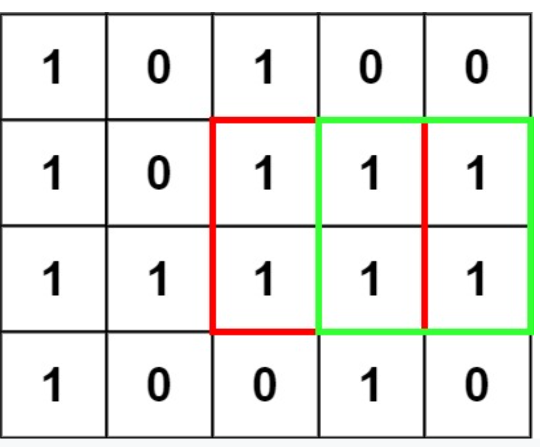

- [5.Longest Palindromic Substring](#5longest-palindromic-substring)
- [10.Regular Expression Matching](#10regular-expression-matching)
- [11.Container With Most Water](#11container-with-most-water)
- [15.3Sum](#153sum)
- [17.Letter Combinations of a Phone Number](#17letter-combinations-of-a-phone-number)
- [19.Remove Nth Node From End of List](#19remove-nth-node-from-end-of-list)
- [20.Valid Parentheses](#20valid-parentheses)
- [21.Merge Two Sorted Lists](#21merge-two-sorted-lists)
- [139.Word Break](#139word-break)
- [141.Linked List Cycle](#141linked-list-cycle)
- [142.Linked List Cycle II](#142linked-list-cycle-ii)
- [146.LRU Cache](#146lru-cache)
- [148.Sort List](#148sort-list)
- [152. Maximum Product Subarray](#152-maximum-product-subarray)
- [155.Min Stack](#155min-stack)
- [160. Intersection of Two Linked Lists](#160-intersection-of-two-linked-lists)
- [169.Majority Element](#169majority-element)
- [198.House Robber](#198house-robber)
- [199.Binary Tree Right Side View](#199binary-tree-right-side-view)
- [200.Number of Islands](#200number-of-islands)
- [206.Reverse Linked List](#206reverse-linked-list)
- [207.Course Schedule](#207course-schedule)
- [215. Kth Largest Element in an Array](#215-kth-largest-element-in-an-array)
- [221.Maximal Square](#221maximal-square)
- [226.Invert Binary Tree](#226invert-binary-tree)
- [230.Kth Smallest Element in a BST](#230kth-smallest-element-in-a-bst)
- [234. Palindrome Linked List](#234-palindrome-linked-list)
- [236. Lowest Common Ancestor of a Binary Tree](#236-lowest-common-ancestor-of-a-binary-tree)
- [238. Product of Array Except Self](#238-product-of-array-except-self)
- [239. Sliding Window Maximum](#239-sliding-window-maximum)
- [240、Search a 2D Matrix II](#240search-a-2d-matrix-ii)
- [279.Perfect Squares](#279perfect-squares)
- [283.Move Zeros](#283move-zeros)
- [287.Find the Duplicate Number](#287find-the-duplicate-number)
- [295.Find Median from Data Stream](#295find-median-from-data-stream)
- [<font color=red>297.Serialize and Deserialize Binary Tree</font>](#font-colorred297serialize-and-deserialize-binary-treefont)
- [300.Longest Increasing Subsequence](#300longest-increasing-subsequence)
- [309.Best Time to Buy and Sell Stock with Cooldown](#309best-time-to-buy-and-sell-stock-with-cooldown)
- [322.Coin Change](#322coin-change)
- [337.House Robber III](#337house-robber-iii)
- [338. Counting Bits](#338-counting-bits)
- [347. Top K Frequent Elements](#347-top-k-frequent-elements)
- [394.Decode String](#394decode-string)
- [406.Queue Reconstruction by Height](#406queue-reconstruction-by-height)
- [416.Partition Equal Subset Sum](#416partition-equal-subset-sum)
- [437.Path Sum III](#437path-sum-iii)
- [438.Find All Anagrams in a String](#438find-all-anagrams-in-a-string)
- [448.Find All Numbers Disappeared in an Array](#448find-all-numbers-disappeared-in-an-array)
- [494.Target Sum](#494target-sum)
- [543. Diameter of Binary Tree](#543-diameter-of-binary-tree)
- [560. Subarray Sum Equals K](#560-subarray-sum-equals-k)
- [581. Shortest Unsorted Continuous Subarray](#581-shortest-unsorted-continuous-subarray)
- [617.Merge Two Binary Trees](#617merge-two-binary-trees)
- [621. Task Scheduler](#621-task-scheduler)
- [647.Palindromic Substrings](#647palindromic-substrings)
- [739. Daily Temperatures](#739-daily-temperatures)
- [763.Partition Labels](#763partition-labels)
## 5.Longest Palindromic Substring

给定一个字符串返回其中的最长回文子串。

**Example 1:**

```
Input: s = "baba
Output: "bab"
Note: "aba" is also a valid answer.
```

**Example 2:**

```
Input: s = "cbbd"
Output: "bb"
```

需要一个二位数租i,j记录其子串s.substr(i,i+j)是不是回文的。

```c++
string longestPalindrome(string s) {
        // write code here
        int n=s.size();
        if (n == 1) return s;
        int longest = 1;
        int start=0;
        vector<vector<int> > dp(n,vector<int>(n));
        for(int i=0;i<n;i++)
        {
            dp[i][i]=1;
            if(i<n-1)
            {
                if(s[i]==s[i+1])
                {
                    dp[i][i+1]=1;
                    start=i;
                    longest=2;
                }
            }
        }
        
        for(int l=3;l<=n;l++)
        {
            for(int i=0;i+l-1<n;i++)
            {
                int j=l+i-1;
                if(s[i]==s[j] and dp[i+1][j-1]==1)
                {
                    dp[i][j]=1;
                    start=i;
                    longest=l;
                }
            }
        }
        return s.substr(start,longest);
        
    }
```

更简单的O(n)思路，从某处左右同时扩展法。

```java
public String longestPalindrome(String s) {
        if(s.length()<=1)
            return s;
        int minStart=0;
        int maxLen=1;
        for(int i=0;i<s.length();i++){
            if(s.length()-i<=maxLen/2) break;
            int l=i;
            int r=i;
            while(r<s.length()-1 && s.charAt(r+1)==s.charAt(r)) ++r;
            while(r<s.length()-1 && l>0 && s.charAt(r+1)==s.charAt(l-1)){
                r+=1;
                l-=1;
            }
            int newLen=r-l+1;
            if(newLen>maxLen){
                minStart=l;
                maxLen=newLen;
            }
        }
        return s.substring(minStart,minStart+maxLen);
        
    }
```

## 10.Regular Expression Matching

给定一个源字符串s和一个模式串p，判断p是否为s的正则表达式，

其中:

'.'代表任何单一字符，’*‘表示前一个字符的0个或n个。

**Example 1:**

```
Input: s = "aa", p = "a"
Output: false
Explanation: "a" does not match the entire string "aa".
```

**Example 2:**

```
Input: s = "aa", p = "a*"
Output: true
Explanation: '*' means zero or more of the preceding element, 'a'. Therefore, by repeating 'a' once, it becomes "aa".
```

**Example 3:**

```
Input: s = "ab", p = ".*"
Output: true
Explanation: ".*" means "zero or more (*) of any character (.)".
```

**Example 4:**

```
Input: s = "aab", p = "c*a*b"
Output: true
Explanation: c can be repeated 0 times, a can be repeated 1 time. Therefore, it matches "aab".
```

**Example 5:**

```
Input: s = "mississippi", p = "mis*is*p*."
Output: false
```

思路：以s每个字符为遍历，查看是否p能匹配，但是这里要注意$*$的情况，需要看$*$后一个字符才能判断此时p的位置该前进或不动。

具体怎么做：

假设s的长度为n，p的长度为m。利用动态规划思想，即判断$dp[n][m]$最终是否为true(能否好用m长度的p来描述出n长度的s)。

$dp[i][j]=true$即$s[0...i-1]$可用$p[0...j-1]$描述出来。

考虑子问题情况：

1、如果$p[j-1]!=*$，那么$dp[i][j]=dp[i-1][j-1] 并且 s[i-1]==p[j-1]||'.'==p[j-1]$

2、如果$p[j-1]==*$，也就是说$p[j-2]$为真正需要考虑的字符。这时候又有两种子情况：

​	a、$x*$ 重复了0次，表示为空，这时候$dp[i][j]=dp[i][j-2]$

​	b、$x*$重复了$n(n\ge 1)$次, 这时候$dp[i][j]=(s[i-1]==p[j-2] || '.'==p[j-2])$&&$dp[i-1][j]$


难度：较大，需要利用动态规划


```c++
class Solution {
public:
 bool isMatch(string s, string p) {
     
     int m=s.size();
     int n=p.size();
     
     //dp[i][j] ==true means  s[0:i] can be described by p[0:j]
     vector<vector<bool> > dp(m+1,vector<bool>(n+1,false));
     
     dp[0][0]=true;
     
     //special situation s="" 
     for(int j=1;j<=n;j++)
         dp[0][j]=p[j-1]=='*'&&dp[0][j-2];
     
     for(int i=1;i<=m;i++)
     {
         for(int j=1;j<=n;j++)
         {
             if(p[j-1]!='*')         
                 //
                 dp[i][j]=(dp[i-1][j-1] &&(s[i-1]==p[j-1]||'.'==p[j-1]));
             else
                 dp[i][j]=dp[i][j-2] ||(s[i-1]==p[j-2]||'.'==p[j-2])&&dp[i-1][j];
         }
     }
    return dp[m][n];
    
    }
};
```

## 11.Container With Most Water

 

给出很多条高度>=0的栅栏，需要找到两条栅栏，使得两者之间围城的面积最大(长为距离之差，宽为矮栅栏的高度)

考虑：从宽度->高度来考虑面积

首先考虑宽度，因为距离越远宽度越宽，所以初始宽度设为最大宽度，

因为面积要增大，所以宽度逐渐减小时，面积需要增大则必须高度增加，因此宽度减小后，选取的两栅栏的高度都必须大于当时最小的那个栅栏的高度才行，这样的思路，就能够在O(n)的时间复杂度解决该问题。

```c++
class Solution {
public:
    
    int maxArea(vector<int>& height) {
        
        int i=0;
        int j=height.size()-1;
        
        //start area
        int currentArea=min(height[i],height[j])*(j-i);
        while(i<j)
        {

            int temp=min(height[i],height[j]);//current height
            //beause height decrease so height need become higher
            while(height[i]<=temp&&i<height.size()-1)
                    i+=1;
            while(height[j]<=temp&&j>0)
                    j-=1;

            if(min(height[i],height[j])*(j-i)>currentArea)
                    currentArea=min(height[i],height[j])*(j-i);
        }
        
        return currentArea;
        
    }
};
```

## 15.3Sum

类似 18.4Sum。

目的是找出所有和为0的长度为3的集合。(不重复)

排序后可以将第2层循环用2pointer来改为O（1）

**Example 1:**

```
Input: nums = [-1,0,1,2,-1,-4]
Output: [[-1,-1,2],[-1,0,1]]
```

思路：O(n3)转O(n2)

```c++
vector<vector<int>> threeSum(vector<int>& nums) {
        sort(nums.begin(),nums.end());
        vector<vector<int> > rvec;
        int n=nums.size();
        for(int i=0;i<n-2;i++)
        {
            if(i>0 and nums[i]==nums[i-1])  //repeat
                continue;
            int target=-nums[i];
            for(int l=i+1,r=n-1;l<r;)
            {
                if(nums[l]+nums[r]==target)
                {
                    rvec.push_back({nums[i],nums[l],nums[r]});
                    while(l<n-1 and nums[l]==nums[l+1]) l+=1;
                    while(r>0 and nums[r]==nums[r-1]) r--;
                    
                    l+=1;
                    r-=1;
                }
                else if(nums[l]+nums[r]<target) l+=1;
                else r-=1;
                     
            }
            
        }
        return rvec;
    }
```

```java
 public List<List<Integer>> threeSum(int[] nums) {
        
        int n=nums.length;
        List<List<Integer>> result=new ArrayList<>();
        if(n==0)
            return result;
        
        Arrays.sort(nums);
        int oldNumsj=nums[n-1]+1;
        int oldNumsk=nums[n-1]+1;
        for(int i=0;i<n-2;i++){
            if(i>0 && nums[i]==nums[i-1])
                continue;
            int target=-nums[i];
            int j=i+1;
            int k=n-1;
            while(j<k){
                if(nums[j]+nums[k]==target){
                    List<Integer> l=Arrays.asList(nums[i],nums[j],nums[k]);
                    result.add(l);
                    while(j<n-1 &&nums[j]==nums[j+1]) j+=1;
                    while(k>0 && nums[k]==nums[k-1]) k-=1;
                    j+=1;
                    k-=1;
                }else if(nums[j]+nums[k]<target){
                    j++;
                }else{
                    k--;
                }
            }
        }
        return result;
    }
```

## 17.Letter Combinations of a Phone Number

考虑手机的九键输入，

给定从2到9的数字序列，返回所有可能的字符串集合。

 

**Example 1:**

```
Input: digits = "23"
Output: ["ad","ae","af","bd","be","bf","cd","ce","cf"]
```

**Example 2:**

```
Input: digits = ""
Output: []
```

**Example 3:**

```
Input: digits = "2"
Output: ["a","b","c"]
```

思路：递归，然后回溯

第一步：建立映射

```c++
class Solution {
public:
    vector<string>  r;
    unordered_map<char,vector<string> > m;

    
    void dfs(string now,string remainder)
    {
        if(remainder.size()==0)//finish
            r.push_back(now);
        else{
            char temp=remainder[0];
            for(int j=0;j<m[temp].size();j++)
            {
                //in
                dfs(now+m[temp][j],remainder.substr(1));
                
                //back
            }
        }
    }
    vector<string> letterCombinations(string digits) {
        if(digits.empty())
            return r;

        //construct map relationship
        m['2']={"a","b","c"};
        m['3']={"d","e","f"};
        m['4']={"g","h","i"};
        m['5']={"j","k","l"};
        m['6']={"m","n","o"};
        m['7']={"p","q","r","s"};
        m['8']={"t","u","v"};
        m['9']={"w","x","y","z"};
        dfs("",digits);
        
        return r;
        
    }
};
```

Java

```java
class Solution {
    
    Map<Character,List<Character>> m=new HashMap<>();
    List<String> l=new ArrayList<>();
    
    private void dfs(String curString,String remainDigits){
        if(remainDigits.length()==0)
            l.add(curString);
        else{
            Character number=remainDigits.charAt(0);
            List<Character> chars=m.get(number);
            for(int i=0;i<chars.size();i++){
                dfs(curString+chars.get(i),remainDigits.substring(1));
            }
        }
    }
    public List<String> letterCombinations(String digits) {
        if(digits.length()==0)
            return l;
        
        m.put('2',Arrays.asList('a','b','c'));
        m.put('3',Arrays.asList('d','e','f'));
        m.put('4',Arrays.asList('g','h','i'));
        m.put('5',Arrays.asList('j','k','l'));
        m.put('6',Arrays.asList('m','n','o'));
        m.put('7',Arrays.asList('p','q','r','s'));
        m.put('8',Arrays.asList('t','u','v'));
        m.put('9',Arrays.asList('w','x','y','z'));
        dfs("",digits);
        return  l;
    }
}
```

## 19.Remove Nth Node From End of List

给定一个链表和一个数n，移走链表中 倒数第n个数。

<font color=red>思考:如何只需要一次遍历？</font>

Example:


一次遍历，即需要在一次遍历中记录list的位置，通过vector先存起来

```c++
 ListNode* removeNthFromEnd(ListNode* head, int n) {
        
        ListNode* first=head;//save start node;
        vector<ListNode*> vec;
        //int i=1;//start from 1

        while(head!=nullptr)
        {
            vec.push_back(head);
            head=head->next;
        }
        
        int num_sum=vec.size();//node num
        
        //special situation
        if(num_sum-n<=0)  //delete the first number
        {
            if(num_sum==1) //only one number,then empty
                return nullptr;
            if(num_sum>=2) //more than one number
                return vec[1];
        }
        //else  
        vec[num_sum-n-1]->next=vec[num_sum-n]->next;
        return first;
        
    }
```

另一种O(1)时间复杂度的快慢指针

```java
class Solution {
    public ListNode removeNthFromEnd(ListNode head, int n) {
        ListNode fast=head;
        ListNode slow=head;
        int tick=0;
        while(fast!=null && tick<n){
            fast=fast.next;
            tick+=1;
        }
        ListNode pre=null;
        while(fast!=null){
            fast=fast.next;
            pre=slow;
            slow=slow.next;
        }
        
        if(pre==null){
            return head.next;
        }else if(slow==null){
            pre.next=null;
            return head;
        }else{
            pre.next=slow.next;
            return head;
        }
        
    }
}
```


## 20.Valid Parentheses

给定一个只包含字符“（”、“）”、“{”、“}”、“[”和“]”的字符串，确定输入字符串是否有效。

**Example 1:**

```
Input: s = "()"
Output: true
```

**Example 2:**

```
Input: s = "()[]{}"
Output: true
```

**Example 3:**

```
Input: s = "(]"
Output: false
```

**Example 4:**

```
Input: s = "([)]"
Output: false
```

**Example 5:**

```
Input: s = "{[]}"
Output: true
```

第一思路，用栈，主要考虑进栈、出栈条件：

```c++
class Solution {
public:
    bool isValid(string s) {
        
        stack<char> mstack;
        for(int i=0;i<s.size();i++)
        {
            if(s[i]==')')
            {
                if(mstack.empty()==false && mstack.top()=='(')
                    mstack.pop();
                else return false;
            }
            else if(s[i]=='}')
            {
                 if(mstack.empty()==false && mstack.top()=='{')
                    mstack.pop();
                else return false;
            }
            else if(s[i]==']')
            {
                 if(mstack.empty()==false && mstack.top()=='[')
                    mstack.pop();
                else return false;
            }
            else{
                mstack.push(s[i]);
            }
        }
        if(mstack.empty())
            return true;
        return false;
    }
};
```

## 21.Merge Two Sorted Lists

将两个已排序的链表合并为一个排好序的链表：

Example

```
Input: l1 = [1,2,4], l2 = [1,3,4]
Output: [1,1,2,3,4,4]
```

最简单的方法，重新建立一个长度为n1+n2的链表，O(n)，需要消耗额外空间。

```C++
class Solution {
public:
    ListNode* mergeTwoLists(ListNode* l1, ListNode* l2) {
        ListNode* first=new ListNode(-1);
        ListNode* head=first;
        while(l1 and l2)
        {
            if(l1->val <l2->val)
            {
                head->next=new ListNode(l1->val);
                l1=l1->next;
                head=head->next;
            }
            else{
                head->next=new ListNode(l2->val);
                l2=l2->next;
                head=head->next;
            }   
        }        
        if(l1)
            head->next=l1;
        else
            head->next=l2;
        return first->next;
    }
};
```

是否有不需要消耗O(n)额外空间的方法？

```c++
public ListNode mergeTwoLists(ListNode l1, ListNode l2) {
        if(l1==null)
            return l2;
        if(l2==null)
            return l1;
        
        ListNode l1Cur,l2Cur;
        ListNode head=null;
        l1Cur=l1;
        l2Cur=l2;
        ListNode pre=null; //合并后的当前前缀节点
  			//设置头结点
        if(l1.val<l2.val){
            head=l1;
            l1Cur=l1Cur.next;
        }else{
            head=l2;
            l2Cur=l2Cur.next;
        }
        pre=head;  //第一个前缀节点肯定是头结点
        
        while(l1Cur!=null && l2Cur!=null){
            if(l1Cur.val<l2Cur.val){
                pre.next=l1Cur;
                pre=l1Cur;
                l1Cur=l1Cur.next;
            }else{
                pre.next=l2Cur;
                pre=l2Cur;
                l2Cur=l2Cur.next;
            }
        }
        
        if(l1Cur!=null)
            pre.next=l1Cur;
        else if(l2Cur!=null)
            pre.next=l2Cur;
        return head;
    }
```

## 139.Word Break

给定一个字符串s和一个字典，判断s能否被字典里的一个或多个词组成。

字典中的同一单词可以在分段中多次重复使用。
您可能认为字典不包含重复的单词。

**Example 1:**

```
Input: s = "leetcode", wordDict = ["leet", "code"]
Output: true
Explanation: Return true because "leetcode" can be segmented as "leet code".
```

**Example 2:**

```
Input: s = "applepenapple", wordDict = ["apple", "pen"]
Output: true
Explanation: Return true because "applepenapple" can be segmented as "apple pen apple".
             Note that you are allowed to reuse a dictionary word.
```

**Example 3:**

```
Input: s = "catsandog", wordDict = ["cats", "dog", "sand", "and", "cat"]
Output: false
```

思路：贪婪法

```c++
 bool wordBreak(string s, vector<string>& wordDict) {
        if(s=="")
            return true;
        for(auto word:wordDict)
        {
            int l=word.size();
            if(s.substr(0,l)==word)
            {
                if(wordBreak(s.substr(l),wordDict))
                    return true;
            }
        }
        
        return false;
    }
```

但是会TLE。

利用动态规划：

```java
class Solution {
    public boolean wordBreak(String s, List<String> wordDict) {
        
        HashSet<String> set=new HashSet<>(wordDict);
        int n=s.length();
        int[] dp=new int[n+1];
        dp[0]=1;
        for(int i=1;i<=n;i++){
            for(int j=i-1;j>=0;j--){
                if(dp[j]==1){
                    if(set.contains(s.substring(j,i))){
                        dp[i]=1;
                        break;
                    }
                }
            }
        }
        
        return dp[n]==1;
    }
}
```

## 141.Linked List Cycle

给定一个链表的头结点，判断该链表是否有循环

**Example 1:**


```
Input: head = [3,2,0,-4], pos = 1
Output: true
Explanation: There is a cycle in the linked list, where the tail connects to the 1st node (0-indexed).
```

思路:简单就用一个hash来存储访问过的

```c++
bool hasCycle(ListNode *head) {
        unordered_map<ListNode*,bool> visited;
        while(head!=nullptr)
        {
            if(visited.find(head)==visited.end())
                visited[head]=true;
            else
                return true;
            head=head->next;
        }
        return false;
        
    }
```

**延伸：如何在O(1)空间？**——双指针

```c++
bool hasCycle(ListNode *head) {
        ListNode* fast=head;
        ListNode* low=head;
        while(fast!=nullptr and fast->next!=nullptr)
        {
            low=low->next;
            fast=fast->next->next;
            if(low==fast)
                return true;
        }
        return false;
        
    }
```

## 142.Linked List Cycle II

给定一个链表的头结点，判断链表是否有环，如果有环，返回环开始节点；否则返回nullptr。

思路：类似141,找到相遇节点后，再求开始节点。

```java
public class Solution {
    public ListNode detectCycle(ListNode head) {
        if(head==null)
            return null;
        ListNode fast,slow;
        fast=slow=head;
        boolean flag=false;
        while(fast.next!=null && fast.next.next!=null){
            fast=fast.next.next;
            slow=slow.next;
            if(fast==slow){
                flag=true;
                break;
            }
        }
        
        if(flag==false)
            return null;
        else{
            ListNode start1=head;
            ListNode start2=slow;
            while(start1!=start2){
                start1=start1.next;
                start2=start2.next;
            }
            return start1;
        }
        
    }
}
```

## 146.LRU Cache

构造一个数据结构遵循**最近最少用原则(LRU)**

有3个成员函数

LRUCache：构造函数给定cache 容量

get： 给定key，返回value

put: 给定key，value 进行存储

**Example 1:**

```
Input
["LRUCache", "put", "put", "get", "put", "get", "put", "get", "get", "get"]
[[2], [1, 1], [2, 2], [1], [3, 3], [2], [4, 4], [1], [3], [4]]
Output
[null, null, null, 1, null, -1, null, -1, 3, 4]

Explanation
LRUCache lRUCache = new LRUCache(2);
lRUCache.put(1, 1); // cache is {1=1}
lRUCache.put(2, 2); // cache is {1=1, 2=2}
lRUCache.get(1);    // return 1
lRUCache.put(3, 3); // LRU key was 2, evicts key 2, cache is {1=1, 3=3}
lRUCache.get(2);    // returns -1 (not found)
lRUCache.put(4, 4); // LRU key was 1, evicts key 1, cache is {4=4, 3=3}
lRUCache.get(1);    // return -1 (not found)
lRUCache.get(3);    // return 3
lRUCache.get(4);    // return 4
```

LRU双向链表

```java
class LRUCache {
    private Map<Integer,Integer> m;
    private int Capacity;
    public LRUCache(int capacity) {
        m=new LinkedHashMap<>(capacity,0.75f,true);
        Capacity=capacity;
    }
    
    public int get(int key) {
        if(m.containsKey(key)){
            int value=m.get(key);
            return value;
        }else{
            return -1;
        } 
    }
    
    public void put(int key, int value) {
        m.put(key,value);
        if(m.size()>Capacity){
            m.remove(m.keySet().iterator().next());
        }
    }
}
```

## 148.Sort List

给定一个链表，返回其排序后升序的链表

另外考虑：如何在O(nlogn)时间且只用O(1)空间复杂度

**Example**

```
Input: head = [4,2,1,3]
Output: [1,2,3,4]
```

思路：使用快慢指针，归并排序的思想

```java
class Solution {
    public ListNode sortList(ListNode head) {
        if(head==null || head.next==null){
            return head;
        }
        ListNode slow=head;
        ListNode fast=head.next;
        while(fast!=null && fast.next!=null){
            slow=slow.next;
            fast=fast.next.next;
        }
        
        //two single list
        fast=slow.next;
        slow.next=null;
        return merge(sortList(head),sortList(fast));
    }
    private ListNode merge(ListNode l1,ListNode l2){ //l1 sorted,l2 sorted
        if(l1==null)
            return l2;
        if(l2==null)
            return l1;
        
        ListNode start=null;
        ListNode pre=null;
        if(l1.val<l2.val){
            start=l1;
            pre=l1;
            l1=l1.next;
        }else{
            start=l2;
            pre=l2;
            l2=l2.next;
        }
        
        while(l1!=null && l2!=null){
            if(l1.val<l2.val){
                pre.next=l1;
                pre=l1;
                l1=l1.next;
            }else{
                pre.next=l2;
                pre=l2;
                l2=l2.next;
            }
        }
        
        if(l1!=null)
            pre.next=l1;
        else if(l2!=null)
            pre.next=l2;
        
        return start;
    }
}
```

## 152. Maximum Product Subarray

给定一个数组nums，找出其中子连续数组拥有最大乘积的值。

**Example 1:**

```
Input: [2,3,-2,4]
Output: 6
Explanation: [2,3] has the largest product 6.
```

**Example 2:**

```
Input: [-2,0,-1]
Output: 0
Explanation: The result cannot be 2, because [-2,-1] is not a subarray.
```

思路：因为是连续的考虑动态规划，因为有正负，所以考虑用两个dp数组。

```java
public int maxProduct(int[] nums) {
        int n=nums.length;
        int[] dpMax=new int[n];
        int[] dpMin=new int[n];
        
        int MaxValue=nums[0];
        for(int i=0;i<n;i++){
            dpMax[i]=nums[i];
            dpMin[i]=nums[i];
        }
        
        for(int i=1;i<n;i++){
            if(nums[i]>0){
                dpMax[i]=Math.max(dpMax[i-1]*nums[i],nums[i]);
                dpMin[i]=Math.min(dpMin[i-1]*nums[i],nums[i]);
            }else if(nums[i]<0){
                dpMax[i]=Math.max(dpMin[i-1]*nums[i],nums[i]);
                dpMin[i]=Math.min(dpMax[i-1]*nums[i],nums[i]);
            }
        }
        
        for(int i=0;i<dpMax.length;i++){
            MaxValue=Math.max(MaxValue,dpMax[i]);
        }
        return MaxValue;
       
    }
```

进一步优化空间复杂度。

```c++
public int maxProduct(int[] nums) {
        int n=nums.length;
        if(n==0)
            return 0;
        int maxProduct=Integer.MIN_VALUE;
        int maxProd=1;
        int minProd=1;
        for(int value:nums){
            if(value<0){
                int temp=maxProd;
                maxProd=minProd;
                minProd=temp;
            }
            maxProd=Math.max(maxProd*value,value);
            minProd=Math.min(minProd*value,value);
            maxProduct=Math.max(maxProduct,maxProd);
        }
        return maxProduct;
    }
```

## 155.Min Stack

构造一个stack支持push pop top 。

并且在常数时间内返回stack内最小值。

```c++
stack<int> s1;
    stack<int> s2;
    void push(int x) {
	    s1.push(x);
	    if (s2.empty() || x <= getMin())  s2.push(x);	    
    }
    void pop() {
	    if (s1.top() == getMin())  s2.pop();
	    s1.pop();
    }
    int top() {
	    return s1.top();
    }
    int getMin() {
	    return s2.top();
    }
```

Java

```java
 /** initialize your data structure here. */
    private LinkedList<Integer> s1;
    private LinkedList<Integer> s2; //save min value
    
    public MinStack() {
        s1=new LinkedList<>();
        s2=new LinkedList<>();
    }
    
    public void push(int val) {
        s1.addFirst(val);
        if(s2.size()==0 || val<=getMin()) 
            s2.addFirst(val);
    }
    
    public void pop() {
        if(s1.peek()==getMin()){
            s2.poll();
        }
        s1.poll();
    }
    
    public int top() {
        return s1.peek();
    }
    
    public int getMin() {
        return s2.peek();
    }
```

## 160. Intersection of Two Linked Lists

找出两个链表的公共开始节点：

 

```
Input: intersectVal = 8, listA = [4,1,8,4,5], listB = [5,6,1,8,4,5], skipA = 2, skipB = 3
Output: Reference of the node with value = 8
Input Explanation: The intersected node's value is 8 (note that this must not be 0 if the two lists intersect). From the head of A, it reads as [4,1,8,4,5]. From the head of B, it reads as [5,6,1,8,4,5]. There are 2 nodes before the intersected node in A; There are 3 nodes before the intersected node in B.
```

思路1：使用hashSet

```c++
    public ListNode getIntersectionNode(ListNode headA, ListNode headB) {
        HashSet<ListNode> set=new HashSet<>();
        while(headA!=null){
            set.add(headA);
            headA=headA.next;
        }
        
        if(set.size()==0)
            return null;
        while(headB!=null){
            if(set.contains(headB)){
                return headB;
            }
            headB=headB.next;
        }
        return null;
    }
```

思路2 ：O(1)空间复杂度

```java
public class Solution {
    private int getListLength(ListNode node){
        ListNode temp=node;
        int len=0;
        while(temp!=null){
            temp=temp.next;
            len+=1;
        }
        return len;
    }
        
    public ListNode getIntersectionNode(ListNode headA, ListNode headB) {
        int lenA=getListLength(headA);
        int lenB=getListLength(headB);
        while(lenA>lenB){
            headA=headA.next;
            lenA--;
        }
        while(lenA<lenB){
            headB=headB.next;
            lenB--;
        }
        
        while(headA!=headB){
            headA=headA.next;
            headB=headB.next;
        }
        return headA;
    }
}
```


## 169.Majority Element

给定一个长度为n的数组，找出其中出现次数超过$⌊ n/2 ⌋$的数(题设：该数一定存在)

**Example 1:**

```
Input: [3,2,3]
Output: 3
```

**Example 2:**

```
Input: [2,2,1,1,1,2,2]
Output: 2
```

常规方法有很多，这里比较好的是利用目标数会出现超过总数一半的条件，进行一次遍历

```java
public int majorityElement(int[] nums) {
        int majorityNum=nums[0];
        int majorityCount=1;
        for(int i=1;i<nums.length;i++){
            if(majorityNum==nums[i]){
                majorityCount+=1;
            }else{
                majorityCount-=1;
                if(majorityCount==0){
                    majorityNum=nums[i];
                    majorityCount=1;
                }
            }
        }
        return majorityNum;
    }
```

## 198.House Robber

给定一个正整数组，你可以取其中所有不相邻的值，求能取得的最大值。

**Example 1:**

```
Input: nums = [1,2,3,1]
Output: 4
Explanation: Rob house 1 (money = 1) and then rob house 3 (money = 3).
             Total amount you can rob = 1 + 3 = 4.
```

**Example 2:**

```
Input: nums = [2,7,9,3,1]
Output: 12
Explanation: Rob house 1 (money = 2), rob house 3 (money = 9) and rob house 5 (money = 1).
             Total amount you can rob = 2 + 9 + 1 = 12.
```

思路：动态规划

```c++
int rob(vector<int>& nums) {
        int n=nums.size();
        if(n==0)
            return 0;
        if(n==1)
            return nums[0];
        else if(n==2)
            return max(nums[0],nums[1]);
        vector<int> dp(nums.size(),0);
        dp[0]=nums[0];
        dp[1]=nums[1];
        if(nums.size()>2)
            dp[2]=dp[0]+nums[2];
        for(int i=3;i<n;i++)
        {
                dp[i]=max(dp[i-2],dp[i-3])+nums[i];
        }
        return *max_element(dp.begin(),dp.end());
    }
```

Java版

```java
class Solution {
    public int rob(int[] nums) {
        int n=nums.length;
        if(n==1)
            return nums[0];
        if(n==2)
            return Math.max(nums[0],nums[1]);
        
        int[] dp=new int[n];
        dp[0]=nums[0];
        dp[1]=nums[1];
        dp[2]=nums[0]+nums[2];
        
  
        for(int i=3;i<n;i++){
            dp[i]=Math.max(dp[i-2],dp[i-3])+nums[i];
        }
        
      
        int maxValue=dp[0];
        for(int i:dp){
            maxValue=Math.max(i,maxValue);
        }
        return maxValue;
           
    }
```

## 199.Binary Tree Right Side View

给定一个二叉树，返回从右边往左看的所有层第一个数的数组。

**Example:**

```
Input: [1,2,3,null,5,null,4]
Output: [1, 3, 4]
Explanation:

   1            <---
 /   \
2     3         <---
 \     \
  5     4       <---
```

思路：dfs遍历：对于每下一层，先往右，若没有右孩子再往左。需要记录层次信息。

```c++
void dfs(TreeNode* node,vector<int>& rvec,int h)
    {
        if(node!=nullptr)
        {
            if(h+1>rvec.size())
                rvec.push_back(node->val); //right side number 
            dfs(node->right,rvec,h+1);
            dfs(node->left,rvec,h+1);
        }
    }
    vector<int> rightSideView(TreeNode* root) {
        vector<int> rvec;
        dfs(root,rvec,0);
        return rvec;
    }
```

java版

```java
    private List<Integer> l=new ArrayList<>();
    
    private void RLRtraversal(TreeNode node,int h){
        if(node!=null){
            if(l.size()<h){
                l.add(node.val);
            }
            RLRtraversal(node.right,h+1);
            RLRtraversal(node.left,h+1);
        }
        
    }
    public List<Integer> rightSideView(TreeNode root) {
        int h=1;
        RLRtraversal(root,h);
        return l;
    }
```


## 200.Number of Islands

给定一个m x n的2维矩阵，其中1代表land，0代表water。返回其中所有的岛屿数目（岛屿与岛屿之间不能有陆地连接）

**Example 1:**

```
Input: grid = [
  ["1","1","1","1","0"],
  ["1","1","0","1","0"],
  ["1","1","0","0","0"],
  ["0","0","0","0","0"]
]
Output: 1
```

**Example 2:**

```
Input: grid = [
  ["1","1","0","0","0"],
  ["1","1","0","0","0"],
  ["0","0","1","0","0"],
  ["0","0","0","1","1"]
]
Output: 3
```

思路：利用dfs遍历

```c++
 void DFSsearch(pair<int,int> point,vector<vector<char>>& grid,vector<vector<bool>> & visited)
    {
        
        stack<pair<int,int>> mys;
        mys.push(point);
        int x,y;
        x=point.first;
        y=point.second;
        visited[x][y]=true;
        while(!mys.empty())
        {
            pair<int,int> temp=mys.top();
            mys.pop();
            
            x=temp.first;
            y=temp.second;
            
            //from 4 directions
            if(x-1>=0&&grid[x-1][y]=='1'&&visited[x-1][y]==false)
            {
                mys.push(make_pair(x-1,y));
                visited[x-1][y]=true;
            }
            if(x+1<=grid.size()-1&&grid[x+1][y]=='1'&&visited[x+1][y]==false)
            {
                mys.push(make_pair(x+1,y));
                visited[x+1][y]=true;
            }
            if(y-1>=0&&grid[x][y-1]=='1'&&visited[x][y-1]==false)
            {
                mys.push(make_pair(x,y-1));
                visited[x][y-1]=true;
            }
            if(y+1<=grid[0].size()-1&&grid[x][y+1]=='1'&&visited[x][y+1]==false)
            {
                mys.push(make_pair(x,y+1));
                visited[x][y+1]=true;
            }
        }
        
    }
    
    int numIslands(vector<vector<char>>& grid) {
        
        int m=grid.size();
        int n=grid[0].size();
        vector<vector<bool>> visited(m,vector<bool> (n,false)); //has been traversaled
        
        int islands_num=0;
        for(int i=0;i<m;i++)
            for(int j=0;j<n;j++)
            {
                if(grid[i][j]=='1'&&visited[i][j]==false)
                {
                    islands_num+=1; //find a island
                    DFSsearch(make_pair(i,j),grid,visited);     //visit all lands in this island
                }          
            }
        
        return islands_num;
    }
```

java版，注意java中的pair

```java
private static int m;
    private static int n;
    private void dfs(char[][] grid,boolean[][] visited,int i,int j){
        LinkedList<Pair<Integer,Integer>> s=new LinkedList<>();
        visited[i][j]=true;
        s.addFirst(new Pair<Integer,Integer>(i,j));
        while(s.size()>0){
            Pair<Integer,Integer> point=s.poll();
            int x=point.getKey();
            int y=point.getValue();
            if(x+1<m && grid[x+1][y]=='1' && visited[x+1][y]==false){
                s.addFirst(new Pair<Integer,Integer>(x+1,y));
                visited[x+1][y]=true;
            }
            if(x-1>=0 && grid[x-1][y]=='1' && visited[x-1][y]==false){
                s.addFirst(new Pair<Integer,Integer>(x-1,y));
                visited[x-1][y]=true;
            }
            if(y+1<n && grid[x][y+1]=='1' && visited[x][y+1]==false ){
                s.addFirst(new Pair<Integer,Integer>(x,y+1));
                visited[x][y+1]=true;
            }
            if(y-1>=0 && grid[x][y-1]=='1' && visited[x][y-1]==false ){
                s.addFirst(new Pair<Integer,Integer>(x,y-1));
                visited[x][y-1]=true;
            }
        }
    }
    public int numIslands(char[][] grid) {
        m=grid.length;
        n=grid[0].length;
        boolean[][] visited=new boolean[m][n];
        int islandNum=0;
        for(int i=0;i<m;i++){
            for(int j=0;j<n;j++){
                if(grid[i][j]=='1' && visited[i][j]==false){
                    dfs(grid,visited,i,j);
                    islandNum+=1;
                    
                }
            }
        }
        return islandNum;
    }
```

## 206.Reverse Linked List

给定一个单链表，返回其反转链表。

**Example 1:**

```
Input: head = [1,2,3,4,5]
Output: [5,4,3,2,1]
```

思路：如果用O(1)空间复杂度的话

```c++
ListNode* reverseList(ListNode* head) {
        if(head==nullptr or head->next==nullptr)
            return head;
        ListNode* node=head->next;
        ListNode* prenode=head;
        prenode->next=nullptr; //firstnode->next=nullptr
        while(node!=nullptr and node->next!=nullptr)
        {
            ListNode* temp=node->next; 
            node->next=prenode;
            prenode=node;
            node=temp;
        }
        node->next=prenode;
        return node;
    }
```

递归的解法，更易理解：

```java
    private ListNode lastNode=null;
    
    private ListNode helper(ListNode node){
        if(node.next!=null){
            ListNode temp=helper(node.next);
            temp.next=node;
            return node;        
        }else{
            lastNode=node;
            return node;
        }
        
        
    }
    public ListNode reverseList(ListNode head) {
        if(head==null)
            return null;
        helper(head);
        head.next=null;
        return lastNode;
    }
```

## 207.Course Schedule

你需要去修n个课程其序号从0到n-1，但是其中有限制条件，即例如[1,0]，即你修课程0的话，必须先修完课程1。

给定课程数目n和限制条件，判断是否能够修完。

**Example 1:**

```
Input: numCourses = 2, prerequisites = [[1,0]]
Output: true
Explanation: There are a total of 2 courses to take. 
             To take course 1 you should have finished course 0. So it is possible.
```

**Example 2:**

```
Input: numCourses = 2, prerequisites = [[1,0],[0,1]]
Output: false
Explanation: There are a total of 2 courses to take. 
             To take course 1 you should have finished course 0, and to take course 0 you should
             also have finished course 1. So it is impossible.
```

思路：整个数据结构看一看做是有向树结构，遍历，只有无需前缀课程的课程的才能作为叶节点。一层层的叶节点剥离(条件，目前入度为0)，若全部剥离成功，则可以完成。

```java
 class Solution {
    public boolean canFinish(int n, int[][] prerequisites) {
        List<Integer>[] G=new ArrayList[n];
        int[] degree=new int[n];
        List<Integer> bfs=new ArrayList<>();
        for(int i=0;i<n;i++){
            G[i]=new ArrayList<>();
        }
        for(int[] e:prerequisites){
            G[e[1]].add(e[0]);
            degree[e[0]]++;
        }
        for(int i=0;i<n;i++){
            if(degree[i]==0) bfs.add(i);
        }
        
        for(int i=0;i<bfs.size();i++){ //原始入口
            for(int j:G[bfs.get(i)]){ //一层层脱去
                if(--degree[j]==0) bfs.add(j);
            }
        }
        return bfs.size()==n;
    }
}
```

## 215. Kth Largest Element in an Array

找出一个未排序序列，第k大的数值。

**Example 1:**

```
Input: [3,2,1,5,6,4] and k = 2
Output: 5
```

**Example 2:**

```
Input: [3,2,3,1,2,4,5,5,6] and k = 4
Output: 4
```

优先队列：基于二叉堆排序。

```c++
class Solution {
    public int findKthLargest(int[] nums, int k) {
        Queue<Integer> q=new PriorityQueue<>((num1,num2)->{
            return num1-num2;
        });
        
        for(int i=0;i<nums.length;i++){
            q.add(nums[i]);
            if(q.size()>k)
                q.poll();
        }
        
        return q.peek();
        
    }
}
```

## 221.Maximal Square

给定一个m x n的二维矩阵 只有0和1，找出其中最大的正方形(全1),并返回它的面积

**Example 1:**

  

```
Input: matrix = [["1","0","1","0","0"],["1","0","1","1","1"],["1","1","1","1","1"],["1","0","0","1","0"]]
Output: 4
```

思路：动态规划，求能组成的最大边

```java
class Solution {
    public int maximalSquare(char[][] matrix) {
        int m=matrix.length;
        int n=matrix[0].length;
        int[][] dp=new int[m][n];
        int maxEdge=0;
        for(int i=0;i<m;i++){
            for(int j=0;j<n;j++){
                if(i==0 || j==0)
                    dp[i][j]=matrix[i][j]-'0';
                else if(matrix[i][j]=='1'){
                    dp[i][j]=
                        1+Math.min(dp[i-1][j-1],Math.min(dp[i-1][j],dp[i][j-1]));
                }
                 maxEdge=Math.max(maxEdge,dp[i][j]);
            }
        }
        return maxEdge*maxEdge;
    }
}
```

## 226.Invert Binary Tree

反转一个二叉树

**Example:**

Input:

```
     4
   /   \
  2     7
 / \   / \
1   3 6   9
```

Output:

```
     4
   /   \
  7     2
 / \   / \
9   6 3   1
```

思路：递归

```java
class Solution {
    public TreeNode invertTree(TreeNode root) {
        if(root!=null){
            TreeNode temp=root.left;
            root.left=invertTree(root.right);
            root.right=invertTree(temp);
        }
        return root;
    }
}
```

## 230.Kth Smallest Element in a BST

给定一个二叉搜索树的根节点和整数k，返回第k小的元素值

**Example 1:**

、

```
Input: root = [3,1,4,null,2], k = 1
Output: 1
```

思路：中序遍历

```c++
 private int result;
    private int index;
    private boolean find=false;
    private void InorderTraversal(TreeNode node){
        if(node!=null){
            InorderTraversal(node.left);
            if(find==true)
                return;
            if(index==1){
                //System.out.println(node.val);
                result=node.val;
                find=true;
                return;
            }else{
                index--;
            }
            InorderTraversal(node.right);
        }
    }
    public int kthSmallest(TreeNode root, int k) {
        index=k;
        InorderTraversal(root);
        return result;
        
    }
```

## 234. Palindrome Linked List

给定一个单链表，判断其是否为回文的 。

**Example 1:**

```
Input: 1->2
Output: false
```

**Example 2:**

```
Input: 1->2->2->1
Output: true
```

```c++
bool isPalindrome(ListNode* head) {
        vector<int> vec;
        while(head!=nullptr)
        {
            vec.push_back(head->val);
            head=head->next;
        }
        
        int l=vec.size();
        for(int i=0;i<l/2;i++)
        {
            if(vec[i]!=vec[l-i-1])
                return false;
        }
        return true;
    }
```

O(1)空间复杂度

```java
//private ListNode pre;
    ListNode reverse(ListNode head)
    {
        ListNode pre=null,cur=head;
        while(cur!=null)
        {
            ListNode next=cur.next;
            cur.next=pre;
            pre=cur;
            cur=next;
        }
        return pre;
    }
    public boolean isPalindrome(ListNode head) {
        
        ListNode slow,fast;
        slow=fast=head;
        while(fast!=null && fast.next!=null )
        {
            slow=slow.next;
            fast=fast.next.next;
        }
        ListNode left=head;
        ListNode right=reverse(slow);
        
        while(right!=null)
        {
            if(left.val!=right.val) return false;
            left=left.next;
            right=right.next;
        }
        
        return true;
    }
```

## 236. Lowest Common Ancestor of a Binary Tree

给定一个二叉树，找出两个给定节点的最早的祖先。

**Example 1:**

 

```
Input: root = [3,5,1,6,2,0,8,null,null,7,4], p = 5, q = 1
Output: 3
Explanation: The LCA of nodes 5 and 1 is 3.
```

思路1：用两个hashmap存父节点，存高度，然后统一高度网上找

```c++
private void PreTraversal(TreeNode node,Map<TreeNode,TreeNode> parent,Map<TreeNode,Integer> depth){
        if(node!=null){
            if(node.left!=null){
                parent.put(node.left,node);
                depth.put(node.left,depth.get(node)+1);
            }
            if(node.right!=null){
                parent.put(node.right,node);
                depth.put(node.right,depth.get(node)+1);
            }
            PreTraversal(node.left,parent,depth);
            PreTraversal(node.right,parent,depth);
        }
    }
    public TreeNode lowestCommonAncestor(TreeNode root, TreeNode p, TreeNode q) {
        Map<TreeNode,TreeNode> parent=new HashMap<>();
        Map<TreeNode,Integer> depth=new HashMap<>();
        
        parent.put(root,null);
        depth.put(root,1);
        PreTraversal(root,parent,depth);
        
        while(depth.get(p)>depth.get(q)){
            p=parent.get(p);
        }
        while(depth.get(p)<depth.get(q)){
            q=parent.get(q);
        }
        
        while(p!=q){
            p=parent.get(p);
            q=parent.get(q);
        }
        
        return p;
        
    }
```

思路2：更简单，递归

```java
public TreeNode lowestCommonAncestor(TreeNode root, TreeNode p, TreeNode q) {
        if(root==null)
            return null;
        if(root==p || root==q)
            return root;
        
        TreeNode left=lowestCommonAncestor(root.left,p,q);
        TreeNode right=lowestCommonAncestor(root.right,p,q);
        
        if(left!=null && right!=null)
            return root;
        if(left==null && right==null)
            return null;
        return left==null?right:left;
    }
```


## 238. Product of Array Except Self

给定一个数组a，返回一个数组b，其中b[i]等于a中除a[i]其它所有数字的乘积。

**Example:**

```
Input:  [1,2,3,4]
Output: [24,12,8,6]
```

思路：用两个累成数组标记

```java
public int[] productExceptSelf(int[] nums) {
        int n=nums.length;
        int[] dpLeftToRight=new int[n];
        int[] dpRightToLeft=new int[n];
        
        dpLeftToRight[0]=nums[0];
        dpRightToLeft[n-1]=nums[n-1];
        for(int i=1;i<n;i++)
            dpLeftToRight[i]=dpLeftToRight[i-1]*nums[i];
        
        for(int i=n-2;i>=0;i--)
            dpRightToLeft[i]=dpRightToLeft[i+1]*nums[i];
        
        int[] result=new int[n];
        result[0]=dpRightToLeft[1];
        result[n-1]=dpLeftToRight[n-2];
        
        for(int i=1;i<n-1;i++){
            result[i]=dpLeftToRight[i-1]*dpRightToLeft[i+1];
        }
        
        return result;
        
    }
```

## 239. Sliding Window Maximum

给定一个序列和一个窗口长度k，窗口从最左边每次滑动一个单位，返回所有窗口中最大值形成的序列。

**Example 1:**

```
Input: nums = [1,3,-1,-3,5,3,6,7], k = 3
Output: [3,3,5,5,6,7]
Explanation: 
Window position                Max
---------------               -----
[1  3  -1] -3  5  3  6  7       3
 1 [3  -1  -3] 5  3  6  7       3
 1  3 [-1  -3  5] 3  6  7       5
 1  3  -1 [-3  5  3] 6  7       5
 1  3  -1  -3 [5  3  6] 7       6
 1  3  -1  -3  5 [3  6  7]      7
```

**Example 2:**

```
Input: nums = [1], k = 1
Output: [1]
```

**Example 3:**

```
Input: nums = [1,-1], k = 1
Output: [1,-1]
```

$O(n^2)$时间复杂度会超时，

考虑设计双端队列q。

```c++
  vector<int> maxSlidingWindow(vector<int>& nums, int k) {
        
        
        int maxn;
        
        deque<int> q;//window max number in the q front
        vector<int> rvec;
        
        for(int i=0;i<nums.size();i++)
        {
            while(!q.empty()&&q.back()<nums[i])//delete number in q smaller than nums[i]
            {
                q.pop_back();
            }
            q.push_back(nums[i]);//add new number
            if(i>=k-1){ //from k-th has the Max
                
                rvec.push_back(q.front());//max number
                
                if(q.front()==nums[i-k+1])//max number is in the window front
                    q.pop_front();
            }    
            // for(auto item:q)
            //     cout<<item<<" ";
            // cout<<endl;
        }
        return rvec;
        
        
    }
```

java版

```java
class Solution {
    public int[] maxSlidingWindow(int[] nums, int k) {
        int n=nums.length;
        LinkedList<Integer> maxQ=new LinkedList<>();
        int[] result=new int[n-k+1];
        for(int i=0;i<n;i++){
            while(maxQ.size()>0 && maxQ.getFirst()<nums[i]){
                maxQ.pollFirst();
            }
            maxQ.addFirst(nums[i]);
            if(i>=k-1) {
                result[i - k + 1] = maxQ.getLast();
                if (nums[i - k+1] == maxQ.getLast())
                    maxQ.pollLast();
            }
        }
        return result;
    }
}
```


## 240、Search a 2D Matrix II

写出一个算法能够在一个二维数组中判断是否存在目标值

其中二维数组的特点是：

$matrix[i+1][j]>matrix[i][j]$且$matrix[i][j+1]>matrix[i][j]$

即每列从上往下是递增的，没行从左到右也是递增的。

**Example 1:**

 

```
Input: matrix = [[1,4,7,11,15],[2,5,8,12,19],[3,6,9,16,22],[10,13,14,17,24],[18,21,23,26,30]], target = 5
Output: true
```

**思路1：二分法(略)**

**思路2：从左下角开始，如果比target数大，就查找它的上面，如果比target小就查找它的右边。**

```java
class Solution {
    public boolean searchMatrix(int[][] matrix, int target) {
        if(matrix.length==0)
            return false;
        int rows=matrix.length;
        int cols=matrix[0].length;
        int startRow=rows-1;
        int startCol=0;
        while(startRow>=0 && startCol<cols){
            if(matrix[startRow][startCol]==target)
                return true;
            else if(matrix[startRow][startCol]<target)
                startCol+=1;
            else
                startRow-=1;
        }
        return false;
    }
}
```

## 279.Perfect Squares

给定一个整数n，返回其能被平方数之和构成的组合中的最小长度组合的大小。

**Example 1:**

```
Input: n = 12
Output: 3
Explanation: 12 = 4 + 4 + 4.
```

**Example 2:**

```
Input: n = 13
Output: 2
Explanation: 13 = 4 + 9.
```

思路：用动态规划的思想，考虑前面的如何组合，选出组合的最小方案。

```java
class Solution {
    public int numSquares(int n) {
        if(n<=0)
            return 0;
        int[] dp=new int[n+1];
        Arrays.fill(dp,Integer.MAX_VALUE);
        dp[0]=0;
        for(int i=1;i<=n;i++){
            for(int j=1;j*j<=i;j++){
                dp[i]=Math.min(dp[i],dp[i-j*j]+1);
            }
        }
        return dp[n];
    }
}
```

## 283.Move Zeros

给定一个整数数组，将其所有的0移动到后面同时保证其余非零数相对顺序不变。

**Example:**

```
Input: [0,1,0,3,12]
Output: [1,3,12,0,0]
```

必须在不复制阵列的情况下就地执行此操作。

思路：冒泡交换法

```java
public void moveZeroes(int[] nums) {
        int l=nums.length;
        for(int i=l-1;i>=0;i--){
            if(nums[i]==0 && i<l-1&&nums[i+1]!=0){
                int j=i;
                while(j+1<=l-1){
                    int tem=nums[j];
                    nums[j]=nums[j+1];
                    nums[j+1]=tem;
                    j++;
                }
            }
        }
    }
```

思路2：用一个fast记录当前不为0的位置，用slow进行刷新。

```c++
public void moveZeroes(int[] nums) {
        int slow=0,fast=0;
        while(fast<nums.length){
            if(nums[fast]!=0){
                nums[slow]=nums[fast];
                slow++;
            }
            fast++;
        }
        for(int i=slow;i<nums.length;i++)
            nums[i]=0;
    }
```

## 287.Find the Duplicate Number

找出n+1个树中的的[1,n]含有重复值的那一个（不一定只有两次）。

**Example 1:**

```
Input: nums = [1,3,4,2,2]
Output: 2
```

**Example 2:**

```
Input: nums = [3,1,3,4,2]
Output: 3
```

**Example 3:**

```
Input: nums = [1,1]
Output: 1
```

思路2：二分法

```java
class Solution {
    public int findDuplicate(int[] nums) {
        int n=nums.length;
        int low=1;
        int high=n;
        int mid=0;
        while(low<high){
            mid=(low+high)/2;
            int count=0;
            for(int num:nums){ 
                //找整个数组中比mid小于等于的数
                if(num<=mid) count+=1;
            }
            if(count>mid) high=mid; //如果数目大于mid，则证明<=mid的数存在重复
            else low=mid+1;//如果数目小于mid，则证明>mid的数存在重复
        }
        return  low;
    }
}
```

## 295.Find Median from Data Stream

设计数据结构，能够即时添加新数并且计算中位数。

**Example:**

```
addNum(1)
addNum(2)
findMedian() -> 1.5
addNum(3) 
findMedian() -> 2
```

若为偶数个数，则返回中间两个数的平均值。

可以考虑用两个优先队列，这样直接能够找到中间的一个数或两个数。

```java
class MedianFinder {

    /** initialize your data structure here. */
    private PriorityQueue<Integer> q1;
    private PriorityQueue<Integer> q2;
    public MedianFinder() {
        q1=new PriorityQueue<>((a,b)->{
           return b-a; 
        });//大顶堆，大的在队头
        
        q2=new PriorityQueue<>((a,b)->{
           return a-b; 
        });//小顶堆，小的在队头
        
    }
    
    public void addNum(int num) {
        if(q2.size()>0 && num>q2.peek())
            q2.add(num);
        else
            q1.add(num);    
        if(q1.size()>q2.size()+1)
            q2.add(q1.poll());
        if(q2.size()>q1.size())
            q1.add(q2.poll());
    }
    
    public double findMedian() {
        if(q1.size()>q2.size())
            return q1.peek();
        else{
            double temp1=q1.peek();
            double temp2=q2.peek();
            return (temp1+temp2)/2;
        }
    }
}
```

## <font color=red>297.Serialize and Deserialize Binary Tree</font>

设计一个数据结构能将二叉树编码成字符串，并且能够将字符串解码成二叉树。

```java
/**
 * Definition for a binary tree node.
 * public class TreeNode {
 *     int val;
 *     TreeNode left;
 *     TreeNode right;
 *     TreeNode(int x) { val = x; }
 * }
 */
```


```java
public class Codec {
    private String SEP=","; //节点分隔符
    private String NULL="#"; //空节点

    private void serialize(TreeNode node,StringBuilder sb){
        if(node==null){
            sb.append(NULL).append(SEP);
            return;
        }
        sb.append(node.val).append(SEP);
        serialize(node.left,sb);
        serialize(node.right,sb);
    }
    // Encodes a tree to a single string.
    public String serialize(TreeNode root) {
        StringBuilder sb=new StringBuilder();
        serialize(root,sb);
        System.out.println(sb.toString());
        return sb.toString();
    }

    private TreeNode deserialize(LinkedList<String> nodeList){
        if(nodeList.size()==0) return null;

        String first=nodeList.pollFirst();
        if(first.equals(NULL)) return null; //空节点，返回空
        TreeNode root=new TreeNode(Integer.parseInt(first));
        
        root.left=deserialize(nodeList);
        root.right=deserialize(nodeList);
        return root;
    }
    // Decodes your encoded data to tree.
    public TreeNode deserialize(String data) {
        LinkedList<String> nodeList = new LinkedList<>();
        String[] nodes=data.split(SEP);
        for (String node : nodes) {
            nodeList.addLast(node);
        }
        return deserialize(nodeList);
    }
}

```

## 300.Longest Increasing Subsequence

给定一个数组，找出其中最长递增子数组的长度。

**Example 1:**

```
Input: nums = [10,9,2,5,3,7,101,18]
Output: 4
Explanation: The longest increasing subsequence is [2,3,7,101], therefore the length is 4.
```

**Example 2:**

```
Input: nums = [0,1,0,3,2,3]
Output: 4
```

**Example 3:**

```
Input: nums = [7,7,7,7,7,7,7]
Output: 1
```

思路：动态规划

```java
    public int lengthOfLIS(int[] nums) {
        int n=nums.length;
        if(n==0)
            return 0;
        int[] dp=new int[n];
        Arrays.fill(dp,1);
        for(int i=1;i<n;i++){
            for(int j=i-1;j>=0;j--){
                if(nums[j]<nums[i]){
                    dp[i]=Math.max(dp[i],dp[j]+1);
                    if(dp[j]==j+1)
                        break;
                }else{
                    if(j+1<=dp[i])
                        break;
                }
            }
        }
      	int r=dp[0];
        for(int i=1;i<n;i++){
            r=Math.max(r,dp[i]);
        }
        return r;
    }
```

## 309.Best Time to Buy and Sell Stock with Cooldown

股票问题：你有一个数组，每个数a[i]代表第i天的股票价格。

计算出你能通过买卖获得的最大利润，可以有很多次交易，但是1.你必须先买股票再卖股票，你手上最多只能有一个股票。2.当你买掉一个股票后，在下一天你不能买股票，因为进入cooldown。

**Example:**

```
Input: [1,2,3,0,2]
Output: 3 
Explanation: transactions = [buy, sell, cooldown, buy, sell]
```

思路：动态规划

```java
class Solution {
    public int maxProfit(int[] prices) {
        int n=prices.length;
        int dpSell=0;
        int dpBuy=Integer.MIN_VALUE;
        int dpPre=0;
        for(int i=0;i<n;i++){
            int temp=dpSell;
            dpSell=Math.max(dpSell,dpBuy+prices[i]);
            dpBuy=Math.max(dpBuy,dpPre-prices[i]);
            dpPre=temp;
        }
        
        return dpSell;
    }
}
```

## 322.Coin Change

一个数组里的数代表不同面值的硬币，给你一个目标数，计算出所需要最少数目硬币的方案的硬币数。如果没有方案，则返回-1。

**Example 1:**

```
Input: coins = [1,2,5], amount = 11
Output: 3
Explanation: 11 = 5 + 5 + 1
```

**Example 2:**

```
Input: coins = [2], amount = 3
Output: -1
```

**Example 3:**

```
Input: coins = [1], amount = 0
Output: 0
```

思路：动态规划。

```java
class Solution {
    public int coinChange(int[] coins, int amount) {
        int[] dp=new int[amount+1];
        Arrays.fill(dp,-1);
        dp[0]=0;
        for(int i=1;i<=amount;i++){
            for(int j=0;j<coins.length;j++){
                if(i-coins[j]>=0 && dp[i-coins[j]]!=-1){
                    if(dp[i]==-1)
                        dp[i]=dp[i-coins[j]]+1;
                    else
                        dp[i]=Math.min(dp[i],dp[i-coins[j]]+1);
                }
            }
        }
        return dp[amount];
    }
}
```

## 337.House Robber III

二叉树形式的房间，小偷偷东西，但是不能偷连续两个相邻节点，

计算能够获得的最大赃款。

**Example 1:**

```
Input: [3,2,3,null,3,null,1]

     3
    / \
   2   3
    \   \ 
     3   1

Output: 7 
Explanation: Maximum amount of money the thief can rob = 3 + 3 + 1 = 7.
```

**Example 2:**

```
Input: [3,4,5,1,3,null,1]

     3
    / \
   4   5
  / \   \ 
 1   3   1

Output: 9
Explanation: Maximum amount of money the thief can rob = 4 + 5 = 9.
```


思路：递归

```c++
/**
 * Definition for a binary tree node.
 * struct TreeNode {
 *     int val;
 *     TreeNode *left;
 *     TreeNode *right;
 *     TreeNode() : val(0), left(nullptr), right(nullptr) {}
 *     TreeNode(int x) : val(x), left(nullptr), right(nullptr) {}
 *     TreeNode(int x, TreeNode *left, TreeNode *right) : val(x), left(left), right(right) {}
 * };
 */
class Solution {
public:
    unordered_map<TreeNode*,int> robmax;
    unordered_map<TreeNode*,int> notrobmax;
    int helprob(TreeNode* node,bool robflag)
    {
        if(node==nullptr)
            return 0;
        else{
            if(robflag==true) //this room rob
            {
                //child can't rob
                if(node->left!=nullptr and notrobmax.find(node->left)==notrobmax.end())
                {
                    int leftval=helprob(node->left,false);
                    notrobmax[node->left]=leftval;
                }
                if(node->right!=nullptr and notrobmax.find(node->right)==notrobmax.end())
                {
                    int rightval=helprob(node->right,false);
                    notrobmax[node->right]=rightval;
                    //return node->val+max(leftval,rightval);
                }
                int leftval=node->left==nullptr?0:notrobmax[node->left];
                int rightval=node->right==nullptr?0:notrobmax[node->right];
                robmax[node]=node->val+leftval+rightval;
                return robmax[node];
            }
            else{
                //this room not rob
                //child room can rob, and also can not rob.
                if(node->left!=nullptr) 
                {
                   
                    if(notrobmax.find(node->left)==notrobmax.end())
                    {
                         int leftval1=helprob(node->left,false);
                         notrobmax[node->left]=leftval1;
                    }
                    if(robmax.find(node->left)==robmax.end())
                    {
                         int leftval2=helprob(node->left,true);
                         robmax[node->left]=leftval2;
                    }
                }
                if(node->right!=nullptr)
                {
                    if(notrobmax.find(node->right)==notrobmax.end())
                    {
                         int rightval1=helprob(node->right,false);
                         notrobmax[node->right]=rightval1;
                    }
                    if(robmax.find(node->right)==robmax.end())
                    {
                         int rightval2=helprob(node->right,true);
                         robmax[node->right]=rightval2;
                    }
                }
                
                int leftval1=node->left==nullptr?0:notrobmax[node->left];
                int leftval2=node->left==nullptr?0:robmax[node->left];
                int rightval1=node->right==nullptr?0:notrobmax[node->right];
                int rightval2=node->right==nullptr?0:robmax[node->right];
                
                int maxleft=max(leftval1,leftval2);
                int maxright=max(rightval1,rightval2);
                notrobmax[node]=maxleft+maxright;
                return notrobmax[node];
            }
        }
    }
    int rob(TreeNode* root) {

        int val1=helprob(root,true);
        int val2=helprob(root,false);

        return max(val1,val2);

        }
        
    
};
```

## 338. Counting Bits

给定一个非负整数num，对于范围内的0<=i<=num所有i，计算其二进制数所含有的1数目。返回一个vector。

**Example 1:**

```
Input: 2
Output: [0,1,1]
```

**Example 2:**

```
Input: 5
Output: [0,1,1,2,1,2]
```

思路：dp 方法

```c++
class Solution {
public:
    vector<int> countBits(int num) {
        vector<int> dp(num+1,0);
        dp[0]=0;
        if(num==0)
            return dp;
        dp[1]=1;
        int x=1;
        int i=2;
        while(i<=num and i==pow(2,x))  
        {
            int temp=pow(2,x);
            while(i<=num and i<pow(2,x+1))
            {
                dp[i]=dp[i-temp]+1;
                cout<<dp[i]<<endl;
                i++;
            }
            x+=1;
        }
        return dp;
    }
};
```

## 347. Top K Frequent Elements

给定一个非空整数数组，返回其中k个出现最频繁的数组成的序列。

**Example 1:**

```
Input: nums = [1,1,1,2,2,3], k = 2
Output: [1,2]
```

**Example 2:**

```
Input: nums = [1], k = 1
Output: [1]
```

思考，用unordered_map存储后在再排序

```c++
  static bool cmp(pair<int,int> a,pair<int,int> b)
    {
        return a.second>b.second;
    }
    vector<int> topKFrequent(vector<int>& nums, int k) {
        
        unordered_map<int,int> m;
        for(auto item:nums)
        {
            if(m.find(item)==m.end())
                m[item]=1;
            else
                m[item]+=1;
        }
        vector<pair<int,int> > ntpairvec(m.begin(),m.end());
        sort(ntpairvec.begin(),ntpairvec.end(),cmp);
        
        vector<int> rvec;
        int i=0;
        while(i<k)
        {
            rvec.push_back(ntpairvec[i].first);
            i+=1;
        }
        return rvec;
    }
```

## 394.Decode String

给定一个编码好的字符串返回其译码后的字符串。

编码规则：k[string] 译码后是 k个string连起来的

**Example 1:**

```
Input: s = "3[a]2[bc]"
Output: "aaabcbc"
```

**Example 2:**

```
Input: s = "3[a2[c]]"
Output: "accaccacc"
```

**Example 3:**

```
Input: s = "2[abc]3[cd]ef"
Output: "abcabccdcdcdef"
```

思路：顺序递归

```c++
string decodeString(const string& s, int& i) {
        string res;
        
        while (i < s.length() && s[i] != ']') {
            if (!isdigit(s[i]))
                res += s[i++];
            else {
                int n = 0;
                while (i < s.length() && isdigit(s[i]))
                    n = n * 10 + s[i++] - '0';
                    
                i++; // '['
                string t = decodeString(s, i);
                i++; // ']'
                
                while (n-- > 0)
                    res += t;
            }
        }
        
        return res;
    }

    string decodeString(string s) {
        int i = 0;
        return decodeString(s, i);
    }
```

## 406.Queue Reconstruction by Height


你被给定一组人的身高及其前面身高大于等于该人的数目，

将其重新排序，让每个人在正确的位置。

**Example 1:**

```
Input: people = [[7,0],[4,4],[7,1],[5,0],[6,1],[5,2]]
Output: [[5,0],[7,0],[5,2],[6,1],[4,4],[7,1]]
Explanation:
Person 0 has height 5 with no other people taller or the same height in front.
Person 1 has height 7 with no other people taller or the same height in front.
Person 2 has height 5 with two persons taller or the same height in front, which is person 0 and 1.
Person 3 has height 6 with one person taller or the same height in front, which is person 1.
Person 4 has height 4 with four people taller or the same height in front, which are people 0, 1, 2, and 3.
Person 5 has height 7 with one person taller or the same height in front, which is person 1.
Hence [[5,0],[7,0],[5,2],[6,1],[4,4],[7,1]] is the reconstructed queue.
```

**Example 2:**

```
Input: people = [[6,0],[5,0],[4,0],[3,2],[2,2],[1,4]]
Output: [[4,0],[5,0],[2,2],[3,2],[1,4],[6,0]]
```

思路：

input: [[7,0], [4,4], [7,1], [5,0], [6,1], [5,2]]
sort: [[7,0], [7,1], [6,1], [5,0], [5,2], [4,4]]
step1: [**[7,0]**]
step2: [[7,0], **[7,1]**]
step3: [[7,0], **[6,1],** [7,1]]
step4: [**[5,0]**, [7,0], [6,1], [7,1]]
step5: [[5,0], [7,0], **[5,2]**, [6,1], [7,1]]
step6: [[5,0], [7,0], [5,2], **[4,4]**, [6,1], [7,1]]

```c++
 vector<vector<int>> reconstructQueue(vector<vector<int>>& people) {
        
        sort(people.begin(),people.end(),cmp);
        int i=0;
        vector<vector<int> > result;
        for(int i=0;i<people.size();i++)
        {
            result.insert(result.begin()+people[i][1], people[i]);
        }
        return result;
        
    }
    static bool cmp(vector<int> a,vector<int> b)
    {
        if(a[0]!=b[0])
            return a[0]>b[0];
        else return a[1]<b[1];
    }
```

## 416.Partition Equal Subset Sum

给定一个数组，判断这个数组的元素能否被分为两个数组其中每个数组的和都一样。

**Example 1:**

```
Input: nums = [1,5,11,5]
Output: true
Explanation: The array can be partitioned as [1, 5, 5] and [11].
```

**Example 2:**

```
Input: nums = [1,2,3,5]
Output: false
Explanation: The array cannot be partitioned into equal sum subsets.
```

思路：肯定要先排序

```c++
bool canPartition(vector<int>& nums) {
        int sum = accumulate(nums.begin(), nums.end(), 0);
        if (sum & 1) return false;
        int half = sum >> 1;
        
        vector<bool> accessibility(half + 1, false);
        accessibility[0] = true;    // '0' is always reachable
        //For all num in nums, check the accessibility from half - num to 0. 
        //If 'i' is accessible by former numbers, then 'i + num' is also accessible. (DP Algorithm)
        for(auto num : nums) 
       //Below here we must start from 'half' downto 'num', otherwise current 'num' might be multiply used. 
       //e.g.: If num == 2, then we will have 2, 4, 6... will all be accessible and lead to wrong answer. 
            for(int i = half; i >= num; i--){
                if (accessibility[i - num] == true){
                    accessibility[i] = true;
                }
            }
        return accessibility[half];
    }
```

## 437.Path Sum III

给定一个二叉树，每个二叉树中有一个整数值，给定一个目标数，找出其中的路径中值和为目标数的路径数量。

其中路径的方向必须是从parent到child的方向。

**Example:**

```
root = [10,5,-3,3,2,null,11,3,-2,null,1], sum = 8

      10
     /  \
    5   -3
   / \    \
  3   2   11
 / \   \
3  -2   1

Return 3. The paths that sum to 8 are:

1.  5 -> 3
2.  5 -> 2 -> 1
3. -3 -> 11
```

```c++
int PreOrderTraversal(TreeNode* node,int sum,int& pathsnum)
    {
        if(node!=nullptr)
        {  
            int val=node->val;
            int remain=sum-val;
          
            if(remain==0)
            {
                return 1+(PreOrderTraversal(node->left,0,pathsnum)+PreOrderTraversal(node->right,0,pathsnum));
            }
            else{
                int leftpath=PreOrderTraversal(node->left,remain,pathsnum);
                int rightpath=PreOrderTraversal(node->right,remain,pathsnum);
                int total=leftpath+rightpath;
                return total;
            }
        }
        else 
            return 0;
    }
    void pretraversal(TreeNode* node,int& sum,int& pathsnum)
    {
        if(node!=nullptr)
        {
            pathsnum+=PreOrderTraversal(node,sum,pathsnum);
            pretraversal(node->left,sum,pathsnum);
            pretraversal(node->right,sum,pathsnum);
        }
    }
    int pathSum(TreeNode* root, int sum) {
        int pathsnum=0;
        pretraversal(root,sum,pathsnum);
        return pathsnum;
    }
```

## 438.Find All Anagrams in a String

给定字符串s和字谜字符串p

找出s中所有p开始的位置

**Example 1:**

```
Input:
s: "cbaebabacd" p: "abc"

Output:
[0, 6]

Explanation:
The substring with start index = 0 is "cba", which is an anagram of "abc".
The substring with start index = 6 is "bac", which is an anagram of "abc".
```

**Example 2:**

```
Input:
s: "abab" p: "ab"

Output:
[0, 1, 2]

Explanation:
The substring with start index = 0 is "ab", which is an anagram of "ab".
The substring with start index = 1 is "ba", which is an anagram of "ab".
The substring with start index = 2 is "ab", which is an anagram of "ab".
```

思路：用两个 map

```c++
 vector<int> findAnagrams(string s, string p) {
        vector<int> revec;
        int sn=s.size();
        int pn=p.size();
        unordered_map<char,int> mym;
        for(auto c:p)
        {
            if(mym.find(c)==mym.end())
                mym[c]=1;
            else mym[c]+=1;
        }
        
        unordered_map<char,int> mym1;
        for(int j=0;j<pn;j++)
        {
                if(mym1.find(s[j])==mym1.end())
                    mym1[s[j]]=1;
                else mym1[s[j]]+=1;
        }
        
        bool flag=true;
            for(auto iter=mym.begin();iter!=mym.end();iter++)
            {
                if(iter->second!=mym1[iter->first])
                {
                    flag=false;
                    break;
                }
            }
            if(flag)
        revec.push_back(0);
        for(int i=1;i<=sn-pn;i++)
        {
            mym1[s[i-1]]-=1;
            if(mym1[s[i-1]]==0)
                mym1.erase(mym1.find(s[i-1]));
            if(mym1.find(s[i+pn-1])==mym1.end())
                mym1[s[i+pn-1]]=1;
            else 
                mym1[s[i+pn-1]]+=1;
            bool flag=true;
            
            for(auto iter=mym.begin();iter!=mym.end();iter++)
            {
                if(iter->second!=mym1[iter->first])
                {
                    flag=false;
                    break;
                }
            }
            if(flag)
            revec.push_back(i);
        }
        return revec;
    }
```

## 448.Find All Numbers Disappeared in an Array

给出一个长度为n的数组，其中数组中的每个数都在1,n之间，一些元素出现超过两次，一些元素只出现过一次。

找出其中没有出现的数。

**Example:**

```
Input:
[4,3,2,7,8,2,3,1]

Output:
[5,6]
```

思考：如何O（n）复杂度

```c++
vector<int> findDisappearedNumbers(vector<int>& nums) {        
        vector<int> visited(nums.size(),false);
        for(int i=0;i<nums.size();i++)
            visited[nums[i]-1]=true;
        vector<int> rvec;
        for(int i=0;i<visited.size();i++)
            if(visited[i]==false)
                rvec.push_back(i+1);
        return rvec;
    }
```

且不需要额外的空间

```c++
vector<int> findDisappearedNumbers(vector<int>& nums) {
        int len = nums.size();
        for(int i=0; i<len; i++) {
            int m = abs(nums[i])-1; // index start from 0
            nums[m] = nums[m]>0 ? -nums[m] : nums[m];
        }
        vector<int> res;
        for(int i = 0; i<len; i++) {
            if(nums[i] > 0) res.push_back(i+1);
        }
        return res;
    }
```

## 494.Target Sum

给定一个非负整数数组和一个目标数S。现在你有两种符号+或-。

你可以选择+或-来组成算术表达式来求得结果。

返回能够得到结果S的算术表达式的个数。

**Example 1:**

```
Input: nums is [1, 1, 1, 1, 1], S is 3. 
Output: 5
Explanation: 

-1+1+1+1+1 = 3
+1-1+1+1+1 = 3
+1+1-1+1+1 = 3
+1+1+1-1+1 = 3
+1+1+1+1-1 = 3

There are 5 ways to assign symbols to make the sum of nums be target 3.
```

思路：dfs+回溯。

```c++
void dfs(int start,vector<int>& nums,int& S,int& method,int cur)
    {
        if(start>=nums.size())
        {
            if(cur==S)
                method+=1;
        }
        else
        {
        
                dfs(start+1,nums,S,method,cur+nums[start]);            
                dfs(start+1,nums,S,method,cur-nums[start]); 
        }
            
    }
    int findTargetSumWays(vector<int>& nums, int S) {
        
        int method=0;
        
        dfs(0,nums,S,method,0);
        return method;
    }
```

dp方法：

```c++
int findTargetSumWays(vector<int>& nums, int s) {
        int sum = accumulate(nums.begin(), nums.end(), 0);
        return sum < s || (s + sum) & 1 ? 0 : subsetSum(nums, (s + sum) >> 1); 
    }   

    int subsetSum(vector<int>& nums, int s) {
       vector<int> dp(s+1,0);
        dp[0] = 1;
        for (int n : nums)
            for (int i = s; i >= n; i--)
                dp[i] += dp[i - n];
        return dp[s];
    }
```

## 543. Diameter of Binary Tree

给定一个二叉树，找出它们任意两节点的最长路径，可以通过根节点，也可以不通过。

**Example:**
Given a binary tree

```
          1
         / \
        2   3
       / \     
      4   5    
```

思路：记录unordered_map记录每个节点的左右深度。

```c++
int dfs(TreeNode* node,unordered_map<TreeNode*,pair<int,int> >& deeps)
    {
        
        if(node!=nullptr)
        {
            int l=dfs(node->left,deeps);
            int r=dfs(node->right,deeps);
            deeps[node]=make_pair(l,r);
            return 1+max(deeps[node].first,deeps[node].second);
        }
        return 0;
    }
    
    void PreOrderTraversal(TreeNode* node,unordered_map<TreeNode*,pair<int,int> >& deeps,int& maxPath )
    {
        if(node!=nullptr)
        {
            maxPath=max(maxPath,deeps[node].first+deeps[node].second);
            PreOrderTraversal(node->left,deeps,maxPath);
            PreOrderTraversal(node->right,deeps,maxPath);
        }
    }
    
    int diameterOfBinaryTree(TreeNode* root) {
        unordered_map<TreeNode*,pair<int,int> > deeps;
        dfs(root,deeps);
        int maxpath=0;
        PreOrderTraversal(root,deeps,maxpath);
        return maxpath;
        
    }
```

## 560. Subarray Sum Equals K

给定一个整数数组合一个整数k，返回其中连续子数组和为k的子数组数目。

**Example 1:**

```
Input: nums = [1,1,1], k = 2
Output: 2
```

**Example 2:**

```
Input: nums = [1,2,3], k = 3
Output: 2
```

O(n^2)会超时


```java
int subarraySum(vector<int>& nums, int k) {
       int cum=0; // cumulated sum
        map<int,int> rec; // prefix sum recorder
        int cnt = 0; // number of found subarray
        rec[0]++; // to take into account those subarrays that begin with index 0
        for(int i=0;i<nums.size();i++){
            cum += nums[i];
            cnt += rec[cum-k];
            rec[cum]++;
        }
        return cnt;
    }
```

## 581. Shortest Unsorted Continuous Subarray

给定一个整数数组，判断其真正需要排序的数字个数。

**Example 1:**

```
Input: nums = [2,6,4,8,10,9,15]
Output: 5
Explanation: You need to sort [6, 4, 8, 10, 9] in ascending order to make the whole array sorted in ascending order.
```

**Example 2:**

```
Input: nums = [1,2,3,4]
Output: 0
```

**Example 3:**

```
Input: nums = [1]
Output: 0
```

思路：先排序得到新数组，然后分别从前后找出不一样的数的位置。

```c++
int findUnsortedSubarray(vector<int>& nums) {
        vector<int> sortednums=nums;
        sort(sortednums.begin(),sortednums.end());
        int i=0,j=nums.size()-1;
        while(i<=nums.size()-1 and nums[i]==sortednums[i])
            i++;
        while(j>=0 and nums[j]==sortednums[j])
            j--;
        if(i>j)
            return 0;
        else return j-i+1;
            
    }
```

## 617.Merge Two Binary Trees

给定你两个二叉树

将两个二叉树合并为一个二叉树，

合并规则：

若相同位置都有节点，则节点值为两节点之和，若一方为nullptr而另一方不为nullptr，则为另一方结构，若都为nullptr则为nullptr。

**Example 1:**

 

```
Input: root1 = [1,3,2,5], root2 = [2,1,3,null,4,null,7]
Output: [3,4,5,5,4,null,7]
```

**Example 2:**

```
Input: root1 = [1], root2 = [1,2]
Output: [2,2]
```

思路：感觉用递归比较合适

```c++
 TreeNode* merge(TreeNode* root1, TreeNode* root2)
    {
        if(root1==nullptr and root2==nullptr)
            return nullptr;
        TreeNode* root=new TreeNode();
        if(root1!=nullptr and root2!=nullptr)
        {
            
            root->val=root1->val+root2->val;
            root->left=merge(root1->left,root2->left);
            root->right=merge(root1->right,root2->right);
        }
        else if(root1==nullptr and root2!=nullptr)
        {
            root->val=root2->val;
            root->left=merge(nullptr,root2->left);
            root->right=merge(nullptr,root2->right);
        }
        else if(root1!=nullptr and root2==nullptr)
        {
            root->val=root1->val;
            root->left=merge(root1->left,nullptr);
            root->right=merge(root1->right,nullptr);
        }
        return root;
    }
    TreeNode* mergeTrees(TreeNode* root1, TreeNode* root2) {
        TreeNode * root=merge(root1,root2);
        return root;
        
    }
```

## 621. Task Scheduler

给定一个任务列表tasks，代表CPU需要做的任务，其中每个字符代表着不同的task，可以以任意顺序处理这些tasks，每个task需要一个unit的时间。对于每一个单位时间，CPU要么处理一个task 要么处于休息状态IDLE。

但是每两个相同的task之间必须要休息n时间。

求需要的最短总时间


**Example 1:**

```
Input: tasks = ["A","A","A","B","B","B"], n = 2
Output: 8
Explanation: 
A -> B -> idle -> A -> B -> idle -> A -> B
There is at least 2 units of time between any two same tasks.
```

**Example 2:**

```
Input: tasks = ["A","A","A","B","B","B"], n = 0
Output: 6
Explanation: On this case any permutation of size 6 would work since n = 0.
["A","A","A","B","B","B"]
["A","B","A","B","A","B"]
["B","B","B","A","A","A"]
...
And so on.
```

**Example 3:**

```
Input: tasks = ["A","A","A","A","A","A","B","C","D","E","F","G"], n = 2
Output: 16
Explanation: 
One possible solution is
A -> B -> C -> A -> D -> E -> A -> F -> G -> A -> idle -> idle -> A -> idle -> idle -> A
```

思路：

查看出现最多的字符。

```c++
int leastInterval(vector<char>& tasks, int n) {
        unordered_map<char,int> showtime;
        for(auto task:tasks)
        {
            if(showtime.find(task)==showtime.end())
                showtime[task]=1;
            else 
                showtime[task]+=1;
        }
        //find max number
        int MAX=0;
        for(auto iter=showtime.begin();iter!=showtime.end();iter++)
            MAX=max(iter->second,MAX);
        //find the number of character showtime==MAX
        int t=0;
        for(auto iter=showtime.begin();iter!=showtime.end();iter++)
            if(iter->second==MAX)
                t++;
        int l1=tasks.size();
        int l2=(1+n)*(MAX-1)+t;
        return max(l1,l2);
    }
```

## 647.Palindromic Substrings

给定一个字符串，判断里面有多少个回文子串。

**Example 1:**

```
Input: "abc"
Output: 3
Explanation: Three palindromic strings: "a", "b", "c".
```

**Example 2:**

```
Input: "aaa"
Output: 6
Explanation: Six palindromic strings: "a", "a", "a", "aa", "aa", "aaa".
```

思路：动态规划

```c++
int countSubstrings(string s) {
        int n=s.size();
        vector<vector<int> > dp(n,vector<int>(n,0));
        for(int i=0;i<n;i++) dp[i][i]=1;
        for(int i=0;i<n;i++)
        {
            for(int j=i-1;j>=0;j--)
            {
                if(s[j]==s[i])
                {
                    if(j==i-1)
                        dp[j][i]=1;
                    else{
                        if(dp[j+1][i-1]==1)
                            dp[j][i]=1;
                    }
                }
            }
        }
        
        int sum=0;
        for(int i=0;i<n;i++)
            for(int j=i;j>=0;j--)
                if(dp[j][i]==1)
                    sum+=1;
        return sum;
    }
```

## 739. Daily Temperatures

给定一个整数列表T，返回一个列表r，其中r[i]等于T[i+r[i]]是第一个大于T[i]的数，若没有则r[i]=-1.

For example, given the list of temperatures `T = [73, 74, 75, 71, 69, 72, 76, 73]`, your output should be `[1, 1, 4, 2, 1, 1, 0, 0]`.

思路：利用stack栈

```c++
 vector<int> dailyTemperatures(vector<int>& T) {
        stack<int> mys;
        vector<int> ret(T.size(),0);
        for(int i=0;i<T.size();i++)
        {
            while(!mys.empty() and T[i]>T[mys.top()])
            {
                int idx=mys.top();
                ret[idx]=i-idx;
                mys.pop();
            }
            mys.push(i);
        }
        return ret;
    }
```

## 763.Partition Labels

将一个只含小写字符的字符串进行尽可能地分割，这样分割的每一部分的字符都只在这个部分出现，不能在其它部分出现。

**Example 1:**

```
Input: S = "ababcbacadefegdehijhklij"
Output: [9,7,8]
Explanation:
The partition is "ababcbaca", "defegde", "hijhklij".
This is a partition so that each letter appears in at most one part.
A partition like "ababcbacadefegde", "hijhklij" is incorrect, because it splits S into less parts.
```

思路:利用hash结构，可以首先考虑hash结构记录字符出现最后位置。

```java
 vector<int> partitionLabels(string S) {
        unordered_map<char,int> endindex;
        for(int i=0;i<S.size();i++)
             endindex[S[i]]=i;
        vector<int> parts;
        
        int maxIndex;
        int i=0;
        while(i<S.size())
        {
            int start=i;
            maxIndex=endindex[S[start]];
            while(i<=maxIndex)
            {
                if(endindex[S[i]]>maxIndex)
                    maxIndex=endindex[S[i]];
                i+=1;
            }
            //cout<<i-start<<endl;
            parts.push_back(i-start);      
        }
        return parts;
                                  
    }
```


